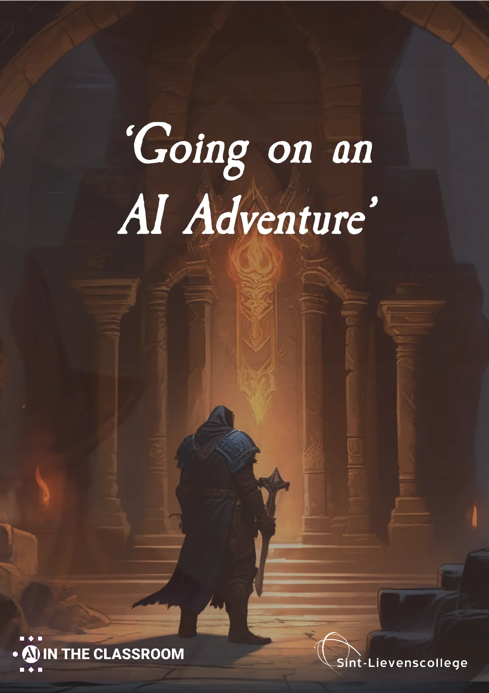
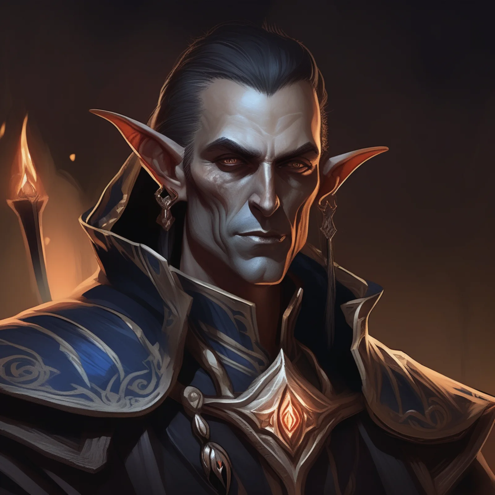
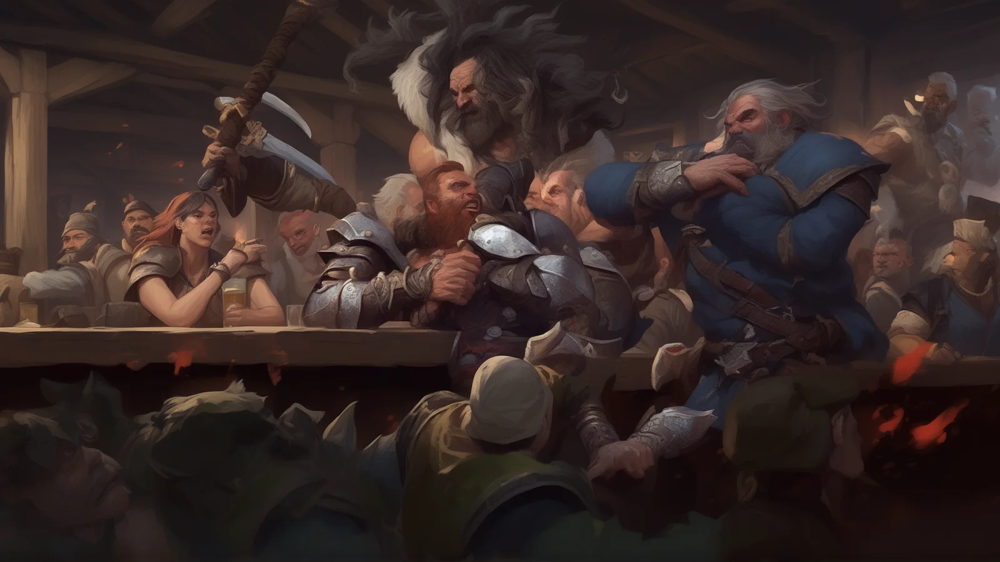

Dear adventurer, welcome! In this lesson project, you will be introduced to the workings of GPT language models, prompting and learn how to use them, in interaction with others and an AI, to experience a story. This is version 2.0 of this lesson material that I have been using and designing with my students since 2020. Here's a shout-out to Jerom, Sander and Ward! Teaching material in which we combine language algorithms and language technology with creative writing. Teaching material in which Dungeons & Dragons and language science meet. Teaching material that can be a nice addition to the curriculum of many a course with 'Modern Languages' and 'Language Editing and Language Technology'. We're off on an adventure!

Wizard casting a fireball spell - image generated using Stable Diffusion and Python-code. [**Click here for more information.**](/onderwijs/ai-design-aikea)

With this project, we combine computer science subjects with modern languages (English, French, Dutch ...) and students explore a subfield of artificial intelligence development, namely neural language processing. A mouthful, but with the development of language models such as GPT-2, GPT-3 and, since 2022, ChatGPT, A.I. can increasingly conduct natural-looking conversations and generate texts. These language models have already been used to write poetry, pen columns for newspapers (about the danger of A.I.), enable interactions with digital characters in VR games, conversations with chatbots ... So examples abound. For this project, we are tapping from a different keg. Because we are combining these language algorithms with an assignment on story structure and creative writing! In collaboration with an A.I., we write a fictional world and go on an adventure. Not with flashy images and bright colours, but just with our language. In this teaching material, you get a start based on role playing games such as the well-known Dungeons & Dragons.

The antagonist in the story - image generated using Stable Diffusion and Python-code. [**Click here for more information.**](/onderwijs/ai-design-aikea)

After our real adventure, we explore the underlying techniques that make these language algorithms possible and reflect on our adventure. We look critically at the performance of our 'AI Game Master' and how it steered the story. Do we achieve an exciting story arc? Does the language model remember all the details? Who really got creative? Us as humans, or secretly the AI model too?

Tavern brawl - image generated using Stable Diffusion and Python-code. [**Click here for more information.**](/onderwijs/ai-design-aikea)

### How does this project work?

Within this project, students work together on their story. Before we start working with a language algorithm, we need to put some things down on paper ourselves. Such as:

-   Where does the story take place? Is it in the future, in a parallel version of the present, the past, a fantasy setting with ancient kingdoms and knights, or among the stars and planets of a bleak science fiction future?

-   Who are our main characters? A group of spacemen? Warriors? Beings similar to humans or just a little different? What are their strengths and weaknesses?

-   What is the goal of our adventure? Are we going on a quest to look for an important artefact? Should- en we save a village from a tyrannical leader? Is a dysfunctional component threatening to damage our space station or is sabotage at play?

The above are all elements for students to prepare. This can be done at home, through group work in class ...

> **Tip:** never let students embark on a brain storm unprepared. Let them collect books, look up, bring ideas with them to class. Truly creative solutions only come out of a brainstorm when every participant has been able to carry out a piece of preparation. If not, the result risks being disappointing or you don't get the diversity of proposals you had in mind.

One of the heroes cleaning his rifle in the tavern - image generated using Stable Diffusion and Python-code. [**Click here for more information.**](/onderwijs/ai-design-aikea)

### Proof-of-Concept

Further on in this teaching material you will find a sample set-up for such a story. In this example, you get some characters, a setting, a story ... Which you can start working with immediately. You can use this as inspiration, or as a demonstration. Through this example, the pupils can form an idea about their hero, their story, what the possibilities and limitations of the language algorithm are, and already carry out a short analysis and reflection. Then they can repeat the task with their self-written heroes, adventures and prompts.

   

### GPT Technology and Prompting

Volledige grootte weergeven

Language algorithms have been around for several years. So you could already experiment with sentiment analysis for a while, querying GPT-2 or GPT-3 ... but since the breakthrough of OpenAI's ChatGPT, Google's Bard and Microsoft's Bing AI, text generation has been gaining momentum, especially in education. But how does such an AI model actually work? How do you write good **instructions** **or** **prompts** for such a language model? That's also what we consider in this teaching material!

**Prompting** is a crucial aspect in interacting with AI models. A prompt can be seen as a pointer or instruction given to the model to generate a specific response or output. In essence, it acts as a starting point for the model to apply its knowledge and produce a relevant response. A well-worded prompt can mean the difference between an accurate and relevant response and one that is less relevant or even incorrect.

Volledige grootte weergeven

In language algorithms such as OpenAI's GPT series, prompting plays a central role. These models are trained on large amounts of text, making them capable of generating human-like responses to a wide range of prompts. However, the art of formulating an effective prompt takes some practice and understanding. Too vague a prompt may result in a general or unfocused response, while too specific a prompt may limit the model and exclude potentially relevant information.

As the technology behind language algorithms evolves, methods for effective prompting are further refined. Some researchers and developers are even experimenting with "dynamic prompting", where the model helps iteratively refine the prompt based on intermediate responses. This can lead to more accurate and contextual responses. As language models continue to grow in capacity and complexity, optimising prompting remains essential for ensuring the best possible interactions with these systems.

That "dynamic prompting" will prove crucial to our adventure. We are not going to be able to live a story by putting just one instruction into the model. We are going to have to provide several instructions. This can best be compared to setting up and playing a board game. For this too, you will find a detailed step-by-step plan and a practical example in the teaching material

 

### Always be mindful of the AI results!

Actually, an always-valid advice when working with AI models: don't blindly trust the output. Be aware of its limitations, errors, possible biases and put it alongside your expert knowledge. Similarly, the knowledge you have about a smooth flow of a story, how a "hero's journey" goes, how to write a good character, a logical progression of a scene ... It also requires a solid language register to immediately understand all the words a GPT tool writes. The complexity or 'perplexity score' of the language register sometimes dares to differ from that of our students.

You will find material for that too in this syllabus. After "playing" our story, students should reflect. What went well, what could have been better? They should extract pieces from the text, edit, summarise ... and thus present their analysis to the teacher or to the class.

     

### Requirements

To get started with this teaching material, you will need the following materials:

-   This workbook for teacher and/or students;

-   Writing materials (really, feel free to let students write their heroes and stories first);

-   Stable internet connection;

-   (School) laptop;

-   Access to GPT tool such as ChatGPT or alternatives.

### Curriculum placing and objectives

For the selection of curriculum objectives below, we looked at the draft curriculum 'Language Technology and Language Editing' within the direction of Modern Languages in the through-flow finality. This curriculum was created within the umbrella association 'Catholic Education Flanders'.

-   LPD 1: Students purposefully reformulate scribe and oral texts according to the target audience, channel or medium.Hint: within this lesson assignment, students should write their own text about their character, the world, their quest ... and turn this information into a prompt for the AI model. Afterwards, learners process their adventure (the chat) into a text reflection (critical analysis of the story) or rewrite it into a story (fantasy text).

-   LPD 3: Pupils edit written texts for language use, consistency and purpose.Hint: When reworking the adventure (the resulting chat) into a reflection or consistent story, pupils should rewrite entire pieces according to agreements and guidelines. Here, learners can also use translation programmes.

-   LP4: Learners engage critically with language technology tools.Hint: Speaks for itself within this teaching material. Here, students come into contact with language algorithms, learn how to compose a prompt and then evaluate the texts in terms of consistency, memory, story structure, etc. Here you can also dwell on the issue of creativity, copyright and plagiarism.

More curriculum objectives could possibly be linked to this teaching material, but the above already gives a clear indication.

The clients in the tavern - image generated using Stable Diffusion and Python-code. [**Click here for more information.**](/onderwijs/ai-design-aikea)

### **I want this in my classroom! What should I do?**

**Want to work on this yourself in your classroom? Super! Introducing young people to language algorithms and language technology, especially within a direction with a focus on modern languages, is an important part. Below you will find the buttons to download the syllabus, ask a question but also teaching materials on language algorithms for the classical languages.**

<a class="content-button content-button--primary content-button--medium" href="/contactinfo">I have a question</a>

<a class="content-button content-button--primary content-button--medium" href="/education/ai-and-greek-epigraphy-with-a-robot">Anything for Classical Studies?</a>

