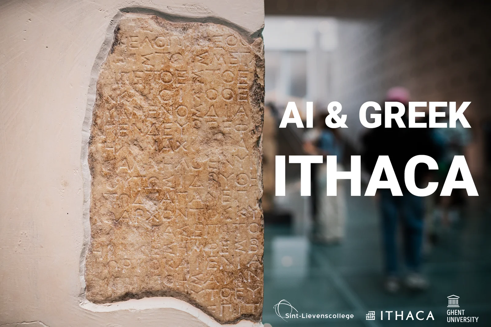

### Artificial intelligence is popping up more and more. Smart computer models determine what we see online or what a photo taken with our smartphone looks like. We can now bring these increased possibilities and computing power into the classroom, even within classical languages! [Earlier this year, UGent and Sint-Lievenscollege Ghent joined forces to develop AI course material for the subject Latin,](/education/ai-latin-bring-tacitus-to-life) but in this project we explore the world of epigraphy and Greek antiquity. [A fresh development, call it version 2.0, of our earlier cooperation at the end of 2021](/education/ai-greek-epigraphy-poetry-and-ai-with-pythia). Put on your Indiana Jones outfit and fire up that computer, because artificial intelligence can also make a difference in the world of archaeology!

<!-- p08-deferred:media-b2118cf16d22283a -->

### Bridge between two opposites

This project was developed to build a bridge between two apparent opposites, namely Classical Languages and modern computer techniques and programming languages. We want to give the student an introduction to the world of artificial intelligence, show him its possibilities but also its limitations. It is therefore a combination of an introduction to epigraphy, artificial intelligence and the skills of Ancient Greek.

### How did this project develop?

This lesson project was developed by Robbe Wulgaert (Sint-Lievenscollege Gent) and Noor Vanhoe (Student Shortened Educational Master Greek-Latin UGent). This together with lecturers Katrien Vanacker and Katja De Herdt (UGent) within the framework of the subject 'Vakdidactiek B'. This project is a further development of the teaching project 'AI & Greek - Pythia' and is built on earlier work by Bram Fauconnier (UGent), Yannis Assael (Oxford), Thea Sommerschield (Oxford) and Tim Whitmarsh (Cambridge), among others.

[Video on YouTube](https://www.youtube.com/watch?v=MhNinruUhUw)

Footage of version 1.0 - November 2021

### Triptych of lesson content

In this project, three elements come together in one teaching project: **epigraphy, artificial intelligence and literature**. It shows the students that these elements are related and can help each other. It shows that AI is not a STEM-only story and that the AI model can be used as a tool by the epigrapher, not as a threat that will make the job of epigrapher or classicist disappear.

### Introduction to epigraphy

The study of history makes extensive use of various sources. Sources such as coins, rolls of papyrus, manuscripts ... but also inscriptions in stones such as tombstones, temple walls or jewellery can be invaluable. The study of such sources is called epigraphy. From the period of classical antiquity, 600,000 inscriptions have already been found, especially in the cities of old. These inscriptions can teach us more about the political, social, cultural and economic history of societies.

Ancient Greek Inscription, Akropolis museum Athens

But these inscriptions, like many other sources over the years, have not always been well preserved. Destroyed or damaged by the ravages of time, by human actions or exposure to natural elements. As a result, texts are unreadable, missing characters or complete sentences. Before one can research the history hidden in the inscription, an epigrapher must try to restore the work. For this, the 600,000 inscriptions found are invaluable, but this is a gigantic amount of knowledge and data that an epigrapher must find his way through. Not an easy task!

### AI to the rescue

Those 600,000 known finds are a curse and a blessing. A blessing because it can provide a wealth of information to the epigrapher, but also a curse because it is a very large set of data to manage. To help the epigrapher with this, we use the great computing power of an AI model. For an earlier teaching project, we used Pythia in the classroom. A development by Yannis Assael and Thea Sommerschield at Oxford University. For version 2.0 of this project, we look again to Yannis, Thea et al. for their updated AI model called Ithaca. This updated model comes with improvements and new features, such as situating in space and time!

### Input - rebellious poetry or rather the stars and muses?

In this lesson project, you can choose between two inscriptions to treat. The first is from research by Tim Whitmarsh of Cambridge University, the second inscription was chosen by Noor Vanhoe (student UGent) and deals with the muse Ourania. The choice of inscription obviously has consequences for the last part of this lesson project, when we discuss the characteristics and the history behind the inscription.

In both texts we have omitted letters. The students are thus presented with an incomplete inscription. The next step of an epigrapher is to try to find out how many characters have been lost. If this has been done by the ravages of time or by human intervention many years ago, the number of missing characters is much more difficult to determine. In this step, we help the student by identifying where characters have been lost. These missing characters are indicated with a question mark.

### Processed by Ithaca

When we have completed the text with question marks, it has to be entered into the AI model. For this, the students use their Greek keyboard. In this way, the students practise the use of the keyboard in this lesson project as well! When entering the text, the students have to pay attention to the use of the Leiden Conventions. Thus diacritical marks, capitals and punctuation marks are omitted. This makes the text easier to understand for the AI model. Then they add these elements back into the output.

When everything is in place, the AI will make a restoration attempt. To do this, it uses probability computing. Ithaca is trained on a dataset of 178,551 transcribed texts from the Packard Humanities Institute (PHI). Then, for each missing character, the AI model will check which character could be there. For this it uses attention mechanisms, looking at other characters and words in the sentence and the wider context.

### Output - hypotheses!

When the AI model behind Ithaca has finished its probability calculations, it comes up with hypotheses. No fewer than twenty appear on the screen, each with its percentage. This percentage expresses how sure the model is of that hypothesis. You will notice that:

1.  No hypothesis is 100% certain;

2.  There may still be errors in the best hypotheses.

This is an important lesson about using artificial intelligence. You do not work with absolute certainties and it serves as a tool to help the human being, in this case the epigraphist, in his job. It is a tool like an electric drill is for a woodworker. He can try to achieve the same goal with a screwdriver and force, but it also takes more time. Enabling the computing power of an AI model like Ithaca reduces the epigrapher's work time from (in some cases) two hours to about five minutes. And just like with a drill, you can get it wrong from time to time. That is why we still need the expertise of the epigraphist to correct the machine!

In addition to the top 20 hypotheses, the model also comes with new functions. Functions that were not yet in the Pythia AI model. For example, it can, again on the basis of probability calculation, situate the text in space and time. This means that it can generate a map and timeline.

The larger the circle around the map, the more uncertainty this expresses. The model can also use bar charts to express which regions are most likely to be the origin of the inscription.

  

Besides situating in space, the model can also situate in time. This is another important piece of information and skill. In situating in time, the time line, from 800 BC to 800 AD, is divided into decades. The model thus tries, again through probability calculation, to find out from which decade the text originates. Again, it provides a graphical representation of this.

### About Urania, muze of astronomy

Once the text has been recovered and situated in time and space, it is time to translate it from Ancient Greek into Dutch. This is a skill that neither Ithaca nor Pythia possess, but the pupils do. So, it is a good exercise to translate the text individually, in groups or in class and to find out its message.

The text we have chosen for this project (fragment two, chosen by Noor Vanhoe), about the muse Ourania, can be found below. Including the output as we got it from the AI model and the corresponding translation.

If we translate the text, we see that it is about Urania or rather Ourania, muse of astronomy. It is an ideal moment to dive into the world of muses with the pupils. We can talk about their role in Greek mythology, their fields of expertise, their representations from ancient times to the present day.

### Requirements

For this teaching project you need the following items:

-   One laptop per student or per two students;

-   A stable internet connection;

-   The workbook that accompanies this lesson project;

-   The PowerPoint slides and handout that come with this lesson project;

-   Approximately one lesson per unit (i.e. three to four hours in total).

### Lesson goals

In the development of this lesson project, relevant curriculum objectives were selected from the curriculum Greek, 3rd grade, within Catholic Education Flanders. The selected objectives are:

-   **LPD 9:** demonstrate understanding of text by extracting the main idea from the text, paraphrasing the text, synthesizing the text, reading the text expressively, making a working translation or fluent translation of the text (SET 13, 15);

-   **LPD 12:** Identify typical stylistic devices and explain their function within the text (SET 2, 4, 9);

-   **LPD 17:** critically evaluate the relationship between content and form and assess the expressive value according to classical and contemporary views (SET 9, 18);

-   **LPD 20:** expressing translation problems (SET 17);

-   **LPD 23**: situate author(s) and work(s) within the cultural-historical context and include that context in the interpretation of texts (SET 5, 14).

**Lesson objectives** were also formulated for the lesson design. After this lesson project you can:

-   Explain in your own words what an inscription is;

-   Give an example of an inscription (historical source);

-   Explain what the task of an epigrapher is;

-   explain how an AI model can help an epigrapher;

-   explain why an AI model like Ithaca will not replace an epigraphist

-   using the Greek keyboard to digitise a text;

-   explain the output of the Ithaca AI model;

-   translate the recovered work into Dutch;

-   Explaining the role of the muses in Greek mythology;

-   To interpret the content of the restored text.

This project and the accompanying workbook are divided into **four parts**, namely:

1.  Introduction to epigraphy (theoretical via class discussion, duration 1 lesson hour)

2.  Introduction AI and machine learning (theoretical and practical, duration 1 lesson hour)

3.  Reading of the text (translation in class or in group, duration 1 hour)

4.  Discussion of the Muses (theoretical through class discussion, duration 1 lesson)

This teaching project has a whole handout for pupils and teachers.

### I want this in my class! What do I have to do?

Do you want to work with this in your classroom? Super! The future will be increasingly digital. A future in which artificial intelligence will play a very important role. It goes without saying that we need to prepare and motivate young people. I am happy to help you with that! Through the buttons below you can send me a message or get information about a training or workshop. I usually reply within 48 hours!

<a class="content-button content-button--primary content-button--medium" href="/education/workshops-and-teacher-training">Workshop</a>

<a class="content-button content-button--primary content-button--medium" href="/contactinfo">Ask a question</a>

