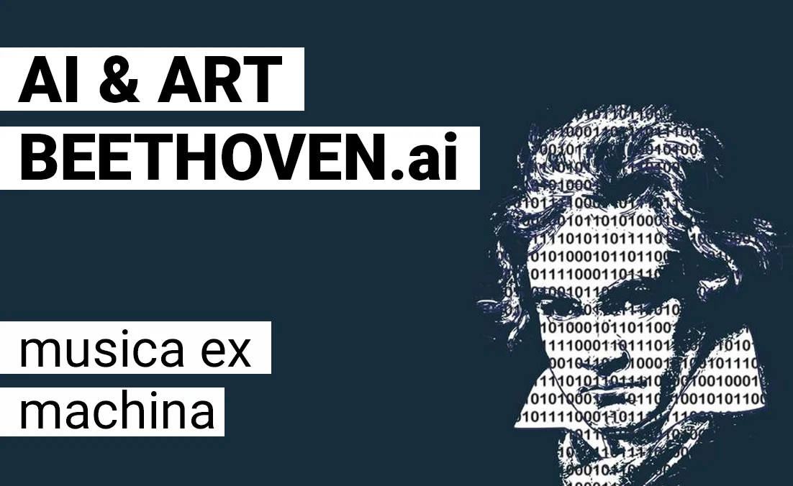

## In Search of the Tenth Symphony with AI!

You may know Beethoven. **Beethoven** was a German pianist and composer. He made no fewer than nine symphonies and countless other works. But that tenth symphony, that is no longer successful. We are trying to change that with this educational project!

By means of **artificial intelligence**, Python and his nine finished symphonies, we try to have that tenth made.

### **Musica ex machina! Music Maestro!**

[Video on YouTube](https://www.youtube.com/watch?v=vAKIi3trGCo)

## **Beethoven AI: earlier attempts and approaches**

This attempt to create the Tenth Symphony by an AI is not revolutionary or new. There are several experiments and approaches to crack this musical note. For example, this topic made the news again in early October 2021 when a new result was published. This result was worked on for two years.

[Beethoven X AI Experiment door het orkest van Bonn](/media/f9b807d00bb73ce290781c7e379b87511f86ed4c6961831f2fed3dbf059cbd45.mp3)

**In this AI classroom project, we will attempt to follow in the footsteps of Beethoven and those AI data scientists.**

### How does this work, maestro?

Similar to the 'Author or AI-thor' project, we train an AI model on a set of data. In this project we do not work with a set of books such as the stories of 'Lord of the Rings' or 'Harry Potter', but with the nine well-known symphonies of Beethoven. These are converted into sequences of notes. These sequences are analyzed by the AI, looking for patterns.

Long story short, but the AI will try to figure out Beethoven's style, just like we did with 'Author or AI-thor' with Tolkien, Rowling, Ovid ...

Once the AI is sufficiently 'trained', it can create music. This can be done in two ways:

-   Creating a fully new track

-   Helping the neural network by using a primer

For example, in the latter method, we give the neural network 10 seconds of an existing song. This could be a piano piece, such as an example of symphony number 10, made by Barry Cooper. This will put our AI on the right track.

**As a result, we get a brand new song!**

If we want to take it one level up, we can use another AI model (GANsynth) to process the brand new song. It is then not played by one piano, but up to 100 different instruments. The AI will interpolate between those different instruments. That means the AI tries to move fluidly from one instrument to another.

### Some examples, maestro!

[Video on YouTube](https://www.youtube.com/watch?v=uk-fdSjpn-o)

Symfonie nr 10 door GANsynth

[Video on YouTube](https://www.youtube.com/watch?v=wXnxsLIJltI)

Symfonie nr 10 - door BEETHOVEN.ai

### AI Song Contest

Are you a big fan of this music genre? Then there is good news for you, because there is also an AI Song Contest! This took place in 2020 and 2021. The Belgian entry for the most recent edition can be found below.

[Video on YouTube](https://www.youtube.com/watch?v=K4vx_Y4c6WY)

### Contact

Questions or in need of more information? Head over to the contact page!

<a class="content-button content-button--primary content-button--medium" href="/contactinfo">Contact</a>

