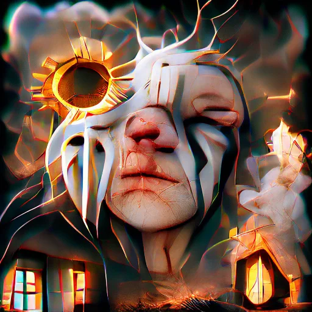
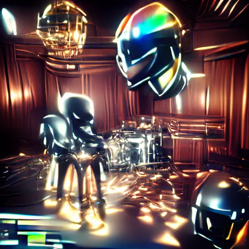
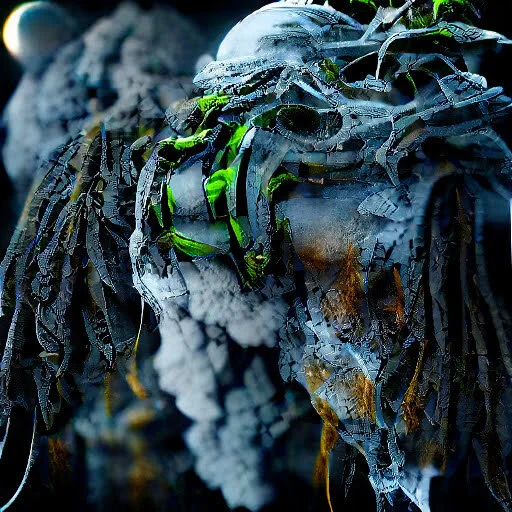
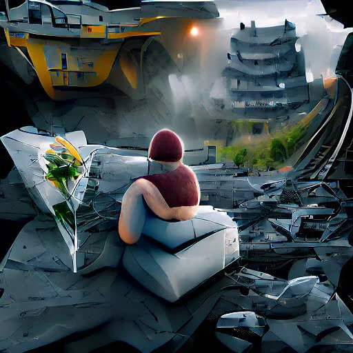
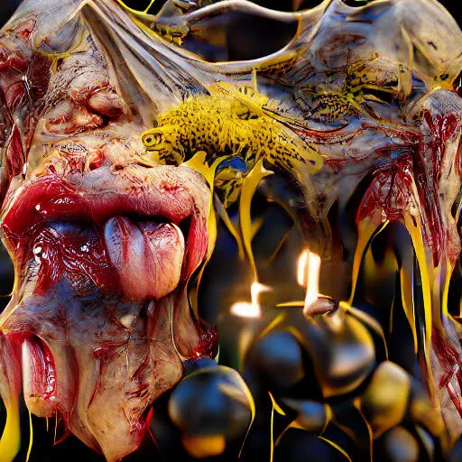
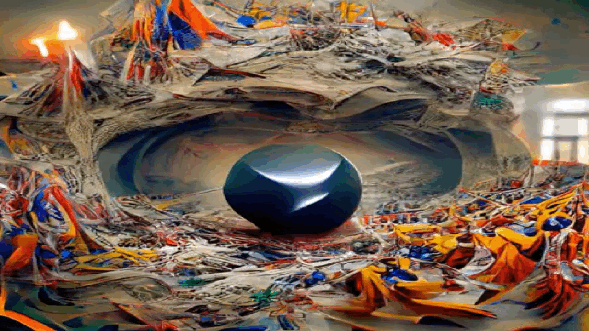
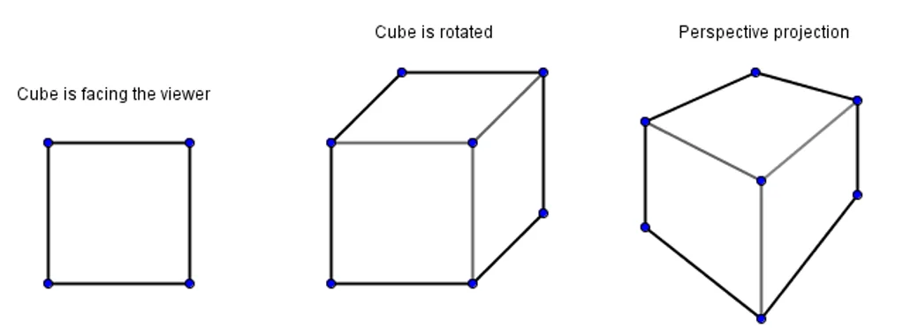
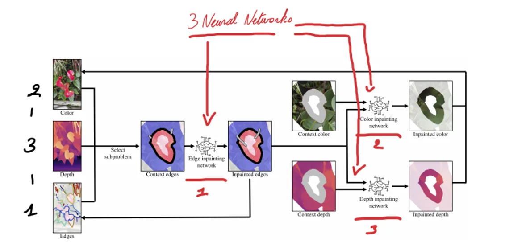

### “AI-Generated Art Scene Explodes as Hackers Create Groundbreaking New Tools” (Vice) – This post couldn't have asked for a more fitting introduction, because that's exactly what we'll be doing in this AI educational project: creating art with artificial intelligence. Not by complicated techniques and calculations, but by typing in a simple sentence. Unleash your lyrical Picasso in 'AI & ART – DALL-E's Workshop'!

[Video on YouTube](https://www.youtube.com/watch?v=R-FzVk1YCCU)

### Consider

I myself have a modest history as a Arts Education teacher (Last year, now mostly integrated). I borrowed the structure of considering, creating and reflecting from that curriculum. So it's time to 'consider' the artistic work of these neural networks, because we use no fewer than five in this project.

[Video on YouTube](https://www.youtube.com/watch?v=etnP7Vxk0sg)

As you can see, these creations are pretty wacky, crazy, or seem to come out of some weird nightmare. That analogy is not too bad, because these creations show similarities with Google's DeepDream project. In addition, it was possible to look at how an AI 'dreams' via Google's pre-trained neural networks. This was done by passing selected images through the different neural networks. One was specifically trained on and went looking for figures of cats, the next cars… each time adjusting the image to see more cats or cars. This took place in 'latent space', or the 'secret space' between the different parts of the AI.

    

In this AI project we also make use of that latent space, but with some important changes. For example, we do not use Google's AI networks, but CLIP and VQGAN. CLIP is a text-to-image technology and makes it possible for us to put our AI to work in one sentence. VQGAN on the other hand works on the principle of a 'Generative Adversial Network' (GAN), where two systems compete against each other. A generator and a discriminator. The generator will generate images based on our command. The discriminator will look at that image and judge whether it sufficiently resembles our command. Those two systems do that again, again, again… until, after many iterations, we reach our desired result.

  

That's not the only difference with DeepDream. Not only do other AI models use these, these are also non-pretrained! While in other projects we work with pre-classified images, train a model to music or fine-tune the Harry Potter books, tasks that can take hours, the models in this part are not pre-trained. We follow a zero-shot approach. Zero training.

Then we animate our creations with another three neural networks. In this way we turn our 2D print into a 3D experience. We do this through 3D Inpainting. A rather complicated task, because that means that we have to estimate the parts that are not visible on the 2D view with an AI. We use a neural network that is trained to recognize edges, a network for coloring and a network to calculate the depth. Once finished, our print comes to life!

### Create

To get started you only need a good sentence as a command. In addition, a computer and a Chrome browser. No more! Previous knowledge of Python and AI is useful, but certainly not required.

[Video on YouTube](https://www.youtube.com/watch?v=Zo5HyACwoyI)

### Reflect

After experimenting with this CLIP+VQGAN approach for several months, a few things stand out.

1) It is perfectly possible to get a good result with a few tries.

2) It is also possible that, after 3,000 steps, you are still not satisfied. The system is not very predictable and multiple iterations do not necessarily equate to better quality.

3) The system that gets started with our text commands can be manipulated by specific keywords. Like “in the style of Van Gogh”, “in the style of Ghibli” … we manage to do “style transfer”. This means that our AI artwork inherits properties of a particular artist or artwork!

4) But also more unusual keywords, such as “unreal engine”, “Free HD Wallpaper”, “in the style of a 100,000 dollar NFT”, “Ultra High Settings”. Rather, these are keywords that you would expect from a search engine such as Google. Still, we manage to achieve better quality (although these keywords can also cause their own artifacts, such as a UE badge when using “unreal engine”).

Experiments like this with DALL-E are ideal for getting started with AI and democratizing this form of 'art'. With minimal prior knowledge and only one text command, you can conjure up amazing things on the screen.

### Contact

Questions or in need of more information? Head on over to the contact page!

<a class="content-button content-button--primary content-button--medium" href="/contactinfo">Contact</a>

