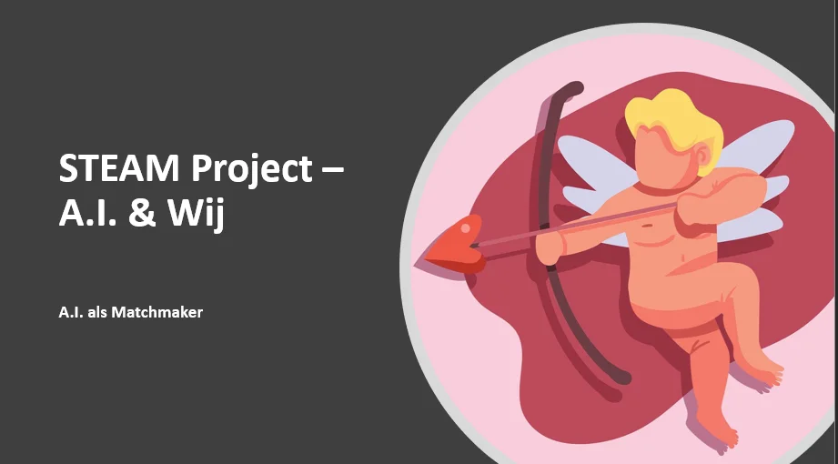
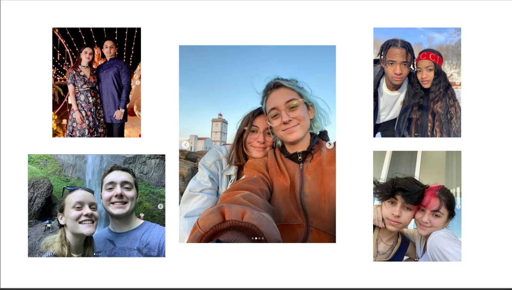
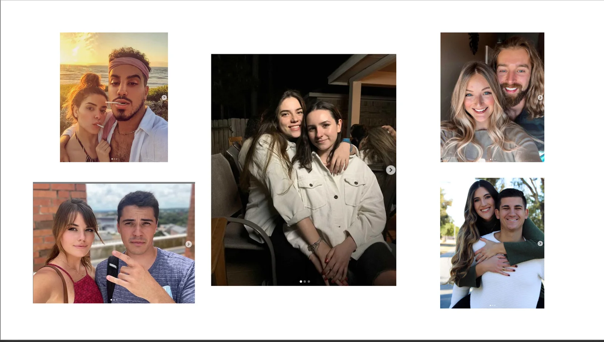
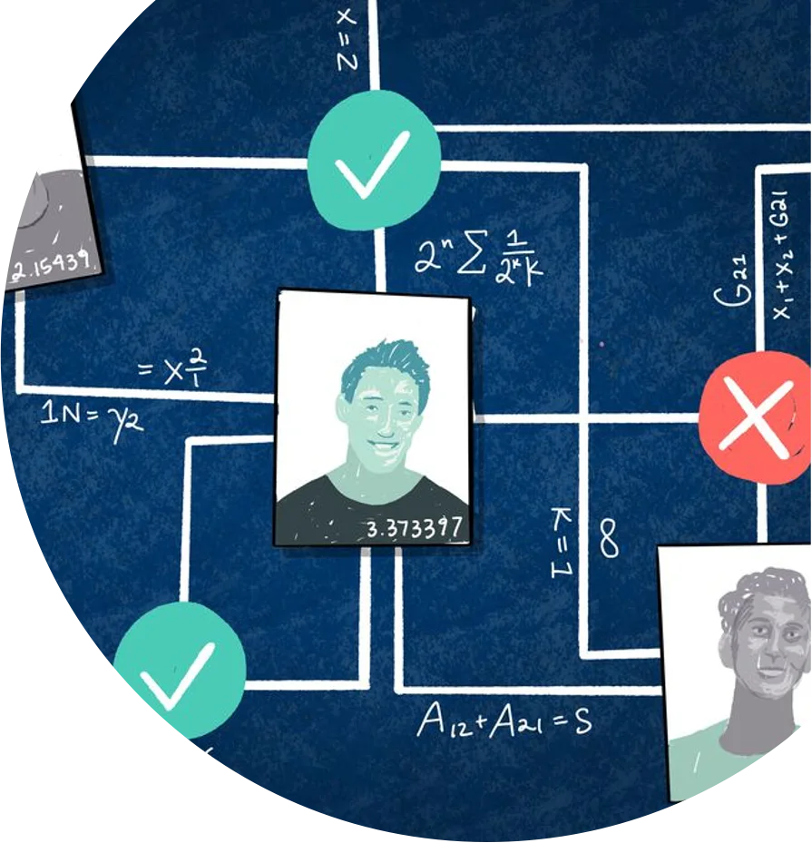
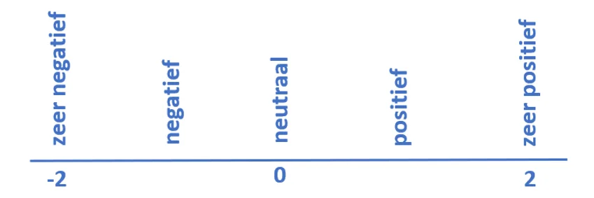
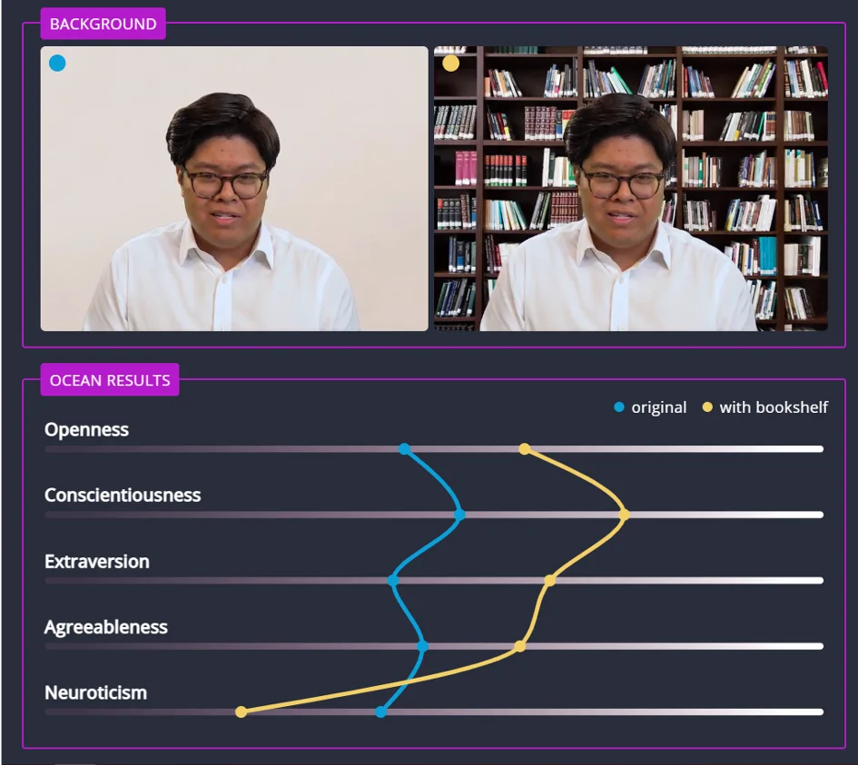

### You usually don't associate an app like Tinder with group assignment in class. But imagine a world or classroom where the team members for that group work are not selected by the teacher or friends, but by an algorithm? Future music you say? It happens more often than you think. More and more CVs in the regular labor market are screened and assessed by all kinds of artificial intelligence. Time for an experiment and awareness with this educational AI project!

[Video on YouTube](https://www.youtube.com/watch?v=4svrRjHInAY)

### The ideal partner IRL

Whether it's about dating or finding a new hire, it's all about matching. You are looking for someone with certain qualities. Qualities you like. Simple, isn't it? But which qualities do we now consider 'good'?

If we consider dating and our own psychology, we can conduct a fun experiment. Add the Instagram account 'Siblings or Dating', and you'll have fun for a while. We note that it is damn hard to tell apart 'siblings' or 'love partners'. This is due to a simple observation: siblings resemble each other, because of shared DNA and shared upbringing. But the people we fall for are also like us! The 'dating' couples also look alike! What is going on here?

 

The qualities we look for in a love partner are often the same as those we possess. The statement 'opposites attract' is statically mostly a fable. We are just struck by the similarities, and that is only logical. Are you a big fan of books and fantasy? Then there will be a greater chance that your partner is too, instead of having a profound dislike of books. Differences in interests, opinions, views… can cause friction. It may sound a bit unintentionally narcissistic, but we are attracted to the (positive) qualities that we also possess! (It's never the case that lovers start to look alike after a while. Research, with AI, by Tea-Makron recently disproved that hypothesis).

### Tinder and chess

We can pour those qualities and preferences into an algorithm. That's what Tinder does so successfully. You create a profile, load your photos and bio, indicate your location ... bingo, just swipe! It sounds simple, but it's the language of the algorithm behind the scenes to show you suitable candidates. For this, the algorithm uses the data that you entered when creating your profile. It assigns tags and searches for people with similar scores or interests. Of course, it will also include your behavior on the app in the calculation afterwards. Who do you swipe to the right side, and especially who swipes you to the right side? There is even a bit of chess involved here. There they work with an ELO score. An ELO score determines your relative position in a zero-sum game (a game with one winner, one loser). The more games you win in chess, and the fewer you lose, the higher the ELO score. In a game of chess between a high ELO score and a low score, the high score is more likely to win. If this happens, that player's score increases slightly. If there is a surprise win for the low ELO score, it will increase enormously.

So what does this have to do with Tinder and matchmaking? Well, Tinder uses a variant of the ELO score in the algorithm. If you are swiped to the right side but you swipe the other to the other side, you 'win' and the other 'loses'. A zero-sum game, as it were. If this happens often, the algorithm assumes that you are quite attractive and assigns you a high ELO score. The algorithm will start matching the users with high scores, or who it thinks are very attractive… voila! The handsome souls have found each other, what a coincidence!

### Tinder for group assignments

Now, how can we apply these kinds of algorithms in the classroom? For this we use a variant of sentiment analysis. This is a tool in which an AI goes through a piece of text and tries to find out the sentiment of the text on the basis of predetermined keywords. Is technique is used to judge whether a restaurant review is positive or negative.

So we work on the basis of a text. A motivation letter, as it were. We will have these read in by our AI. In addition to a motivation letter, our AI must also be given a lexicon. This is a list of all the qualities that the algorithm should pay attention to. A word list with, for example, 'team player' and a corresponding score or polarity. We place this polarity between -2 and 2.

In this way we draw up a lexicon based on the qualities I picked from the site of the Tempo Team employment agency. This list contains roughly 45 qualities that the algorithm will pay attention to and can be adjusted freely.

After that, the AI will pass our letter to a **Natural Language Processor (NLP)**. He 'understands' Dutch and will subject our text to some adjustments, such as:

-   **Lowercasing**: removing uppercase characters

-   **Tokenisation**: divide the text. This goes from one long string to a list. Punctuation marks are separated from the last word of a sentence…;

-   **Part-of-speech tagging**: from those separate parts of the sentence the part of speech is determined (verb, adjective or noun);

-   **Lemmatisation**: the (verbs) words in the letter are reduced to their dictionary form. “Performed” thus becomes “performing” again.

-   **Bag of words**: once everything is cut, the parts are put in a figurative bag and shaken together. The AI will count the number of occurrences of a given word and make a sum of its polarity. “Team player” occurs three times and has a polarity of 1.7? Then the score will increase by three times 1.7. This step will also be the Achilles heel of this approach!

The end result is a total score. The AI analyzed every single word in the letter and calculated the polarity of the words in the lexicon. So the end result is the sum of the individual polarities!

In this way we can draw up a **lexicon** of the qualities that we consider important. We have an AI analyze the many motivation letters and calculate who is the most suitable candidate for our group work!

### Objectivity reached! Right?

Corona has accelerated the transition to digital solution. The same goes for looking for a job in the labor market. Especially in Germany and the US, more and more stories are popping up where job seekers have their motivation letter or interview assessed by an AI. Striving for objectivity is to be welcomed. We noticed that people still have some psychological biases. But that pursuit of objectivity must go hand in hand with transparency! Because does the AI measure what we want? Is it really objective?

### Amazon

One of the best-known experiments with such an approach comes from Amazon. An AI was built there that would go through applications for programming jobs. They had that AI trained on the profiles of the existing employees so that it would develop its own lexicon. So it built a kind of 'desired values profile' itself. It turned out: after a while it was noticed that the AI only selected white men, about 30 years old. It was always trained on the existing staff and that was… white and usually of that age range. In fact, the system had learned to assign male pronouns a positive polarity, and female pronouns a negative one! This is how the existing prejudice, less women in those kinds of professions, crept into the AI!

### Video Job Interview

In Bavaria, Germany, a team of journalists went to investigate. How objective of the AI that was supposed to review video interviews? They made some shocking discoveries. For example, the score appeared to change if you wore glasses or sat in front of a fictional bookcase (think Teams background).

When analyzing the level of English, two tests were performed:

-   answer the questions in English (the journalist received a score of 8.5/9);

-   answer the questions by reading aloud the german wikipedia page on psychoanalysis (score was 6/9).

The even when a wrong language was spoken, the applicant got a good score. How objectively does the AI measure the level of English…? Learn more about these and similar experiments in the excellent podcast from the MIT series In Machines We Trust.

[Video on YouTube](https://www.youtube.com/watch?v=ztcVB_zh_M0)

### Critical Reflection

The approach in this educational project also has its own Achilles heel. This is in the bag-of-words approach. In this approach, the words in a text are treated separately from the context. A letter where every sentence starts with the I-form and is full of wrong conjugations can write the same score as a better written letter. The approach of the AI does not take the context into account! It only pays attention to the predefined keywords in the lexicon. That's a very close approximation of a piece of text. This consideration must be taken into account when a tool such as this is used for a job application. It can be used as a support, but perhaps not as the sole factor in such an important decision.

What this exercise does show is the potential of this technology, where it is already being used, and the difficulties we all need to be aware of. **Objectivity and transparency!**

### Contact

Questions or in need of more information? Head on over to the contact page!

<a class="content-button content-button--primary content-button--medium" href="/contactinfo">Contact</a>

