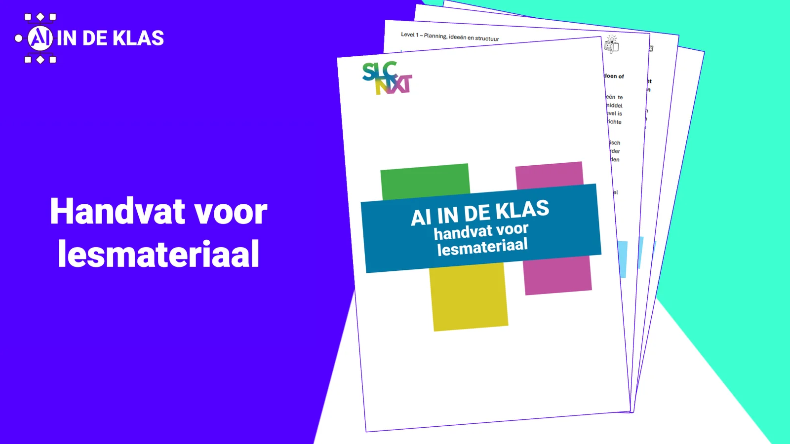
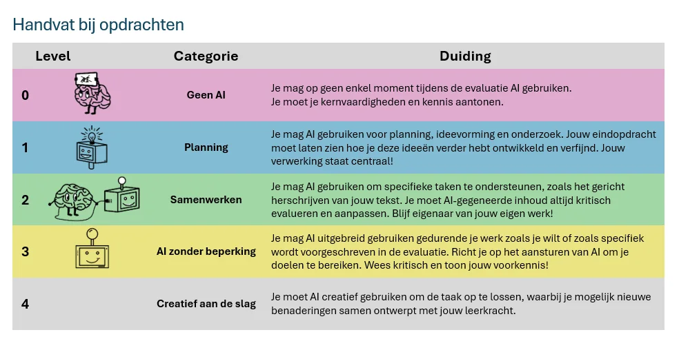
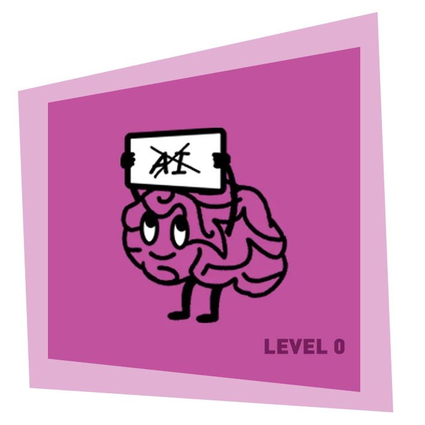
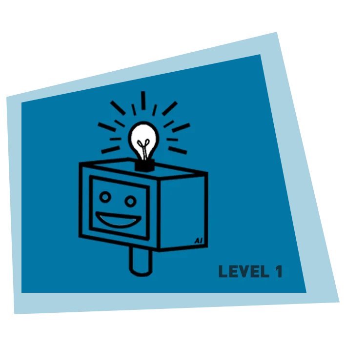
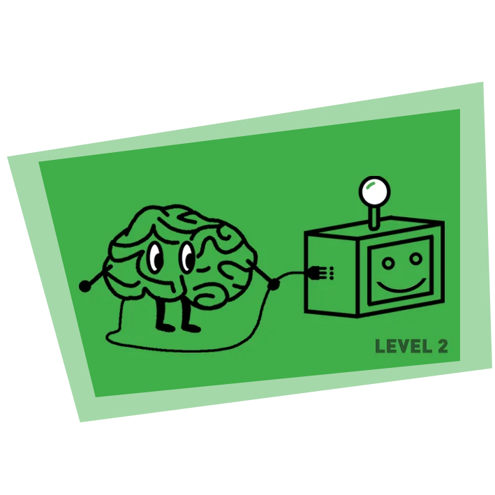
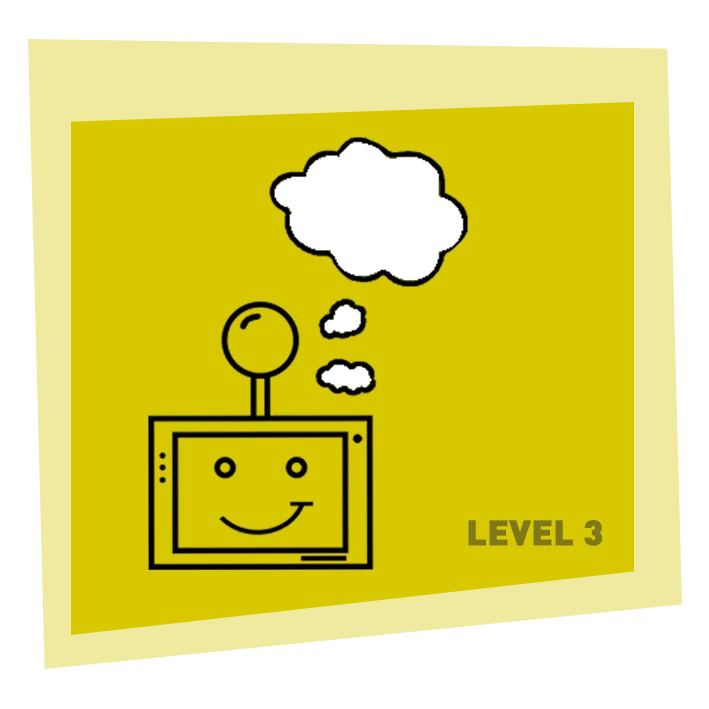

### At my school in Ghent, we have been working around AI literacy for eight years. We developed teaching materials on chatbots, pronunciation assignments, restoring inscriptions, developing interiors to philosophical experiments on the value of AI art. This work culminated in the book ‘AI in the Classroom’. But how do you practically incorporate AI into your own lessons, without losing your learning objectives? For that, some colleagues and I created a guide and assessment scale: a practical document that shows our colleagues where AI can play a role, what we expect from students and how we work together on reliable assessments. No complicated theory or implicit value judgements, but a tool straight from classroom practice.

[Video on YouTube](https://www.youtube.com/embed/4ybT4IYOhFc?feature=oembed)

### Why did we develop this?

### Context

We developed this handle to support colleagues in creating teaching materials and lesson preparations. It is aligned with the pedagogical vision of our school, to which we regularly refer in the handle. So beware of merely copying and pasting this handle to your own classroom and school. Ctrl+c, Ctrl+v works great in computer science classes, but not in educational policy. Just like a worksheet downloaded from Klascement, you will have to make the necessary adjustments to make it really work in your context.

### Practical value

This handle is inspired by the work of Leon Furze (2024) and our own pedagogical vision. Furze developed a scale to help assess AI use in assignments. That scale circulates in several variants, but we noticed that they often remain vague. It lacks concrete examples for classroom practice. That's why we wanted to give colleagues a tool that is immediately usable in our school: with practical examples that serve as inspiration, clear agreements and clear expectations. So this tool was written by teachers in the field, for teachers in practice.

### No value judgement

In developing this handle for our school context, we often noticed implicit or even explicit value judgements in existing AI scaling models. Some scales colour assignments without AI red, while those with a lot of AI are invariably green. Although Leon Furze himself added nuance in late 2024, we see that many variants still make this one-sided division (sometimes deliberately).

We do not start from the idea that more AI is always and anyway better. We do not take a technical perspective, but focus on valid and reliable assessments. A lesson in which students write a text independently without AI can be just as valuable as a project in which AI is central, as long as the learning objective is clear, the lesson was well constructed and objectives were achieved. Clear expectations, clear goals and classroom management are the key; AI is at best a tool in our classroom practice.

### How did we approach this topic?

This handle did not come from nowhere. In recent school years, we asked students and teachers about their experiences and expectations around AI in the classroom. We asked them the same questions each time:

Where do you see the use of AI before the lesson (lesson preparation, feed-forward)

-   During the lesson?

-   After the lesson?

-   In evaluations and reports?

The answers from both groups turned out to be surprisingly similar. Based on these insights, we developed an AI policy that focuses on three levels:

-   Literacy in classroom practice (micro-level)

-   Literacy of our teachers (meso-level)

-   Support in designing teaching materials (meso-level - this handle)

### Looking At The Larger Picture

That last element is important when reading this handle. It is part of a broader vision of AI literacy and educational practice. For example, do you work with students on writing skills and let them use an AI chatbot for formative feedback? Then realise that those same learners need subject knowledge as well as an understanding of their own learning process to bring this to fruition. Critically handling a chatbot, assessing the output and adjusting it where necessary, demands a lot from them. So don't see this tool as a stand-alone product, but as a guide to help you bring AI literacy into your teaching practice step by step. The handle grows with new technologies and insights from our own classroom practice and is thus, like much in our teaching, subject to change.

### AI In The Classroom - Supporting, Not Replacing

AI offers many opportunities to enhance teaching, from generating ideas and feedback to supporting complex analysis. Yet technology should never overshadow educational goals or didactic principles. It is essential to maintain the right order in teaching practices:

-   **Goals**: What do we want students to learn? What knowledge and skills should they develop?

-   **Didactics**: Which learning activities best support these goals?

-   **Tools**: What tools, including AI, can we use to reinforce these activities?

### Four Levels

To support both teachers and students in the responsible use of AI, we have developed a four-level framework. Each level provides guidelines and sample assignments that align AI use with lesson objectives and didactic design of the lesson and assignment:

-   Level 0: No AI

-   Level 1: Planning

-   Level 2: Working together

-   Level 3: AI without restrictions

-   Level 4: Getting creative

**Please note:** within this guide, you will not find a step-by-step development of the last level, ‘Getting creative’. Therefore, ‘only’ four levels. This is not due to forgetfulness, but because we see very few links between the content of this level, our educational vision and the learning process throughout the six years of our pupils. Getting fully creative with AI applications requires a solid portion of digital literacy, media literacy and, above all, tons of subject knowledge. Only when a student is sufficiently strong in these various areas can they be linked together. We see this level coming into its own only with a sufficiently strong, educated and mature group of learners.

_Source: Degrave D., Dhondt K., Vanderfaeillie D. & Wulgaert R. (2025)_

### What does every level contain?

Within each level, teachers will find the following information:

-   Explanation of the level: What does this level mean, what place does AI have in the learning process, and how does it connect to our core objectives?

-   A general workflow: a step-by-step description that you can apply in your subject or assignment.

-   Elaborated lesson examples: Concrete examples for different subjects, such as languages, history and science. These make the workflow tangible and are both inspiring and directly applicable.

-   What do learners submit? Detailed guidelines on what students should submit to ensure transparency and reliability in assessments.

-   Why do we value this? A reflection on why this level is important, not only because of AI use, but because of the whole learning process.

This guide does not merely try to help you integrate AI into your teaching practice, but serves to support you as a teacher and stay true to our didactic vision. By deploying AI strategically, we strengthen our tradition of high-quality teaching and prepare students for a future in which technology plays an essential role.

* * *

### Before you start …

-   Know that the use of AI applications is NOT allowed in youngsters up to 12 years old. In a first year of secondary education, you can only use level 0;

-   Know that use of AI applications in 13- to 18-year-olds must be subject to parental consent. We arrange this consent at the start of the school year and/or upon enrolment in our school.

-   Know that there is a tight GDPR framework for teachers and students. So be careful when entering personal data (name, address, dates of birth ...);

-   Know that you cannot give a 0/10 just because you suspect that an assignment was created with AI;

-   Know that no tool can correctly verify whether or not an assignment was created with an AI application.

* * *

### Level 0: No AI

**_At no point in the assignment do you use any form of AI. You prove your basic personal knowledge and skills._**

_Illustration by Dhondt Kavita._

In Level 0, students do not use any form of AI in assignments. This level is designed to evaluate their personal knowledge and skills without external support. The aim is to measure what learners understand and can apply themselves.

Assignments in this level should be deliberately designed and based on pedagogical principles. Excluding AI is not an end in itself, but a conscious choice to measure basic competences. This requires us as teachers to look critically at our assessment methods: Are we actually measuring what we want to measure?

### Practical tips for Level 0

When designing assignments within Level 0, boundary conditions such as location and evaluation method are extremely important. Here are some practical tips to limit AI use and ensure evaluation reliability:

### At home

In assignments that students do at home, the exclusion of technology, including AI, is difficult to control. Some learners have access to various devices and tools. This availability of tools and the impossibility of controlling this environment can encourage opportunity inequality. Therefore, try to:

-   Provide targeted tasks that make AI less relevant or interesting, such as preparing an oral presentation or a task that focuses on personal interpretations and reflections.

-   Monitor processes by asking students to record their work process (e.g. in a logbook or portfolio). Some writing platforms allow to obtain a timeline or history with modifications. This makes sudden additions more noticeable and helps you understand how they arrived at their answers.

### In class with laptop

For in-class assignments, it is easier to control AI usage, but technology such as Word includes built-in AI functionalities (spelling correction, text suggestions ...). Therefore, consider:

-   Offline assignments: Have students work on paper or in a controlled environment where technology is limited, such as a laptop without an internet connection.

-   Targeted tools: Use an exam browser (such as SEB) to minimise access to AI tools during assessments.

### General

When you are not sure whether you can rule out AI use during an assignment, when you cannot therefore guarantee reliability and validity, it may be wise to consider a higher level in which AI applications are used in a controlled way. Keep in mind here:

-   Clear communication: Discuss with learners why AI should not be used in this context and how learning without AI strengthens their skills. Discussing the teaching and learning objectives often helps students better understand the ‘why’ of a task.

-   Awareness: No tool can currently prove 100% whether an assignment was created with AI or not. So don't stare blindly at these purely technical tools. For assignments, strive for personal processing, analysis and your own ideas.

### Examples of lessen plans for level 0 - No AI

-   ### Sciences

    o During the lesson, students perform an experiment, such as measuring salts, nitrates and nitrites in anonymised water samples (groundwater, seawater, tap water ...). They collect measurement data, discuss the results in small groups and process the data manually in their group. They hand in a handwritten report in which they try to identify the types of water based on their findings.

-   ### Art

    Students are introduced to a particular art style or technique during the lesson, such as technical drawing, depth lines and shading via pencil. The process and final result are presented without digital tools.

-   ### P.E.

    Students play a volleyball match. Players not actively playing on the court take note of the course of the game, errors and technical practice. Afterwards, players and teams change. At the end, pupils share peer feedback and compare it with teacher comments.

-   ### Geography

    o Students indicate cities, rivers ... on a blind map without aids.

    o Students use an atlas (digital or physical) to solve a map exercise.

    o Students indicate the points of erosion on a figure and substantiate their answer with the knowledge they have acquired from the lesson.

-   ### Languages

    Pupils perform an oral conversation in pairs, e.g. a dialogue simulating a shopping trip. They prepare the conversation without digital translation tools, focusing on the use of learned vocabulary and correct grammar. During the performance, you assess their pronunciation and intonation.

-   ### Writing

    In class, students write a short text, such as a letter to a pen pal, using at least five new words and one grammatical construction from the lesson. The assignment is completed entirely by hand. After writing, they give peer feedback on each other's texts using a checklist prepared by you, the teacher.

-   ### History

    Students are divided into groups after an introductory series of lessons. Each group is given a source to discuss. In doing so, they have to link the characteristics of the source to the insights from the lesson. You can do this in the third grade using cartoon, or within the first grade using representations of the myth of Spartan education and throughout the centuries (Fitness, football, art, politics).

-   ### Economy

    Have students prepare a debate on the proposition: ‘Capitalism stimulates innovation but increases social inequality.’ During the lesson, they collect arguments and sources from previously covered teaching materials. In groups, they discuss and present their positions in the debate, focusing on analytical skills and synthesis.

-   ### Math

    Have students solve a quadratic equation and sketch the graph of the associated quadratic function on paper. They calculate the coordinates of the associated intersections with the x-axis. Then 1 pair presents their results to the class and how they achieved that solution. We then discuss in groups how small changes to the equation (different b-value e.g.) affect the graph and the coordinates.

### What do students hand in? - level 0

In Level 0 ‘No AI’, students submit their work digitally or on paper, depending on the arrangements made with the teacher. The assignment is made entirely without AI. To ensure this, students may be asked to submit a brief explanation of their work process, describing the steps they took and how they approached the assignment.

In addition, grade-wide agreements, such as correct source citation and deadlines, remain in place. Transparency and reflection on the work process not only provide an aid in case of doubt, but also strengthen the student's learning process. What can learners submit in this level?

-   ### The task itself

    o This includes the assignment as created by the learner, without any AI support. Examples include a handwritten essay, an oral presentation, or a diagrammatic representation of data processed manually.

    o Examples of submitted assignments:

    -   Language: An essay or text written using only the student's own knowledge and class notes.

    -   Science: A manually drawn graph or data analysis, e.g. the results of a test on gravity.

    -   History: A written analysis of a source, written entirely independently.

-   ### Reflecting on the process

    o To ensure transparency and authenticity, students add a short commentary describing how they approached the assignment and the steps they went through. This reflection provides insight into their work process and helps in case of doubt about the origin of the work.

    **Pupils describe:**

    -   How did they proceed?

        -   For example, ‘I used my class notes to summarise the main points of the source and then wrote my own analysis.’

    -   What sources did they use?

        -   For example: ‘I consulted the textbook summary and my class notes.’

    -   How did they solve challenges?

        -   For example, ‘I had difficulty putting the data into a graph, so I asked my teacher for help during class.’

### Why do we think level 0 is important?

In an increasingly digital world, it remains essential that students develop a strong foundation in knowledge and skills. Doing tasks independently without the help of AI allows them to build deeper understanding and embed this knowledge in a sustainable way.

Independent skills such as critical thinking, analysis and problem-solving are the building blocks that will enable learners to effectively use technology, including AI, in the future. Indeed, in order to reliably monitor and interpret AI output, it is imperative that learners themselves have a very solid knowledge base and understanding. Without these foundations, it becomes difficult to evaluate AI results or identify inaccuracies and biases. A future where humans remain central when interacting with AI systems is one with a knowledge-rich human foundation.

By allowing students in Level 0 to work independently and work on that intellectual substructure, we contribute to their ability to learn independently, approach knowledge critically and face the world - digital or analogue - with confidence.

**Again, note: we neither explicitly nor implicitly consider a lesson with AI superior to a teaching approach that achieves learning objectives without the use of AI.**

* * *

### Level 1: Planning

**_You may use AI for planning, getting ideas or doing research._**

_Illustration by Dhondt Kavita._

In Level 1, learners may use AI to work out a schedule, generate ideas or do research. The emphasis is on tasks where AI serves as an aid, while the learner remains responsible for the content and elaboration. This level is similar to a teacher deploying a language model for lesson ideas, getting targeted feedback on it, and then working on it himself.

The aim is to teach learners how to use simple AI applications effectively and critically. The AI phase is short and focused, after which students continue working independently. This keeps the focus on the subject-specific lesson objectives, pupils' knowledge and skills.

### Workflow

In general, the concrete examples and teaching assignments in this level follow the following workflow:

**Preparation:**

-   Students receive information in class and process it into knowledge. They make summaries, sources, articles ... These serve as context for the next phase.

**AI phase:**

-   They use AI models to brainstorm, gather ideas or structure. They use the materials they have collected or created from the preparation phase.

**Critical evaluation:**

-   The information generated is assessed and filtered. At this step, students should have sufficient prior knowledge and meta-knowledge.

**Independent work:**

-   Based on the previous phases, learners proceed without intervention or support from AI technology.

### Examples from level 1 – planning

-   ### Arts

    -   Students learn within the lesson about a particular style of art. How to situate it in time and space and what characteristics it has. They then use an AI model to create three works that use this style. In addition, they also find three real works within this style that were not part of the lesson material. Then collect these in class to distinguish real works from AI works. In doing so, students should explicitly refer to the characteristics of AI images, but also recognise or interpret the characteristics of the art style when these are missing from the AI images. Contemplation, recognition and interpretation are central here, both on the art subject side and around media literacy.

-   ### Economy

    -   Analysis of data and trends (with or without mock data) where students first develop their own analysis and then test it against the analysis by a language model. In doing so, students refine their analysis and work in class to formulate arguments for a debate or poster session. The processing of the data, the adaptation of their own analysis, elaborations of the arguments and the poster session are central to the assessment.

-   ### History

    -   Process the material and your own notes from class by making your own summary. In pairs, work on an LLM to obtain three good research questions. Filter the AI output and take the best research question to class, e.g. ‘How democratic was Athenian democracy?’. You will work with that within this research project.

-   ### P.E.

    -   Students prepare for an upcoming cross or run during class. In doing so, they keep track of their time and possibly heart rate as a baseline measurement. Using a language model, they design a running schedule and a reflection schedule. In doing so, they aim to train X number of times at home and save their measurements. Finally, they complete the trial and final measurement with the teacher.

-   ### Modern Languages

    -   Students collect newspaper articles on a current topic at home and summarise them at cost. They then have AI summarise them. In class, they compare the AI summaries with their own interpretations and discuss what was and was not represented well. They submit the prompts together with a short reflection on how the AI helped them and what limitations they experienced.

    -   In an assignment on speaking or conversational skills, students use AI to generate ideas for a dialogue. They choose a topic and work out an original conversation based on their learned vocabulary and grammar. The focus is on pronunciation, intonation and creativity, while the AI output (only) serves as a tool to trigger ideas.

-   ### English

    -   Use AI to create a picture associated with proverbs, different learners ‘design’ different pictures and then guess each other's proverb (=recognise). Then learners note down the meaning of the proverb (=duplicate) and use it in a contextual sentence (=use).

-   ### Science

    -   Students use information from the syllabus and collected resources to ask an AI model to generate research questions. They assess the generated questions for relevance and quality and choose the best three.

    -   In class, they work with one of these research questions to conduct an experiment or analysis.In the science lesson, students first learn about a scientific principle or experiment, such as Archimedes' law or how enzymes work. During the lesson, they perform a practical in which they make observations and collect data. At home, they use an AI-generated dataset that matches their experiment to compare their own observations and gain additional insights. For example, they can test the reliability of their data, analyse differences such as the influence of extreme values

-   ### Maths

    -   Give the AI system a question or task based on exercises and examples from the lesson. Then let the AI system generate new questions or problems that build on this. Students then solve these problems themselves.

    -   A concrete example: ask the AI system to generate 10 mixed questions about quadratic equations. Students solve these questions themselves on paper and keep a copy of their conversation with the AI system. This copy can serve to collect good examples, e.g. for a collaborative question pool or to be used later as bonus questions in a summative assessment.

### What do students hand in? - level 1

When students work at level 1, they always hand in two documents. Suppose the assignment revolves around working with newspaper articles: then learners bring both their collection of articles and a document in which they record their process with the AI tool. This second document should contain the following information:

-   **What tool did I use?**

    -   Students describe the website, tool or AI model they used.

-   **Why and what did I use it for?**

    -   They state why they chose this tool and explain where in the process (e.g. during brainstorming or summarising) they applied it.

-   **Evidence with screenshots or other**

    -   Students add some screenshots, for example of a chat conversation with the AI tool, to substantiate their working process.

### Why do we think level 1 is important?

Tracking this process does not mean any additional workload for you as a teacher. On the contrary, it offers a valuable tool to discuss doubts about the reliability of the work and to gain insight into the pupil's planning, preparation and approach. Moreover, as a teacher, you yourself can discover new tools and applications used by your pupils, which can enrich your own practice.

* * *

### Level 2: Collaborate

**_You may use AI to support specific tasks, such as targeted rewriting of your text. You should always critically evaluate and modify AI-generated content. Keep ownership of your own work!_**

_Illustration by Dhondt Kavita._

In Level 2, learners are allowed to use AI as a tool for one specific step within a larger learning process. The use of AI is thus restricted to one link in a chain of tasks, such as rewriting texts or receiving feedback, while the learner remains responsible for the rest of the process. An example is a writing task where learners write their own text but are allowed to use AI to receive feedback on spelling, sentence structure or text structure. This feedback is then self-evaluated and processed by the learner. The student brings it to class for further direct instruction and processing. Finally, they submit their final version.

### Workflow

To clarify the above, we include a writing assignment from a modern languages lesson. During this writing assignment, students go through several steps:

1.  **Generate ideas and write a first draft (without AI).**

2.  **Formative feedback (🤖AI): Here they can use AI, e.g. Grammarly or ChatGPT, to improve spelling, grammar, and the structure of their text.**

3.  **Own processing (at home): Students assess the feedback from the AI and decide what to adjust in their text.**

4.  **Class processing (school): Students continue reworking and rewriting in class, under the guidance of the teacher. This is where things like direct writing instruction, feedback by the teacher or peer feedback come back.**

5.  **Submit final version: The improved text is handed in for assessment by the teacher.**

So in this model, AI is only used in one link (during the feedback moment), while the learner does the core work - the creation and processing - completely independently. In this way, learners learn to use AI critically and retain ownership of their learning process. The aim is for learners to experience how AI can play a supporting role in one specific moment of their learning process, while independently developing the subject knowledge and skills essential for the task.

### Examples for level 2 – collaborate

-   ### Biology

    -   **What is a good lab report (without AI):**

        -   Students learn to understand the structure and content of a good lab report.

        -   The teacher discusses the components of a lab report (introduction, hypothesis, methods, results, discussion, conclusion) and gives examples of good and not-so-good reports.

        -   In groups, students review a sample report and discuss areas for improvement. Our end point is this step is a checklist of criteria for a good lab report.

    -   **Performing experiment (without AI):**

        -   Students learn/repeat their prior knowledge about photosynthesis and use their knowledge to formulate a null hypothesis and an alternative hypothesis.

        -   Pupils learn how to perform an oxygen measurement during photosynthesis of spinach leaves.

        -   Students connect measuring instruments (e.g. a Microbit with a CO2 sensor) and perform various measurements. In doing so, they vary the light intensity of the test lamp.

        -   Pupils systematically record their observations.

    -   **Writing first version of the report (without AI):**

        -   Pupils write out a first version of their report. For this, they use the checklist and the good examples from the first step.

        -   They submit this first version (digitally).

    -   **First feedback via an AI tutor (with 🤖 AI):**

        -   Learners use an AI, provided with a checklist and good examples, to provide feedback on their version of the report.

        -   Students process this feedback and submit a new version.

    -   **Class discussion of results and hypotheses (without AI):**

        -   During class, students discuss their results and experiences in mixed groups. Or if a class hypothesis was drawn up, it is discussed in class via direct instruction.

        -   Via projection of some reports, students have to indicate which findings, figures, data ... from their report they can use to support or refute their hypothesis.

-   ### Philosophy

    -   Exploring emotions and emotion understanding in humans. We compare this with AI-driven computer systems.

    -   **What are emotions? (without AI):**

        -   Students gain an understanding of the layering of human emotions and how they can be expressed through different signals.

        -   We discuss things like voice intonation, body posture, position relative to the receiver, facial expression ...

        -   The conclude this step with a hypothesis: can AI systems recognise emotions as well, better or worse than humans?

    -   **Recognising emotions themselves (without AI):**

        -   Students obtain several examples of facial expressions. Together, these form the dataset that the AI model will use in the next step.

        -   Each group classifies the emotions they observe and notes the features they pay attention to.

        -   The groups reflect on the emotions that are more difficult to recognise. This can be done by using a separate stack to collect the ambiguous prints.

    -   **Using AI to recognise emotions (with 🤖 AI):**

        -   Students go through a digital learning path to train an AI model to recognise emotions.

        -   The AI model uses the same pictures (=dataset) as the learners used in the previous step.

        -   Once trained, the AI model is tested on a number of images from the dataset and the webcam. Students assess how well the AI model's decisions match their own classifications.

    -   **Analysis and dicussion (without AI):**

        -   During this step, learners explore the limitations of the strictly technical application.

        -   We discuss that the AI model only takes visual information from 1 part of the body.

        -   You can use the following guiding questions in a class discussion:

            -   ‘Why can't AI emotions always be recognised accurately?’

                ‘What do AI systems lack compared to human observation and empathy?’

            -   ‘What consequences does it have if AI decisions are based on emotion detection (e.g. in surveillance, granting medication or job applications)?’

-   ### History

    -   **Source analysis (without AI):**

        -   Make groups of three to four students. Each group receives a specific source on Spartan education, such as a text by Plutarchus or an excerpt from modern historical research. The group reads the source carefully, takes notes and discusses together the main claims and possible exaggerations.

        -   Synthesis writing (without AI): Students compare their findings with those of other groups. Together they write a synthesis in which they summarise the key points of the sources and indicate where possible exaggerations or myths are present.

    -   **Visualise the myth (with 🤖 AI):**

        -   Students use a generative AI system to create images that fit the Spartan upbringing. In pairs, learners enter prompts such as:

        -   ‘Create an image of Spartan children training in military exercises’ or

        -   “Visualise a Spartan boy being taught discipline”.

        -   Students save the generated images and note which elements in the images seem to represent myths or stereotypes.

    -   **Comparison with sources (without AI):**

        -   Students compare the generated images with historical sources and look for myths and factual elements. Each group compares their AI images with a historical source (e.g. a text from Plutarchus or modern research).

        -   They analyse which elements in the AI images correspond to the source and which are exaggerated, incorrect or mythological.

        -   Students note down examples of myths and link them to specific elements in the generated images. Where does this information come from that AI models use for their image generation? Is it coloured or factual?

    -   **Presentation and discussion in class (without AI):**

        -   Each group presents one image and a brief analysis of the myths they have identified.

    -   **Class discussion on how generative AI reinforces myths or can help critical thinking.**

        -   Discuss with students what you as humans need to be able to refute those myths, human or AI-generated.

-   ### Computer Sciences

    -   **Code writing and debugging (without AI):**

        -   Students write a programme that performs a specific task, such as calculating averages of a list of numbers using the round() function. They try to write the code independently and check for errors.

    -   **AI use for clarification and feedback (🤖 AI):**

        -   Students add their own comments to their code and ask AI to check if the comments and names used for variables are clear and complete. For example, they can ask the AI: ‘Please give feedback on my comments and variables used with this code. Are the steps adequately explained for a novice programmer?’

        -   Students question the AI about the programming concepts used, e.g. the round() function. Take care that the tool does not start introducing concepts that learners do not yet know, do not understand and consequently cannot assess. ‘Give targeted feedback on programming concept X in this exercise. Did I apply that concept correctly or how can it be improved? Explain briefly and concisely to this novice programmer.’

        -   Students take a test and afterwards compare their solution with the model solution. They ask the language model to give feedback on their code compared to the model solution.

    -   **Classroom processing (without AI):**

        -   Students are given an exercise sequence to process beforehand. Split this sequence into two permutations. Then students go through the above steps at home with AI support. In the next lesson, students access the other exercise sequence and help each other find the algorithm. Important game rule: you cannot see your own code or take over the fellow student's laptop. Use pen, paper, knowledge and experience to help the fellow student.

-   ### Modern Languages

    -   **Students use an AI tool to prepare for a debate task.**

        -   **Preparation (without AI):** Pupils are given a statement in groups that they will defend or attack in a debate (e.g. ‘Social media have more disadvantages than advantages.’). Together, they think of three arguments for or against the statement and make a first draft of this.

        -   **Feedback and counterarguments (🤖AI):** Students enter their arguments into a generative AI tool (such as ChatGPT) and explicitly ask for feedback on the structure, clarity and relevance of their arguments. For example:

        -   ‘Give feedback on these three arguments for the statement ‘Social media have more disadvantages than advantages.’ Are they well structured and convincing?’

        -   They ask an AI tool to list possible counterarguments. Students use these to practise their defences and adjust arguments in the next step.

        -   Own processing (at home): Students review the feedback from the AI and the generated counterarguments. They adjust or sharpen their arguments where necessary. They then prepare a strategy with their group to effectively counter the counter-arguments during the debate.

    -   **Classroom debate**: In class, students conduct the debate, both presenting their own arguments and responding to the counterarguments of the other group. This is done under the guidance of the teacher, who observes and provides feedback on content, argumentation and speaking skills.

    -   **Reflection and submission**: After the debate, students reflect in writing on the process: how did AI help them, what did they adapt and what did they learn about building strong arguments? These reflections are submitted for assessment together with their notes and improvements (portfolio).

-   ### Sciences

    -   **Introduction and build up to an investigation question (without AI):**

        -   Students are given classroom information about particulate matter. What is it, what are its sources or causes? What is the impact to humans and the environment?

        -   We discuss PM2.5, PM5 and PM10 particles are and how they affect air quality.

        -   Together with the class, we draw up a null hypothesis. Here you can use the following: ‘How does the concentration of particulate matter particles vary during the day at different locations?’.

        -   In groups, students refine their research question and specify both time and location. They also make a schedule to carry out these measurements.

    -   **Sensor preparation (without AI):**

        -   In class, students design their measurement instrument together with the teacher.

        -   Students learn to use it to capture and visualise data.

        -   Students learn how to process and submit that data in a practical report.

    -   **Data collection (without AI, outside of class):**

        -   Students collect their data using the sensors.

        -   This will mostly happen outside the lesson or school domain.

        -   They note down their data as well as environmental characteristics (temperature, weather conditions ...)

    -   **Data analysis (with 🤖 AI):**

        -   Pupils use a modified AI version to enter their measurement data and research question. Learners use the AI model to analyse the data.

        -   Learners work with the tool to look for patterns, generate graphs and charts.

        -   Students check and select the relevant output and incorporate it into their practical report.

        -   ‘Which graphs and findings best fit our research question?’ ‘What trends are visible in the data, and what can we conclude from them?’

        -   They jointly work on a short summary of their research, combining their own analysis with the selected AI output.

    -   **Poster design and presentation (without AI):**

        -   Students present their findings using a poster session in class.

        -   First, we discuss in class the usefulness of a poster session, the content of a poster and how such a poster presentation works.

        -   The teacher thus models a poster session on the basis of a self-made poster.

        -   Students select relevant information from their lab report and incorporate it into a poster. (For this, you can use PowerPoint, Canva, Word ...)

    -   **Reflection and discussion (without AI):**

        -   Students reflect specifically on the contributions of the AI model during their research. We can use the following guiding questions here:

        -   ‘How did AI help to analyse our data?’

        -   ‘What AI outputs did we not use? Why?’

        -   ‘What are the risks of blindly relying on AI in data analysis?’

### What do students hand in? - level 2

In level 2, students are allowed to use AI as a tool for one specific step within a larger learning process. The use of AI is limited to one link in the chain, e.g. for analysing data, generating feedback, or creating a graph. All other steps - such as collecting data, interpreting results, and creating a final product - are performed independently by the learners. In this way, AI supports the learning process, while the learner remains responsible for the overall process and the final result.

When students work on Level 2, they submit three papers:

-   **The original document or file.** This contains the student's work before interacting with AI. For a science lesson, for example, this could be raw measurement data, such as CO₂ concentrations measured using Micro:Bits in an experiment on photosynthesis.

-   **Interaction with generative AI.** This document contains an overview of the interaction with the AI tool, such as prompts, generated answers and a learner's explanation of the tool used. Learners describe: Which tool did they use?

    -   For example, ‘I used ChatGPT to generate graphs based on my measurement data and identify trends.’ Why and what did they use it for?

    -   For example, ‘I wanted to create a visual overview of how light intensity affected CO₂ concentrations, and the AI helped to make the trends clear.’

    -   Evidence with screenshots. For example, a prompt asking for a line graph and the output generated.

-   **The final product.** The final work created by the student after processing the AI output. For a practicum, this could be an enhanced lab report integrating the generated graphs and selected findings.

### Why do we think level 2 is important?

Tracking this process gives teachers insight into student growth and how AI supports them in their learning. It makes the following things visible:

-   What progress has the learner made? Through process evaluation (e.g. with a rubric), the teacher can assess how the learner has processed raw data, used AI feedback and created a structured praticum.

-   Where and how did the learner seek support? By documenting the interaction with AI, it becomes clear at what moments the learner used AI, was this as agreed and how this contributed to the outcome.

The following three elements are important to keep in mind for assignments at this level, namely the workload for teachers, applying AI support at one link and being able to switch back to an earlier level.

-   **Workload:** This approach is not intended to increase the workload for teachers, but just to strengthen the transparency and validity of our teaching and evaluation methods. Rigorous checking of all documents is not a recommendation, but a tool that can be used in doubtful cases. This allows for confidence in the student's learning process and avoids unnecessary extra burden on the teacher.

-   **One link:** In line with the basic principle of level 2, AI support is limited to one link in the learning process and used as a support tool. The aim is explicitly not to replace human efforts, but just to support or reinforce them. This approach is in line with the human-centred mindset we strive for and can also be found in UNESCO's AI Competency Frameworks (UNESCO, 2024). In this way, AI is used as a partner in the learning process, with the learner retaining ownership and responsibility for the work and thus developing important skills.

-   **Depending on the assignment and lesson goals, you can return to an earlier level.** For example: if the goal is to learn the structure of a practical report, classical evaluation (level 0) can be just as much a part of this process. The preceding detailed description and examples of level 2 serve as a guide, not an obligation.

* * *

### Level 3: AI without limits

**_You may use AI without restriction for this assignment as you wish or as specifically prescribed in the assessment. The aim is to use AI effectively and critically as a tool in multiple steps of the learning process. At the same time, you remain responsible for the final result and demonstrate your own prior knowledge and skills in the elaboration._**

_Illustration by Dhondt Kavita._

In Level 3, AI is integrated into different phases of the learning process. Learners learn to strategically drive AI to achieve their learning goals, for example by generating ideas, processing complex data or creating visual and textual content. The emphasis here is on critical use of AI: learners reflect on results, evaluate quality and recognise possible limitations such as inaccuracies or biases. It is essential that learners are transparent about how and where AI was used. They hand in both the AI-generated parts and the final end product. In this way, they demonstrate not only their ability to work with AI, but also their own input and critical evaluation.

### Workflow

To clarify the above, let's take a writing assignment in modern languages as an example:

-   **Idea generation (with 🤖AI)**: Students use AI to come up with ideas and concepts that reinforce their writing task, such as topics, angles or arguments.

-   **First version writing (🤖AI and own work)**: They combine their own knowledge and skills with AI support to write a first version of their text.

-   **Analysis and optimisation (with 🤖AI)**: AI is used to improve the text, e.g. by checking grammar and style, suggesting synonyms or restructuring paragraphs. This is done in combination with the student's own work and the teacher's evaluation matrix.

-   **Critical evaluation (without AI)**: Learners critically evaluate the AI output, correct inaccuracies and reflect on any biases or shortcomings in their work.

-   **Submit final version:** They produce a final product that combines their own input and the AI usage. Students also submit AI interactions to make their process transparent.

In Level 3, the role of AI thus shifts to a broader, integrated tool that supports multiple phases of learning, as opposed to Level 2 where this was limited to one phase. This helps learners not only strengthen their own skills, but also to use AI strategically and consciously. However, it remains extremely important that they retain ownership of the process and take responsibility for the end result. This approach again aligns with a human-centred mindset. In doing so, AI serves as a partner, not a substitute for human effort. It teaches students to use technology critically, while requiring them to own, use and also develop their subject-specific knowledge and skills.

Subject-specific prior knowledge and digital/AI literacy is a requirement at this level. The learner should know the appropriate AI tools and be able to apply them in a targeted manner. Thereafter, the learner must have the intellectual baggage to critically evaluate and integrate the output of the AI models into their own work. So it is perfectly understandable that this level is not applied within the first three to four years of the school career. We do provide some examples below for inspiration or clarification.

### Examples from level 3

-   ### Geography

    In this assignment, students use a modified AI chatbot equipped with an extensive instructional text containing misleading and incorrect arguments about global warming. Students engage with this chatbot and practise how to puncture these arguments by applying scientific knowledge and critical thinking. The aim is to understand and refute common misconceptions by appealing to processed learning and making connections between lesson topics.

    -   **How to recognise a fake argument (without AI)**

        -   The teacher explains what fake arguments are and discusses common examples around global warming, such as:

            -   ‘The climate has always been changing, so this is natural.’

            -   ‘CO₂ is good for plants, so more CO₂ is actually positive.’

    **Class discussion:**

    -   ‘Why are these arguments misleading and what scientific knowledge refutes them?

    -   What did we learn in class and how can you use that knowledge here?’

    **Conversation with the AI chatbot (with🤖 AI)**

    -   Students engage individually or in pairs in a conversation with an AI chatbot equipped with common fake arguments about global warming.

    -   They ask questions, try to refute the arguments and analyse the chatbot's answers.

    -   When drafting their arguments, students should explicitly refer to material from the lesson or use concepts in the correct context.

    -   Students take notes of the fake arguments used by the chatbot and formulate their own refutations.

    -   Students take screenshot of their conversation or use a partial link.

    **Preparation for debate round 2 (at home, possibly with🤖 AI)**

    -   Students search for scientific sources at home that refute the neo-arguments. For example, via IPCC reports, reliable news articles or educational websites.

    -   These sources include their syllabus from class.

    -   They use a language model to refine their counterarguments, for example:

        -   ‘I have the following proposition. Given my draft argument based on this source, can you rewrite my draft so that it is clearer and more clenched?’

    -   They add the improved arguments and their sources to their portfolio**.**

    **Debate round 2 (with🤖 AI)**

    -   Students again have a conversation with the chatbot, but this time with their strengthened counterarguments.

    -   They analyse how the chatbot responds to the enhanced arguments and note which arguments proved convincing and which need further honing.

    -   They reflect on the difference in the course of the conversation versus last time.

    -   They again take screenshot or partial link of the conversation to dust off that reflection.

    -   Students submit their complete process with screenshots, arguments, reworked arguments, second debate round ... to the teacher.

    **Why does this fit level 3?**

    -   **Multiple links:** AI is used in multiple steps: generating fake arguments, refining counterarguments, and testing those arguments in a follow-up debate.

    -   **Human-centred approach:** Learners remain responsible for interpretation, collecting reliable sources and improving their arguments. Learners document the process in a portfolio document.

    -   **Supporting subject objectives:** Within this assignment, learners should build their arguments by referring to the learning from the lesson series. Making correct connections to the learning material is an important part of this lesson project.

-   ### History

    In deze opdracht gebruiken leerlingen AI-tools om de historische context van Daens' politieke carrière te verbinden met een moderne interpretatie. Ze ontwerpen een fictieve verkiezingscampagne voor Daens in 2024, waarbij AI wordt gebruikt om visuele en tekstuele elementen te genereren. Tegelijkertijd blijven de leerlingen verantwoordelijk voor de historische nauwkeurigheid en kritische reflectie op het eindresultaat.

    -   **Historische context en samenvatting (zonder AI)**

        -   Leerlingen verdiepen zich via directe instructie in het leven en de politieke carrière van Daens.

        -   Individueel of in groepjes maken leerlingen een samenvatting van Daens' politieke carrière, met nadruk op zijn idealen, successen, en uitdagingen.

        -   Ze identificeren kernpunten die relevant kunnen zijn voor een hedendaagse verkiezingscampagne. Bijvoorbeeld: _"Wat waren de kernwaarden van Daens? Zijn er hedendaagse gelijkenissen? Hoe zou men deze vandaag verwoorden?"_

    -   **Verkiezingsposters ontwerpen (met 🤖 AI)**

        -   Leerlingen visualiseren hoe een verkiezingsposter voor Daens eruit zou zien in 2024.

        -   Ze verzamelen hedendaagse voorbeelden van verkiezingsposters.

        -   Met behulp van een beeldgeneratietool (bijvoorbeeld DALL-E of Canva) ontwerpen leerlingen posters met slogans die aansluiten bij Daens' idealen.

        -   Ze vergelijken deze AI-gegenereerde posters met de historische context in hun samenvatting en passen de ontwerpen aan waar nodig. Bijvoorbeeld:

            -   _"Welke elementen uit de poster versterken Daens' historische boodschap?"_

            -   _"Welke moderne accenten zouden passen zonder zijn idealen te veranderen?"_

    -   **Partijprogramma schrijven (met 🤖 AI)**

        -   Leerlingen formuleren en kort programma of puntenplan dat aansluit bij de standpunten en idealen van Daens.

        -   Daarbij formuleren ze instructies voor het AI-taalmodel. Hierbij verwijzen ze expliciet naar de kennis uit de les. Voorbeeld van zo’n instructie: _"Schrijf een kort partijprogramma gebaseerd op sociale rechtvaardigheid, geïnspireerd door de idealen van Adolf Daens."_

        -   Leerlingen beoordelen de output van het AI-model en passen aan waar nodig, opnieuw op basis van de kennis uit de les en bronnen via bronnenonderzoek.

    -   **Presentatie van de posters (zonder AI)**

        -   De leerlingen maken een presentatie waarbij ze hun poster en gebald partijprogramma voorstellen.

        -   Ze beantwoorden daarbij volgende vragen:

            -   _“Waarom hebben jullie voor deze slogan(s) gekozen?”_

            -   _“Waarom hebben jullie voor dit beeld / deze beelden gekozen als basis voor de verkiezingsaffiche?”_

            -   _“Welke rol speelde de AI in het ontwerpen van de slogans, poster en/of het partijprogramma?”_

    -   **Waarom past dit voorbeeld bij level 3?**

        -   **Meerdere schakels:** AI-toepassingen worden gebruikt in verschillende stappen van het proces, van het ontwerpen van posters tot het schrijven van een partijprogramma.

        -   **Human-centered approach:** De leerlingen blijven verantwoordelijk voor de historische context en kritische interpretatie, terwijl een gekozen AI-toepassing hen ondersteunt bij visuele en tekstuele output.

        -   **Vakdoelen ondersteunen:** De opdracht combineert historische analyse met creatieve interpretatie en technologische vaardigheden. Hierdoor krijgen leerlingen de leerkans om complexe verbanden te leren leggen tussen geschiedenis, actualiteit en hedendaagse technologische toepassingen.

-   ### Computer Science

    In this assignment, students use open data about public study spaces to design an application. They combine their own programming skills with AI tools to generate algorithms, build a graphical interface, and document their work. The aim is to teach students to work critically and strategically with AI and open data. In this way, they build their own design step by step.

    -   **Problem definition and data analysis (without AI)**

        -   The teacher introduces a persona and its problem: ‘How can you help students quickly find a suitable study place?’

        -   Students explore open datasets about study places, e.g. with information about locations, opening hours and number of available places.

            They formulate the objective of their application for their persona: ‘Design an application that recommends the best study place based on specific criteria (ranking by available places, is that location open today ...).’

    -   **Designing algorithms (with🤖 AI)**

        -   Learners use their knowledge and skills to write basic programme code.

            Learners write this down in a document.

        -   Learners then use a custom chatbot to check the basic code for readable comments, correct variables and programming concepts. They thus obtain targeted feedback on their initial code.

        -   Learners test and debug the modified code. Students write down the result in a document.

    -   **Design a graphical interface (with🤖 AI)**

        -   Learners design a neat graphical interface so that the persona can interact with the programme code in a more user-friendly way.

        -   They use a language model to design that GUI (with e.g. Tkinter or Gradio).

            Testing, debugging and presenting (without AI)

            Learners test out their application on their own computer and the persona's (or another learner's) computer.

        -   Learners walk through how the algorithm works with a regular user and note feedback.

        -   Learners document what adjustments are desirable to their programme after testing with the user.

        -   Learners present their final programme and their process to the class and/or teacher.

    -   **Why does this fit level 3?**

        -   **Multiple links**: An AI model is used to design algorithms, improve code, build a GUI and document the process.

        -   **Human-centred approach:** Learners remain responsible for interpreting, modifying and presenting the final product. The targeted application of the AI model (e.g. for the GUI) enhances their skills without replacing human efforts throughout the entire project. It is used as a scaffolding tool to achieve more.

        -   **Supporting subject goals**: The assignment combines computational thinking, programming skills and targeted use of AI, appropriate within computer science.

-   ### Language Studies

    In this assignment, students write an opinion piece on a social issue, such as dress codes at school. They use their own draft and a generative AI model to generate the opinion piece and make critical adjustments until a good final product is achieved. They then reflect on the argument by writing a second opinion piece that contradicts the first. The aim is to teach students to critically engage with AI output, develop argumentative skills and explore multiple perspectives on a topic.

    -   **Introduction: ingredients of a good opinion piece (without AI)**

        -   Students learn the characteristics of a strong opinion piece and how argumentation is constructed.

        -   The teacher discusses with the class the structure of a good opinion piece: a clear thesis, logical and well-founded arguments, a convincing conclusion in which the arguments contribute to the conclusion ...

        -   We thus obtain a list of criteria for a good opinion piece (= our evaluation class).

    -   **Generating an opinion piece (with🤖 AI)**

        -   Students choose a statement or get it from the teacher.

        -   Pupils first search for articles, studies and other sources themselves to support the pro-side of the debate. They keep these in a portfolio.

        -   Pupils write a first draft of their opinion piece. They keep this in a portfolio.

        -   Pupils use a language model and provide it with their sources and draft. Then pupils have the AI model generate a modified version of the text. Pupils check the output and keep this in the portfolio.

    -   **Second opinion piece - the response (with🤖 AI)**

        -   Pupils write an opinion piece in response to the first one. You see this more often in newspapers.

        -   A reaction piece deals with the arguments from the first piece and tries to refute them one by one, and then uses this/ her own version of the opinion to back it up.

        -   Students first write a draft version of the reaction piece and save their version in the porfolio.

        -   Learners then use a language model to generate a reworked version. They provide this language model with a clear instruction, their draft version of the second opinion piece and the version of the first opinion.

        -   For example, ‘You are a columnist for a reputable newspaper. Write an opinion piece opposing school dress codes and advocating complete freedom of clothing choice. For this, you use the original opinion piece and my draft version for a response. Build on my draft version. You indicate what you have modified and why you have done so.’

        -   Students indicate in the AI version which things the AI model has modified and why.

    -   **Reflection phase (without AI)**

        -   Pupils reflect on how AI contributed to their writing process and how they remained responsible for the content themselves.

        -   Class discussion on the role of AI:

            -   ‘How did AI help generate ideas?’ ‘What arguments from the AI did you need to correct or add to?’

        -   Students write a short reflection:

            -   ‘How did the process help me think critically about both perspectives?’

            -   ‘What did I learn about adjusting AI output?’

        -   We obtain a written reflection on working with the AI model in writing two opinion pieces and exploring both sides of a social issue.

        -   Students keep this reflection in a portfolio.

    -   **Pick a side and submit (without AI)**

        -   Pupils write down which opinion they prefer as a capstone. They also note what their initial position was and whether writing about both sides of the debate changed their opinion.

        -   This reflection is also part of their portfolio.

    -   **Why does this fit level 3?**

        -   **Multiple links:** AI is used in multiple stages, namely generating an initial text, building a counterargument and interpreting the modifications to the learner's original text (=formative feedback).

        -   **Human-centred approach**: learners remain responsible for evaluating, rewriting and presenting the texts. The AI model serves as an aid, but not as a substitute for their own effort. The learning process should be made transparent through the portfolio.

        -   **Support subject objectives:** The assignment aligns with language, critical thinking and argumentative skills, while also teaching students how to use targeted AI support in creative and analytical processes.

-   ### Sciences

    In this assignment, students conduct a scientific investigation using AI in several stages. An AI model helps them generate and select a research question, analyse measurement data and create visual representations such as graphs. Students learn to target AI applications and critically evaluate them, while retaining responsibility for the interpretation and presentation of results.

    -   **Generate and select a research question (with 🤖AI)**

        -   Students are introduced to the lesson topic and learn about the underlying theory.

        -   Students develop a reasoned instruction for the AI tool. For this, they use knowledge gained from the lesson. They use this to ask an AI tool to generate a list of research questions based on a topic, such as particulate matter and air quality. For example, ‘Generate five possible research questions on the impact of traffic on PM2.5, PM5 and PM10 concentrations.’

        -   Based on this discussion, students choose one question and justify their choice in their report.

    -   **Data collection (without AI)**

        -   Pupils collect data by conducting an experiment.

        -   Pupils design and programme a particulate sensor and use it to collect data at different locations and times.

        -   They collect their measurement results in a spreadsheet.

    -   **Analysis of measurement data (with 🤖AI)**

        -   Students use the support of an AI model to analyse the measurement data.

        -   They design an instruction based on their original research question, information about the measurement (time point, location, weather conditions) and their measurement results from the experiment.

        -   They use that instruction to analyse the data, help design graphs and help formulate their findings.

    -   **Evaluation and interpretation (without AI)**

        -   Students evaluate the output of the AI model based on their prior knowledge and subject knowledge.

        -   Learners ask the following questions:

            -   ‘Are the findings and conclusions of the AI logical and consistent with our hypothesis and observations?’

            -   ‘Which results are most relevant to our research question? Did the AI act on those results?’

    -   **Presentation and discussion (with 🤖AI)**

        -   Students present their results to the class via a poster session.

        -   During that presentation, they discuss their hypothesis, the design of their experiment, the instruction they drew up for the AI model and the final findings.

        -   They can use AI images in this step via a generative AI (such as in Canva) or a language model to help them structure their story.

        -   In this presentation, students indicate at which stage an AI model supported them and how they evaluated that support.

    -   **Why does this example fit level 3?**

        -   **Multiple links**: AI is used at different stages of the process, from generating research questions to analysing data and creating graphs.

        -   **Human-centred approach:** Students remain responsible for interpreting and presenting the final result and learn to critically manage AI.

        -   **Supporting subject objectives:** The assignment links to scientific skills such as formulating a research question, data collection, data analysis and critical thinking. In each case, this is combined with subject knowledge, technology and AI literacy.

**A collection document or portfolio**

This document contains a summary of all the steps the learner went through, including interactions with AI. The collection document acts as a process record that provides insight into how AI was deployed and how the learner developed the final product. Learners document:

-   **Which tool did they use?**

    -   For example, ‘I used ChatGPT to generate an algorithm and then worked with GitHub CoPilot to add error handling.’

-   **Why and what did they use AI for? For example,**

    -   ‘The AI helped to structure the code more efficiently and I made my own improvements to increase readability.’

    -   What steps did they perform themselves? For example, ‘I modified the logic of the algorithm and added an extra validation step myself.’

    -   Proofing with screenshots and annotations: Students add screenshots of AI interactions and changes, with annotations about their choices.

-   **The final product**

    -   This is the learner's final work, incorporating the AI output and supplementing it with their own insights and creativity. The final product should meet high quality standards (after all, a lot of support is possible during the process) and show that the learner has used AI effectively as support, without replacing human responsibility.

**Examples of final products:**

-   **Language**: An opinion piece with a clear thesis, strong argumentation, and convincing style, in which AI feedback has been indicated and incorporated.

-   **Science**: A fully developed practical report or research report, including generated graphs and critically interpreted analysis.

-   **Computer** **Science**: A working application or GUI, with documented code and explanation of how AI contributed to the process.

-   **History**: A poster session or presentation integrating AI-generated content (such as visuals or summaries) and supplemented with historical interpretations.

### Why do we think level 3 is important?

-   Focus on product evaluation: Level 3 is all about the quality of the final product. Students show that they have used AI applications to take their work to the next level while handling technology critically and responsibly. Human processing should still be detectable in the final product.

-   Transparency: By documenting the process, learners offer insight into how AI applications have contributed to the final product and their own efforts.

-   High quality standards: The final product is assessed for its subject matter and technical quality, with human contribution remaining leading. The quality requirements are allowed to grow with the amount of support possible. With the wide availability of AI tools, the bar is allowed to be sufficiently high.

-   Validity of evaluation: This approach, with documentation through portfolio and evaluations of projects through presentation, poster sessions or other ensures that students submit authentic work, even if AI models are used at multiple points in the process.

* * *

### I want this too!

Want to use this handle at your school? Definitely do! We are happy to share it as a source of inspiration. Important though: this handle is just one piece of the puzzle within a broader policy on AI literacy that we have been building at our school for several years. It works because it is aligned to our vision, subjects and students. Ctrl+C, Ctrl+V is useful for a worksheet, but with teaching quality, it requires customisation. So feel free to adapt it to your school context. And if you go with it: fine! But don't forget to mention the source. The tool was developed by Dorothée Degrave, Kavita Dhondt, Dieter Vanderfaeillie, & Robbe Wulgaert. All staff at Sint-Lievens College in Ghent.

### Sources: 

Devlies, E. (2024). AI Goeie afspraken maken goeie vrienden. \[PowerPointpresentatie\]. Webinar. Geraadpleegd op 19 november 2024.

Dhondt, K. (2024). Illustraties gemaakt voor Sint-Lievenscollege in opdracht van Dorothée Degrave, Dieter Vanderfaeillie, & Robbe Wulgaert.

European Commission. (2024). AI Act: The first-ever legal framework on AI. Retrieved from [https://ec.europa.eu/ai-act](https://ec.europa.eu/ai-act)

Furze, L. (2024a). AI Assessment Scale (AIAS) translations from around the world. Retrieved from [https://leonfurze.com/aias-translations/](https://leonfurze.com/aias-translations/)

Furze, L. (2024b, August 28). Updating the AI Assessment Scale. Retrieved from [https://leonfurze.com/2024/08/28/updating-the-ai-assessment-scale/](https://leonfurze.com/2024/08/28/updating-the-ai-assessment-scale/)

Miao, F., & Shiohira, K. (2024). AI competency framework for students. UNESCO.[https://unesdoc.unesco.org/ark:/48223/pf0000391105](https://unesdoc.unesco.org/ark:/48223/pf0000391105)

Miao, F., & Cukurova, M. (2024). AI competency framework for teachers. UNESCO. [https://unesdoc.unesco.org/ark:/48223/pf0000391104](https://unesdoc.unesco.org/ark:/48223/pf0000391104)

Wulgaert, R. (n.d.). AI in de klas. Borgerhoff & Lamberigts. Retrieved from [https://www.borgerhoff-lamberigts.be/owl-press/shop/boeken/ai-in-de-klas](https://www.borgerhoff-lamberigts.be/owl-press/shop/boeken/ai-in-de-klas)
