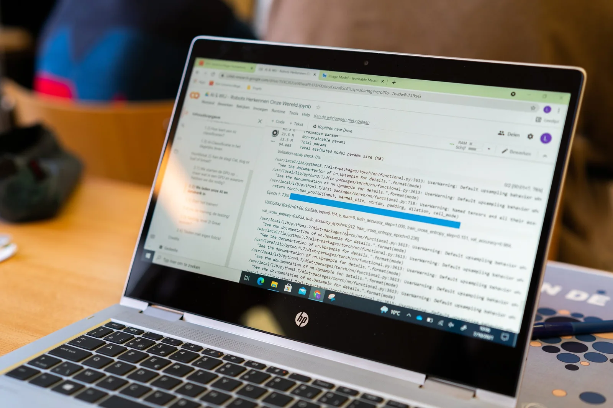
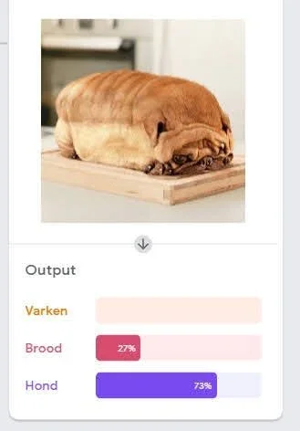

_This post appeared earlier on the site of the Flemish AI knowledge center_ [_Kenniscentrum Data & Maatschappij_](https://data-en-maatschappij.ai/nieuws/gastblog-ai-in-de-klas)_._

**Ask any teacher how things are going and you are guaranteed to get a variant of ‘busy, busy, busy’. The agenda is always full: projects, goals, attainment targets whiz past in the classroom. If you also want to make time for AI in your school team, you should come fully prepared. But how do you get started? You don’t have to invent hot water for that. This book full of AI-topics and projects is ideal for you!**

### Why should we learn this? 

Students often ask it in a plaintive tone, a little ungrateful even, but it remains my favorite question. It challenges, makes you reflect and calls to account. Because yes, why is AI so important? Isn’t that something with self-driving cars like Tesla’s or from science fiction like Star Wars? A very technical far-from-my-bed show? On the contrary! All too often we fall asleep with the smartphone in hand and that device is the first thing we use when waking up. Nothing far-from-my-bed! Twitter, Facebook, YouTube, Netflix, Spotify, Deliveroo, Tinder … how we communicate, relax, travel, order food and even date: almost everything is done via apps and platforms. Platforms that somehow work with an AI model. Everyone is feeling the effects or reaping the benefits, but few understand what is really
happening.

> “AI is not a STEM only story. AI models are entering the arts, writing stories and distorting our democracy. Necessary enough to ‘mould’ all our students, isn’t it?”

### Hey Siri, how do I bring AI into my classes?’

When you want to talk about AI, you sometimes threaten to not see the forest for the trees. It seems so complicated, requires a lot of prior knowledge, a solid foundation in math… But you don’t have to talk about Naive Bayes Classifier, K-Nearest Neighbors Algorithm or be able to write Python code. In this book you will find some concrete ideas for involving AI in language subjects, in art and in wider society. In this way you can also set up cross-curricular projects in the school team.

### AI & US

Rarely I’ve laughed as with the animated film ‘The Mitchells vs. The Machines’, where robots fail against the Mitchell family’s dog. Their chubby pug Monchi looks a bit like a pig, a dog and a loaf of bread. Sufficient for a system error! Monchi is the inspiration for a first project: how do I teach an AI to recognize dogs, pigs and bread? In other words, how does object classification work? This system also surrounds us in real life, such as identifying road users, detecting missorted waste on the recycling belt, and even recognizing emotions. Is it possible to recognize emotions by an AI? Of course! We can use object classification to teach happiness, anger, fear, sadness ... to an AI model. That way the job is done on the AI side, but isn’t this an ideal reason to discuss emotion understanding together with your colleague psychology, religion or morality? Does emotion only have a visual aspect? Is emotion just about the face? What if we extend this to biology and build an AI Dermatologist? The possibilities, but also risks and food for debate, are increasing. 

> “Let the introduction to ‘De Bello Gallico’ roll from Caesar’s ‘own’ lips, you can do that in your class.”

### AI & ART

This GAN approach does not only lend itself to making old emperors speak. You can also use it to breathe new life into old photos and videos. If your school or neighborhood has an archive of old images, you can have them colored with an AI model. You can even almost bring them to life through a system where 2D images are turned into 3D. It only takes you and your students about twenty minutes.

Have you ever wondered what your selfie would look like in the style of ‘The Starry Night’, by Van Gogh? Here’s a first time for everything! You can teach an AI a certain painting style to create your own artwork. Even music styles can be mastered by an AI. Thus Beethoven left us only nine complete symphonies. That tenth was left unfinished… but what if you could have an AI study those nine well-known works? What if an AI could then attempt to finish that tenth?

Don’t like coloring photos or copying a style? No worries. With systems such as CLIP and VQGAN you can let an AI create the most wacky art itself based on simple text commands. Unleash your inner Picasso, compose the most lyrical commands and unleash an AI’s wildest fantasy.

### AI & LANGUAGE

In addition to recognizing images, an AI can also be used in a language lesson. You can use it to recognize an author’s writing style (stylometry), or to teach the AI a certain writing style. How about writing a new Harry Potter story in the classroom using an AI language model? A new adventure for Frodo and Sam from Middle-earth or new verses as only Taylor Swift or Ovid can?

Speaking of Ovid, did you know that you can also use an AI with classical languages? Discover your inner Indiana Jones and take on the role of an archaeologist who finds a new, but unfortunately damaged, inscription. This is fodder for an epigraphy lesson where an AI will help us track down missing characters in an ancient Greek poem. Not just any poem, but one of which the last lines are so scratchy, the meter so different, that your Greek colleague will be happy with it for a few lessons afterwards. “I don’t care. Go on, love me. It’ll do you good.”

And what about Latin colleagues? No worries! Get to know ‘deepfakes’ together. An AI approach where two systems, a detective and a counterfeiter, compete against each other to create increasingly better false images. 95% of the time, this technology is used for bad purposes. Disinformation, fake news, revenge porn… Dangers that students need to be aware of. But what if you use it for something good? What if you could use it to resurrect Roman emperors and consuls? To organize a speaking assignment in active Latin as an ideal excuse to learn how to make deepfakes in the classroom?

[Video on YouTube](https://www.youtube.com/watch?v=cnyXYQmAF0g)

### Conclusion

AI systems have long ceased to be a footnote in our lives and should not be limited to the margins of a media literacy project. They have the potential to profoundly influence every aspect of our lives, every subject in school. For the worse, but also for the better. Have you been bitten by one or more of the above projects and would you like to get started? You can find them and some others in this book or on my website. Feel free to send an email and I will help you on your way.

### Contact

Questions or you need more information? Head on over to the contact page!

<a class="content-button content-button--primary content-button--medium" href="/contactinfo">Contact</a>

