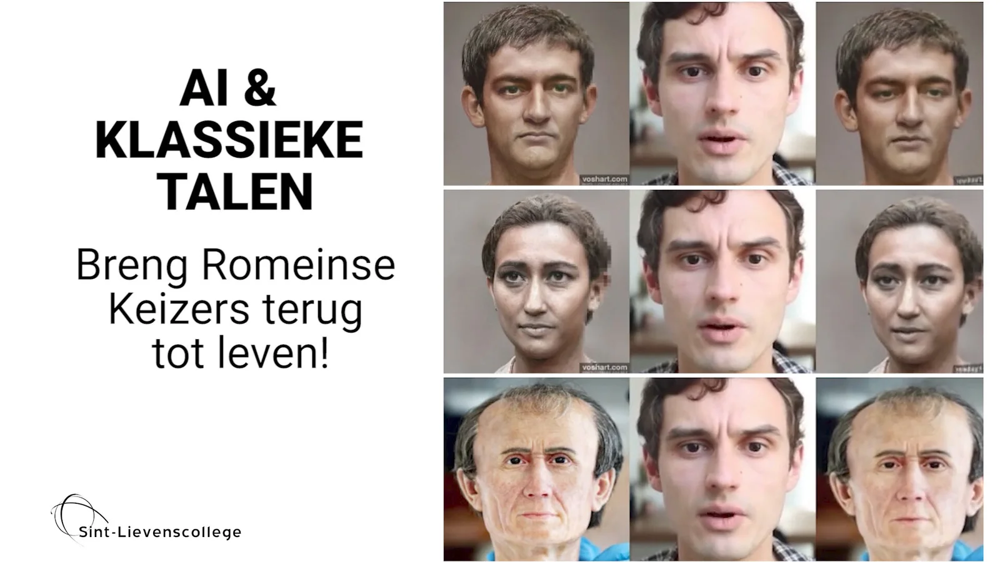

**"Artificial Intelligence"** has an increasing influence on our lives. From autocorrect on touchscreen keyboards to recommendations on Netflix, the posts on social media, the deliveries on Deliveroo… to the ranking on Tinder. Take your smartphone by the hand and you will find countless apps that involve AI in one way or another. Apps, AI and algorithms increasingly determine our future!

In this educational project (secondary education), we bridge the gap between two apparent opposites: classical languages and programming languages such as Python. We're using just that AI technology and programming techniques to bring the ancient Roman emperors back to life!

### Examples

[Video on YouTube](https://www.youtube.com/watch?v=Gc3yBfwIiwk)

Caligula speaking. Demonstration of class assignment on Latin pronunciation and historical background of an elected emperor.

[Video on YouTube](https://www.youtube.com/watch?v=ddtnNYgiluU)

(for the record, I am not a classicist and my pronunciation is much too French)

[Video on YouTube](https://www.youtube.com/watch?v=_-SV6k0I5w0)

(A better example of how to take care of your Latin pronunciation!)

### Full explanation

This educational project consists of three parts, namely:

-   A theoretical introduction into AI

-   A part focusing on AI and sensible media usage

-   A part combining Roman emperors and AI

In the video below I walk you through these parts.

[Video on YouTube](https://www.youtube.com/watch?v=OUQbia6wRFM)

### Contact

Questions or in need for more info? Head over to the contact page!

<a class="content-button content-button--primary content-button--medium" href="/contactinfo">Contact</a>

