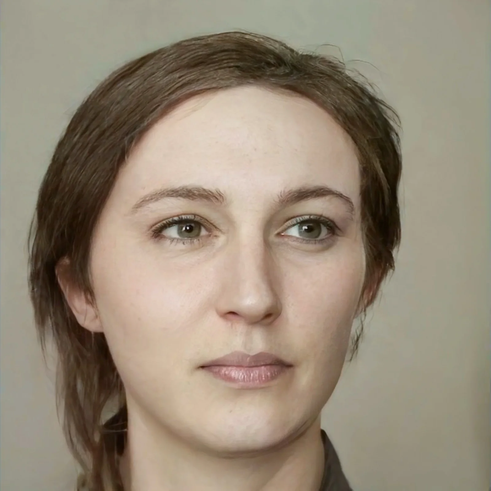
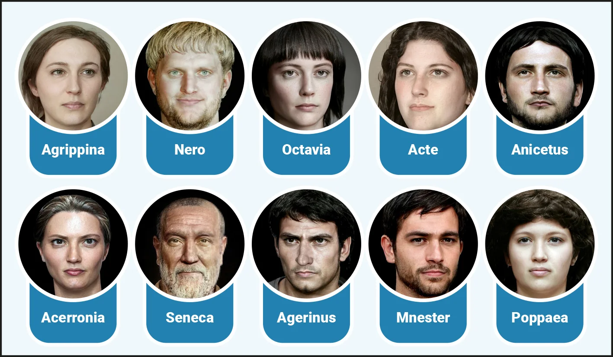
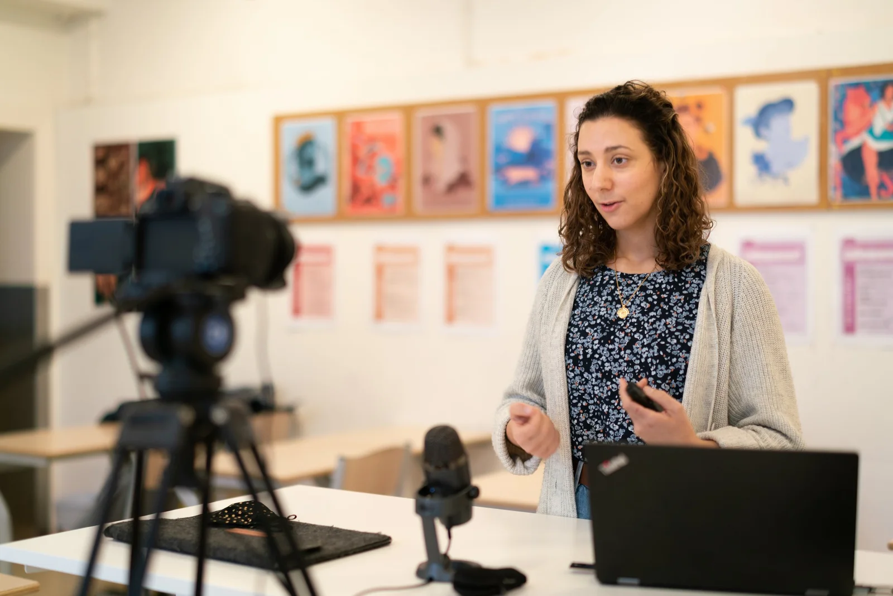
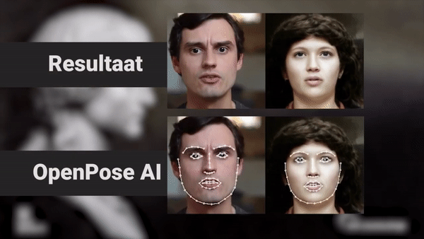
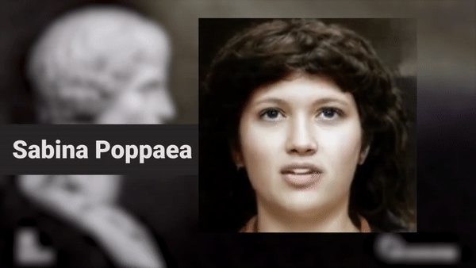
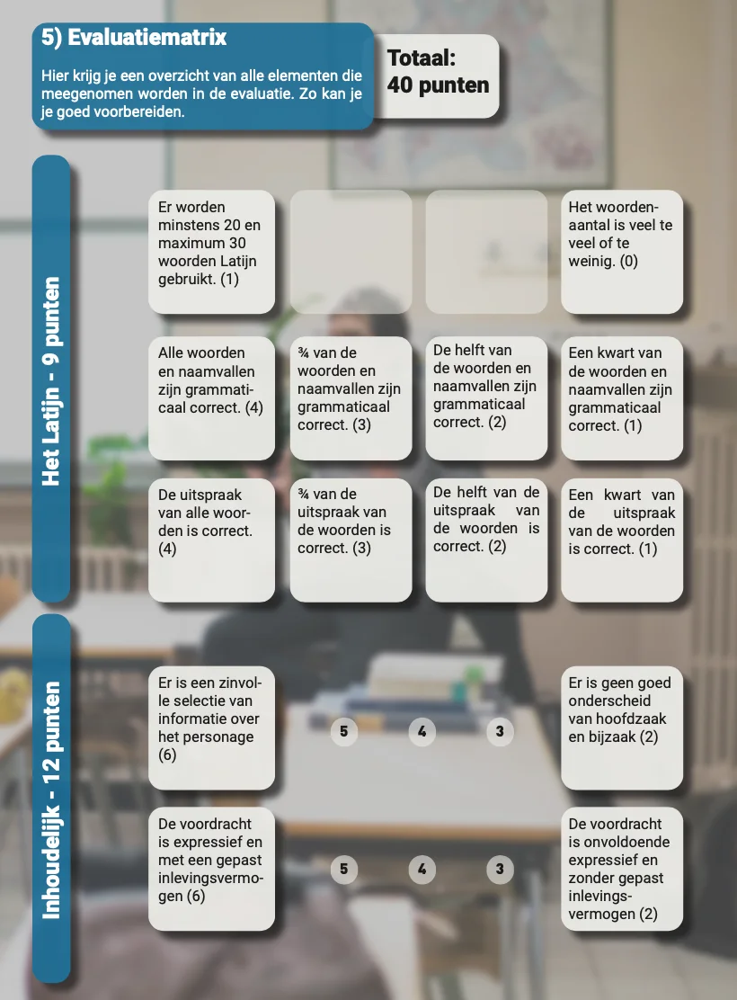
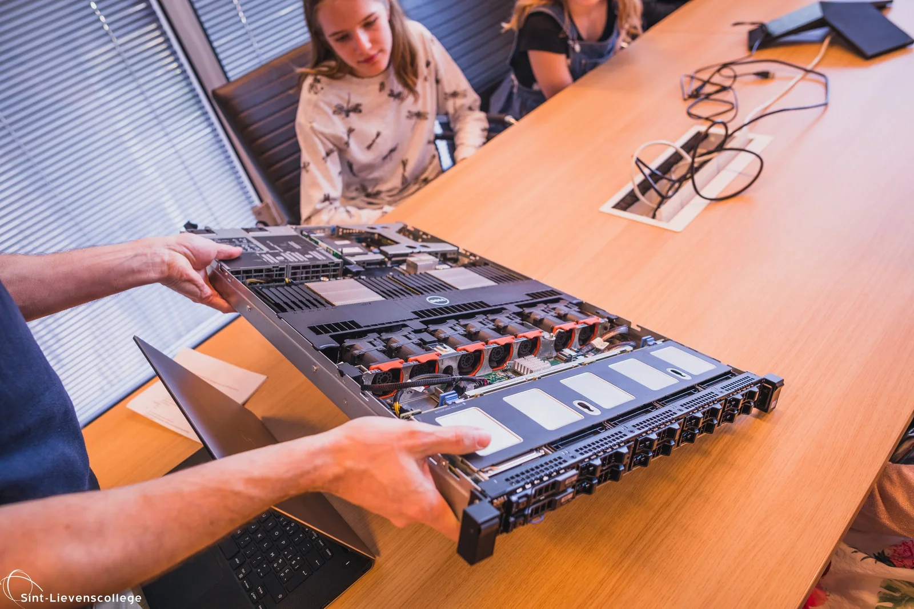

### Artificial intelligence is on the rise. It is driving breakthroughs in self-driving cars, creating a personalised viewing experience with services such as Netflix, determining what we see on social media ... and it also accelerated the creation of deepfakes. More than 95% of all deepfakes are made with malicious intent, such as misinformation or revenge porn. This project, a collaboration between UGent and Sint-Lievenscollege, makes a positive case for this AI technology! We build a bridge between two apparent opposites: classical languages and programming languages. In this project, you will use your knowledge of Latin to play the role of one of the characters in the Annals of Tacitus!

[Video on YouTube](https://www.youtube.com/watch?v=RY0JahcxLmU)

### Bridge between two opposites

This project was developed to build a bridge between two apparent opposites, namely classical languages and modern computer techniques and programming languages. It aims to introduce students to the world of artificial intelligence, showing them the possibilities, but also the dangers. It is thus a combination of media wisdom, AI knowledge, understanding of Latin texts and pronunciation.

### How did this project come about?

This teaching project was developed by Robbe Wulgaert (Sint-Lievenscollege Gent), Florian Debaene and Laurens Van Daele (Students Educational Master Greek-Latin UGent). This together with lecturers Katrien Vanacker and Katja De Herdt (UGent) within the framework of the subject 'Vakdidactiek B'. This project is a further development of the teaching project 'AI & Classical Languages - Bring the Roman Emperors back to life' and is built on earlier work, namely 'First Order Motion Model for Image Animation'.

### Get started with Tacitus!

A digital reconstruction of Agrippina by Panagiotis Constantinou.

For this project, we chose Book XIV, paragraphs 1 to 9 from the Annals of Tacitus. These texts tell the story of the murder of Agrippina, the mother of Emperor Nero. According to the stories, Agrippina was even murdered by an accomplice of her son and Emperor Nero. In the selected fragments, a whole range of characters are portrayed. Nero and Agrippina, but also Sabina Poppaea, Acceronia and even the philosopher Seneca. They all play a role in a story in which Nero twice tries to kill his mother. The last time with success ...

### Choose your character!

In this project, the pupils do not read the entire text. Each pupil chooses a character from the story to whom a selection from the chosen paragraphs is linked. Thus, the pupils can choose from:

-   **Agrippina**: Nero’s mother.

-   **Nero**: emperor of the Roman Empire.

-   **Octavia**: Nero’s wife.

-   **Acte**: Nero’s slave.

-   **Anicetus**: Nero’s accomplice / henchmen.

-   **Acerronia**: Agrippina’s ‘friend’.

-   **Seneca**: Nero’s counsellor.

-   **Agerinus**: Agrippina’s messenger.

-   **Mnester**: Agrippina’s former slave.

-   **Poppaea**: mistress of Nero and wife of Otho (see also examples later in this article).

Overview of the characters in the text. Reconstructions by Panagiotis Constantinou.

When the students have chosen their character, they read through the relevant paragraphs. For this purpose, we provide the text in Latin and in Dutch. Through the text fragments, they learn the true situation of their character in this story. They will have to summarise this information and translate it into direct speech, as if their character is telling it himself. In the text the pupils have to use at least 20 to 30 Latin words. This text will serve as a basis for the next step, where we will turn it into a real pronunciation exercise!

### Ready? Set? Action!

Collega Latijn/Grieks toont hoe het moet.

-   Before we get into the skin of our chosen character, we have to record the text (in direct speech). For this, we use the webcam of the laptop. There are a number of things to bear in mind during this step:

-   take care of your pronunciation of Dutch, English and Latin;

-   articulate well;

-   tie up long hair;

-   remove (if possible) accessories such as glasses or hats;

-   try to stay in the middle of the frame;

-   deliver the text with empathy, intonation and enthusiasm!

The above tips will ensure that our AI model can calculate the best possible final result. Long loose hair or unnecessary accessories can confuse the AI model!

### How does this AI work?

The AI model or First Order Image Model for Image Animation uses two elements that it tries to put together. The first element is a base image. This is a reconstruction of one of the characters in the story of Tacitus. Secondly, the model uses our recorded video, where we introduce our text in direct speech, as a driver video. This video will drive the animation of the base image. So the model will look for parts of our face in the video and transfer these movements to the still image.

The AI model shown above does not use a regular machine learning technique like supervised or unsupervised learning. This model is built on the GAN principle. A GAN or Generative Adversial Network actually consists of two AI models. One AI model is responsible for generating false images, the other tries to distinguish the false from the real. Think of it as an eternal boxing match where two opponents get better and better. This approach ensures that we get to realistic image generation much faster through artificial intelligence ... with all the consequences that this entails.

### What does the AI model see?

AI models are often black boxes. Because of the way they write their own algorithms, it is very difficult to see how the model makes decisions. In other words, AI models are not very transparent. By letting the OpenPose AI loose on our video, you get an indication of the points of interest that our AI model would use for deepfakes. It is an indication because the OpenPose AI model is a different model than the First Order model.

### End result!

The end result is an output of three screens. In it we recognise our base image, the driver video and the end result. This end result is the synthesis of the image, the video and the sound from the video. So it is possible that you chose a character that does not match your gender identity or voice timbre, but this should not affect the technical functioning of the AI model.

If all students take good care of their video and follow the step-by-step plan in the Notebook, each student will have made one deepfake of their chosen character. When you group the characters together in one PowerPoint file and sequence them, you can bring the story of Tacitus to life! Each of the characters will tell their story, from their own perspective!

[Video on YouTube](https://www.youtube.com/watch?v=zfNlg2tF2Ws)

### What will I learn?

### Lesson targets

During this project, which combines the reading of a Latin text, a speaking exercise and an introduction to artificial intelligence, many lesson objectives are addressed. In order to help the teacher to evaluate these objectives, we have designed an evaluation matrix.

Part one of the evolution matrix.

### Curriculum goals

Some curriculum objectives (curriculum Latin Grade 3, Catholic Education Flanders) are also achieved through this approach, namely:

-   LPD 4: Apply a learned reading method.

-   LPD 5: Systematically check reading comprehension against grammatical and content-related criteria and indicate the nature of any problems.

-   LPD 7: Demonstrate reading comprehension by extracting the main idea from the text, paraphrasing the text, synthesizing the text, reading the Latin text expressively ...

-   LPD 9: Dissecting the structure of a text (fragment).

-   LPD 13: Clarify the communicative function of texts through form and content.

-   LPD 14: Critically evaluate the relationship between content and form and assess the expressive value according to classical and contemporary views.

-   LPD 15: Situate a fragment of text in a broader context.

-   LPD 19: Compare given translations with the source text and with each other, explaining differences between the Latin and Dutch language systems.

-   LPD 28: Explain the identity and diversity of Roman society on the basis of language and culture.

-   LPD 29: To give a personal reaction to Roman ideas and cultural expressions and to process this in a creative way.

### Requirements

Student at work in a Colab Notebook.

To get started with this in the classroom, you will of course need a few things. These are:

-   the workbook for pupils

-   the manual for teachers;

-   a laptop with a webcam;

-   a stable internet connection;

-   a Google or Gmail account.

A ‘blade server’ with powerful hardware to solve complex calculations.

In the workbook for pupils and the manual for teachers you can find all the steps, written texts and examples. The laptop, internet connection and Google or Gmail account are required to run the Notebook, the programme with Python code. This Notebook and code require a lot of computing power, more computing power than a regular laptop can generate. To make this project accessible to all students, we use the Google Colab environment. This environment makes it possible to execute the code on solid server hardware at Google.

### I want this in my classroom. What should I do?

Are you interested in bringing the story of Tactician to life with your students? Or do you have another question about this topic? Then you've come to the right place. I will usually answer your question within 48 hours!

<a class="content-button content-button--primary content-button--medium" href="/education/workshops-and-teacher-training">Workshop info</a>

<a class="content-button content-button--primary content-button--medium" href="/contactinfo">Ask a question!</a>

