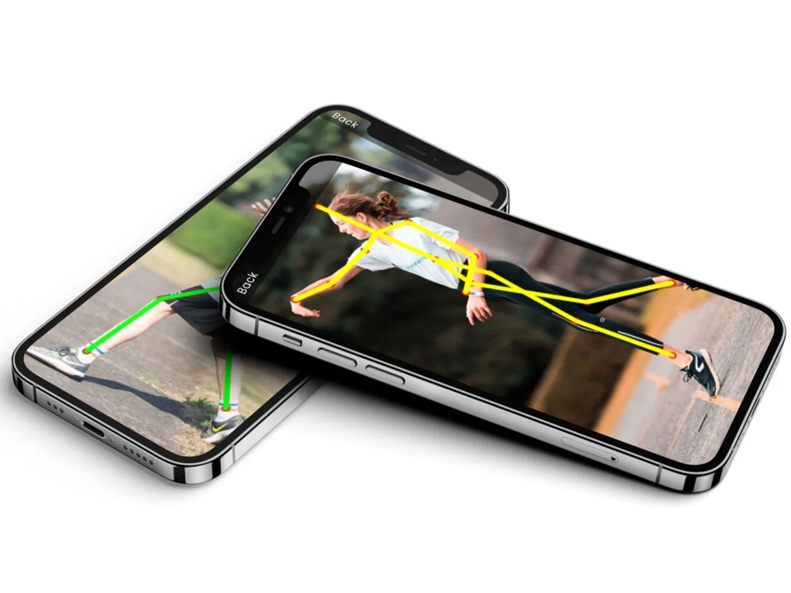

### Artificial intelligence is becoming more and more like electricity. At work everywhere in the background and necessary for countless innovations. Those smart algorithms already determine how we work, travel, date ... applications such as ChatGPT write homework and Stable Diffusion or DALL-E can create the craziest works of art single-handedly. You can bring this technology into the classroom across subjects, together with a colleague in art, classical languages and even physical education! Welcome to InFORM, the lesson project where students combine sports, Python and AI to work on their technology and attitude!

[Video on YouTube](https://www.youtube.com/embed/jm0j_JzMpmI?feature=oembed)

### What is InFORM?

InForm is a teaching project where we bridge the gap between physical education and computational thinking. Designed for students in second and third grade secondary education, it offers an introduction to the world of AI. Not merely theoretical, as we apply it in physical education and programming lessons. This allows students and teachers to use digital applications in physical education lessons to evaluate attitudes and techniques. Such apps and programmes are already purchased by some schools, but the teaching approach in this article engages students in applying this kind of technology. Thus, they gain insight into the underlying technology of such apps, analyse their own sports technique or that of fellow students. Peer feedback, in other words! This way, we work together on thoughtful data collection and analysis to adjust our learning path.

### How does OpenPose work?

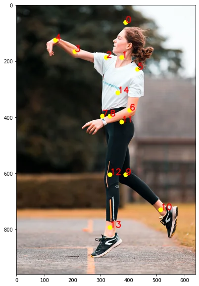

_volleyball player with annotations / ‘keypoints’._

Within this lesson project, students will work with OpenPose. That is an AI Framework that works on the basis of 'Human Pose Estimation' or 'keypoint detections'. So it is pre-trained to recognise a human body by certain points of interest or 'keypoints'. We apply this to a picture from the lesson L.O.

When we give the AI model this image or photo, it will apply its recognition algorithm and automatically point out points on our image. So we, as humans, don't have to do this little job ourselves at all!

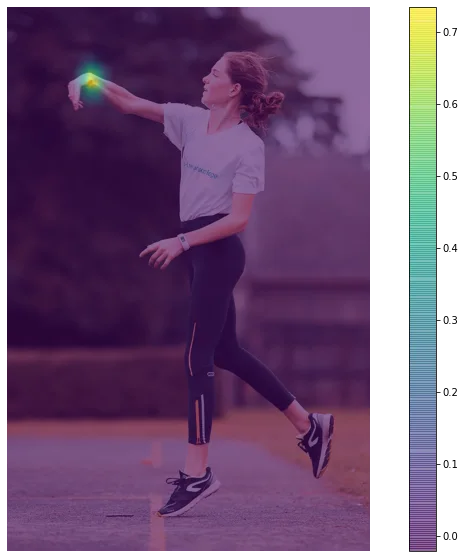

_Analysis of one keypoint. Colour indicates the certainty of the AI-model._

When we look under the bonnet, let the model focus on a single point and visualise it, we learn how the AI model analyses a picture. It is possible for students, through the use of Python code, to control the AI model. By changing the desired focus point, they can designate a zone. They can use this to indicate that a particular point, such as the elbow, is not fully extended on a throw. Or that an ankle, due to poor placement, is overloaded.

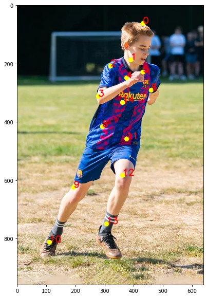 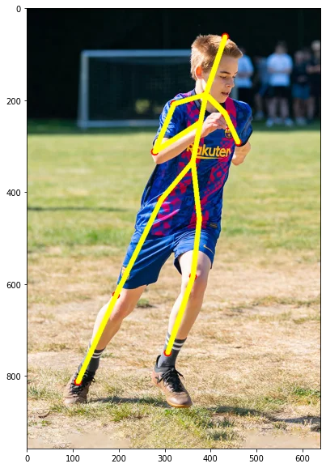

Not only is it possible to indicate a single point or several points in a given picture, the model can also connect those points to create a stick figure. A skeleton, as it were. So you can illustrate the entire figure with yellow line segments, as above. These line segments have RGB code that, again via Python, we can program ourselves. A good excuse to introduce students to RGB codes in a computer science lesson! This also allows you to select certain line segments and assign them a specific colour. Green when the attitude or technique is good, but red when improvement is needed. You can apply this to the analysis of a leg when jumping off, an unstretched arm when throwing or a back when lifting or sitting.

Important: the AI model can automatically point out points and, when you solve the tasks in the Python code, draw line segments in a particular colour. But indicating good- or bad posture, by colouring points and line segments, is done by the teacher and/or student! They use their expert knowledge of good technique and healthy ergonomics to complete that analysis and draft the feedback.

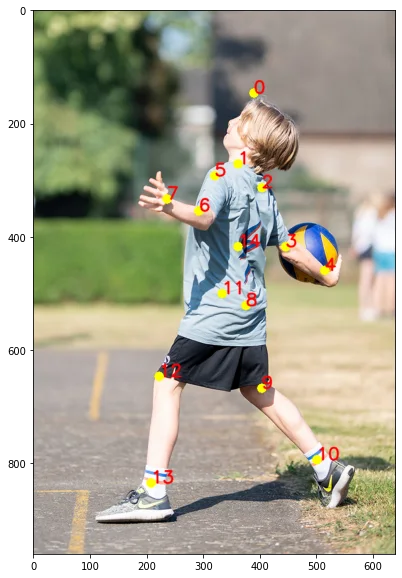

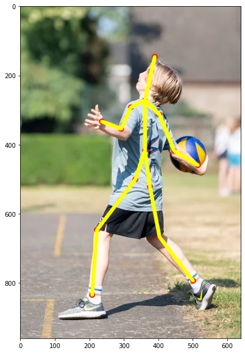

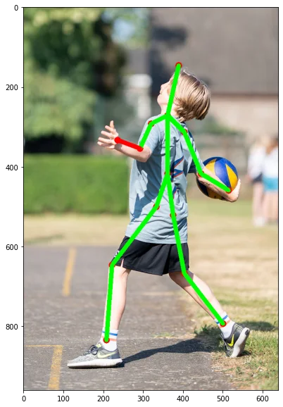

  

Within the learning materials, starter images are provided, but there is also a feature built in that allows students to upload a previously taken photo or turn on their device's webcam and take and analyse the photo directly. It thus offers a certain flexibility when integrating digital learning materials into a physical education lesson.

Finally, and as an extension, it is also possible to import video files. This can be done via an upload of an existing video clip or the direct creation of a video via a connected webcam. Please note: I have deliberately reserved this as an extension, as this analysis may take some time. From the example below, you can see how many seconds it takes per frame. Not frames per second, but seconds per individual frame! If you calculate for a moment that 24 frames stick in 1 second, you may soon count 1 minute of calculation time per second of video. A jump over the buck that is completed in five seconds takes over five minutes to analyse.

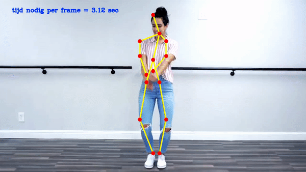

### Class Materials

The teaching material consists of:

-   a fully developed Notebook with Python code;

-   a teaching video;

-   an accompanying PowerPoint.

### Requirements

To get started with this teaching material and thus bring AI into the classroom, you will need the following items:

-   computer (with internal or external webcam);

-   smartphone or other device to take photos;

-   stable internet connection;

-   basic knowledge of Python (what is a string, how do I create a variable ...);

-   a Google or Gmail account.

No programmes need to be installed to run the code. So it does not place any major requirements on the teacher's and student's device. Everything can be run within a computer's web browser. Using a smartphone or iPad to run the Notebook is not recommended.

### Lesson Phases

This teaching material can be applied in the following steps:

-   introduction OpenPose, interpretation of the goals and introduction to the Notebook and Python code;

-   physical education lesson: focus on a particular technique (e.g. the throw in a shot put);

-   physical education lesson: students perform and take pictures;

-   computer science lesson: students perform analysis on the photo material taken;

-   evaluation and reflection.

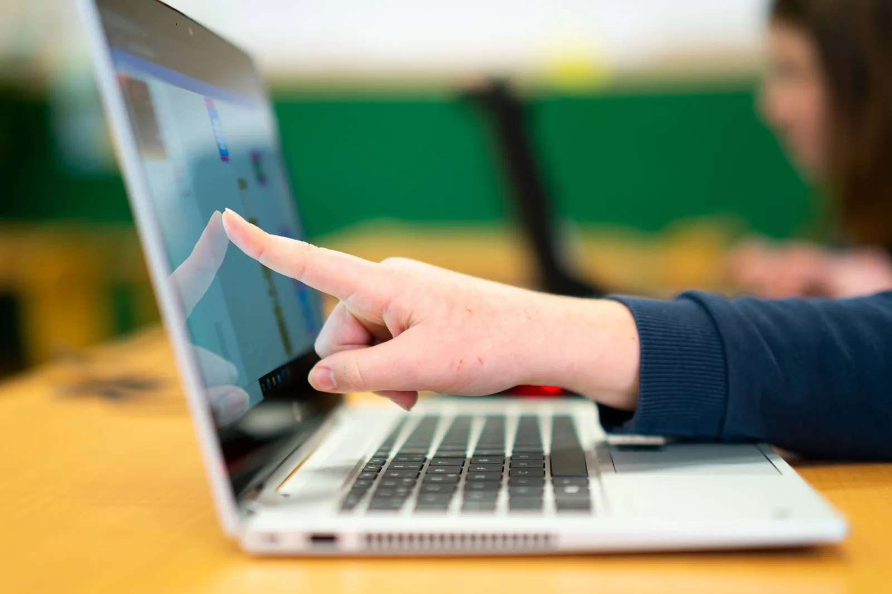

### Computer Science Goals

This project requires a basic knowledge of programming and Python. Thus, in the Notebook, students need to add or modify code themselves in certain places to complete the tasks successfully. The required knowledge and skills are limited to:

-   noting or modifying a string;

-   creating a variable;

-   writing a delimited repeat;

-   modifying an RGB colour code (more information in the teaching material).

This therefore covers a select number of elements from the computational thinking curricula, such as variables, data types, the sequence and bounded repetition. Within the code, there is also a selection.

### Goals - Physical Education

Within the physical education curriculum, you can link this teaching material to movement domains where there can be a focus on technique and ergonomics. For example, the serve in volleyball, but also the players' posture on the pitch when they have to perform a reception. This teaching material is therefore not tied to a particular movement domain.

Within the current physical education curriculum, Catholic Education Flanders, you can try to link this to the following focal points and curriculum objectives:

**Points of interest:**

_'Systematically collecting relevant information about pupils' learning process and learning outcomes can help you understand each pupil's initial situation and the extent to which the pupil is achieving the predefined goals. Based on these determinations, adjusting teaching and/or planning can help pupils progress at their level.'_

Information such as images of technique and attitude can assist a student and teacher in providing targeted feedback on the learning process and outcome.

_"As a teacher, it is important to evaluate broadly. When evaluating, don't just think about skills, knowledge and attitudes and the application of roles also deserve some form of evaluation. Students can only grow if all aspects receive adequate attention and feedback. This evaluation can be formative or summative, formal or informal, oral or written or a combination of the above forms of evaluation. Self- and peer evaluation certainly also deserve a place in this event."_

Here again, the feedback component comes into play. By thoughtfully using images, analysing them and making that analysis dependent on learners' knowledge ("What is a good working posture?", "What characteristics distinguish a good from a bad ergonomic posture?"), we can contribute to this learning process. Pupils do not have to analyse only their own images. By dividing them into groups, they can help take, analyse and provide feedback on each other's images.

**Curriculum objectives:**

-   LPD 1 The pupils, taking into account their physical abilities, perform basic motor skills.

-   LPD 2 The pupils, taking into account their physical abilities, apply techniques and learned skills to perform simple, compound and complex movements.

-   LPD 4 The pupils assess their progress in movement situations using criteria in themselves and others.

-   LPD 7 The pupils apply techniques for correct body posture and ergonomic principles in different movement situations.

-   LPD 8 The pupils compare their own static and dynamic posture with recent insights into ergonomics.

-   LPD 11 The pupils use (digital) resources to support the learning process in movement situations.

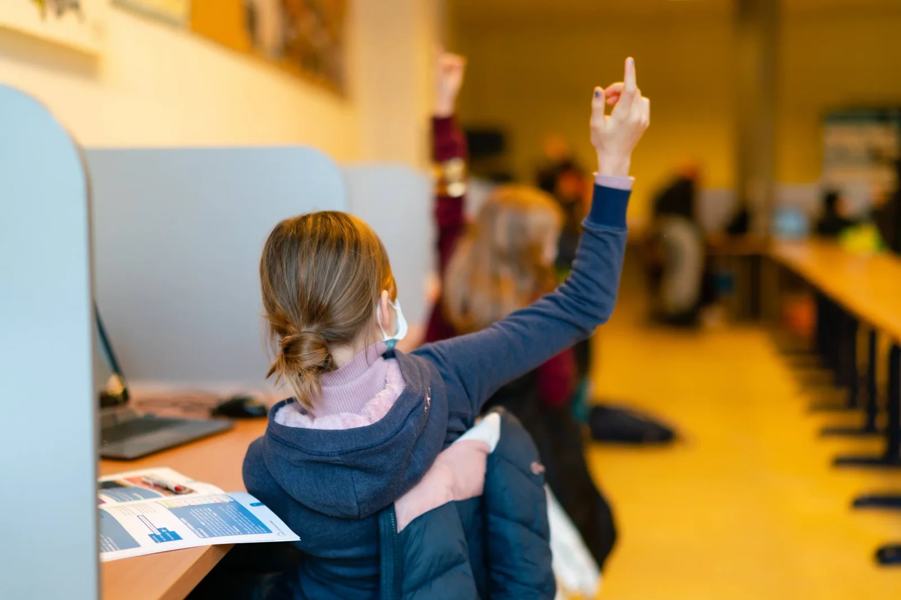

## **I want this in my classroom! What should I do?**

Want to work on this yourself in your classroom or gym? Super! The future will be more and more digital. A future in which artificial intelligence will play a very important role, in all kinds of facets of our lives. That we need to prepare and motivate young people for this goes without saying. I am happy to help you with that! Via the buttons below, you can send me a message or get information about a refresher course or workshop. I usually reply within 48 hours!

<a class="content-button content-button--primary content-button--medium" href="/contactinfo">Ask a question</a>

