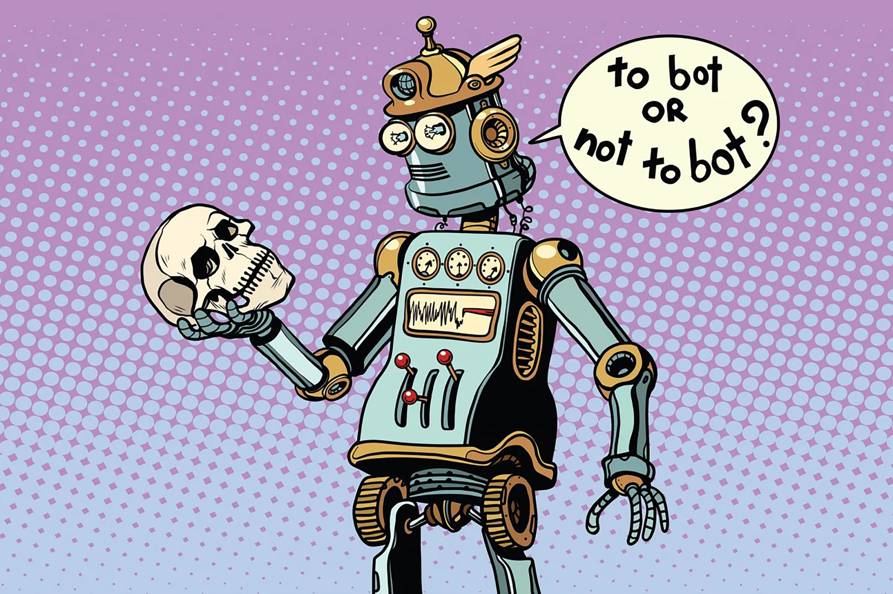
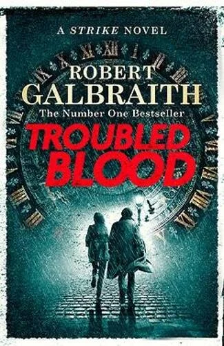

[Video on YouTube](https://www.youtube.com/watch?v=eBZfnJ8l0SQ)

### The holidays are an ideal time to finally read some books. Finally get through that clapper of Zuboff or go back to your old favorites like Tolkien or Rowling. But did you know that AI can also recognize authors and their writing style? Not just recognizing, but learning and imitating that writing style? Will the latest Harry Potter be written by an AI?

**Welcome to the educational AI-Project 'Author or AI-teur'!**

### Stylometry: Linguistic Fingerprint - AI as Detective

### Rowling or Robert Galbraith? Can you still hide behind a 'pseudonym'?

A pseudonym, a false name or pseudonym, is a name writers use when they want to hide their real identities. Because they write something that is banned or censored or want to protect their new work from prejudice.

So it was with Robert Galbraith, author of a series of English-language crime detectives…or was it? Because Galbraith's books were analyzed by language algorithms. These algorithms were trained to do stylometry. That is the art of identifying an author on the basis of the writing style. The AI will read many works, analyze, calculate which words and punctuation marks are used ... in order to retrieve the linguistic or linguistic fingerprint . Exactly CSI!

As it turned out: Galbraith turned out to be none other than J.K. to be Rowling!

### **50 shades of Grey in a medieval monastery**

Another example where language algorithms and stylometry made the world a mystery poorer are the love letters of Abelardus and Heloïse from the 12th century. For a long time these love letters were known for their most explicit content. For Abelardus and Heloise wrote to each other very flirtatiously, while both were in a monastery. Love for each other seemed a lot bigger than love for God, didn't it?

Nothing less true. Thanks to these language algorithms, Jeroen De Gussem (researcher UGent) succeeded in determining the writing style, the linguistic fingerprint, of the letters.

As it turned out: All letters were written by Abelardus himself! So there was no romantic, erotic, spicy correspondence with the beautiful Heloïse at all. For years Abelard made fun of us.

You can learn more about this story and the power of stylometry below in the interview with Jeroen De Gussem.

[Video on YouTube](https://www.youtube.com/watch?v=1ihySn1CQqI)

### **Roboteo & Julia? Lord of the Robots? Algorithms as authors!**

Above we discussed stylometry, the identification of the linguistic fingerprint of a text. So we were able to read in a text via language algorithms and recognize who the author was!

But in the classroom we go a step further. If an AI recognize a writing style, the A.I. imitate that writing style? Writing a text yourself in that particular style? Do you want to write your own newspaper articles?

The answer is: Yes! Below you will learn how we get started!

[Video on YouTube](https://www.youtube.com/watch?v=eBZfnJ8l0SQ)

### AI-thors, that means AI-copyright?

Congrats! After recognizing authors, our AI can also write new stories with our chosen texts. Bring on that new, AI generated, Harry Potter! … However?

Is what we've done actually allowed? Would a J.K. Rowling not be outraged that our A.I. wrote a new book in her franchise? Who is actually the author of this new work? The AI, because who wrote it? We, because we pushed the buttons? The author of the source texts, because that's where the writing style comes from?

With those questions we went to Thomas Gils (KUL). He specializes in IP law and new technologies such as AI. The answer to our questions is not as simple as you think.

[Video on YouTube](https://www.youtube.com/watch?v=Ksheo4RrQUM)

### Contact

Questions or in need of more information? Head on over to the contact page!

<a class="content-button content-button--primary content-button--medium" href="/contactinfo">Contact</a>

