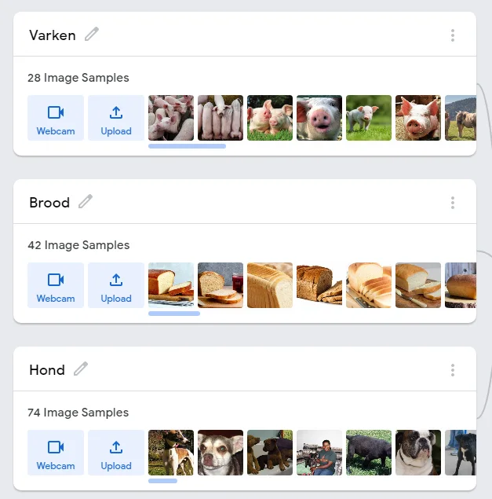
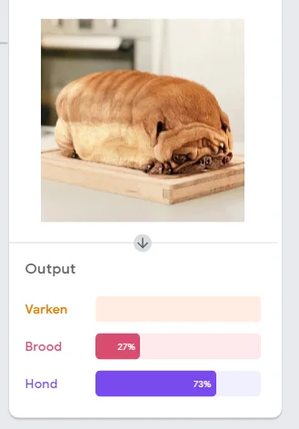
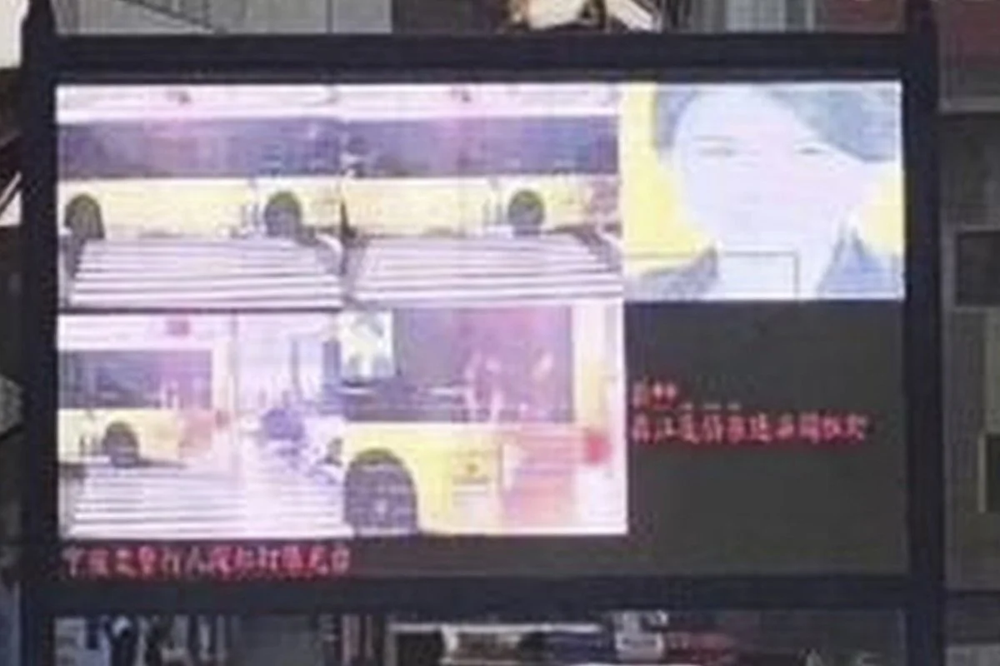
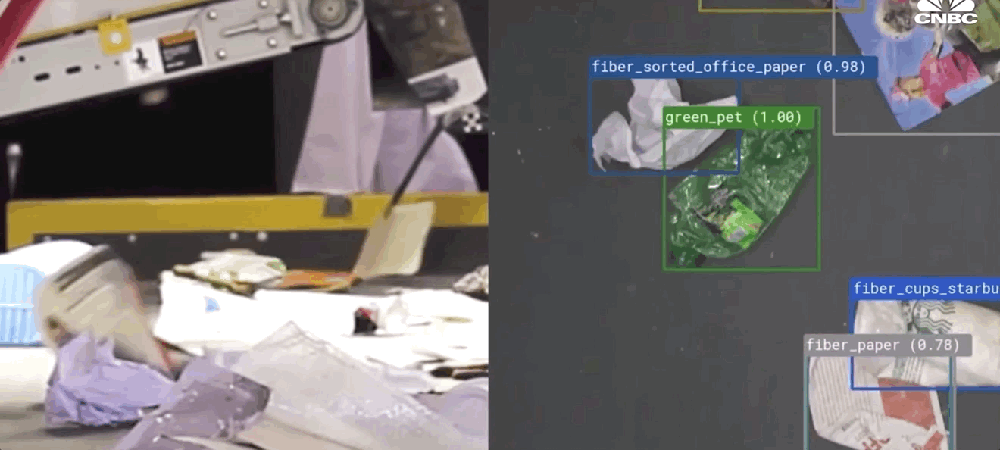
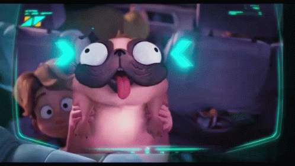

**Object classification or recognition by an AI sounds simple because we use or encounter it on a daily basis. Unlocking your smartphone with your face, apps with special filters that fit perfectly on your face, self-driving vehicles that can distinguish road users ... Even a plant-Shazam app that helps you identify plants. But how can an AI recognize those objects? How do you teach an algorithm to distinguish between dogs, pigs and bread? Can you do that in class?**

**Well, you learn that here!**

[Video on YouTube](https://www.youtube.com/watch?v=6M01VKnypO4)

### How does such an AI learn to classify?

An AI system can do object recognition by means of machine learning. Give an AI model a huge amount of data, such as photos, and time to process it. During this processing, the system will look for patterns. Landmarks, as it were.

To engage in this form of machine learning, it can use one of two types of ML:

-   **Supervised Learning**

-   **Unsupervised Learning**

**Supervised Learning:** That is an ML approach with human intervention. As developers, we will pre-sort the data. So we, as human beings, carry out the classification. Imagine you have three boxes in front of you. The class is noted on the side of that box. Dog, pig or bread. You put thousands upon thousands of pictures of dogs, pigs, and pieces of bread in each box. Then you give those three boxes to the AI model. Its task, with its gigantic computing power, is to go through it X number of times and to remember patterns.

**Unsupervised Learning:** That is an ML approach without human intervention or pre-classification. So the AI system will not get 3 boxes with the correct label, but rather a giant box with all the photos mixed up. The AI model will use the massive computational power to go through those photos, multiple times in a row, looking for patterns. He therefore places them himself, on the basis of the patterns found, in piles that are correct for him.

### AI classification in our daily lives

The end result after the training is an AI model that can recognize new data, unseen images or photos. Or try anyway, because the model makes a prediction. It works with a degree of certainty or uncertainty. Just like humans, an AI model can get confused when an image isn't clear, or when it's ambiguous. That can cause strange situations.

For example, a Chinese CEO received numerous fines for dangerously crossing the road. This while she hadn't even been to that particular city. Buses did drive around there with her face on the side as a promo. The facial recognition cameras at the crossing got really messed up!

Of course, it can also be used for good! For example, it can be used to identify types of garbage. When the wrong types of garbage are in the processing process, a robot can recognize them and remove them. This helps to recycle garbage and could be used to make our living environment more sustainable!

## Let’s get to work!

[Video on YouTube](https://www.youtube.com/watch?v=MWHE-ReAFxA)

We make no secret of it, but an important inspiration for this AI project comes from the Netflix animated film 'The Mitchels vs. The Machines'. In addition to being a wonderfully hilarious and topical film, it also features one of the fun dynamics between side characters. Namely between the pug Monchie and the enemy smart robots.

More was not necessary to overload the AI models in the enemy robots. A hilarious example of a classification error. A classification error that we will try to replicate here in this Notebook!

[Video on YouTube](https://www.youtube.com/watch?v=6M01VKnypO4)

### Contact

Questions or in need of more information? Head on over to the contact page!

<a class="content-button content-button--primary content-button--medium" href="/contactinfo">Contact</a>

