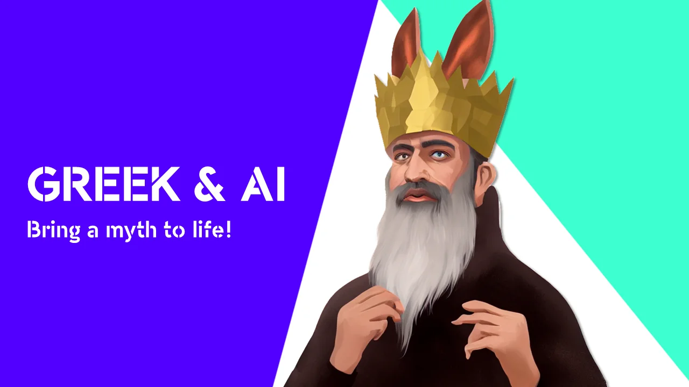

### **Χαῖρε! How do you bridge the gap between artificial intelligence and classical languages? Last academic year, my students and I designed teaching materials that did just this! We developed teaching materials where students took on the roles of characters from Tacitus' Annales for the Latin subject, as well as teaching materials that seamlessly connected AI, History and Greek. This year, we dive into the ancient Greek myths through three different stories using didactic approaches from the artistic education subject. This teaching material thus combines the practical with the digital and targets second and third secondary Greek. Long story short: we made, especially for the Greek Day of Catholic Education Flanders, a Greek myths + AI photobooth!** Πες τυρί!

### **The challenge: Ancient Greek and edtech!**

At educational technology fairs, such as SETT in Belgium or BETT in the UK, you will find countless applications to combine digital tools with sciences and computational thinking. But classical languages are less easy to find there. That is why my students, colleagues and I try to counterbalance them. Within our course section, we consciously focus on the combination between classical languages and modern technology such as games and artificial intelligence!

Within this project, we developed a teaching approach where students are introduced to three myths. The myth about Scylla and two about King Midas, with donkey ears or his characteristic 'golden touch'. They discover the characters and are challenged to assemble the corresponding attributes. Attributes that can help the AI model visualise their chosen mythical figure in the photobooth!

De AI-photobooth in actie!

### **For whom?**

This project targets pupils in the second and third years of secondary education. The pupils discover three myths through adapted stories we tell in class. Then the pupils get to work! In a race against time and with limited craft supplies, they design the corresponding attributes. As icing on the cake, they take a seat in our AI photobooth!

### **Let’s get started!**

During this lesson project, students go through four teaching phases.

**1) Choosing material!**

Even before pupils find out which myths and characters will be discussed, we let them choose material. The justification behind this limitation will be covered in lesson phase 3!

**2) Introduction to myth**

The group of students is divided into three. Each section is presented with its own myth. This myth can be read or told with much bravado (Greek myths, in fact, have a very colourful oral tradition).

**3) Making the attributes**

Pupils are given limited time and resources to develop their attributes. A crown, donkey ears, a lyre, a golden apple ... By limiting time and materials, we challenge them creatively. For the photobooth, it doesn't really matter if the golden apple is made of orange or yellow paper or if the donkey ears turn out to be purple.

**4) Say cheese! Πες τυρί!**

Students take their seats in front of the camera. Through the browser, JavaScript and Python code, we combine the learner's photo with our instruction. This allows the AI model to get to work! The weights in the neural network light up and in no time you see three different processing of your character!

### **How did this project come about?**

This project is the result of a collaboration between UGent and Sint-Lievenscollege Gent. This in the framework of the course unit 'Vakdidactiek B' within the Educational Master. In this course, students Andrée Walravens, Gaëtan Rubbrecht and Sien Denduyver had to develop digital teaching material for Greek in combination with artificial intelligence. For this, they were supervised by subject teachers Katrien Vanacker, Wim Cool and Katja De Herdt (UGent - subject content) and Robbe Wulgaert (supervisor - development of digital material).

Andrée, Gaëtan and Sien explored the possibilities of an AI tool, chose relevant curriculum and lesson objectives, developed teaching materials, chose appropriate didactic approaches, crafted their own attributes and selected evaluation methods ...

Last academic year, in the same course unit, we already designed teaching materials to combine Classical Languages and AI. Thus, you can already take on the roles of characters from Tacitus' Annales or restore an inscription with a language algorithm. So with the myths and our AI photobooth, we are certainly not at our experimental stage!

### Lesson objectives

-   Students can summarise the physical and material aspects of a character using a translation.

-   The pupils can creatively represent the physical and material aspects of a character through a drawing.

-   The pupils can represent what a character looked like using Greek words through a creative product.

-   The pupils show that they have understood words from the basic vocabulary through their creative product.

-   The pupils form opinions about their own and other groups' product through constructive feedback.

-   Learners explain in their own words how AI contributes to the visual reworking of their creative product.

-   Students argue through their artistic process that they have understood the assignment.

-   The students demonstrate through their artistic process and product that they have understood the auditory and written input.

-   Students demonstrate through their artistic process that they can work together.

### Curriculum objectives

These curriculum objectives were selected from the Greek curricula from first grade, second grade, the Artistic Formation / Image and History curriculum, the common ICT curriculum and key competences from first grade and second grade.

**Classics curriculum (first grade):**

-   LPD 47: pupils derive context-appropriate translations of words from the memorised meanings;

-   LPD 27: the pupils process aspects of classical antiquity in a creative way;

-   LPD 52: the pupils describe aspects of Greek culture and compare them with their own.

**Classics curriculum (second grade, updated curricula 2023-2024):**

-   LPD 4: pupils give the meaning, word type and additional meaning of about 800 frequent words;

-   LPD 34: the pupils illustrate the reception of classical antiquity;

-   LDP 35: the pupils process aspects of classical antiquity in a creative way.

**Learning outcomes (key competences) from first grade:**

-   Competences in Dutch

-   Competences in other languages

-   Cultural awareness and cultural expression.

**Eindtermen (sleutelcompetenties) uit de tweede graad:**

-   Key competence Dutch

-   Key competence: cultural awareness

-   Cultural expression:

    -   Appreciation of artistic and cultural expressions can be expressed in different ways, both linguistically and expressively. By going through an artistic creation process yourself, appreciation for the expressions of others can be argued in a more nuanced way. These objectives are at the forefront of the learning outcomes under the third building block.

    -   Cultural expression is addressed in a content building block 'using imagination in a focused way when creating artistic work'. The reciprocal connection and influence between knowledge, feeling and body experience are characteristic of creative processes. Consciously experiencing this interaction between body, feelings and knowledge while creating contributes to personal development.

**Curriculum Artistic Formation / Image:**

**Contemplation**

-   LPD 1: The pupils experience a diverse range of cultural expressions through art.

-   LPD 2: Pupils perceive art and cultural expressions with an eye to subject matter and purpose.

**Create**

-   LPD 10: The pupils experiment in function of a defined task with various building blocks, materials and (basic) techniques of different artistic forms.

-   LPD 12: The pupils create artistic work from their own imagination in function of a defined assignment.

-   LPD 13: The pupils create artistic work together.

**Reflect**

-   LPD 17: The pupils reflect and communicate about their own artistic process and product and those of fellow pupils using the criteria provided.

-   LPD 18: The pupils express their appreciation of artistic and cultural expressions based on their own unique expressive experiences.

**Common Curriculum ICT:**

-   LPD 7: Pupils distinguish building blocks of a digital system

Scylla

### Supplies

You will need a number of items for this lesson project, namely:

-   Colour pencils;

-   Sheets of paper (preferably in colour)

-   The stories of the myths for the teacher;

-   The PowerPoint with the timers;

-   A laptop for the teacher;

-   The AI model;

-   A webcam (internal or external).

This project can be carried out virtually free of charge in the classroom. The AI model can run via browser on almost any school laptop.

### I want this in my classroom! What should I do?

Want to get started with this yourself in your classroom? Super! Introducing young people to artificial intelligence, language and culture is important. That certainly includes exploring the subject of Greek. Feel free to help you with that!

<a class="content-button content-button--primary content-button--medium" href="/contactinfo">Get in touch!</a>

