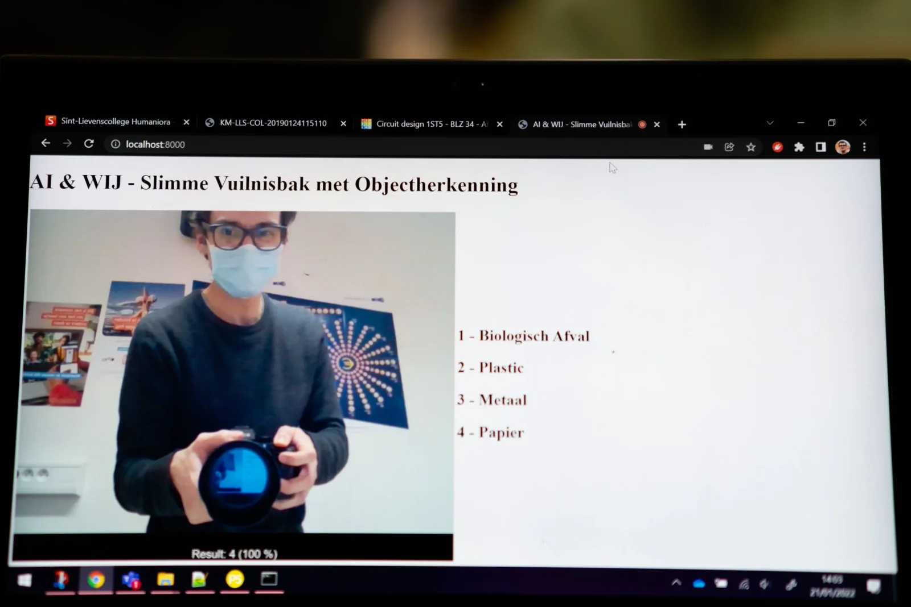

**Have you ever stood in front of a rubbish bin and wondered "is this still plastics, residual waste or something else?" You're not the only one. Sorting well is important and you want to do it right. That way we take care of the environment and the people who take care of our waste. A small effort for a better world. But what if you could remove that doubt? What if we could teach an artificial intelligence to sort and together build a smart waste bin? It is possible! And you don't need a doctorate or a huge computer to do it. This can be done perfectly with a laptop in the classroom!** 

[Video on YouTube](https://www.youtube.com/watch?v=mngiIefe8Nk)

### Requirements

To build a smart trash can that can help us sort, we need a few things. This project can be done on almost any school laptop that has a webcam and runs on a Windows operating system. If necessary, it can be adapted to run on, for example, Mac, but this requires its own adaptations and more extensive knowledge.

What do we need to build this smart bin?

\- A laptop with a webcam; 

\- [The Python software;](https://www.python.org/) 

\- An Arduino Uno, breadboard and LEDs; 

\- [The Arduino IDE software to program the board;](https://www.arduino.cc/en/software)

\- A USB cable to connect the Arduino Uno to the laptop; 

\- A sloppy 5,000 photos of rubbish to train an AI model.

5,000 photos of rubbish!? Don't worry, I'll help you out! But first a word about how an AI model works and why we need those pictures.

### How can an AI recognise waste? 

If we want to build a smart rubbish bin with artificial intelligence, we first have to teach the AI to recognise and sort rubbish. This sounds very complicated, but it is very similar to how we teach children new words. If we want to teach children what a kitten, dog or cow is, we show pictures and tell them what the animal is called. We do the same with waste. We show a picture of a plastic bottle and say its name. We do this over and over again. Thousands of times even with our AI. Because that is what artificial intelligence is: autonomous systems that can imitate human behaviour. Just like you, an AI can learn!

Inside the computer, our AI model will look for patterns in the images via algorithms. Usually, the more data and time we give the AI model, the better it gets at its task. This is called **Machine** **Learning**. As with human learning, there are different strategies to achieve learning. The one we use here, where we show the AI model thousands of pictures and indicate the name of the class (rubbish, plastic, paper, etc.), is called supervised learning. The model learns from the human pre-sorted pictures.

_“Do I have some 5.000 pictures of trash on my personal computer? … Maybe.”_

You can do this 'machine learning' yourself via your computer. You can use [Google's Teachable Machine](https://teachablemachine.withgoogle.com/) for this. You can provide it with collections of photos that you label, and then train it! Once trained, our AI model can do a neat trick: you can take a picture of its learned knowledge (= checkpoint) and download it to the computer. That file can be loaded into another computer, which the pre-trained model can use immediately. Imagine that a maths exam is scheduled. The strongest student in the class studies this subject thoroughly and uploads his/her knowledge, whereupon the rest of the class downloads this to their brains.

Voila, the "brains" of our smart bin are ready!

_You can train your own AI model for this project, or simply use my pre-trained_ **_checkpoint._**

### HTML – webcam trash sorting

Now that we have trained our artificial intelligence, thus providing our smart dustbin with "brains", it is time to work on its "eyes". In order to correctly recognise rubbish, our AI must of course be able to see it.  For this, we use the webcam of our laptop and the browser. 

For this project, you can use my standard HTML and Javascript files. If these computer languages no longer hold any secrets for you, you can also adapt them to your heart's content.

According to the AI, I am 100% paper waste. Clearly not a compliment day ...

### Arduino – our sorting / traffic light

We have equipped our smart waste bin with brains and eyes, but now it also has to 'do something' when it recognises a certain type of waste. For this we use an Arduino Uno. This is a small programmable computer board that we can very easily connect to a computer. We also have a breadboard on which we place four LEDs. This can later be expanded with servo-motors to open/close a physical bin. 

To program our Arduino, we need the Arduino IDE software. With this, we place a piece of code on our Arduino Uno. Through this piece of code, the Arduino will listen to incoming signals from our computer. Depending on the signal, it will light a specific colour LED.

When our computer, via its webcam, recognises a piece of rubbish, it will send a signal. To send this signal, we use the USB port of the computer and a piece of software that forms the bridge between the recognition of our AI model and the Arduino. 

When all the pieces are in place, we can launch our smart bin. To do this, we use a few lines of Python in the command prompt of the computer. When you then use your web browser, you will be directed to the web page that can make use of your webcam. As a test, hold a piece of rubbish in front of it. Check the result on the screen and with the Arduino!

Voila, this is how you build a bin with artificial intelligence in your classroom and contribute to a better world!

[Video on YouTube](https://www.youtube.com/watch?v=EcN2jM6rDHs)

### I want this in my classroom! What do I have to do?  

Do you want to work with this in your classroom? Super! The future will be increasingly digital. A future in which artificial intelligence will play a very important role. It goes without saying that we need to prepare and motivate young people. I am happy to help you with that! You can send me a message via the button below. I usually reply within 48 hours!

<a class="content-button content-button--primary content-button--medium" href="/contactinfo">Contact</a>

