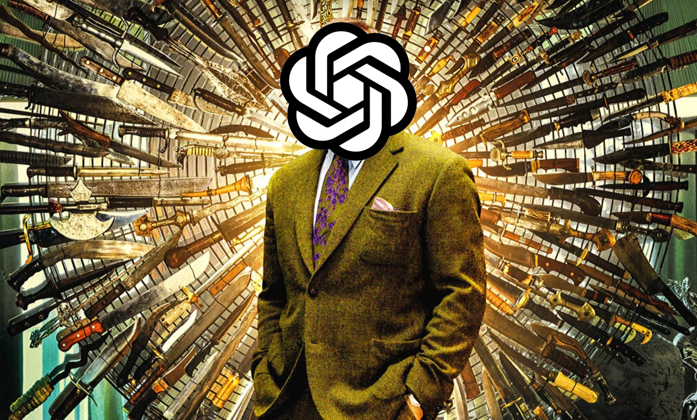

### Artificial intelligence is an enormously powerful tool. It can recognize patterns in data like no other. It already determines large parts of our lives, such as how we gather news, order food, travel and even date! That languages would not escape the dance either was written in the stars. But how do you deal with this in education? Ban it like they did in New York? Pretend we're wrong? Or explore critically with colleagues and students? Let's choose the latter, because this technology is not going away anymore. In this article, I describe the "Turing Test" I conducted with my students. I also give you a framework and tools. Tools you can use to get more out of your adventures with AI systems like ChatGPT in your classroom!

### Background: Turing Test

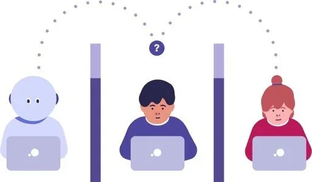

The Turing Test is a theoretical test that was devised by British mathematician Alan Turing. He wanted to devise a way to determine whether a computer program is "intelligent. Because intelligence is a very abstract concept, Alan Turing narrowed the concept down to chat conversation. Three actors are present in the test setup.

-   Jury

-   Human

-   Robot / programme

The juror does not know in advance which of the participants are humans and which are computers. The juror conducts chat conversations with the other actors. Afterwards, the decision is made: who was the human and who was the robot? If the juror fails to distinguish the human from the robot, Alan Turing assumes that the computer system is "intelligent.

There are, of course, caveats to this test. It measures skill only through a chat conversation, much depends on the juror, the computer system may have been built to speak very well on only one subject (as one did with Eliza and Eugene Goostman) in order to deceive the interlocutor ... Searle's Chinese Room Argument also attempts to show that although the computer can conjure words on a screen, it often executes if-then instructions and does not understand the language au fond. A program like ChatGPT might blow your socks off for a while, but so we cannot say that this AI system is actually intelligent.

### Turing Test in the classroom (assessment)

The idea is quite simple. The class group was given a writing task to do. Pen an essay about filter bubbles. What is the concept? What are the advantages and disadvantages? Use the structure learned from Dutch lessons.

The twist is in the following modification to this classic assignment: the group secretly divided into three. A group that writes everything themselves, a group that writes 50% themselves and relies 50% on digital tools like ChatGPT and finally a group that has 100% of everything generated by digital tools.

Students chose which group they belonged to. The teacher (=me) did not know which group which student was in. My objective as a judge was simple: try to classify all students according to the writing tasks they submitted. For this, I too was allowed to use all the tools at my disposal. Tools such as my experience as a teacher, knowledge from previous writing tasks, plagiarism control, translation software and GPT detection software. You could also read this in the [following article from De Morgen.](https://www.demorgen.be/nieuws/in-deze-beroepen-is-chatgpt-meer-dan-een-leuke-grap-voor-routineklussen-is-het-een-zegen~b1f3e5b2/)

### **Old-old school: content assessment**

Any teacher who has ever assigned a writing task or book review will recognize it: sometimes words, terms or complete sentences pop up that you suspect are somewhat over the average student's head anyway. Were they looking something up? Were they getting help from a family member? Classic questions we can actually ask about this assessment method for years.

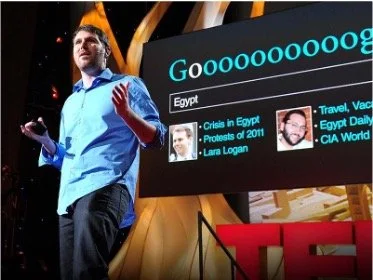

Eli Pariser who coined the term ‘Filter Bubble’.

For example, the name of Eli Pariser, the creator of the concept of the filter bubble, popped up in many a writing task. When so many students mention him in their essays, I thought it would be worthwhile to poll them in class for knowledge about him. Whether they had fished this out of Wikipedia or ChatGPT, you can probably guess the result.

When you pluck a text from the Internet, or have it generated by a tool on the Internet, some solid statements also pop up, such as that "filter bubbles are a manifest threat to social cohesion and our democracy." Solid proposition for a fourteen-year-old! However, when asked if he could verbally clarify this for the board, he remained manifestly silent.

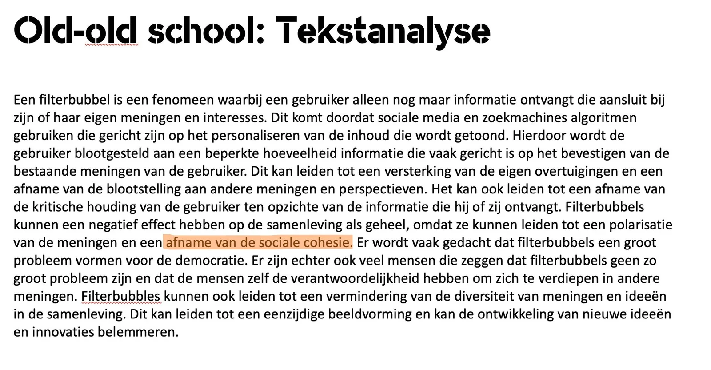

### **Old school: Plagiarism and GPT**

Text written by a GPT model is not plucked from the Internet. This makes the method particularly difficult to detect through the well-known plagiarism checker. However, students still get caught. Sometimes by pasting entire paragraphs from an online source between generated text.

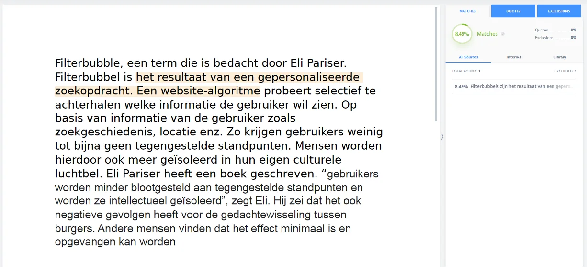

This text was not flagged by traditional plagiarism control. His English-language translation, on the other hand, did.

Some students are more inventive. They look for an online source in a foreign language, translate it using Google Translate or DeepL, and only then submit it. This way they outsmart classical plagiarism software ... until you, the teacher, retranslate their text from Dutch to English. Oops ...

### **New school: GPT Content**

What models like GPT3 and ChatGPT get done naturally makes one dream. Impressively, nine out of ten examples you generate with them are quite okay. A few years and versions ago, nine out of ten examples were downright abysmal or chaotic, with one outlier. Some users seem to conclude from the impressive performance that the model looks things up online while writing, or has a mountain of facts sitting in its neural network. That's not how it works. It is important to point out to students that ChatGPT is not a search or fact machine. That it is best for them to critically examine what they write. Take the example below:

> _Filter bubbles are a phenomenon that causes people to stop seeing news and instead get stuck within a particular genre they like. Social media, news sites and search engines use algorithms to show users things that are likely to be very interesting. This can result in users ending up in an information bubble that confirms their existing beliefs and biases, rather than exposing them to a variety of viewpoints. Filter bubbles can also have bad consequences for singles and more, they cause singles and society to think less critically. So they can also cause misinformation to be perpetuated. To combat filter bubbles, it is important to be aware of the ways they can influence the information we use. This can mean actively seeking different points of view, fact-checking information and being aware of the sources of the information we read._

There is nothing wrong with this at first glance, but a phrase stands out when you have (subject) knowledge about the topic:

> **_Filter bubbles can also have bad consequences for singles and more, they make singles and society think less critically._**

So filter bubbles would be mainly dangerous for single people. A new claim that I have not read before. Unfortunately for the student in question, it is not a fact, but rather perhaps a figment of the machine's imagination. A fabrication that did bring it very convincingly. We look at a second example:

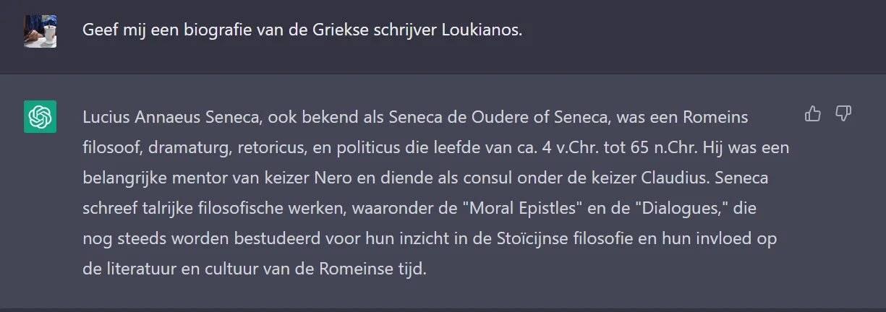

A nice summary, only you poke through it very quickly. Loukianos and Seneca are two different figures in Roman history and Greek literature. But how does ChatGPT manage to confuse the two? Why is it not a fact machine?

This is because of the way it works. The system does not view text the way we do. It is a binary number sequence where the model calculates vectors between words. Words that often appear together in various texts, they have a relationship with each other. Like the word "Albert" with "king" and in turn "king" with "male. A GPT model does a kind of probability theory. Very simplistically put: So the probabilistic model calculates the next word in the sentence. Again and again. You make pretty convincing sentences that way, but you don't do science with it.

### **New school: AI models detecting AI models**

In addition to the known methods, you can also enable AI models to detect AI models. Pretty meta so, but how does this work? Online tools like GPTzero analyze the given text and calculate, sentence by sentence, the complexity. The reason behind this can be summarized as follows: when people write a text, they use their own writing style. The complexity of words varies enormously from sentence to sentence! People write quite "bursty. So with sudden increases of more difficult words.

This is in contrast to a GPT model. That writes texts that have a fairly uniform complexity. So the human jumps and bumps are missing! Below you can see this worked out on a graph. Notice that the Y-axis is a lot lower for the GPT text than for the text written by a human.

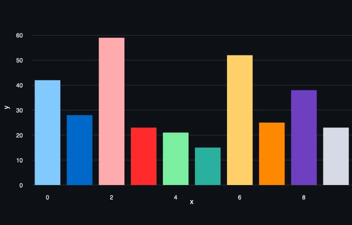 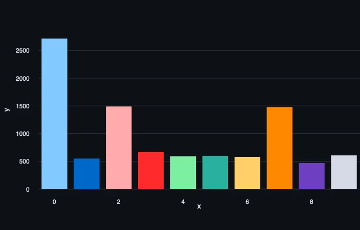

Caution: a GPT detection is not the panacea. If you have a text written by AI model A and then summarized by model B, such a detection system will no longer work. Also, the built-in watermark (which OpenAI is said to be working on) disappears when robots paraphrase each other's work. As we also know from the world of counterfeiting, computer viruses or natural viruses; it will continue to be a cat-and-mouse game between text generators and detectors.

### How to get started with GPT (tool)

Obviously, pretending our noses are bleeding or banning such tools will not work. We'd better use them critically. For that, you can use roadmaps such as the KOFFIE framework.

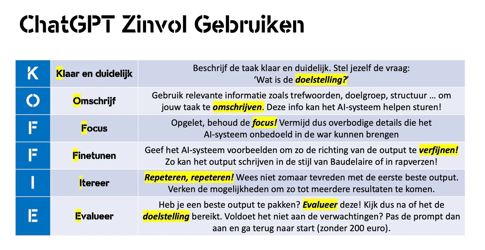

Just as any reputable coffee bar offers extensions with "shots," you can also expand on this KOFFIE framework with single shots!

### ‘Zero Shot’ Approach

First, we have the "zero shot" approach. A classic! You give the AI model a clear and straightforward instruction. For example, to write an introduction about aquatic turtles.

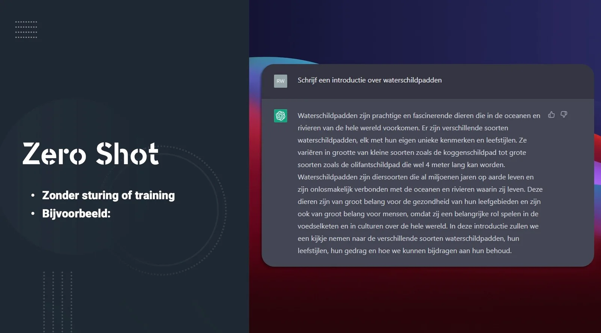

### ‘One Shot’ Approach

Could it be more punishing? Then there is the "one-shot" approach. In this approach, you better describe where you want to go. Here we add a structure about the flamingo. We want the model to follow this structure to pen an introduction about our water turtle. Also, don't get too fancy in this step. Don't add too many details that deviate from the objective and/or structure. Maintain focus!

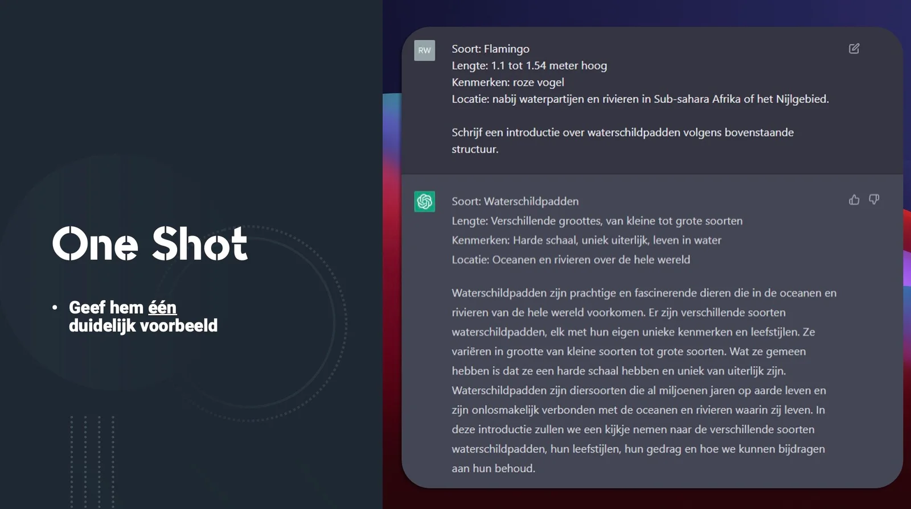

### ‘Few Shot’ Approach

We can take that description and focus to an even higher level with the "few shot" approach. Give him multiple examples of the desired structure like here with the bear and the flamingo. Don't worry about precise facts like the height of the flamingo or what a bear eats. In the instruction add elements such as target audience, how many lines, characteristics of the desired animal. Here I chose the Shoggoth. A completely made-up beast that ran away from a story written by H.P. Lovecraft. The AI model manages to write our specified properties of the beast in the right place, according to our specified structure!

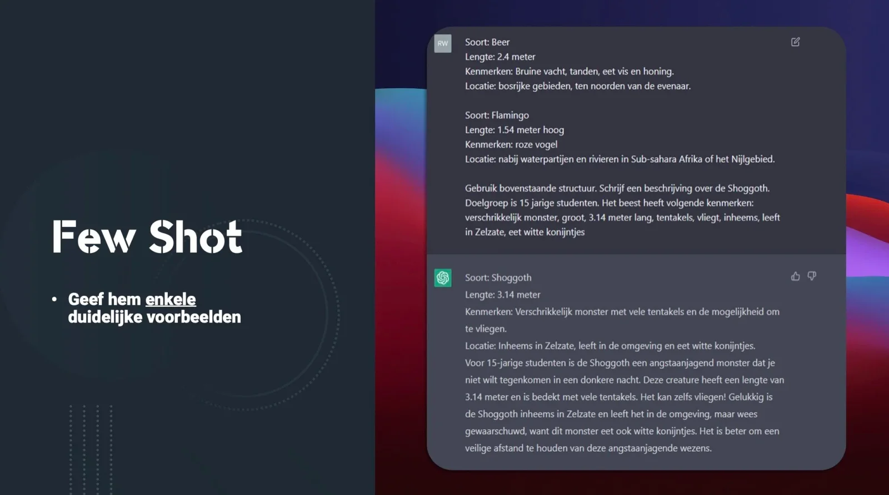

### Tinkering with input ...

We can illustrate this KOFFIE approach using the following example: you are a classical languages teacher and want to do a creative processing with the students. Dialogues of gods are not unfamiliar to you. In these, students write a conversation between two chosen gods. Of course, these conversations should contain some elements from the lesson. Learning material from the culture lessons, a piece of Ancient Greek or Latin ...

When we create the draft version of our dialogue of gods, we can refer back to ChatGPT, for example. We give the AI system a structure, peripheral information about our speakers, the tone of the conversation, the perspective of the gods ... This is how we define our instruction, the input for the system. ChatGPT will continue to work on this momentum. So generate a number of versions. So iterate and evaluate! Adjust your instruction here and there, do some fine-tuning, to get better results.

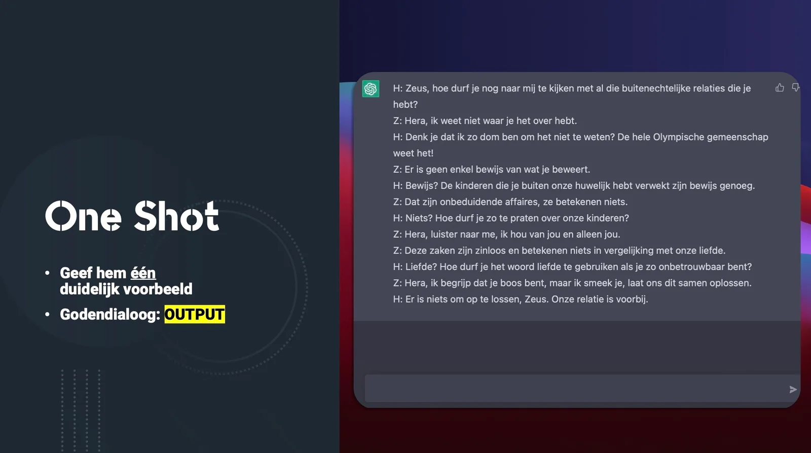 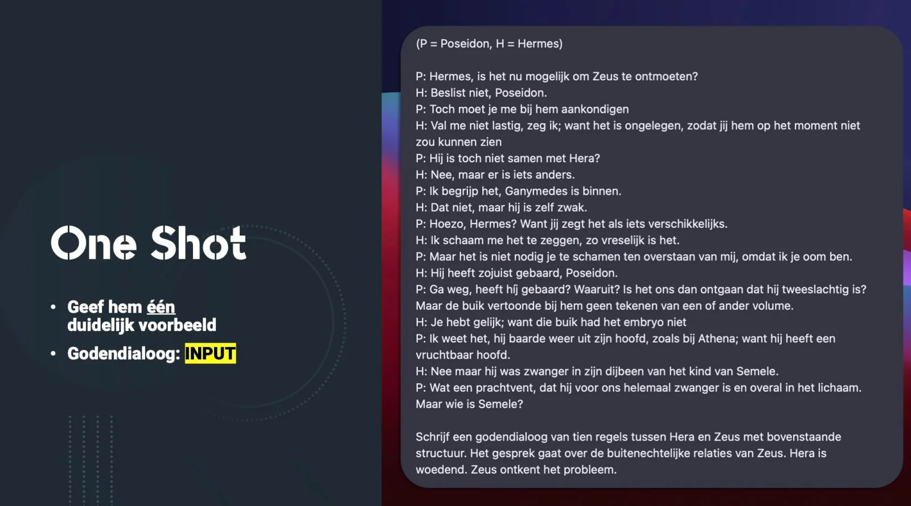

### Looking critically at the output!

Even in modern languages, you can integrate tools such as ChatGPT and critical evaluation of such AI systems can contribute to learning. In the previous example, we already used describing, fine-tuning, iterating ... from the KOFFIE model. We used this model to get the best possible output from the GPT system by systematically tinkering with the input. But we can also work with that improved output in the classroom.

-   Look critically at the text structure, even if you specified it when creating your prompt;

-   Hold GPT's "facts" up to the light, because ChatGPT is not a fact machine;

-   Add your own expert knowledge, anecdotes and clarifications;

-   Delete the superfluous repetitions, odd bucks and hallucinations of the AI system;

-   Create an evaluation matrix together with the students to evaluate the output of the AI system together!

## **I want this in my classroom! What should I do?**

Want to work on this yourself in your classroom? Super! The future will be more and more digital. A future in which artificial intelligence will play a very important role, in many facets of our lives. That we need to prepare and motivate young people for this goes without saying. Should you still have some questions after reading the above article, I am happy to help you with that! Through the buttons below you can send me a message or get information about a refresher course or workshop. I usually reply within 48 hours!

<a class="content-button content-button--primary content-button--medium" href="/contactinfo">Ask a question!</a>

