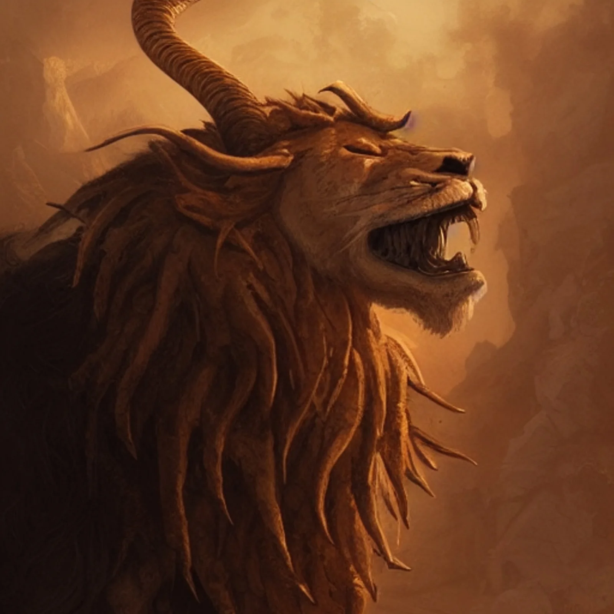

**Once upon a time, in the distant past, there was a mythical kingdom called Lycia. It was ruled by King Iobates. But then a terrible monster came to plague the inhabitants. In this lesson project, we are introduced to the Greek hero Bellerophon, his flying horse Pegasus and the terrible Chimaera. We thus combine Greek myths with artistic education and artificial intelligence to conjure the three-headed monster of fantasy to our screen! An unusual alliance of subjects that thus brings the 'arts' into STEaM.**

## Greek Myth

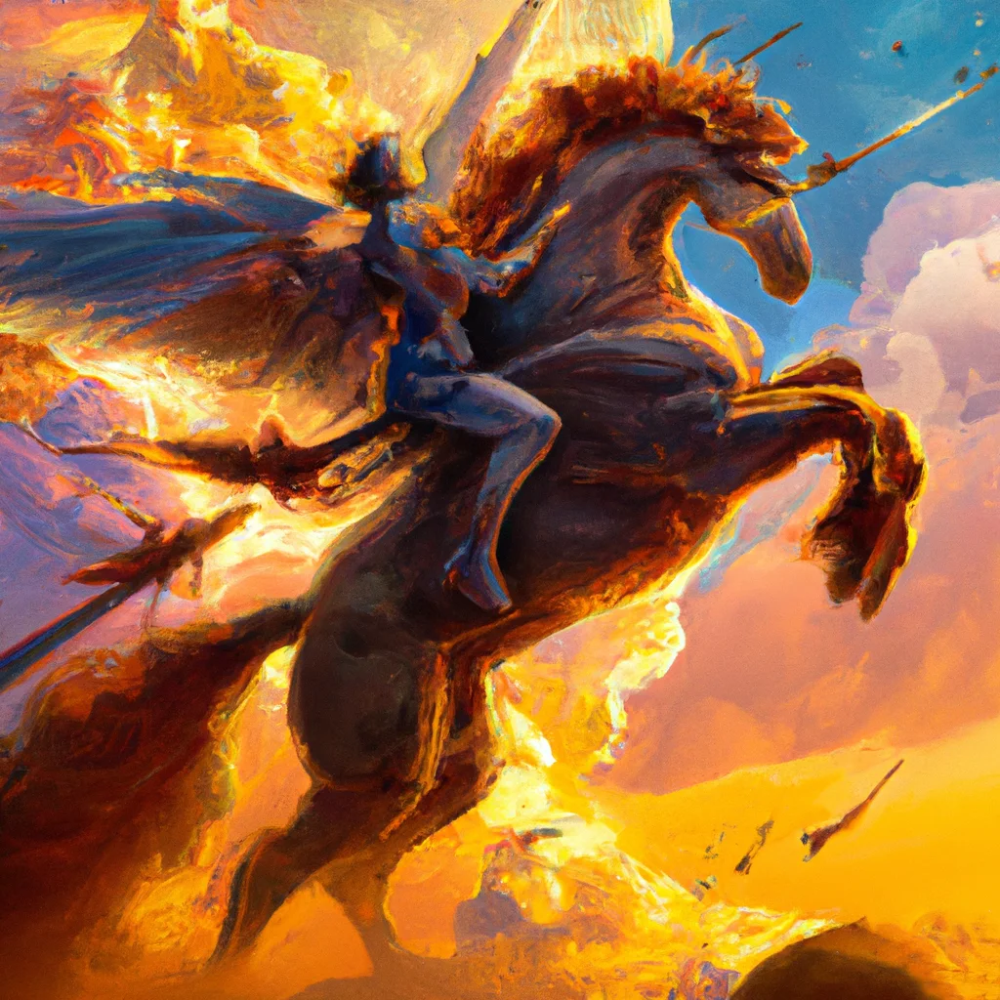

As the story or setting for this lesson project, I chose the myth of the Greek hero and demigod Bellerophon and his confrontation with the Chimera. The latter is a monster with the head and body of a ferocious lion. It also has a goat's head on its back and a snake's tail. As a bonus, it spews scorching flames around. So a very strange monster that seems composed of different creatures. Ideal for this project, where we had multiple students and a computer model draw this monster together. The story was adapted to fit within the scope of this project, so you will find some differences here and there from the classic version. For instance, some gruesome passages and Iobates' motive for sending Bellerophon to certain death were omitted or modified.

As in ancient Greek tradition, this story is best read aloud to the group. In ancient Hellenistic culture, with its distinctive myths and sagas, stories were mostly passed on orally. It is partly because of that storytelling tradition that that common Hellenistic culture could emerge in during the Ancient Near East and Classical Antiquity. So in this lesson project, we explicitly refer to those roots.

[Volledige grootte weergeven 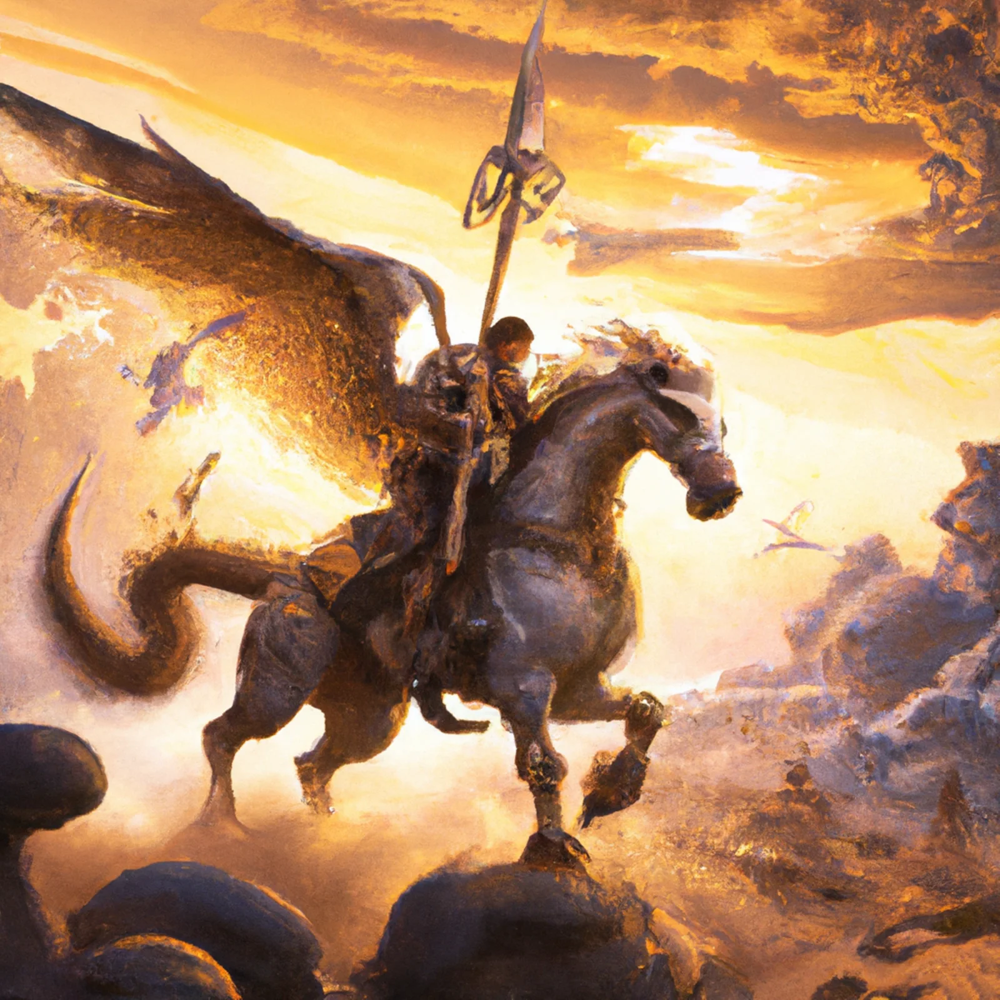](https://images.squarespace-cdn.com/content/v1/6026af223ff1970db5c08fb8/1666717284722-K6FXM4PYH9DL18JOECD4/DA4B53%7E1-gigapixel-art-scale-4_00x.PNG)

[Volledige grootte weergeven 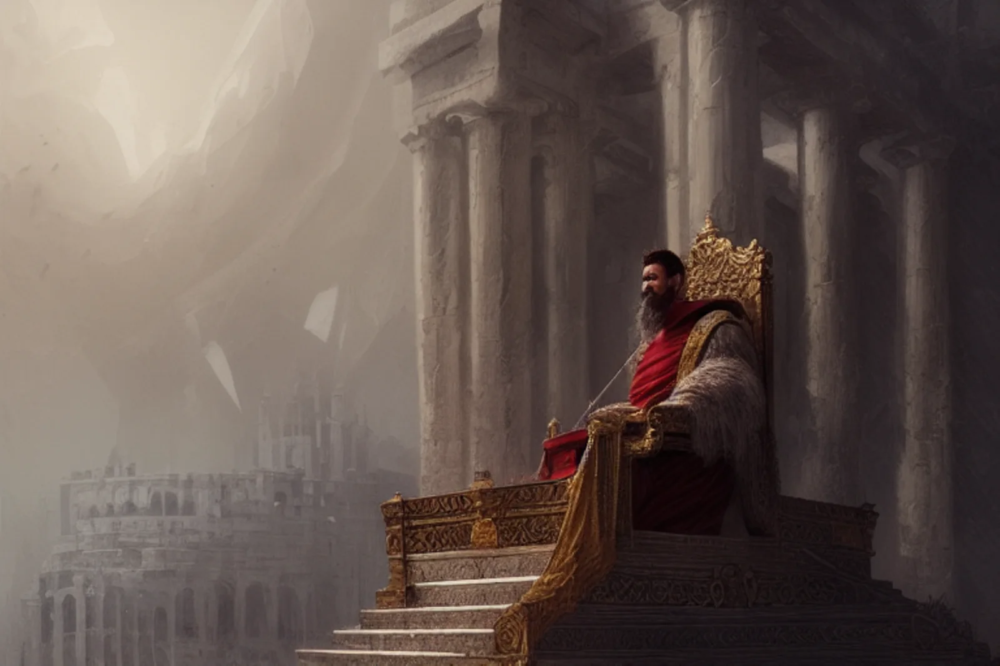](https://images.squarespace-cdn.com/content/v1/6026af223ff1970db5c08fb8/1666717318892-9N5SF36WT5QFFTW5825O/Unknown-2-gigapixel-art-scale-4_00x.png)

[Volledige grootte weergeven 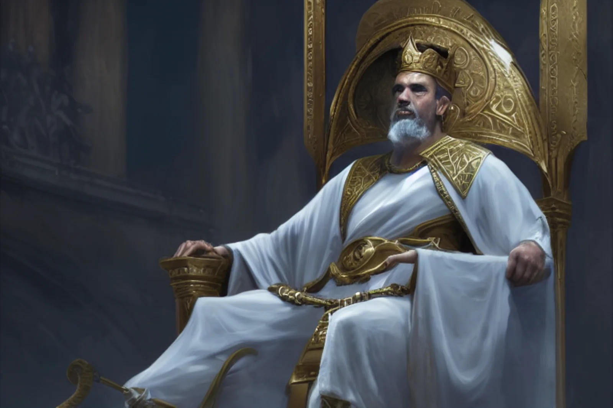](https://images.squarespace-cdn.com/content/v1/6026af223ff1970db5c08fb8/1666717322271-0QDBJ23UGUPWSBO3VS1B/Unknown-13-gigapixel-art-scale-4_00x.png)

[Volledige grootte weergeven 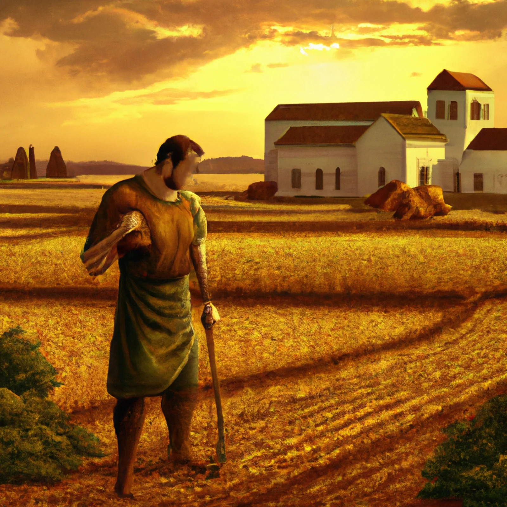](https://images.squarespace-cdn.com/content/v1/6026af223ff1970db5c08fb8/1666717285048-SC4G61YGPBDCZHPY32SI/DALLE2%7E1-gigapixel-art-scale-4_00x.PNG)

[Volledige grootte weergeven 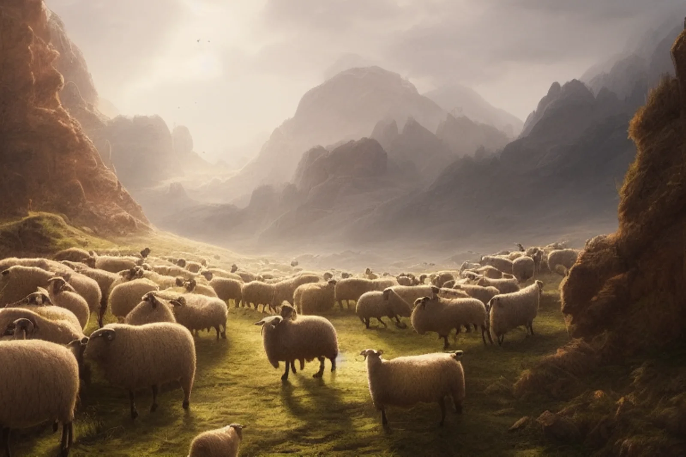](https://images.squarespace-cdn.com/content/v1/6026af223ff1970db5c08fb8/1666717311336-ULAWJZL9VXWND277WTBB/Sheep_3-gigapixel-art-scale-4_00x.png)

[Volledige grootte weergeven 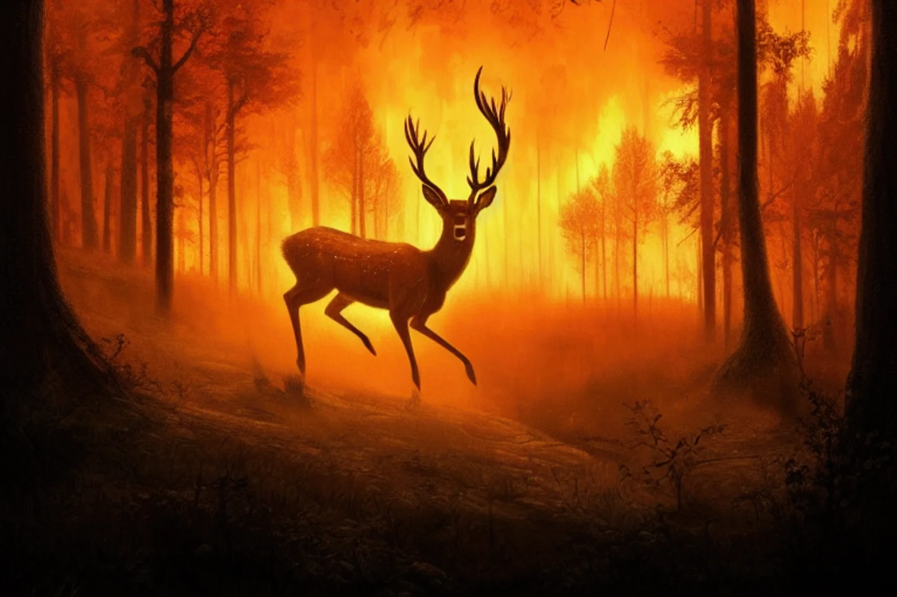](https://images.squarespace-cdn.com/content/v1/6026af223ff1970db5c08fb8/1666717297997-9P80ML7R5LLEPTHOA3H6/Deer_3-gigapixel-art-scale-4_00x.png)

[Volledige grootte weergeven 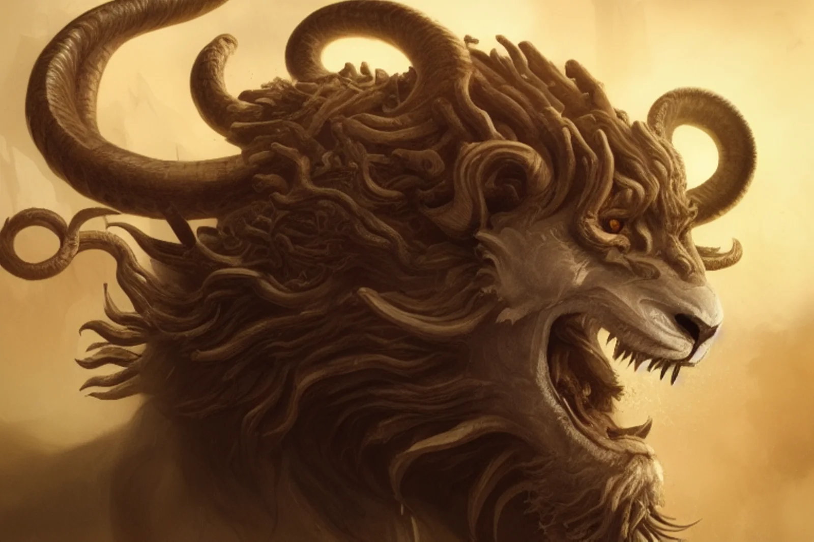](https://images.squarespace-cdn.com/content/v1/6026af223ff1970db5c08fb8/1666717299327-LJHEGJBER2F8POE5NXD6/Monster_4-gigapixel-art-scale-4_00x.png)

[Volledige grootte weergeven 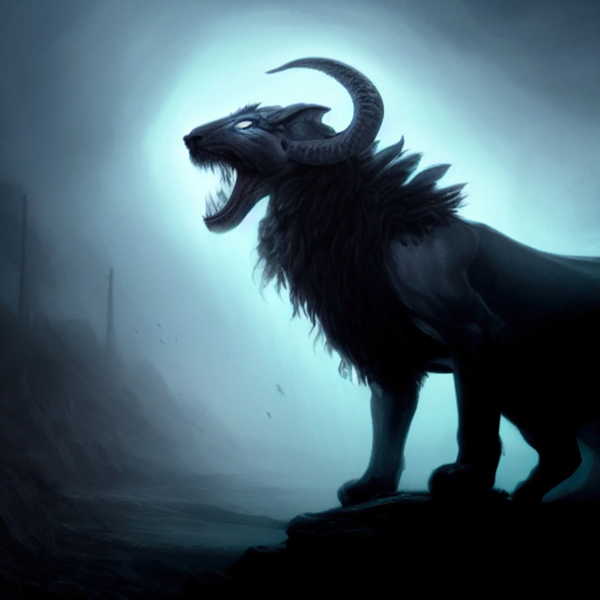](https://images.squarespace-cdn.com/content/v1/6026af223ff1970db5c08fb8/1666717305932-7FG12502VJDW73RI6V5E/Test_Chimera_2-gigapixel-art-scale-4_00x.jpg)

The story is divided into a number of parts. Namely:

-   The introduction that makes the setting clear to the youngsters. For instance, the story mainly takes place in King Iobates' throne room. In the throne room, he holds his weekly consultation hour. Three villagers come to bring their stories to the king.

-   The shepherd describes how a monster, resembling a lion, managed to graze a lamb from his flock.

-   The hunter tells how a goat-headed monster disrupted his hunt for a deer.

-   The farmer tells how his brave but hot-tempered dog got a bite from a snake's tail.

-   Bellerophon confronts the monster.

Through the stories of the shepherd, the hunter and the farmer, the youngsters learn more about the appearance of this monster. Piece by piece, they thus puzzle together the monster from their imagination.

## Fantastical Monster - Art Education

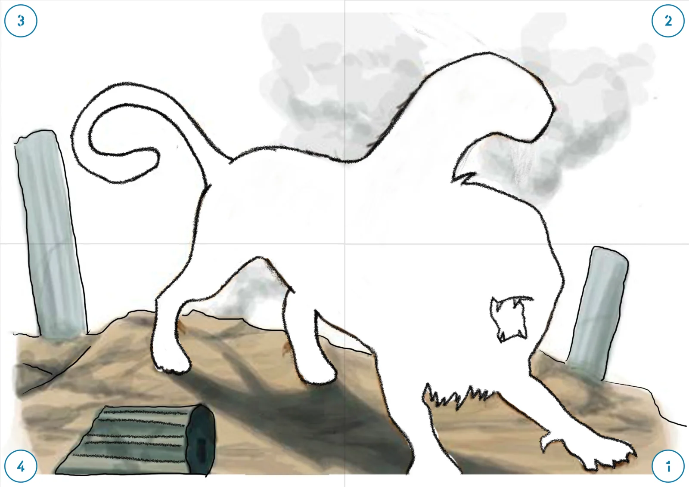

When the teacher tells the story, in all its colours and smells, the pupils get to work. They do this with coloured pencils and a starting document. Four zones are marked in the document. This sheet is folded into four on the lines. The parts of the story (shepherd, hunter, farmer, lock) correspond to the numbers on the drawing.

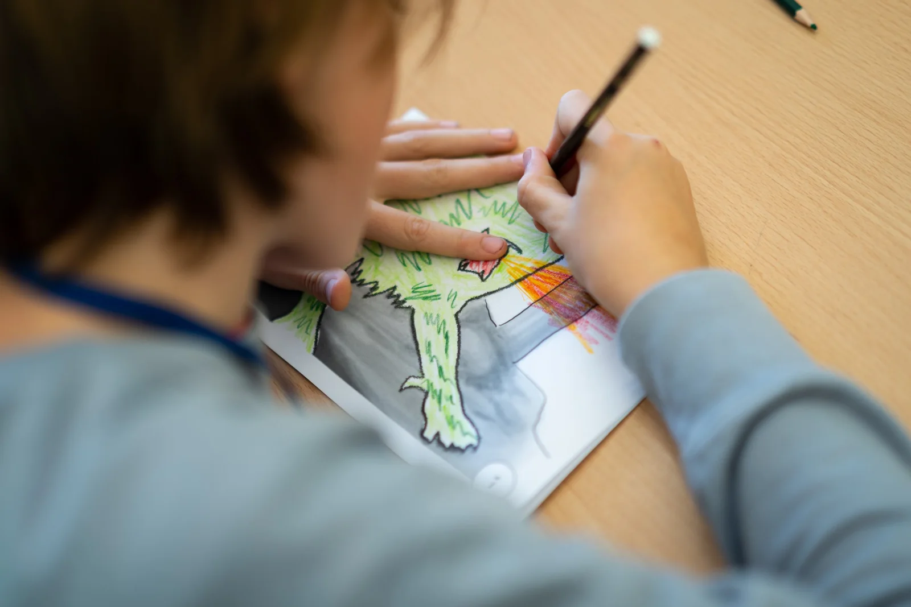

Students are given about five minutes, based on the story they hear, to colour and add to their box. They do not have to stay within the lines. When the timer is over, the drawing is passed to the next student and we start on the next box! This approach is called ''cadavre exquis''. This approach means that throughout the story, different pupils start working on the drawing, but do not see what the previous pupils have drawn. The end result is a monster that seems to have been put together by four different artists. Because that's kind of what the Chimera is too, a strange composition of all kinds of elements. Here you notice that the subject teaching approach fits nicely with the chosen Greek myth!

## AI as the fifth artist!

To this story of the fantastic monster and the four artists, we add a fifth artist. But this time not a flesh-and-blood human, but an AI model from StabilityAI capable of creating images. Their AI model works similarly to OpenAI's well-known DALL-E, but is open source. Give it a piece of text, what you wish to draw, and it can start. To this, however, you can also add a starting image. This image, a 'primer' or 'initialisation image', will guide the AI model on the instruction to follow.

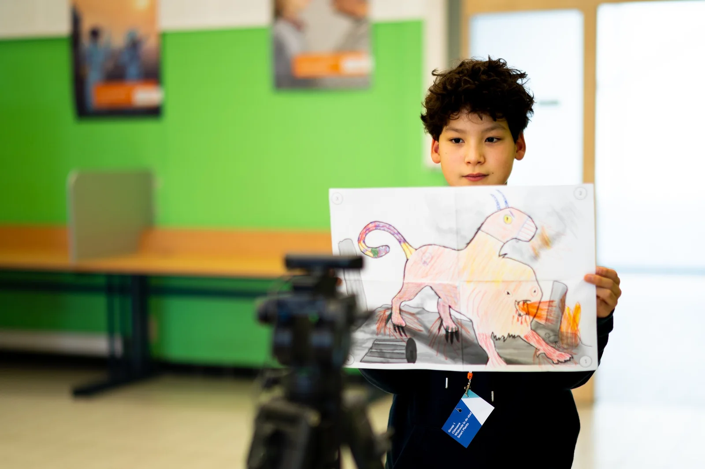

We don't have to look far for this starting image. The code used allows the AI model to connect to the computer's webcam. This can be an internal or external webcam. Through that webcam, the AI model can see the world and photograph the students' drawing. Their drawing, a creation of four artists, thus becomes the basis for our artificial intelligence!

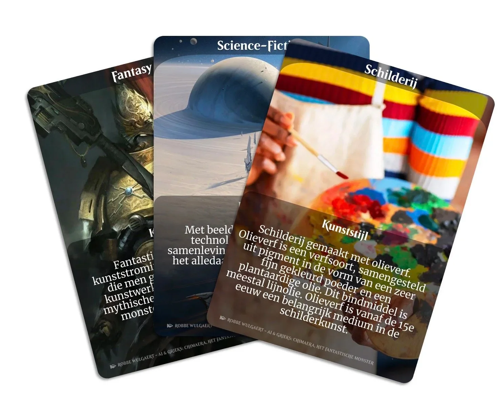

Since writing a good instruction or ''prompt'' for such an AI model is not easy or quite abstract, a deck of cards was designed to help with this. The cards stick to plastic sleeves in three colours. One colour for the different art styles, another colour for the artists and a final one for additional elements. By laying out or choosing cards, and a handy drop-down menu in the code, writing such an instruction is a breeze.

With an instruction and a starting image, the AI model can really begin. In a matter of seconds, it creates three different interpretations of the Chimera. A version that looks like it was painted by Van Gogh, or rather a picture of the monster, or surely in the form of a beautifully drawn tattoo? The possibilities are endless!

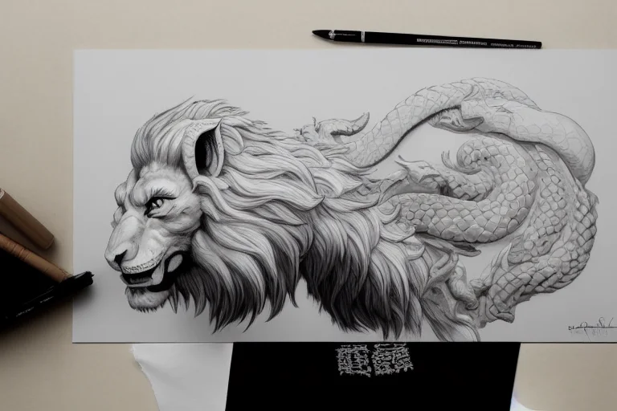

Result of the AI model and a drawing by a student.

## Reflect

After some drawings and results from the AI model, it's time for reflection! The results are easy to print out and hang on blackboard or somewhere in the classroom. The class looks at the results, discusses what the AI model did well and what could be better. Perhaps the model drew something the students themselves had not drawn? What crazy shapes and colours do we see?

Finally, the class comes to a vote. Via post-its, they announce their favourites. Because each piece of work is the result of different students, combined with the randomness of computer algorithms, there is little point in voting for your best classmate. The shared creation is key here!

[Volledige grootte weergeven 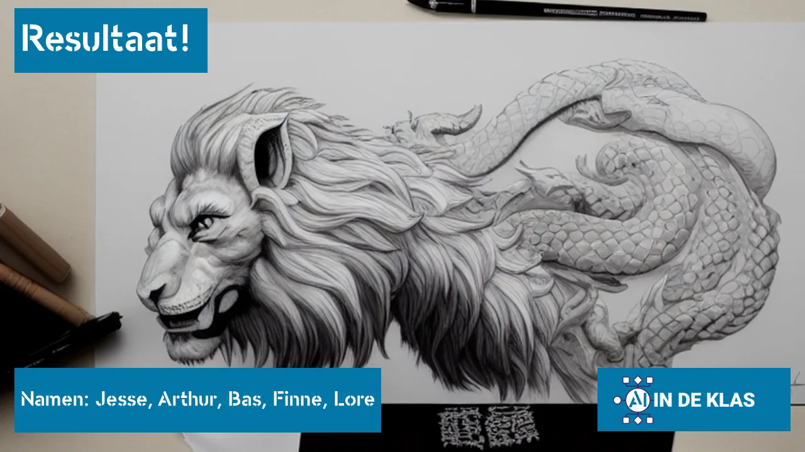](https://images.squarespace-cdn.com/content/v1/6026af223ff1970db5c08fb8/1666787216830-UO1F8IJ1QFK3IFKBNJV8/Slide11.PNG)

[Volledige grootte weergeven 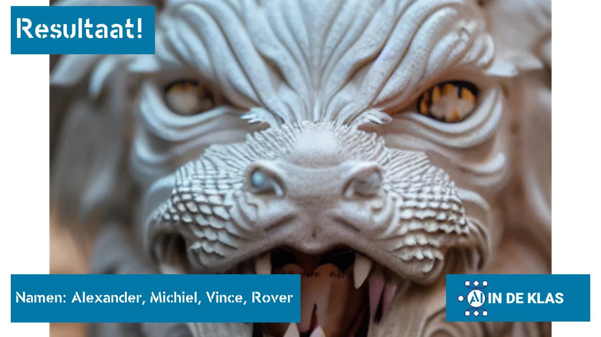](https://images.squarespace-cdn.com/content/v1/6026af223ff1970db5c08fb8/1666787220536-2CNB1XE2ILP032L2Y7J4/Slide12.PNG)

[Volledige grootte weergeven 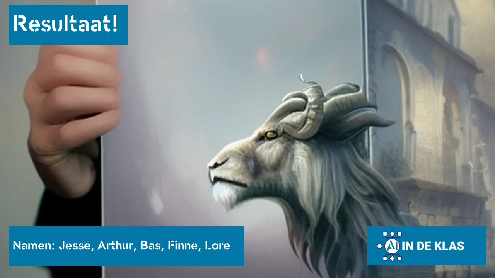](https://images.squarespace-cdn.com/content/v1/6026af223ff1970db5c08fb8/1666787221584-540NTV29C8JYNETCNF9X/Slide13.PNG)

[Volledige grootte weergeven 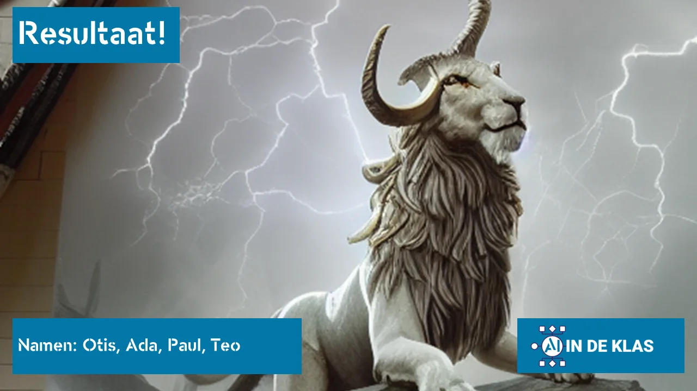](https://images.squarespace-cdn.com/content/v1/6026af223ff1970db5c08fb8/1666787225512-TNC5MCVCCMW1VFQSBBVB/Slide14.PNG)

[Volledige grootte weergeven 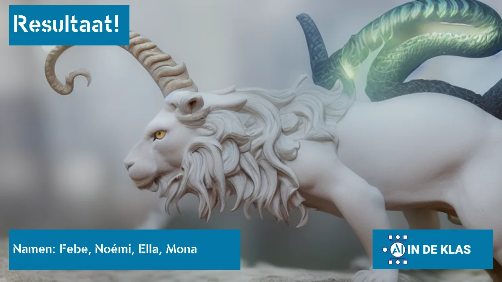](https://images.squarespace-cdn.com/content/v1/6026af223ff1970db5c08fb8/1666787230214-XS2GHP2PFSAB5NG3WBP4/Slide9.PNG)

[Volledige grootte weergeven 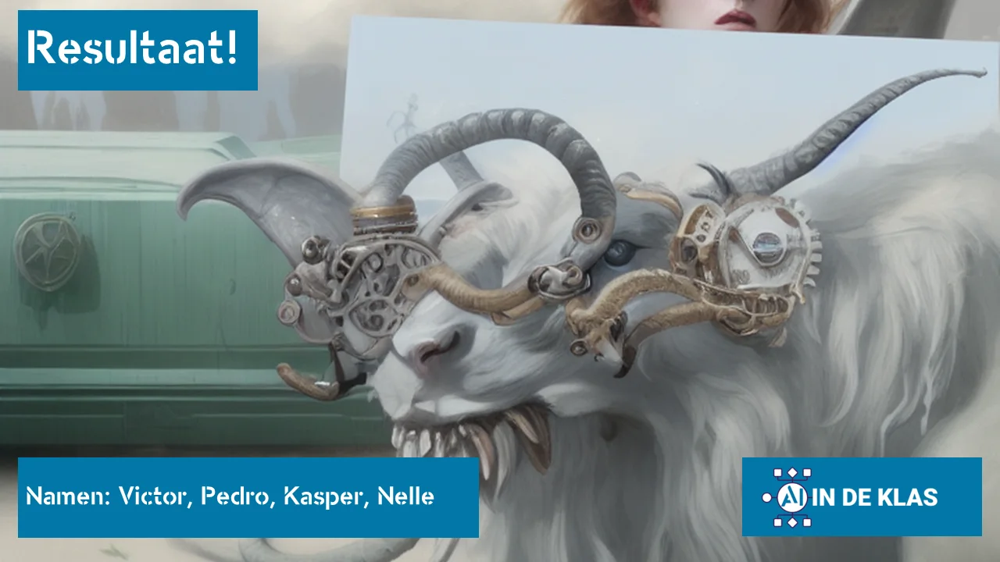](https://images.squarespace-cdn.com/content/v1/6026af223ff1970db5c08fb8/1666787233201-4KUV9YHDHTP3JOZXA5Q4/Slide10.PNG)

## Target demographic

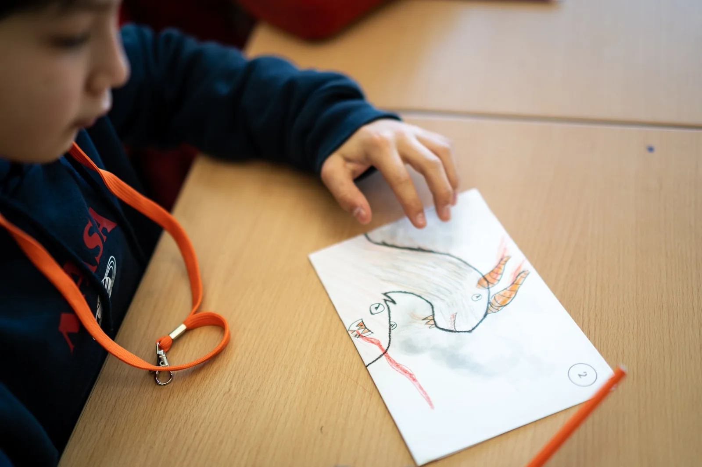

This teaching material was developed for sixth grade and first grade secondary school students. The teaching material gives youngsters a taste of Greek myths, alternative approaches to creating a (work of art) together and the possibilities of new forms of technology. For the latter objective, this teaching project thus tries to contrast with existing teaching materials that focus on the link between technology and robotics or sciences. Thus, this teaching material follows the STEaM principle that technology can also find allies within the 'arts' such as languages and visual arts.

## Lesson Goals

This project brings together approaches and content from the subjects 'Classical Languages', 'Image / Artistic Formation' and the 'Common Curriculum ICT'. The relevant curriculum objectives were selected from the curricula of Catholic Education Flanders. The selected curriculum objectives are as follows:

**Classical Languages curriculum (first grade):**

-   _Experiencing the visual power of language and texts, enjoying it and using it creatively_

-   _Visual power is that which can trigger the reader's imagination in a text. Imagery can be found in the pace of the text, the sounds, the use of words ... There is a gradation in experiencing that visual power: pupils learn to recognise named text elements, articulate their interpretation and enjoy them. This also enables them to use their own creativity to represent the content of the text or their experience of it._

-   _LPD 27 Pupils incorporate aspects of classical antiquity in a creative way._

-   _LPD 52 The pupils describe aspects of Greek culture and compare them with their own._

**Curriculum Artistic Education**

**_Look at_**

-   LPD 1 Pupils experience a diverse range of cultural expressions through art.

-   LPD 2 Pupils perceive art and cultural expressions with an eye to subject matter and purpose.

-   LPD 9 Pupils express their thoughts and feelings when perceiving art and cultural expressions.

**_Create_**

-   LPD 10 The pupils experiment, in function of a defined assignment, with various building blocks, materials and (basic) techniques of the various artistic forms.

-   LPD 12 The pupils create artistic work from their own imagination in function of a defined task.

-   LPD 13 The pupils create artistic work together.

**_Reflect_**

-   LPD 17 Pupils reflect and communicate on their own artistic process and product and that of fellow pupils using provided criteria.

-   LPD 18 Pupils express their appreciation of artistic and cultural expressions based on their own unique expressive experiences.

**Common Curriculum ICT**

-   LPD 1 Students distinguish building blocks of a digital system.

-   Input, processing and output

-   LPD 2 BG - Students understand how communication occurs between information processing systems.

-   Processing is done online in the cloud

-   LPD 7 The pupils purposefully and appropriately use basic functionalities of digital infrastructure and applications to create digital presentations.

-   LPD 9 Learners share digital media and collaborate securely in online shared files or folders.

-   LPD 10 Students demonstrate basic skills to communicate task-oriented according to netiquette via email and messaging and participate in initiatives.

## Class Materials

For this lesson project, you will need a few things, namely:

-   Crayons;

-   A starter drawing (as above) or a blank A3 canvas for each pupil

-   The story for the teacher;

-   The PowerPoint with the timers;

-   The cards (optional);

-   A laptop for the teacher;

-   The AI model;

-   A webcam (internal or external).

This project can be run virtually free of charge in the classroom. The AI model can run via browser on almost any school laptop.

## Phases

This teaching project consists of several teaching phases, namely:

-   The instruction phase where pupils are told the objectives and outline;

-   Reading aloud by the teacher and at the same time drawing by the pupils through the cadavre exquis approach.

-   Finishing the drawings by using the AI model;

-   Class reflection on the creations, choosing a favourite and learning to argue/articulate why a student chose a work.

The above teaching phases took about two class hours. If more time is available, you can extend this lesson project with the following components:

-   Via an extension to the deck of cards, pupils choose an art style such as charcoal, biros, (pavement) chalk or collage.

-   Through an extension to the deck of cards, students choose a chapter of the story. On a blank sheet, students create their interpretation of that chapter. They thus bring the text to images.

-   The results are again finished by the AI model.

-   The pupils present their creation (theirs and the AI model's) in front of the class group. They explain which art style they used, which chapter and what their part of the story is about. So they summarise the story and put into words their interpretation of the image.

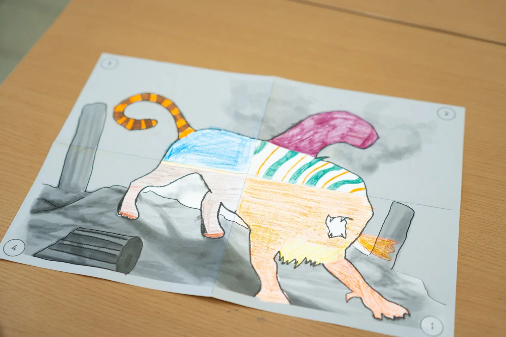

## Credits

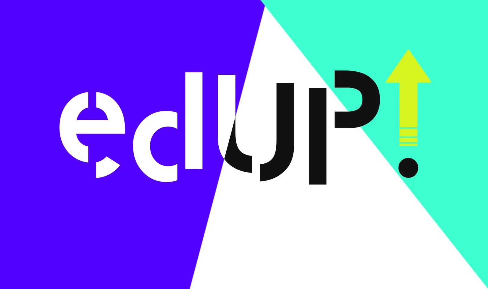

This teaching project was developed for the edUP! education event in Ghent as a workshop to give fifth and sixth grade children a taste of art, classical languages and IT. The project came about after discussions with, among others, teachers within art subjects such as Anna De Paepe (Sint-Lievenscollege Ghent), Simon Vermeulen (Sint-Lucas Academy Ghent) and Kapinga Kabeya (Sint-Lucas Academy Ghent). Classics teacher Hanne Sturtewagen (Sint-Lievenscollege Ghent) provided the story about the Chimera for this teaching project.

## I want this in my classroom!

Want to work on this yourself in your classroom? Super! The future will be more and more digital. A future in which artificial intelligence will play a very important role, in all kinds of facets of our lives. That we need to prepare and motivate young people for this goes without saying. I am happy to help you with that! Via the buttons below, you can send me a message or get information about a refresher course or workshop. I usually reply within 48 hours!

<a class="content-button content-button--primary content-button--medium" href="/contactinfo">Get in touch!</a>

