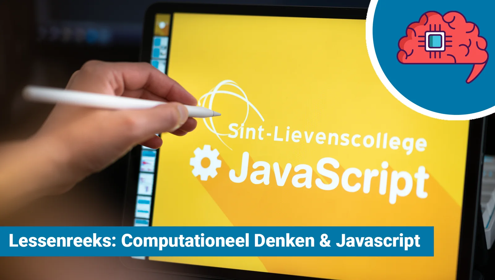
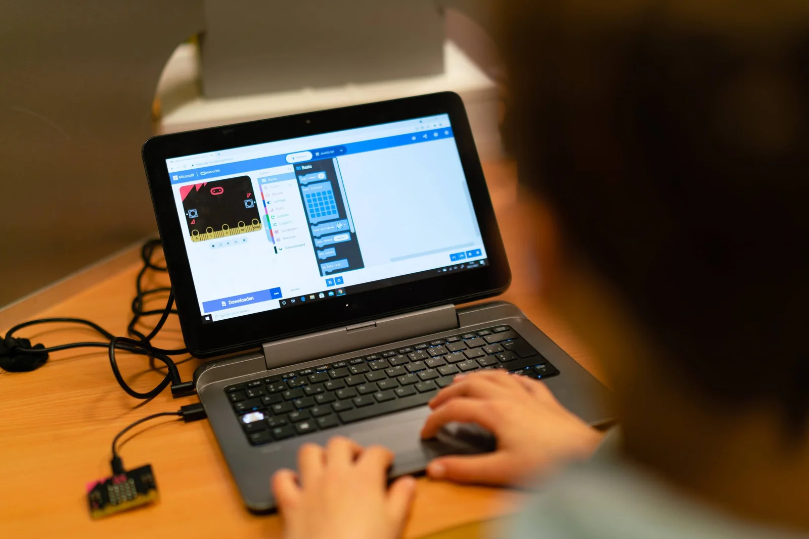
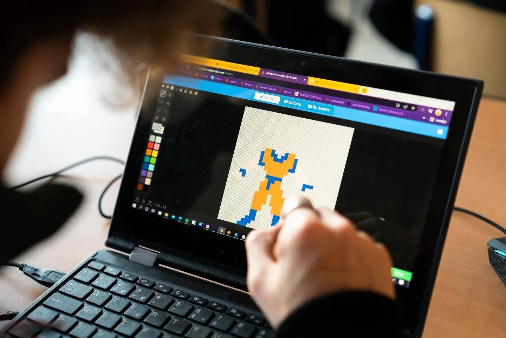
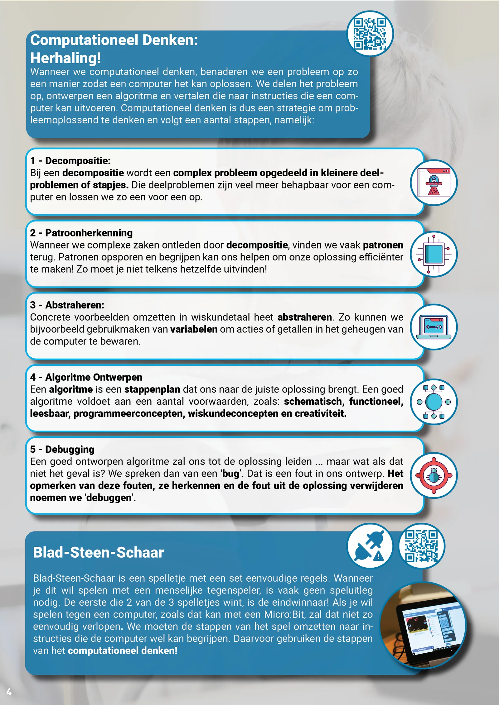
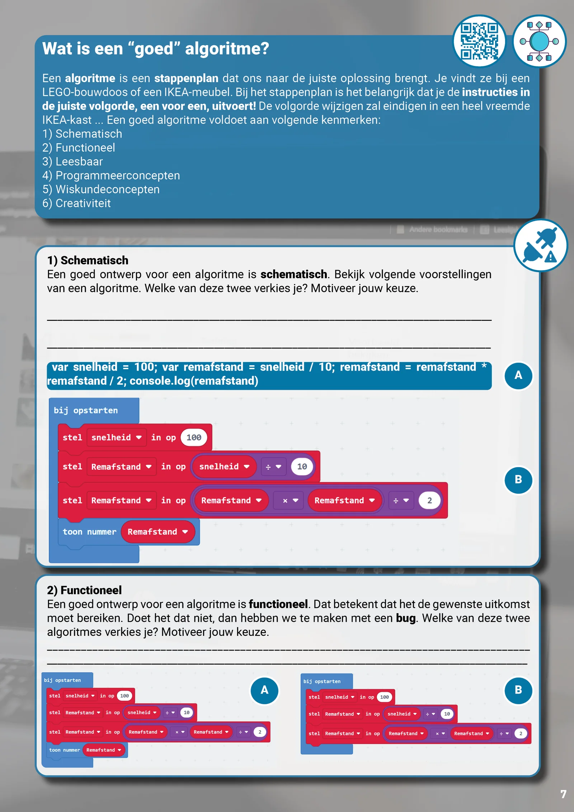
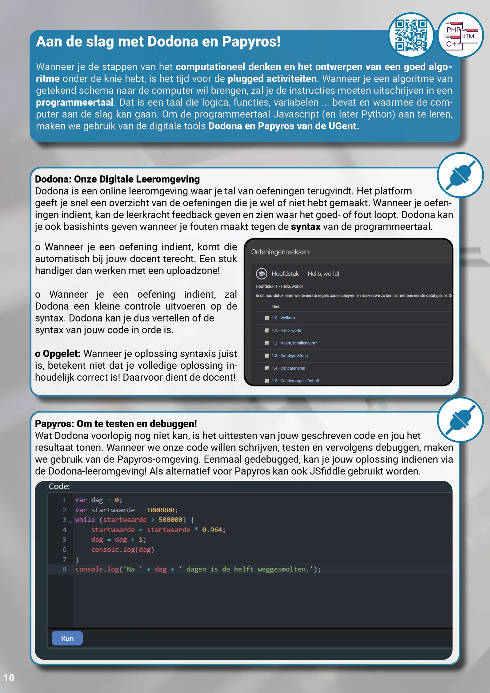
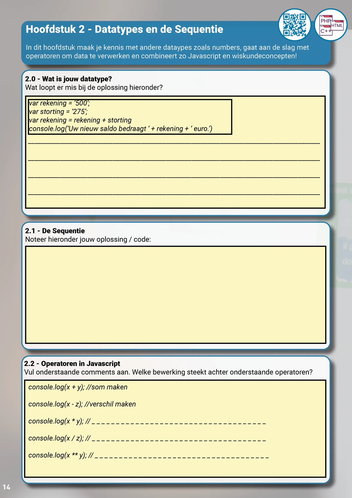

### Computational Thinking Level 2.0

Meer info over de voorgaande lessenreeks? Klik op de afbeelding!

In this series of lessons with a fully formatted 36-page syllabus, 50 digital exercises and no fewer than nine teaching videos, we take you to level 2.0 of computational thinking. We do this by delving into the programming language Javascript!

Are you completely new to this wonderful digital world? Then I recommend you to start with the course ['Computational Thinking'.](/education/course-computational-thinking) There you will learn the basics of computational thinking as a method for problem solving. You learn this by doing 'unplugged' (without a computer) and 'plugged' (using a computer) activities. You also learn programming concepts such as selection and repetition, which we build on in this series of lessons about Javascript.

In this series of lessons, we repeat the knowledge of computational thinking and you learn to use the Javascript programming language to solve various problems. We combine this with familiar programming concepts, knowledge and skills from maths lessons and with the learning environment Dodona. A learning environment that you can also meet when you learn Python or even when you start a programming course in higher education, such as at University og Ghent.

### Programming Languages as ‘tools’

Javascript is a programming language like Python or Object C are. It is a language that we can use to give instructions to a computer. If we were to write instructions in English, the computer would not understand them. But a programming language is a language that we and our computers understand. So it is a tool when we think computationally.

Javascript can be found in a number of applications, such as when learning to program via Blockly, Micro:Bit or within the Minecraft Education Edition game environment. This makes it a good stepping stone for taking our skills and knowledge within computational thinking to a new level.

In this series of lessons and the accompanying syllabus, we repeat the familiar steps of computational thinking and delve into designing an algorithm. When we design our algorithm and use Javascript, we can use programming concepts. When you use concepts properly, pay attention to syntax, variables, data types, operators ... you can make boring static websites come to life, build calculation tools or [even design your own game!](/education/wall-of-game)

Would you like to get a taste of these self-made games? Then the 'Wall of Game', a selection of my student's best creations, offers some nice examples!

### The Class Materials

[Volledige grootte weergeven ](https://images.squarespace-cdn.com/content/v1/6026af223ff1970db5c08fb8/1661264938131-GC49VDIA9EIW5RBL85Y6/Syllabus+JavaScript+2022-2023+KLAD+23+Augustus4.png)

[Volledige grootte weergeven ](https://images.squarespace-cdn.com/content/v1/6026af223ff1970db5c08fb8/1661264935479-F572UX3QFAP4DBBUPOG7/Syllabus+JavaScript+2022-2023+KLAD+23+Augustus7.png)

[Volledige grootte weergeven ](https://images.squarespace-cdn.com/content/v1/6026af223ff1970db5c08fb8/1661264941673-U42OL1L9QZ80JIHIH9IW/Syllabus+JavaScript+2022-2023+KLAD+23+Augustus10.png)

[Volledige grootte weergeven ](https://images.squarespace-cdn.com/content/v1/6026af223ff1970db5c08fb8/1661264942445-S6QMMI1A7VQG2VU94D9G/Syllabus+JavaScript+2022-2023+KLAD+23+Augustus14.png)

The teaching material was developed in the summer of 2022 based on my six years of experience as a programming teacher in secondary education and external supervisor at UGent (subject didactics B/developing teaching material). It uses both unplugged (=no computer required) and plugged (=we do use the computer) teaching activities and deals with the following components:

-   Rehearsing Computational Thinking

    -   decomposition

    -   recognizing patterns

    -   making abstractions

    -   design a algorithm

    -   debugging

-   How do you design a 'good algorithm'?

-   Programming concepts with Javascript

    -   Syntax

    -   Sequence

    -   Selection

    -   Repetitions

**The teaching material consists of:**

-   a syllabus of 36 neatly designed pages in PDF format;

-   a series of nine teaching videos accessible via QR codes throughout the syllabus;

-   around 50 exercises via the Dodona digital learning platform.

The complete series of [teaching videos](https://youtube.com/playlist?list=PL7qul8TV_7p7v3bp1KpzJrH5Yb56Ha4Nx) can be found via this link (YouTube). Below you will find the first of no less than nine teaching videos!

[Video on YouTube](https://www.youtube.com/watch?v=mxoBx3Fvnhs)

### I want this in my class! What do I have to do?

Do you want to work with this in your classroom? Super! The future will be increasingly digital. A future in which artificial intelligence will play a very important role. It goes without saying that we need to prepare and motivate young people. I am happy to help you with that! Through the buttons below you can send me a message or get information about a training or workshop. I usually reply within 48 hours!

<a class="content-button content-button--primary content-button--medium" href="/education/workshops-and-teacher-training">Info workshops</a>

<a class="content-button content-button--primary content-button--medium" href="https://sintlievenscollege-my.sharepoint.com/:b:/g/personal/robbe_wulgaert_sintlievenscollege_be/ES2T--W9hN1IoQuS65yH0-ABCtxRqU_Er0cV-LEsrmKk9g?e=nvOgFU">Download teaching materials</a>

