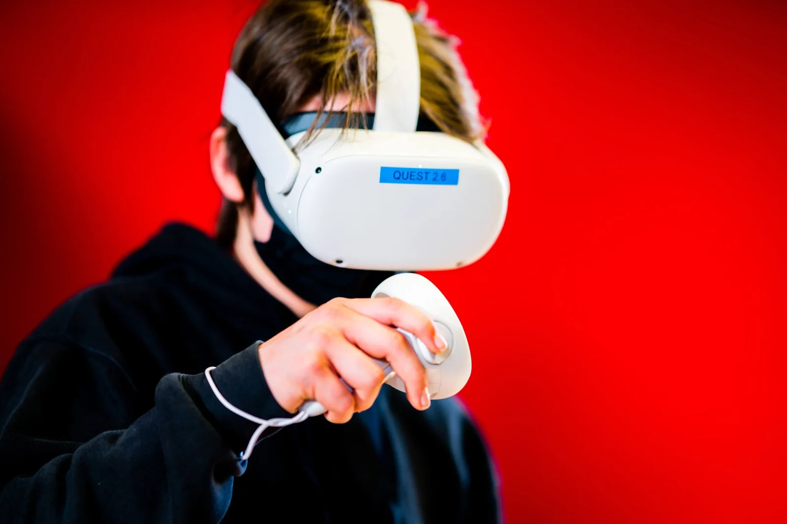
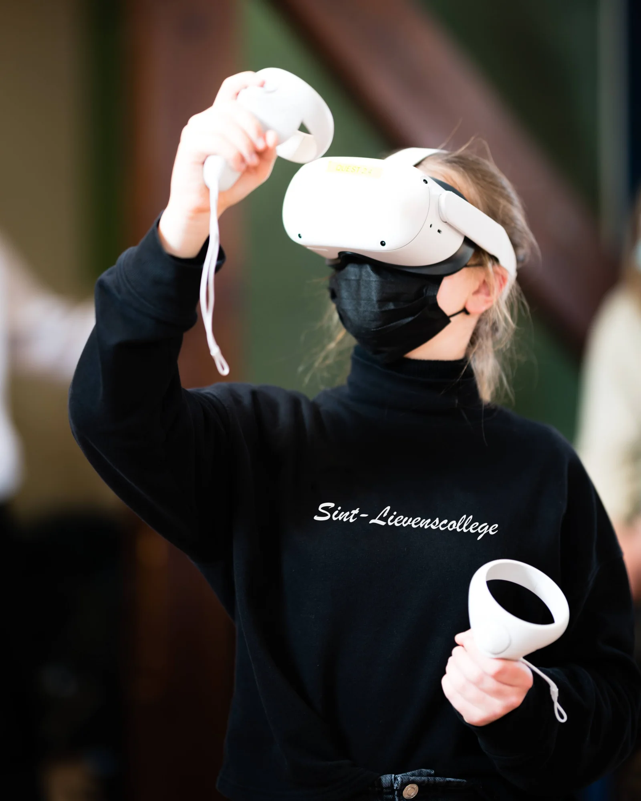
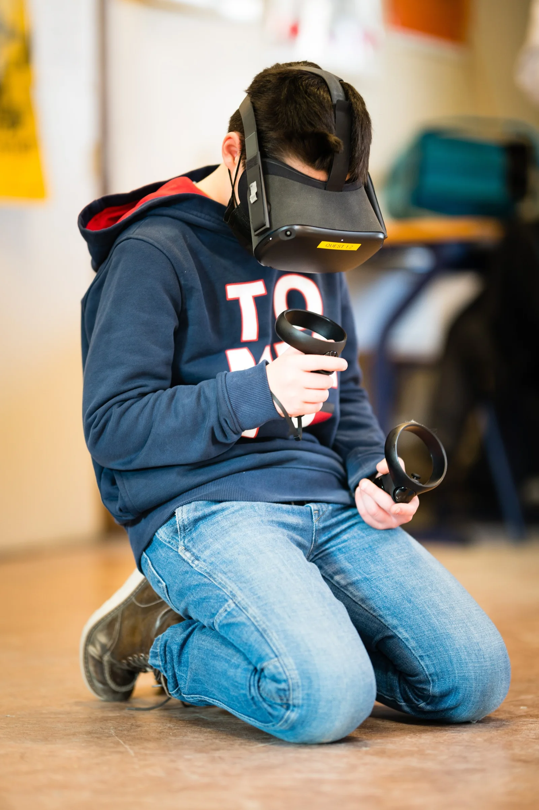
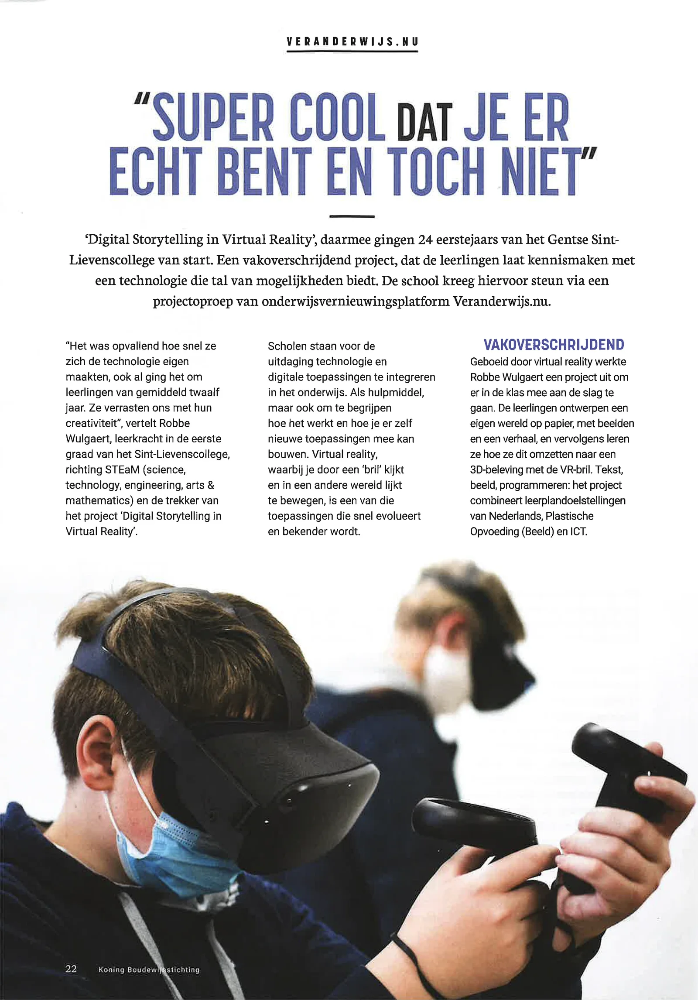
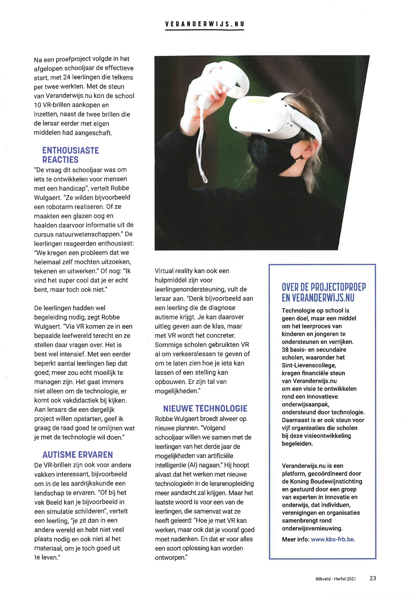

### **'Digital Storytelling in Virtual Reality',** 24 freshmen of the Ghent based Sint-Lievenscollege started with this project. A cross-curricular project that introduces students to a technology that offers numerous possibilities. The school received support for this through a call for projects from the educational innovation platform **Veranderwijs.nu.**

_\- This article appeared earlier in Blikveld magazine, fall edition 2021_

"It was striking how quickly they mastered the technology, even though they were students with an average age of twelve. They surprised us with their creativity," says Robbe Wulgaert, teacher in the first grade at Sint-Lievenscollege, in the direction of STEaM ( science, technology, engineering, arts & mathematics) and the initiator of the 'Digital Storytelling in Virtual Reality' project.

Schools are faced with the challenge of integrating technology and digital applications into education. As a tool, but also to understand how it works and how you can build new applications yourself. Virtual reality, where you look through 'glasses' and seem to move in another world, is one of those applications that is rapidly evolving and becoming more widely known.

### Cross-Curricular

Fascinated by virtual reality, Robbe Wulgaert developed a project to use in the classroom. The students design their own world on paper, with images and a story, and then they learn how to convert this into a 3D experience with the VR glasses. Text, image, programming: the project combines curriculum objectives of Dutch, Plastic Education (Image) and ICT.

After a pilot project, the effective start followed last school year, with 24 students working in pairs. With the support of Wisselwijs.nu, the school was able to purchase and use 10 VR glasses, in addition to the two glasses that the teacher had previously purchased with his own resources.

### Enthusiastic reactions

“The question this school year was to develop something for people with a physical disability,” says Robbe Wulgaert. “For example, they wanted to realize a robot arm. Or they made a glass eye and obtained information from the natural sciences course.” The students reacted enthusiastically: “We got a problem that we were allowed to figure out, draw and work out all by ourselves.” Or: “I think it's super cool that you're really there, but you're not.”

The students did need guidance, says Robbe Wulgaert. “Via VR they enter a digital world and they ask questions about it. It's quite intensive. This went well with a rather limited number of students; more would be really hard to manage. After all, it is not only about technology, it also involves teaching methodology. I would like to advise teachers who want to start such a project to clearly define what you want to do and achieve with the technology.”

### Student Support Tool

The VR glasses are also interesting for other subjects, for example to experience a landscape in geography class. “Or, for example, in the Image course you can paint in a simulation,” says a student, “you are then in a different world and you don't need much space and not all the materials to let yourself go.”

Virtual reality can also be a tool for student support, adds the teacher. “Consider, for example, a student who is diagnosed with autism. You can explain this to the class, but with VR it becomes more concrete. Some schools already used VR to give traffic lessons or to show how to weld something or build scaffolding. There are plenty of options.”

### New Technology

Robbe Wulgaert is already brooding on new plans. “Next school year we want to explore the possibilities of artificial intelligence (AI) together with the students of the third year.” He hopes that working with new technologies in teacher training will receive more attention. But the last word goes to one of the students, Malina, who summarizes what she has learned: “How you can work with VR, but also that you have to think carefully beforehand. And that a kind of solution can be designed for everything.”

### Questions, feedback?

Questions or comments about this project or one of my other projects?

<a class="content-button content-button--primary content-button--medium" href="/contactinfo">Contact</a>

