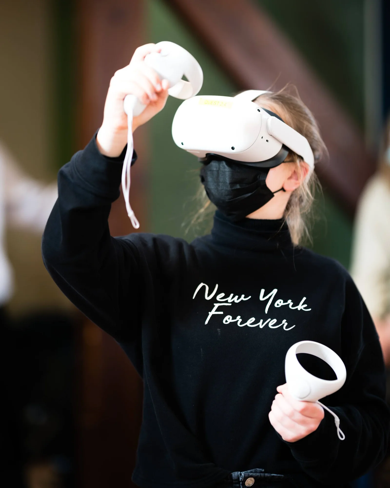
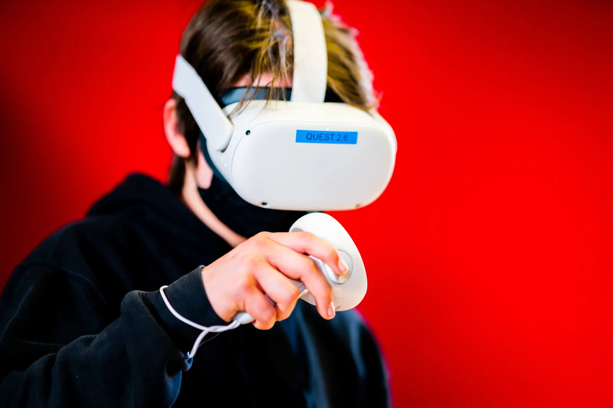
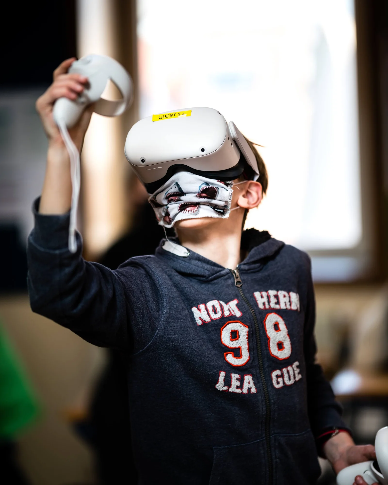

[Video on YouTube](https://www.youtube.com/watch?v=KUIE_fjzhvI)

### The idea

Virtual reality is evolving at lightning speed. Where VR glasses cost a lot of money a few years ago or were difficult to set up, that is changing. Just like with the computer, the camera and the smartphone, the threshold for use of VR glasses is getting lower. As a result, more and more people are able to immerse themselves and others in their own virtual reality. In this new immersive world, people can create content, express themselves creatively and thus give color to their experience in an original way.

With this project we build a bridge between the different subjects, talents and technologies, between computer sciences, plastic education and Dutch. Where students learn to get acquainted with the new technology, immerse themselves in it and lose themselves for a while. Where students get to work creatively to convert their imagination into visual and auditory art.

An image may say more than a thousand words, but the added value of a good narration cannot be underestimated. We combine all this into a whole, in order to convey our message through fantasy and technology.

### The innovation

This cross-curricular project in secondary education aims to use new technology to enable students to create. In this way we bridge the gap between disciplines, colleagues and curricula. In this way we also put the Arts in STEaM in the spotlight.

### Why and how?

This project starts from a small scale (+-12 students) and serves as a proof-of-concept. It is a pilot project to test the technology in an educational setting. However, even if this project succeeds in its objectives, it is likely to remain small-scale. After all, the costs associated with the material are high. Moreover, it takes a lot of time to create a work in 2D and then in 3D and then convert it into an app. An increase in scale of this project will therefore have to be accompanied by investments.

### Results

In this project, students learn to tell a story. They draw their story in 2D (on paper), write it out (language course), make the design in virtual reality and learn how to tell a story in an appealing way (language course). We combine these different parts and build our own VR app. The full story comes to life! You listen to the story, walk around freely, look at the creations from far and close ...

### Tips & tricks

Long story short: feel free to contact us! I give digital workshops to guide schools in these kinds of projects.

<a class="content-button content-button--primary content-button--medium" href="https://www.veranderwijs.nu/verhaal/steam-project-digital-storytelling-virtual-reality">Meer informatie</a>

