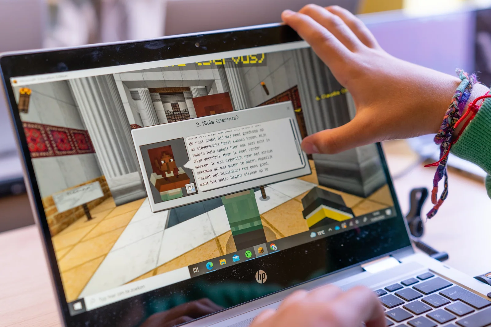
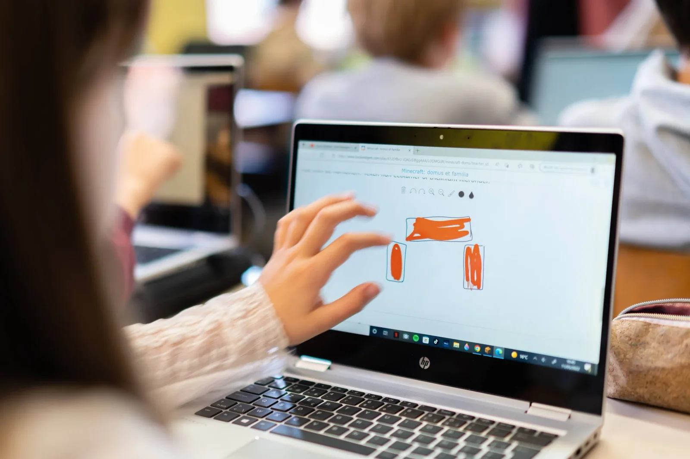
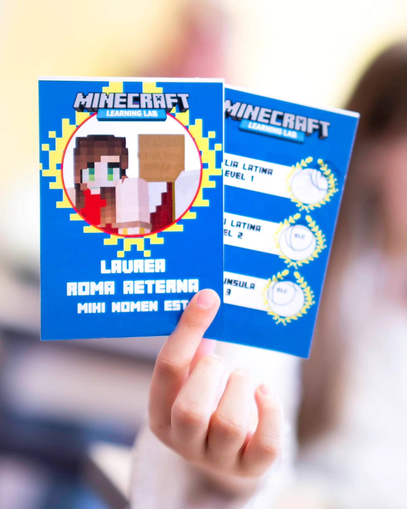
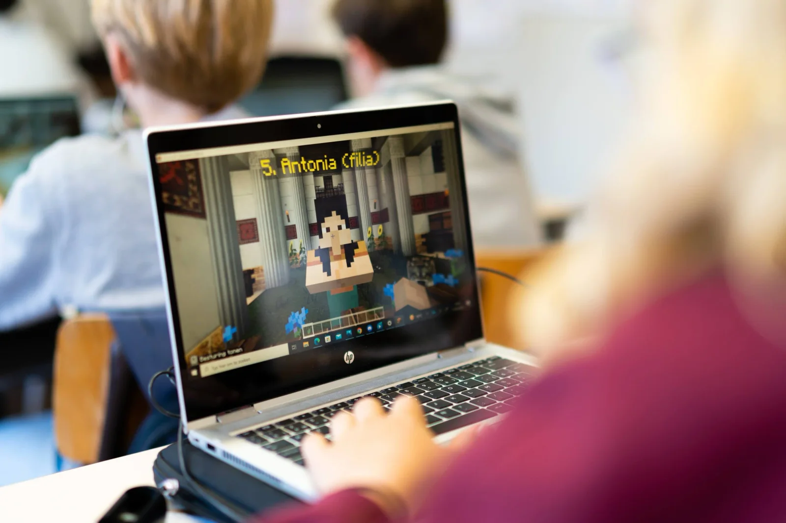

### In making the leap to middle and high school, there is a lot involved. New teachers and new subjects to choose from. Pupils are already getting to know sciences or programming through various activities and camps. But what is Latin? How can one become acquainted with the language and culture of the ancient Romans and still be fully digital? How to build a bridge between two apparent opposites, the classical languages and a digital gaming environment?

[Video on YouTube](https://www.youtube.com/watch?v=KNXrgWcAiBs)

### Collaboration between school and university

In this project, a cooperation between **UGent and Sint-Lievenscollege Ghent**, we developed teaching materials for students in the fifth grade, the sixth grade and the first secondary school. The research question: **Can we make students enthusiastic about Latin by giving them a taste of the life of a familia in ancient Rome?** How do we digitally take them through insulae and domus in a gigantic Minecraft game world? How can we integrate evaluation into the digital learning material?

### Challenge: Get a taste of Latin!

Students in the fifth and sixth year are faced with a big choice: which subject or extension package do they want to choose? Initiatives such as Coderdojo give them a taste of programming or the teacher can bring science into the classroom... but the subject of Latin always remains somewhat unknown. So making a good, informed choice is difficult. Or laced with stereotypes about the usefulness of the language ("later when you want to do Medicine"), and not the beauty of the language and culture itself. This is what we are trying to do with this project!

### Target Audience

This project is aimed at pupils in the **fifth and sixth years of primary school and the first year of secondary school.** The pupils discover the language, culture and life of the Romans through an adapted Minecraft world. In this world an almost complete re-creation of the old Roman city centre was made, including the Circus Maximus, the Palatine, the Colosseum ... We developed several teaching projects in this game environment about the 'Familia Latina', about the 'Domus et Insula' and an extension lesson about the Italian language and its relationship with Latin.

### Get started!

The student is given three levels to choose from, which are completed one by one. In these levels, the student is immersed in the Minecraft world, which is familiar to many. Not to build or survive, but to fully discover ancient Rome! During these levels the game world is delineated. This way we explore the Subura of Rome in the three levels, without the student getting lost in the impressive game world.

Within a level, the student is introduced to several game characters. Claudius, Arminius, Livia ... Romans from all layers of society. From the dominus to the servi who "help" in the household. The pupil learns about family ties and social relations between rich and poor.

As an extra challenge, or evaluation and feedback tool for the teacher, each level ends with a digital quiz! If the pupil succeeds, he/she receives a stamp on his/her personal card and can proceed to the next level!

### How did we develop this project?

This project is the result of a collaboration between UGent and Sint-Lievenscollege Ghent. This in the context of the course 'Subject Didactics B' within the Educational Master. In this course unit students Emma De Bruyne and Maria Kamei had to develop digital teaching materials for Latin within the game Minecraft. They were supervised by lecturers Katrien Vanacker and Katja De Herdt (UGent - subject matter) and Robbe Wulgaert (supervisor - development of digital material).

Emma and Maria explored the possibilities of a digital tool, chose relevant curriculum and lesson objectives, developed lesson materials and evaluation methods ... This way, students learn to develop (digital) lesson materials themselves, from start to finish.

### Requirements

Accessibility is an important element within this project. The tools needed to start working with this material, for teacher and pupil, are

-   the programme Minecraft Education Edition;

-   a Microsoft- or Office365-account;

-   a computer;

-   a external computer mouse (for added comfort);

-   stable internet connection.

### Goals: what will I learn?

### Class level:

-   The pupils can give the Dutch translation of various members of the familia.

-   The pupils can connect the function of the different rooms of the domus with the correct name.

-   The pupils can explain that not all slaves were treated equally well or badly or given the same tasks.

-   The students can identify the languages that belong to the same language family as Latin (differentiation).

-   The students can compare the living conditions of the Romans with today's living conditions.

-   The students can compare the living situation of a poor Roman with a rich one.

-   The students can explain in their own words the disadvantages and dangers of living in an insula.

-   The students can understand and translate a simple Latin sentence with a subject, a praesen form of esse and a NWDG.

-   The students can describe in their own words the relationship between patronus and cliens.

-   The students can give a contemporary example of patronage.

### Curriculum level:

These curriculum objectives were selected from the curriculum Latin first grade (Katholiek Onderwijs Vlaanderen).

-   KLTAa3: The students derive the meaning of words from word structure and word affinity;

    -   in Latin: via affinity with other Latin words;

    -   in Latin: via affinities with modern languages;

    -   in modern languages: through affinity with Latin.

-   KLTAa 26: The students describe aspects of Roman culture and compare them with their own culture. 

-   KLTAa 27: The students process aspects of Classical Antiquity in a creative way.

### I want this in my class! What do I have to do?

Do you want to work with this in your classroom? Super! Helping young people choose and orientate is important. A taste of Latin is definitely part of that. I am happy to help you with that!

<a class="content-button content-button--primary content-button--medium" href="/education/workshops-and-teacher-training">Workshop info</a>

<a class="content-button content-button--primary content-button--medium" href="/contactinfo">Ask a question</a>

