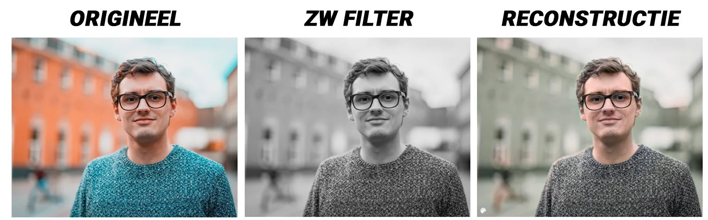

**Over the past few months, coloured old photos and video images have often made the news. Impressive video images of** [**the streets of Brussels in 1908**](https://www.vrt.be/vrtnws/nl/2021/05/24/zo-zag-brussel-er-in-1908-uit/) **or the** [**occupation of Ghent by German troops during WWII**](https://www.vrt.be/vrtnws/nl/2022/02/07/gentenaar-kleurt-nog-nooit-eerder-gepubliceerde-foto-van-adolf-h/)**. Each time, these were coloured by graphic experts with a great eye for detail. A beautiful work that took a lot of time. Would you also like to look at those old photos of your (great) grandparents through coloured glasses? You don't have to become a graphic designer to do that! You can do it with AI-model in the classroom!**

[Video on YouTube](https://www.youtube.com/watch?v=hKop7lxqUxk)

### History is not black and white!

During this class project, we will study how a special AI model works. This model succeeds in giving new colour to old images. It can do this because it works according to a NoGAN principle. This principle combines pre-training with two systems that are placed opposite each other: a forger and a detective. In their constant struggle, they become better and better at their task.

The result is sometimes beautifully coloured pictures. Are they perfect? Certainly not. They are only an approximation of reality. That is why they are also branded, so that later in the archives there is no confusion between primary and secondary sources.

But how do we apply this AI model in the classroom? What assignments can we do with the students?

### Dive into your school's heritage!

[Video on YouTube](https://www.youtube.com/watch?v=lm2--WcXpi4)

Many schools in Flanders have a rich history. Some will also have a nice archive of it in an attic room. Photos of a playground from a bygone era, established teachers in full action in front of their class or labs from other times.

By digitising these archives, we can let students work with them. We bring these images into our AI and actively explore the heritage of our own school!

### Renew the family photos of the class!

[Video on YouTube](https://www.youtube.com/watch?v=CFDN1v9PnQU)

But it doesn't all have to revolve around the school. The pupils can also contribute. They bring old images of grandparents or relatives into the classroom. We place these, as well as the images from the school, in the AI model. Suddenly, the old wedding photos and family portraits get colour! Then the pupils themselves investigate. Which parts were coloured in correctly? Did grandmother's eyes really look like that? Are the colours of the uniforms correct?

### Take on an Instagram filter!

The fact that the AI model is not without its faults is quickly apparent when you present it with an edited photo. This photo was edited using Instagram's black and white filter, as many people do every day. The AI model is not trained for this! It is trained on those old photos. Photos that were taken with old photo plates or film. The results on these smartphone creations show the limitations of our AI approach.

### The Hindenburg, last Tasmanian Tiger and the first science fiction film in colour!

[Video on YouTube](https://www.youtube.com/watch?v=--AqzDkZkr0)

What the AI model can do with one image, it can also do with several images. That is, if you have enough patience. Then you can give it an old video, like the very first science fiction film "La Voyage Dans La Lune" or the crash of the Hindenburg. After waiting a while, the magic appears on the screen!

### Questions or comments?

Questions or comments about this project or any of my other projects? Then please feel free to ask them below!

<a class="content-button content-button--primary content-button--medium" href="/contactinfo">Contact</a>

