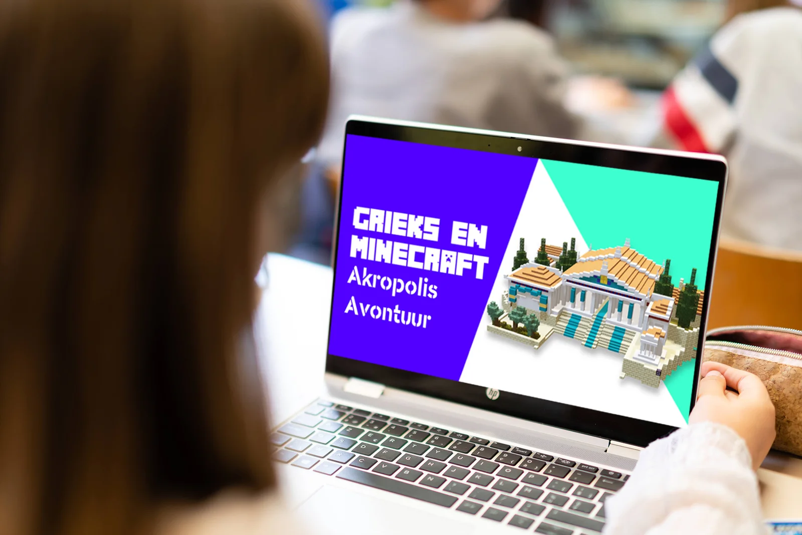
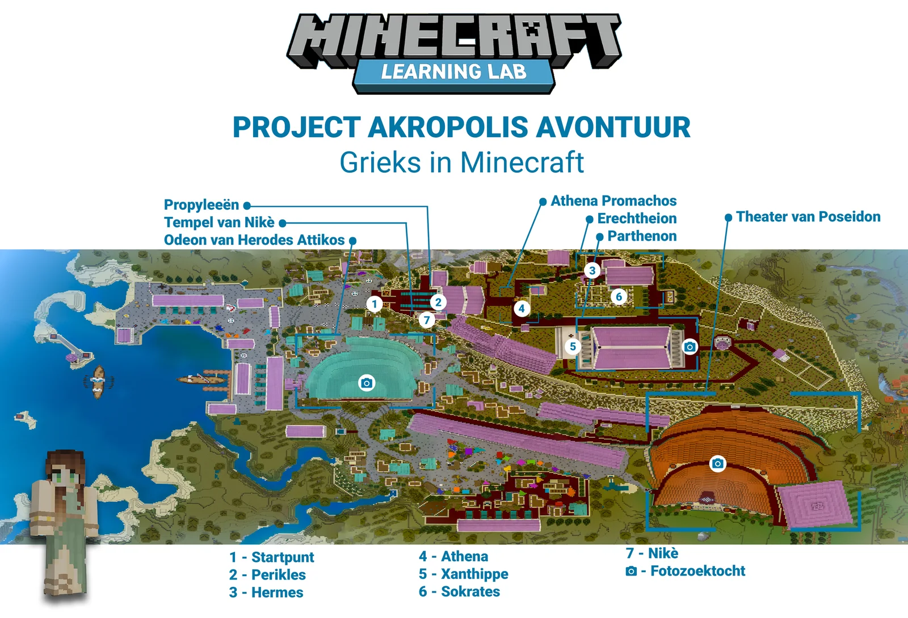
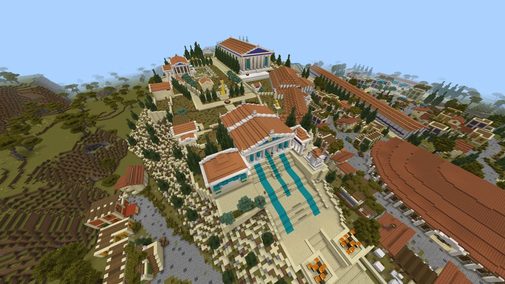
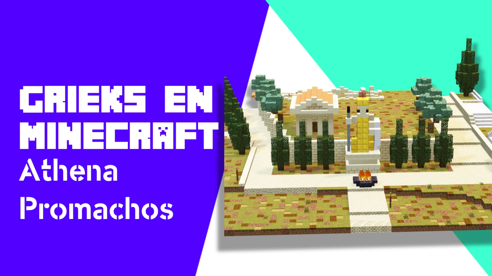
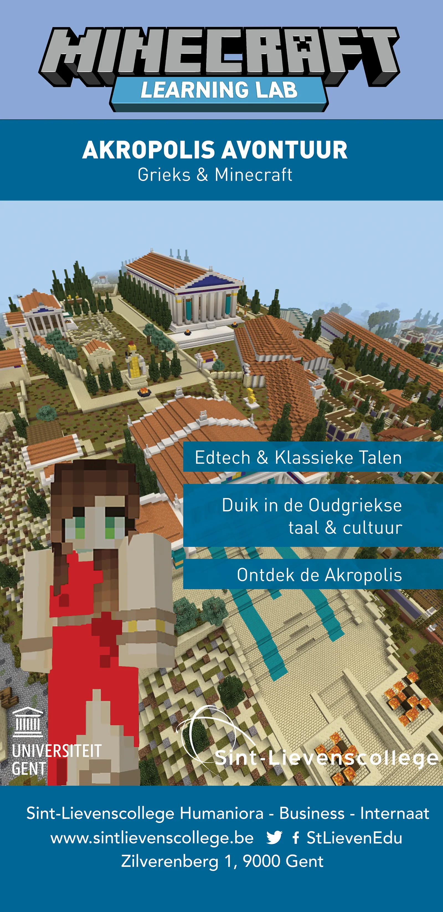
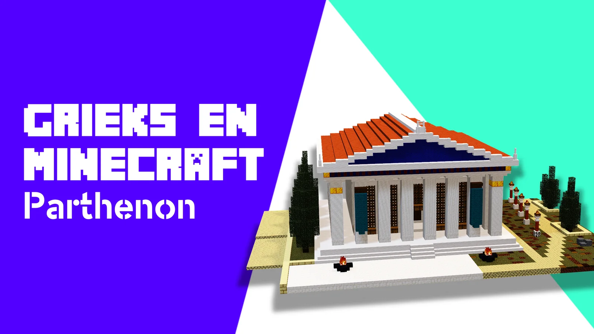
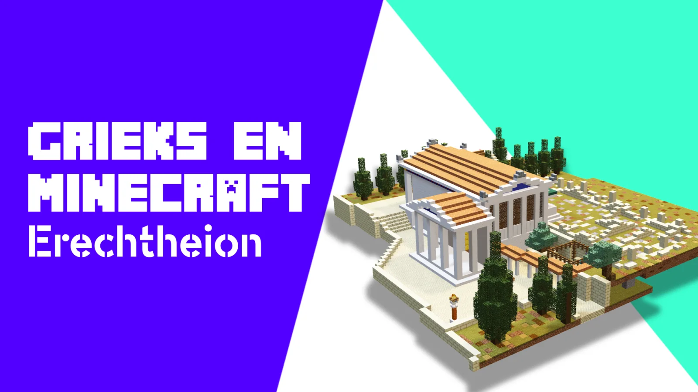

### Χαῖρε! How do you bring educational technology into classics? Last academic year, my students and I designed teaching materials that did just this! We developed two levels where students could explore ancient Rome and learn more about the Familia Latina and the life of the Romans through assignments. This year, we are heading to the Athenian Acropolis! Through a Minecraft world, pupils discover the Parthenon, meet Athena and learn about the Elgin Marbles. This digital learning material targets second- and third-grade Greek and thus dares to raise the content bar. We developed this teaching material especially for the Greek Day of Catholic Education Flanders. **Π**άμε!

### **The challenge: Ancient Greek and edtech!**

At educational technology fairs, such as SETT in Belgium or BETT in the UK, you will find countless applications to combine digital tools with sciences and computational thinking. But classical languages are less easy to find there. That is where my students, colleagues and I try to counterbalance. Within our course section, we consciously focus on the combination between classical languages and modern technology such as games and artificial intelligence!

Within this project, we developed a Minecraft world where students can explore the Athenian Acropolis. On the hill, they not only find Perikles, Athena and Xanthippe, but also the well-known buildings such as the Parthenon, the Caryatids and even the lost statue of Athena Promachos.

Through various stops and intermediate questioning, students get to know the different buildings on the Acropolis and their functions, they learn about various gods and the origins of the polis of Athens, they learn about the debate surrounding the Elgin Marbles and thus get to know arguments for and against their return to Athens.

Moreover, we ensure that the various stops do not remain culture lessons. The texts contain Ancient Greek terms and concepts that challenge students. We alternate simple fill-in-the-blank exercises with reading texts and newspaper articles. In the final exercise, we swap the linear for an exploration task along the odeon of Herod Attikos, the theatre of Dionysos and the chryselephantine statue of Zeus.

### **Target audience**

This project targets second and third year secondary school students. The pupils discover the Acropolis through a customised Minecraft world. This world is an almost complete recreation of the ancient Athenian Acropolis, including the Parthenon, the Erechtheion, the Propylee ...

### **Get started!**

In this lesson material, students are immersed in the Minecraft world that is familiar to many. Not to build or survive, but to fully explore the Acropolis of ancient Athens! Within a level, the student is introduced to some game characters such as Perikles, Hermes, Sokrates ...

As an extra challenge, or evaluation and feedback tool for the teacher, the level contains several quizzes! This allows us to check whether the lesson objectives were achieved by the pupil.

### **How did this project evolve?**

This project is the result of a collaboration between UGent and Sint-Lievenscollege Gent. This in the framework of the course unit 'Vakdidactiek B' within the Educational Master. In this course unit, students Rachel Pittie, Delphine Larmuseau and Aurélie De Baerdemaeker had to develop digital teaching material for Greek within the Minecraft game. For this, they were supervised by subject teachers Katrien Vanacker, Wim Cool and Katja De Herdt (UGent - subject content) and Robbe Wulgaert (supervisor - development of digital material).

Rachel, Delphine and Aurélie explored the possibilities of a digital tool, chose relevant curriculum and lesson objectives, developed teaching materials and evaluation methods ... This way, students learn to develop (digital) teaching materials themselves, from start to finish.

Last academic year, in the same course unit, we already designed teaching materials combining Minecraft and Latin. We also made the bridge between game design and the loose ablative. So this project is not our first foray into the realm of gamification and edtech.

### Class goals

-   Recognise different buildings on the Acropolis;

-   Naming buildings on the Acropolis by their name and function;

-   Recognising Greek words in Dutch words;

-   Getting acquainted with the prominent figures of the 5th century BC: Perikles, Sokrates, Xanthippe;

-   Understand basic Greek vocabulary;

-   Reading comprehension;

-   Deepening knowledge about certain Greek gods vb. Athena, Nike and Hermes;

-   Articulate the debate surrounding the Elgin Marbles and give arguments pro or con.

### Curriculum goals

These curriculum objectives were selected from the Greek and History (second grade) curricula.

**Greek:**

-   LPD 1: Students infer the meaning of words from word structure and relatedness:

    -   in Greek: via kinship with other Greek words;

    -   in Greek: via kinship with modern languages;

    -   in modern languages: via kinship with Greek.

-   LPD 30: Students distinguish similarities and differences between characteristic aspects of their own society and culture and aspects of societies and cultures from ancient Greek.

    -   ✓ Examples: political structures, philosophical and religious views, human and world views, sciences, social relations, religious practices and rituals. -> temples, Perikles, imperialism

    -   ✓ Through Herodotus you can make connections with both the natural sciences (through Ionian natural philosophy) and the social sciences, such as anthropology -> in our project Solon, Sokrates

-   LPD 32: Students explain diversity within the society studied.

-   LPD 33: The pupils reflect on norms, values and views from classical antiquity.

-   LPD 35: The pupils process aspects of classical antiquity in a creative way.

**History:**

-   The pupils explain characteristics of different social domains for societies from the historical periods studied.

### Requirements

Accessibility is an important element within this project. The supplies needed to get started with this teaching material, for teacher and student, are:

-   the Minecraft Education Edition programme;

-   a Microsoft or Office365 account;

-   a computer;

-   possibly a computer mouse (for extra comfort);

-   stable internet connection;

-   the map with all important characters and buildings;

-   of course: the Minecraft level!

### I want this in my classroom! What should I do?

Want to work on this yourself in your classroom? Super! Introducing young people to history, language and culture is important. That certainly includes exploring the subject of Greek. Feel free to help you with that!

<a class="content-button content-button--primary content-button--medium" href="/contactinfo" target="_blank" rel="noreferrer">Get in touch!</a>

