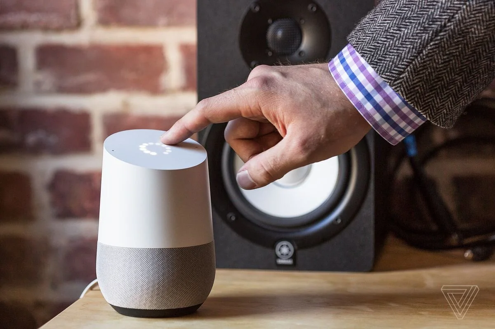
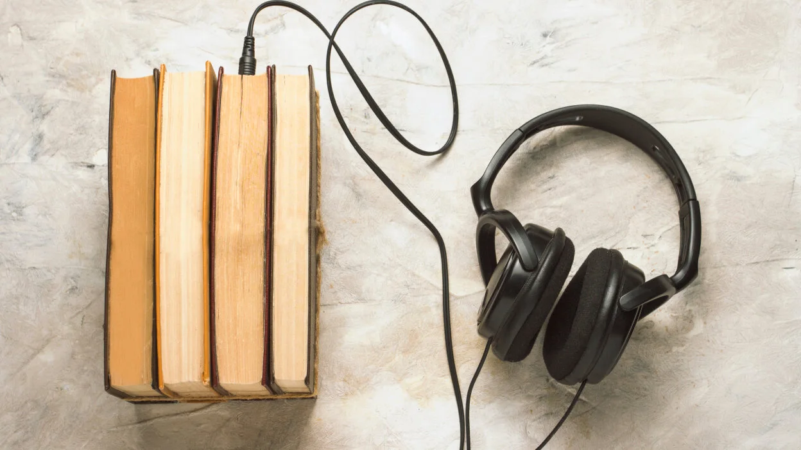
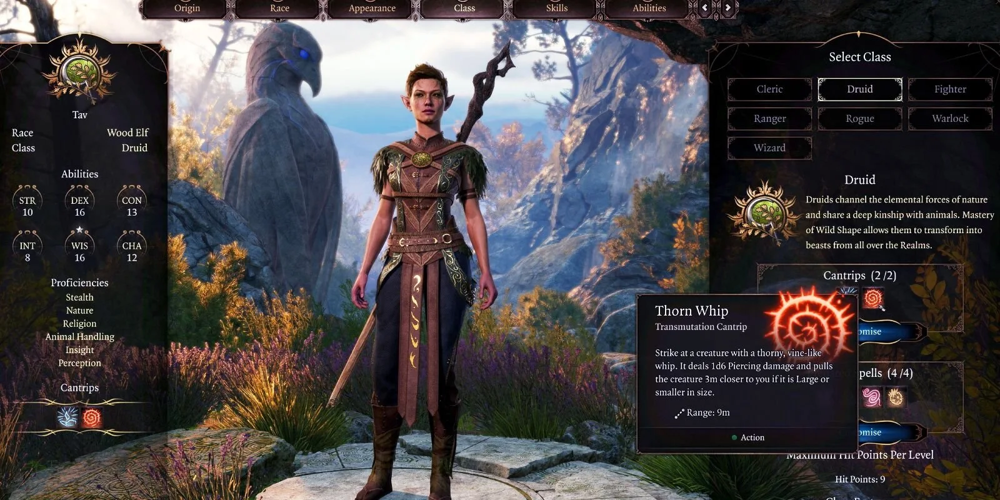
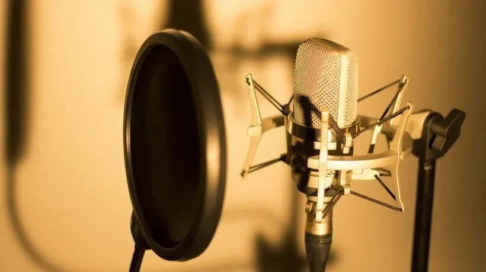

[Video on YouTube](https://www.youtube.com/watch?v=5aMvg_YYkb8)

### Cloning your voice has never been easier!

It only takes ten minutes. You read a script carefully with a microphone or you load an existing recording (for example the voice of David Attenborough). You type in a sentence of your choice and then be patient and ... bingo! Suddenly you hear the somewhat robotic voice that looks eerily like yours. Or David Attenborough's. AI-David in that case, because you just used an AI model to speak like you do. Cloning your voice has never been easier. But what can you do with it? Do you want that? What are the dangers and pitfalls?

### What would I use that for?

### Your own smart assistant or chatbot

You may already know Siri, Google, Cortana or Alexa. Digital voice assistants that help us play music, switch lights on and off, set timers in the kitchen... You can set them up with a whole selection of voices in various languages.

But what if you could choose your own voice? What if you could train the digital assistant to respond like you would speak? Sounds pretty freaky, but from a purely technical point of view it would be possible.

### **Audiobooks**

Fan of audiobooks but would like to make your own? Something like this takes hours to record everyone! But imagine if you could simply input the book, pieces of text, into a program. A program with an AI model that is trained on your voice. The program converts the text to speech via a 'Text-To-Speech' or 'TTS' system. Suddenly you hear the story being told through your voice!

### Your ingame avatar looks and sounds like you!

When starting a video game, especially with role playing games, you get the option to create your own character. Your own avatar. You choose how you look ingame, and can make your avatar look like you. Such avatars, especially in an RPG, have a pre-programmed voice or no voice at all. Imagine if you could load your own voice. Create an avatar that not only looks like you, but also sounds like you do!

### Are you famous? Popular? Your voice as a service!

You may know a well-known voice actor, or you may just be one yourself! These voice actors are often asked to record a piece of text, for example for a radio commercial or a real Disney animated film. Imagine that those voice actors don't have to go to the studio for every movie, for every commercial or for every recording? Imagine if we have enough recordings so that we can build an AI model based on that voice! That you can use your voice as a kind of license and never have to spend another day in your life recording a new commercial for some store chain!

### But… Is your voice still really yours and will all voice actors soon be out of work?

The foregoing sounds like paradise for some voice actors, but does bring us to a fundamental question: who owns your voice, can you just make an AI model of someone's voice, and what is a fair salary for a voice actor?

After the launch of Siri from Apple, there was also a Dutch (Flemish) voice for the service. The person, Libelia Desplenter, who had recorded this voice for the company Lernout & Hauspie, knew nothing about it. She had recorded a series of voices years before, was paid for it ... the stocking seemed finished. Apparently those recordings were later sold and used to train the voice model for Siri, which can be used on millions of devices. Was that person adequately compensated? And what if you could just find a voice recording on the internet and use it for your AI model?

### **Behind the AI-Scenes!**

When we think of voice actors and the systems behind Siri or Alexa, there is an enormous amount of computing power and money behind it. The AI model that is often used for this is a **Text To Speech model, or TTS for short**. Such a system converts written text into spoken text. Sounds pretty simple in theory, but that's faster... said... than done. To make a good TTS system, we need a few things:

-   The voice actors for such systems spend hours in a studio where they have to record the most diverse sentences. These sentences together form the dataset on which the AI model will **train**;

-   An AI model is trained with a large amount of computing power, over a long period of time. Often this is done on servers in data centers;

-   Once created, that model must have so much computing power that it can very quickly read your audio command, convert it into text, understand it, formulate an answer and send it back.

We in the classroom don't have that much time, money and resources. So we approach it differently!

Our approach must:

-   Be able to be run on a laptop or a smartphone;

-   Recordings can be made with a laptop's microphone, without diving into a studio;

-   Working without hours and hours of recorded speech;

-   Get results in seconds or minutes.

We will work with a zero-shot approach in this case. That is, the AI model will not be pre-trained on our speech. The result will not be as good as a Siri or Alexa with this approach, but it will be achievable with a fraction of the resources!

**Let’s get to work!**

[Video on YouTube](https://www.youtube.com/watch?v=MkC97jXeu9g)

### AI Conversation

Imagine a conversation on the playground, an order at the bakery, or a conversation in the store. Only these conversations never took place! These conversations are made by AI models. Students got to work, wrote a short dialogue of their own, made clones of their voices and let these copies do the talking. Literally! You can see and hear the result below.

[Video on YouTube](https://www.youtube.com/watch?v=IbqSM-mDaUM)

[Video on YouTube](https://www.youtube.com/watch?v=djqoATKZuNA)

### Contact

Questions or in need of more information? Head on over to the contact page!

<a class="content-button content-button--primary content-button--medium" href="/contactinfo">Contact</a>

