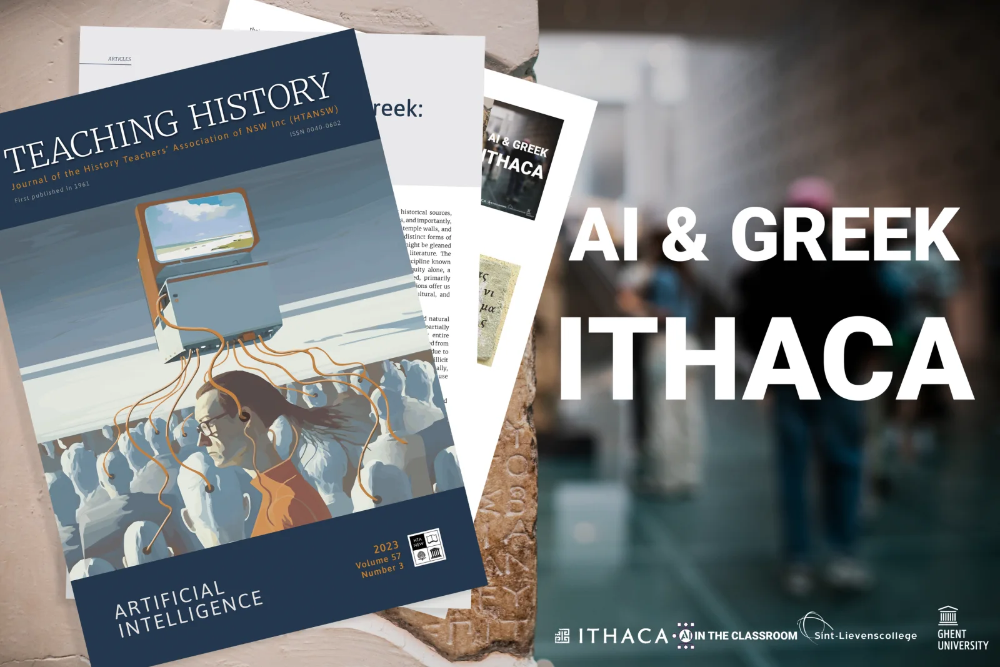

_The following article was published in the September 2023 edition of the ‘Teaching History Journal’ by the_ [_History Teachers’ Association of North-South-Wales, Australia._](https://htansw.asn.au/#:~:text=The%20History%20Teachers%27%20Association%20of%20NSW%20was%20formed%20in%201954,of%20activities%20it%20engaged%20in.)

### _Ithaca AI Meets Ancient Greek: -
Muses and Robots in the Classroom_

_Robbe Wulgaert, computer science and AI educator, Sint-Lievenscollege Gent, Belgium._

**Artificial Intelligence (AI) is steadily making its way into various aspects of our lives. From shaping our digital experiences to enhancing smartphone photography, and even generating full-length essays, the influence of AI is pervasive. Now, the power and potential of AI is poised to revolutionise classroom experiences, particularly in the realms of History, Archaeology and Classical) Languages. This article explores the AI models developed by Google's DeepMind and educational resources produced by the University of Ghent and Sint-Lievenscollege in Belgium for K-12 education. Get ready to don your Indiana Jones hat and power up your computer!**

<!-- p08-deferred:media-83a1055eabf20e0b -->

### Bridge between two opposites

The aim of these educational resources is to bridge what may seem to be two disparate domains: Classical Languages and modern computational techniques, including programming languages. These materials are primarily designed for students aged 16 years and older, studying Ancient Greek, as dictated by the education system in Flanders, Belgium. The intention is to provide students with an introduction to the world of AI, highlighting both its potential and its limitations for studying Classical Languages These classroom materials bring together three interconnected facets: epigraphy, artificial intelligence, and literature, in a single teaching project. They help students realise that these elements, while distinct, can complement and enhance each other. They also demonstrate that the study and application of AI extends beyond the realm of STEM, and that AI can serve as a valuable tool for epigraphers, rather than posing a threat to their careers, as is sometimes suggested in the media. Below, I outline the different components of this project and demonstrate how they can be used in the classroom.

### Epigraphy 101

In the inaugural segments of our course, we familiarise students with the multiplicity of historical sources. The academic syllabus often primarily engages them with artefacts such as pottery, archaeological sites like Mycenae, and literature, such as the works of Homer. These types of sources form the backbone of historical study.

Yet, there exists a wide variety of other historical sources, including coins, papyri scrolls, manuscripts, and importantly, stone inscriptions – found on tombstones, temple walls, and even jewellery. These inscriptions contain distinct forms of historical knowledge, divergent from what might be gleaned from a single, significant piece of ancient literature. The study of such inscriptions falls under the discipline known as epigraphy. From the era of classical antiquity alone, a vast trove of inscriptions has been discovered, primarily within ancient urban landscapes. These inscriptions offer us significant insights into the political, social, cultural, and economic histories of the respective societies.

However, the passage of time, human activity, and natural forces have rendered many of these inscriptions partially or wholly unreadable, with missing characters or entire sentences. Some inscribed artefacts have been separated from their original context and its associated information, due to early excavation techniques, lack of documentation, or illicit trafficking, further complicating their study. Additionally, the inorganic nature of these inscriptions precludes the use of carbon dating.

Epigraphers are tasked with restoring these texts and attempting to attribute them historically and geographically. The corpus of discovered inscriptions forms an invaluable resource in this endeavour. However, navigating through this vast trove of knowledge and data is no small feat. The workflows necessary for restoration and attribution are intricate and time-consuming.  

First, epigraphers draw upon enormous repositories to identify textual and contextual parallels in their quest to restore damaged inscriptions. This repository primarily includes a researcher's mnemonic collection of parallels, complemented by digital corpora that enable 'string matching' searches. However, variances in search queries may unintentionally obscure relevant results, making it challenging to accurately estimate the potential restorations' probability distribution.

Second, attribution poses its unique set of problems, especially for inscriptions that have been removed from their original context or lack internal dating elements. Epigraphers often must resort to auxiliary criteria such as letterforms and dialects to determine an inscription's origin and context. This process frequently involves a significant degree of generalisation, given the expansive timespans that chronological attribution intervals can encompass. The epigrapher is thus dealing with a large amount of data, uncertainties, and a set of time-consuming tasks – whereby machine learning algorithms can be of assistance!

Volledige grootte weergeven

_Image of modified incription used in class materials_

### **AI as an assistant - introducing Ithaca**

Inspired by biological neural networks, a deep neural network (DNN) is a machine learning algorithm that can discover patterns in vast troves of data. Due to steady increases in computational power, DNNs allow us to tackle increasingly larger sets of data using this approach. This even includes datasets of archaeological inscriptions dating back thousands of years.

Ithaca,[\[i\]](applewebdata://4C98FF7B-8B53-4896-9B29-7BCFAEBD694B#_edn1) a deep learning neural architecture, is the first deep neural network designed to restore Ancient Greek texts, and to assist with their geographical and chronological attribution. Named after the island that featured in Homer’s Odyssey, Ithaca AI was conceived by Oxford University researchers and created by Google's DeepMind. It was trained using a dataset of inscriptions written in ancient Greek  across the ancient Mediterranean world between the seventh century BCE and the fifth century CE. The dataset was sourced from the Packard Humanities Institute (PHI), Los Altos, California. Each inscription is accompanied by an ID and metadata about geographical regions and dating. The result is a comprehensive set of machine-readable epigraphical texts, boasting a total of 78,608 inscriptions.

When used alone, Ithaca can achieve 62 per cent accuracy in restoring damaged inscriptions, while historians working without assistance from AI achieve just 25 per cent accuracy. When historians work in combination with Ithaca, its full potential is realised, allowing the historians to achieve a 72 per cent accuracy rate for restoring texts. Ithaca can date inscriptions to a thirty-year period and attribute their archaeological find spots with 71 per cent accuracy. Models like Ithaca can enhance the cooperative potential between historians and AI, transforming the way we study and write about history.

For a more in-depth exploration of the mechanics of the Ithaca AI model, including the handling of inputs and the specifics of transformer technology (the 'T' in 'ChatGPT' also signifies transformer technology), consult the research paper written by the researchers who conceived of Pythia (the original version of Ithaca), Yannis Assael and Thea Sommerschield and others.[\[ii\]](applewebdata://4C98FF7B-8B53-4896-9B29-7BCFAEBD694B#_edn2)

[_\[i\]_](applewebdata://4C98FF7B-8B53-4896-9B29-7BCFAEBD694B#_ednref1) _Ithaca,_ [_https://ithaca.deepmind.com/_](https://ithaca.deepmind.com/) _(accessed 28 July 2023)._

[_\[ii\]_](applewebdata://4C98FF7B-8B53-4896-9B29-7BCFAEBD694B#_ednref2) _Y. Assael, T. Sommerschield, B. Shillingford, et al. ‘Restoring and attributing ancient texts using deep neural networks’, Nature 603 (2022), 280–283. https://doi.org/10.1038/s41586-022-04448-z_

### **Applying Ithaca to our education project**

From an educator's perspective, the most baffling aspect of Ithaca AI is its ease of use. During my student years, computer labs were a rare commodity. For specialised tasks like graphic design or CNC applications, my class and I would have to relocate to a different campus to vie for time on a limited number of high-cost, hardware-equipped computers. Suffice it to say, a learning environment where three students share a single device does not amplify or multiply the learning outcomes.

Fast forward to 2023 and this deep learning neural architecture can be run in the cloud using a Notebook (an online file where, images, video and code can be used interchangeably), off-loading the computational requirements from the end-user’s device. This enables every student in a classroom to participate in our research project by using their school issued laptops or their own devices.

For this academic project, we have chosen two inscriptions: one by Honestos related to the muse Urania (Figure 2) and a poem on a Roman cameo (Figure 3).[\[i\]](applewebdata://D90110AE-9BD7-401E-8965-508417CE885E#_edn1) Astute readers may notice that these examples, such as the cameo, are neither random nor do they feature missing characters in their original forms. Our choice of these two examples is deliberate, selected for their unique characteristics and features, which we explore in depth during the third part of this project. Additionally, we intentionally obscure certain sections of the inscription ourselves, providing the students with these modified materials. These amended materials do not contain any metadata attributes such as geographical or historical information.

The students study the inscriptions and submit their text using their cloud-based Notebook. To perform this task, we begin by acquainting students with the Greek keyboard layout. Many of our students are unfamiliar with Python and Markdown code (the building blocks of a Notebook, which are used to inference the deep neural network), especially the students who did not choose a STEM-track. So, we have hidden the necessary Python code, making the task more accessible for many students and teachers. As a computer science teacher, I encourage everyone to delve into the world of coding and computational thinking, but technicalities should not limit interest or access to these materials.

 After students submit their ‘damaged’ inscription into the AI model, inference is run to restore the text and perform geographical and historical attribution. The time required to perform this task is determined by the length of the submitted task and the number of missing characters. In our experience, it takes between four and ten minutes to complete. Together with the limited hardware requirements (due to off-loading to an online tool), this makes attaining a result feasible within the limitations of a one-hour class. To reiterate, the relatively low hardware requirements combined with hiding raw code (for the uninitiated) and speed of inference, relieves some of the hinderances an educational professional might experience.

[_\[i\]_](applewebdata://D90110AE-9BD7-401E-8965-508417CE885E#_ednref1) _For further details about the cameo, see T. Whitmarsh, ‘Less Care, More Stress: A Rhythmic Poem from the Roman Empire’, The Cambridge Classical Journal 67 (2021): 135-163, doi:10.1017/S1750270521000051_

Volledige grootte weergeven

 **_Roman cameo with Greek poem inscription, Aquincum Museum, Budapest, Hungary._**

### **A critical look at the output**

As we have increasingly discovered in recent years while engaging with AI models and their output, it is crucial to stay alert for hallucinations and factual inaccuracies, using other sources or mnemonic knowledge to fact check. When the Ithaca model finishes its restoration process, it presents twenty hypotheses (Figure 4), arranged from the most plausible to the least likely. Students then use their knowledge, experience, and a digital thesaurus to evaluate and translate the output into Dutch.

Volledige grootte weergeven

Inference results - Top 20 hypotheses

Comparing the performance of the Ithaca model against its predecessor, Pythia, as well as a human historian reveals that Ithaca consistently surpasses the other approaches. The model demonstrates a character error rate that is about half that of the human expert. Furthermore, when human historians collaborate with Ithaca, the character error rate and top hypothesis scores see considerable improvements. When it comes to attribution abilities (both date and geographical, see Figures 5 and 6), the neural network surpasses the predictions made by the human expert specialising in onomastics (the study of the history of proper names). These findings solidify the argument for Ithaca as a supportive tool for historical research, augmenting human abilities and, when used in tandem, achieving superior results than either could accomplish in isolation.

Volledige grootte weergeven

Inference result - historical attribution

Volledige grootte weergeven

Inference result - geographical attribution

### **Delving into the restored texts**

At this point of the study, I hand over to my colleagues who are experts in Ancient Greek. When our inference and translation is completed, we are left with a text by Honestos about the origin story of the muse Urania and her more symbolic and semantic relationship to Zeus, rather than a phonetic connection. In the verse on the visually striking Roman cameo, the stress falls on the first and third syllables, conveying a potent proclamation of philosophical autonomy. Translated, _λέγουσιν, ἃ θέλουσιν, λεγέτωσαν, οὐ μέλει μοι reads,_ '_they say what they like; let them say it; I don’t care_'. The latter part of the text introduces an unexpected erotic twist and society's rejection of the non-conventional relationship. It is a powerful expression of independence and counter-cultural individual thought, contrasted by the geographical reach of this ancient poem from Spain to Mesopotamia. This can be seen as analogous to purchasing a punk-style shirt from a multinational retail giant like H&M - a contemporary example of rebellious spirit in a generally widespread and accessible form.

### Conclusion

Here we are, at our journey's end, our symbolic Ithaca. Throughout this article, I have described the process of integrating the deep neural network named Ithaca into learning materials developed by the University of Ghent and Sint-Lievenscollege in Belgium, designed for students aged 16 and above.

Initially, we familiarise students with epigraphy as a field for historical research, detailing potential obstacles historians might encounter in this field. Next, we explore the potential of deep neural networks and their ability to detect patterns, demonstrating how they can address these identified barriers.

Next, we delve into the implementation of these AI models within the classroom environment, assessing factors such as the minimal hardware requirements, the usability of Python code, and the model's speed of inference. We also consider how these factors align with educators' concerns. We then proceed to integrate the restored and translated text into subsequent lessons, offering students the opportunity to engage with the semantic relationships and rhythmic nuances embedded in two carefully selected case studies.

This approach serves multiple purposes. Not only does it demonstrate the versatility of AI models, extending their application beyond traditional STEM courses to captivate students with a linguistic interest, but it also presents a balanced narrative. By emphasising the collaborative potential between human intelligence and AI, we counter the discourse that views technological advancements solely as a threat to human employment.

<a class="content-button content-button--primary content-button--medium" href="https://sintlievenscollege-my.sharepoint.com/:b:/g/personal/robbe_wulgaert_sintlievenscollege_be/ET5Wt0V6hD5ClgkzcSE22bABGgRwZg5LyZB0hFgKWTz5Jw?e=PduG34" target="_blank" rel="noreferrer">Check the syllabus</a>

<a class="content-button content-button--primary content-button--medium" href="/contactinfo">Contact Robbe</a>

### Who developed these teaching materials?

_These materials were developed by Robbe Wulgaert (Sint-Lievenscollege) and Noor Vanhoe (Student Shortened Track in the Educational Master Greek-Latin University of Ghent), together with lecturers Katrien Vanacker and Katja De Herdt (University of Ghent). This project is a further development of the teaching project 'AI & Greek - Pythia' and is built on research by Tim Whitmarsh (Cambridge University) and the AI models (Pythia and Ithaca) designed by Yannis Assael (Oxford University, Google DeepMind), Thea Sommerschield (Oxford University) and others._

### References and further reading

This article was written in July 2023 by Robbe Wulgaert, computer science and AI educator in Ghent, Belgium.

\[1\] Ithaca, [https://ithaca.deepmind.com/](https://ithaca.deepmind.com/) (accessed 28 July 2023).

\[2\] Y. Assael, T. Sommerschield, B. Shillingford, et al. ‘Restoring and attributing ancient texts using deep neural networks’, Nature 603 (2022), 280–283. https://doi.org/10.1038/s41586-022-04448-z

\[3\] For further details about the cameo, see T. Whitmarsh, ‘Less Care, More Stress: A Rhythmic Poem from the Roman Empire’, The Cambridge Classical Journal 67 (2021): 135-163, doi:10.1017/S1750270521000051
