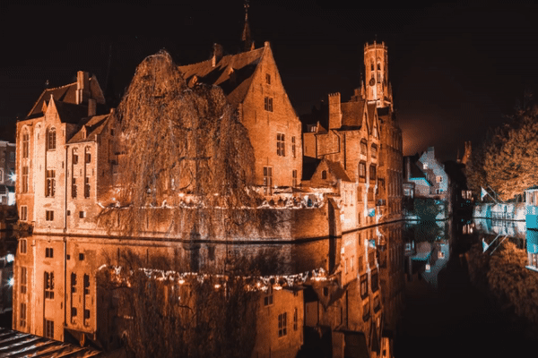
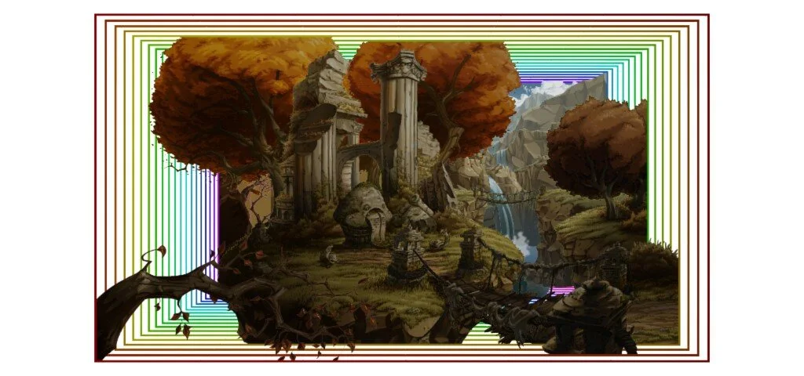
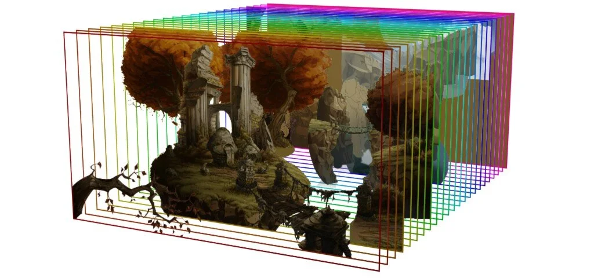
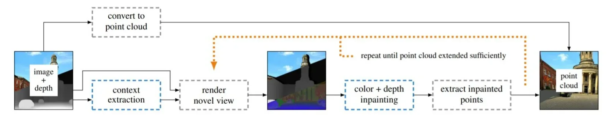

3D Ken Burns Effect via een A.I. model - Metro Stockholm

### From 2D to 3D with AI!

We all know a photo. Snapshots in 2D. With our smartphones you take them daily and you can edit them with all kinds of apps and filters. But did you know that you can (try to) go from 2D to 3D through artificial intelligence and neural networks? This technique in which such a model calculates (or approximates) missing depth information and applies a parallax effect to your image is called the 3D Ken Burns Effect. The results of the A.I. are better than many alternatives and sometimes really trippy!

We view and use this model in the educational project **AI & ART - The Hidden Dimension in Your Photo.**

[Video on YouTube](https://www.youtube.com/watch?v=pW03mgTn-ok)

### The illusion of perspective (Ken Burns)

3D Ken Burns Effect via een A.I. model, modus Turbozoom! - Brugge

The Ken Burns Effect takes its name from the American documentary filmmaker Ken Burns. It is a technique for processing photos in a video project. To soften the difference between a moving image and a still image, he made extensive use of zooms and panning in the photographic images.

-   **Zoom**: zooming in and out

-   **Panning**: slowly vertical or horizontal movement of the camera

This technique is mainly used in documentaries or when no video material is available, but photo material is available. Like a documentary about life in the trenches of World War I.

This effect can be achieved in four ways:

-   By using video editing software (such as NLE’s)

-   Using extensive video animation

-   Using specialized camera equipement like Lytro camera’s (discontinued)

-   **Or using an AI-model!**

3D Ken Burns Effect via een A.I. model - De Reep, Gent

### The AI recipe: point clouds and neural networks

In this project we are not working with high-tech Lytro cameras that capture up to 40 megarays. We work with one regular image, where this depth information is missing, and an A.I. to calculate / approximate this missing information.

Our AI will analyze and segment (divide) the photo. A point cloud will be generated and two separate neural networks will ensure the correct interpretation of trigonometric information ... So this project uses not one, but two neural networks. Everyone will use it to counteract common errors in this type of application.

The entire pipeline for this A.I. can be found below. The research from which this method comes can be found here [(source).](https://arxiv.org/abs/1909.05483)

### Contact

Questions or in need of more information? Head over to the contact page!

<a class="content-button content-button--primary content-button--medium" href="/contactinfo">Contact</a>

