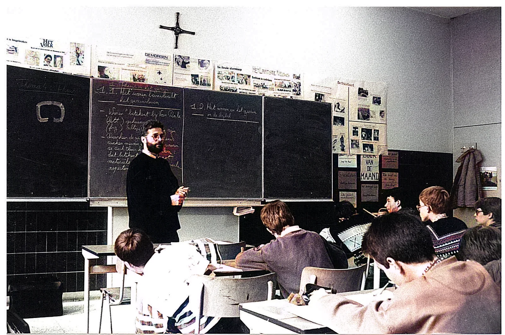
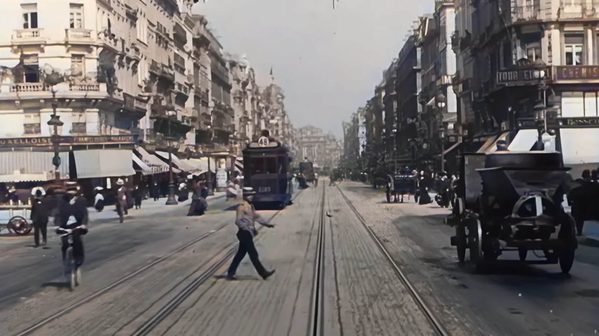
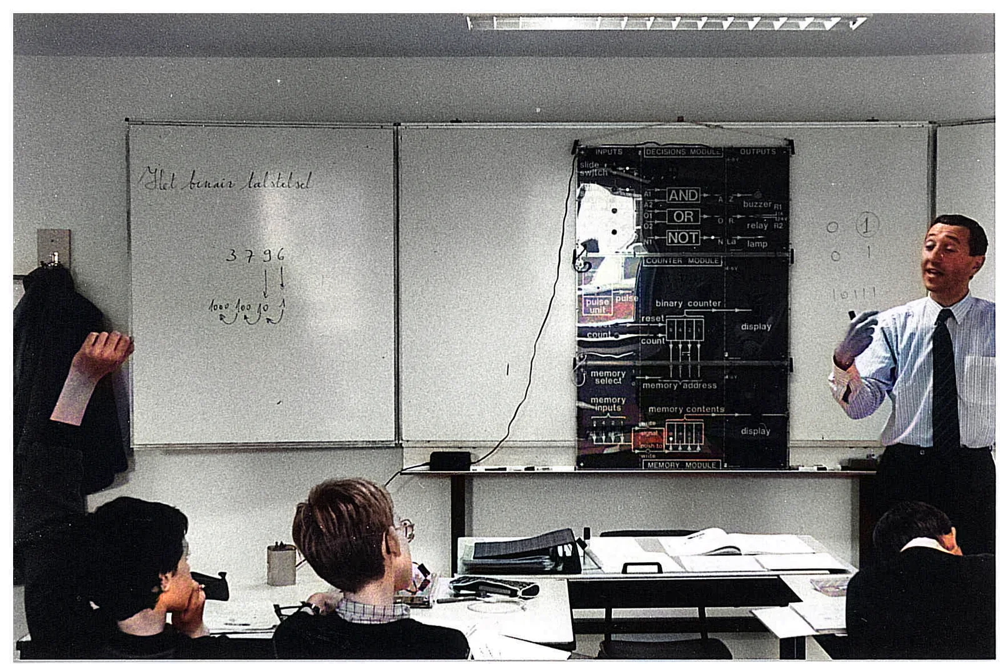
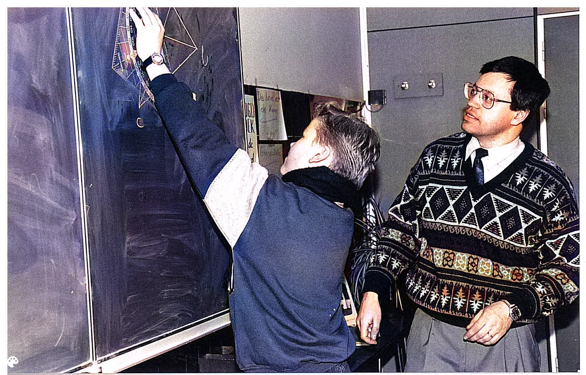
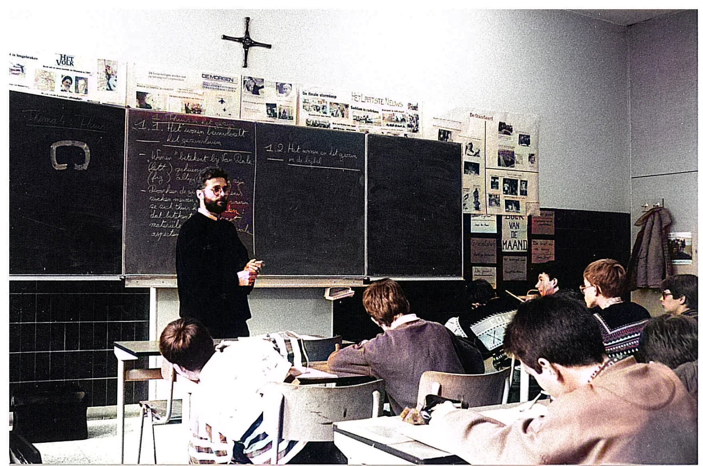
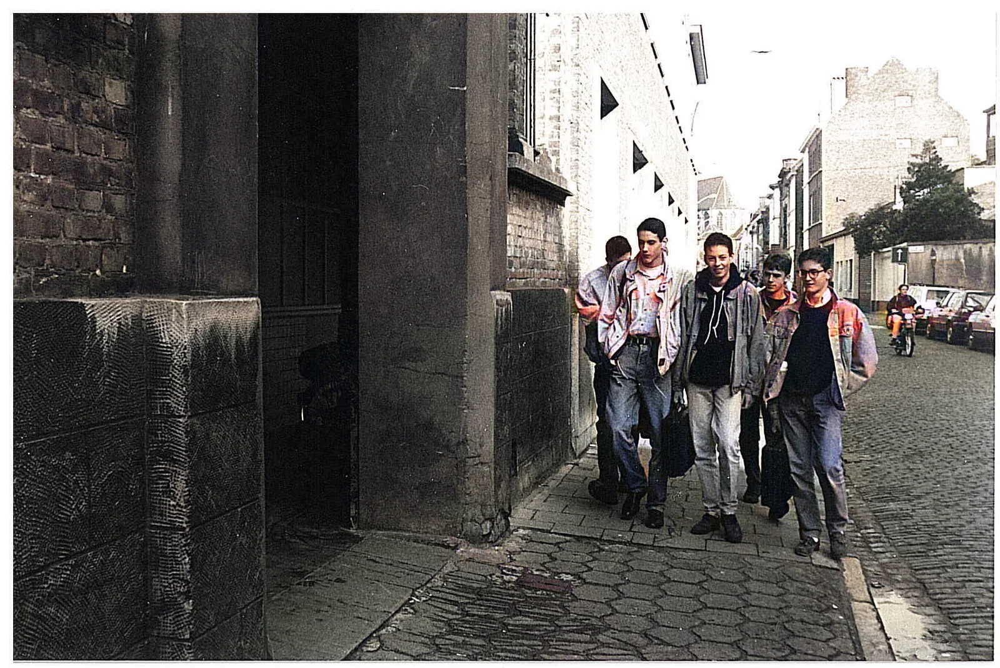
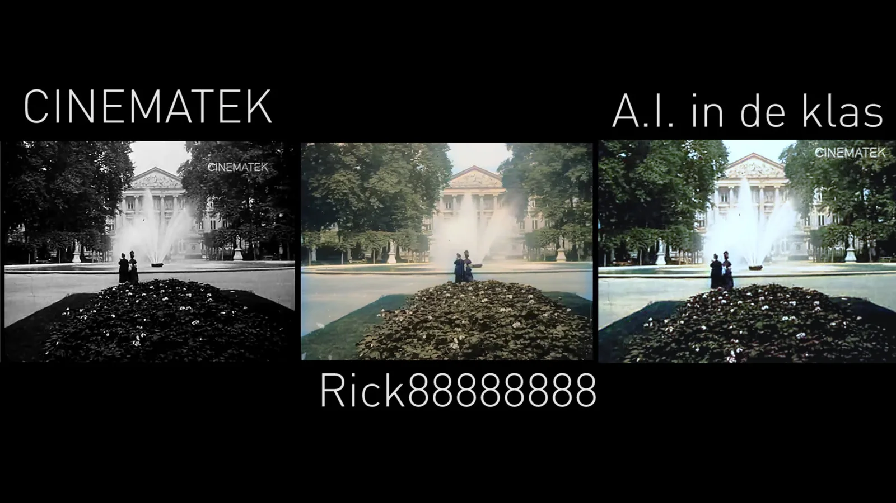
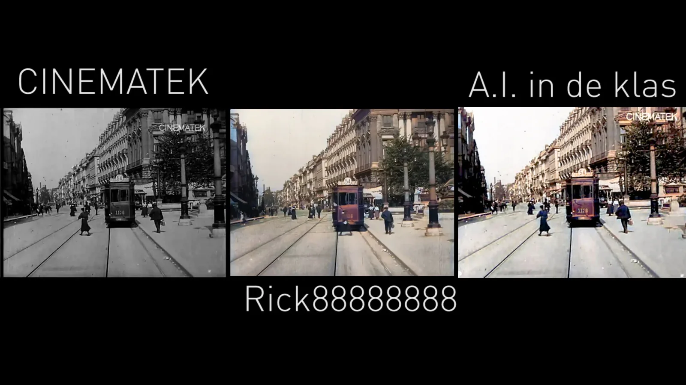
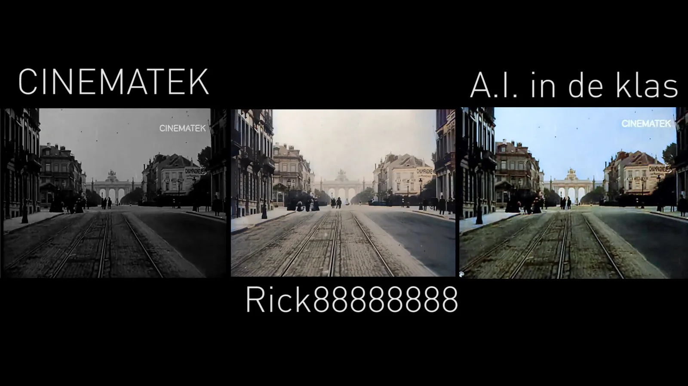
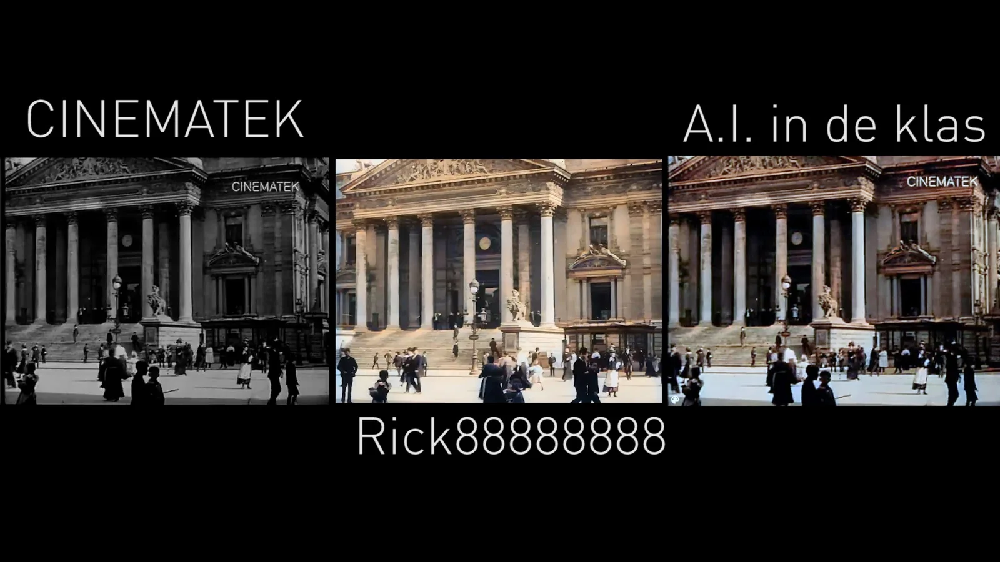

On Monday 24/05/2021 an [article appeared on the website of the VRT](https://www.vrt.be/vrtnws/nl/2021/05/24/zo-zag-brussel-er-in-1908-uit/) about archive images of Brussels, from 1908(!), which were colored by YouTuber Rick88888888. For example, Rick88888888 shows the old street scene of Brussels with its carts, trams, men in tight suits ... in colour!

Besides being very impressive, it is an ideal case for my lessons on 'Artificial Intelligence in education', more specifically the project **'AI & ART - History is not Black and White'** where students use old archive images of their school using Python. (Sint-Lievenscollege Ghent) coloring!

[Volledige grootte weergeven ](https://images.squarespace-cdn.com/content/v1/6026af223ff1970db5c08fb8/1621885911428-EAZW93P4THCHI7DL0AFK/IW_Ingekleurd_1.png)

[Volledige grootte weergeven ](https://images.squarespace-cdn.com/content/v1/6026af223ff1970db5c08fb8/1621885912526-JH1BWLAEWCMSU6ZPHMV3/Jan_Meire_Ingekleurd.png)

[Volledige grootte weergeven ](https://images.squarespace-cdn.com/content/v1/6026af223ff1970db5c08fb8/1621885921179-49PDXEJHNJYI5118H9PL/Klas_2_Ingekleurd.png)

[Volledige grootte weergeven ](https://images.squarespace-cdn.com/content/v1/6026af223ff1970db5c08fb8/1621885922036-TQGAC2WTY2YVIT2NR8WK/Schoolpoort_Ingekleurd.png)

Now, time for a 'human versus machine' competition! In the video below I release the AI that my students and I use in the classroom on the footage from [Cinematek](https://youtu.be/zxYqNgQNXvU). You can compare the original images yourself with the creation of Rick88888888 and our used A.I. fashion model!

[Video on YouTube](https://www.youtube.com/watch?v=tFlMOoxsBKQ)

[Video on YouTube](https://www.youtube.com/watch?v=pprpljPFX0E)

### Contact

Questions or in need for more info? Head over to the contact page!

<a class="content-button content-button--primary content-button--medium" href="/contactinfo">Contact</a>

