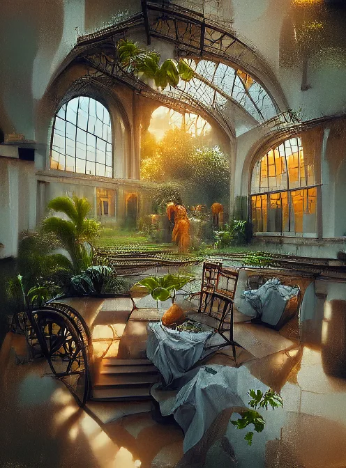

### You may already have heard of artificial intelligence. Smart computers that make cars drive by themselves, smart rubbish bins that can sort all by themselves, facial recognition by cameras ... These smart computers imitate humans and we are quick to call them 'intelligent'. But isn't creativity also a part of intelligence? Can an AI model be creative? Can a computer make art and start an AI art gallery in the classroom?  That is all possible in DALL-E's workshop!

[Video on YouTube](https://www.youtube.com/watch?v=jAN6UCqDeyw)

### Can an AI be creative?

Artificial intelligence is a promising technology. These are autonomous and adaptive systems that, by using algorithms, succeed in imitating human behaviour. For example, they recognise us through cameras or sounds through a microphone. They are trained on large data sets to improve their performance in a specific task.

But when we don't want face recognition or self-driving cars, but we do want a robot that makes its own art, we need to tap from a different barrel. For this project, we are using an AI model that needs as little input from the user as possible and has a lot of creative freedom. A model that can actually start working after one written command, one description of a situation or landscape. That's it.

### Zero training, maximum weirdness

A lesson is short, the students are burning with enthusiasm and are impatient. We have no room to train the AI model for hours. So we don't do it! We call this a 'zero shot approach'. Compare it to a student who comes to an oral exam without any preparation. That doesn't sound very promising, but the results are very different. That is also a plus!

### Pictionary with robots!

So how does the AI model work? It follows the principles of a generative adversial network. Two networks that compete or argue with each other. This technology especially makes chunks, literally and figuratively, in the world of deepfakes. In our situation, we use two systems that play Pictionary with each other. On one side we have CLIP, which can understand words in a text and match them with images. On the other hand, VQGAN which can generate images but does not understand language. We tell our command to CLIP, which then has to work with VQGAN to produce a result. Not just one result, but again and again and again. Hundreds or thousands of iterations in a few minutes to achieve a nice end result.

### The results

It is quite an alienating experience when you see the first images rolling out of the computer. Strange shapes, recognition, wonder... They are not all rough diamonds, but they do show us a new form of creativity. A creativity of AI systems.

[Video on YouTube](https://www.youtube.com/watch?v=-SOJ4NOMkYU)

### Questions or comments?

Questions or comments about this project or any of my other projects? Then please feel free to ask them below!

<a class="content-button content-button--primary content-button--medium" href="/contactinfo">Contact</a>

