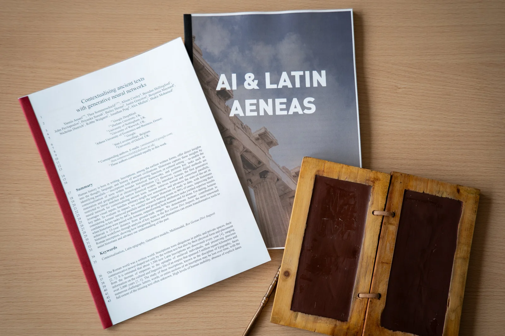
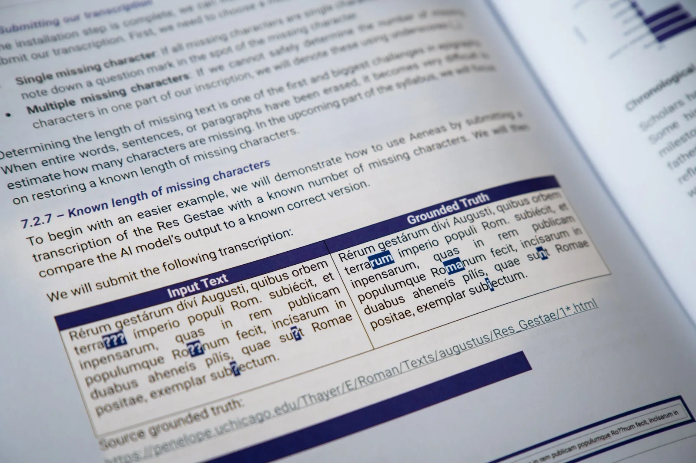
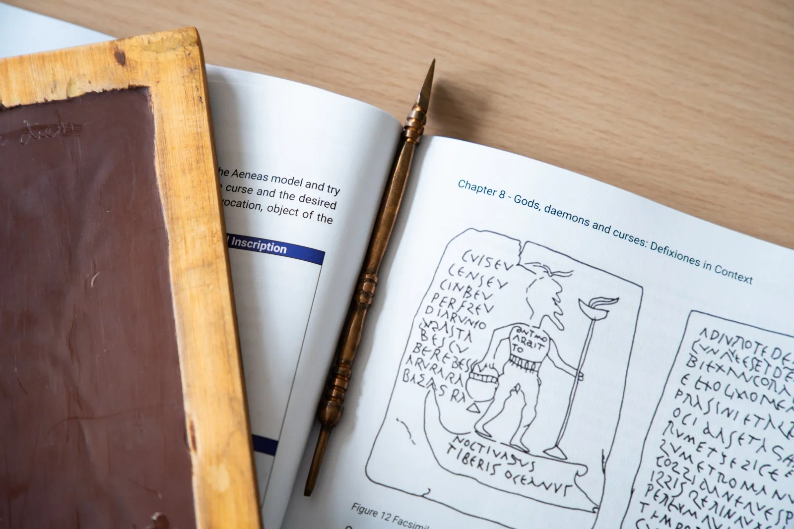

### The recent Digimeter survey by imec already showed it: generative AI, and specifically language models, are the fastest growing and most widely used technology in Flanders today. We use it at work, but AI is also becoming indispensable in the classroom. In an increasingly fast-changing digital environment, the question is not whether AI will change (history) education, but how it will do so and how we can help historians and teachers navigate this new landscape. Meet Aeneas! Aeneas is an AI model that assists historians and classicists in contextualizing and restoring Latin inscriptions. Along with this AI model, we are releasing our research results in the [scientific journal _Nature_](https://www.nature.com/articles/s41586-025-09292-5), providing a bilingual syllabus, and organising training sessions that bridge classical languages and AI literacy. Cutting-edge research and AI directly in your classroom!

_The full research paper can be read on the Nature platform_ [_using this link._](https://www.nature.com/articles/s41586-025-09292-5)

### Previous Work - Ithaca and Pythia

_Discussing Ithaca at a teacher summit in Leuven, Belgium. (2024)_

Building on the success of the ancient Greek language models Pythia and Ithaca ([Nature Publication](https://www.nature.com/articles/s41586-022-04448-z), [AI for Education Award](/education/ai-for-education-awards), [Teaching History Publication](/education/ithaca-teaching-history-journal)), we created educational resources and teacher-training courses demonstrating the power of human-AI collaboration. Our goal was clear: show students that AI isn't restricted to STEM fields and won't replace human expertise. Instead, digital humanities thrive when historians and linguists critically evaluate AI-generated restorations, analysing, translating, and interpreting ancient Greek inscriptions.

During my teacher-training sessions to familiarise ancient Greek educators with AI and our Ithaca model, notably at the Centre for Further Training in Education at the University of Antwerp (CNO, Universiteit Antwerpen), educators repeatedly posed an essential question: **"_What about Latin?_"**

In Flanders, students aged 13 to 18 commonly study Latin rather than ancient Greek. Ithaca, trained exclusively on ancient Greek inscriptions from the Packard Humanities Institute database, could not directly support Latin texts. To extend our approach, we needed a new dataset and a revised neural architecture specifically for Latin.  

Enter Aeneas. We trained this new AI model on the extensive Latin Epigraphic Database (LED). LED contains 176,861 inscriptions spanning from the 7th century BCE to the 8th century CE, covering territories across the Roman Empire, from Britannia to Mesopotamia. Altogether, this dataset comprises roughly 16 million characters. Aeneas mirrors Ithaca's core functions: character restoration, historical dating, and geographical attribution. Moreover, it adds innovative capabilities, such as handling inscriptions with unknown missing text lengths and providing parallel texts, further enhancing historians' contextual understanding.

  

To thoroughly evaluate Aeneas, we conducted one of the largest comparative studies to date, involving 23 historians. We challenged our AI with one of Rome's most iconic inscriptions, Emperor Augustus' _Res Gestae Divi Augusti_, and had an expert verify the results.

The outcomes exceeded our expectations. Historians alone had a character error rate of 39.0% and achieved correct geographical attribution only 27.0% of the time, with dating errors averaging 31.3 years. Aeneas alone achieved a significantly lower error rate of 23.1%, correctly identified 66.7% of locations, and reduced dating errors. When humans and Aeneas collaborated, character errors dropped even further to 21.4%, spatial accuracy improved to 68.3%, and dating accuracy sharpened dramatically, averaging just 14.1 years from historical reality.

These results show a consistent theme: trained historians who skilfully integrate AI achieve the best outcomes when interpreting damaged inscriptions. But how do we train future historians for this new digital frontier?

### AI in Education

Training the next generation of historians moves our work from pure research into classrooms, directly engaging contemporary discussions on AI literacy. As previously highlighted, generative neural networks and language models represent one of the fastest-spreading technologies in society today. Traditionally and etymologically (σχολή meaning ‘free time’) viewed as slightly separate from societal trends, schools are now deeply embedded in this technological shift.

In 2023, nearly half (49%) of Flemish middle and high school students reported using AI in their schoolwork. By 2024, imec found this figure rose dramatically, with 72% of Flemish college and university students incorporating generative AI into their studies. However, widespread adoption doesn't automatically ensure correct or effective usage. According to a study by academic publisher Acco, 75% of Flemish students reported using generative AI primarily as a replacement for traditional search engines. This particular behaviour illustrates a misunderstanding of generative AI’s proper role and potential.

This misconception parallels the pedagogical myth of the 'digital native', which assumes children naturally acquire superior digital skills due to early exposure to technology. In reality, mere familiarity with devices like computers or smartphones does not inherently foster computational thinking or proficient use of advanced digital tools. Similarly, high adoption of generative AI doesn't automatically translate into its effective application in educational contexts or specific disciplines. True proficiency demands knowledge, skills, and targeted training.

To address this challenge, I have developed a introductory syllabus with comprehensive teaching materials based on our Ithaca and Aeneas research. This initial developed syllabus introduces teachers to the broader field of epigraphy, clearly explains the structure and function of our AI model, presents key research findings, and guides practical classroom applications. Teachers learn to apply Aeneas to historically significant inscriptions such as the Res Gestae Divi Augusti, as well as more personal or secretive texts like love spells and curse tablets.

The 150-page resource equips educators with thorough background information, practical exercises, answer keys, and clearly outlined learning objectives; aiding teachers that they can confidently teach historical and linguistic inquiry assisted by AI technology.

### **Impact and AI alignment**

Our work on Aeneas demonstrates an alternative approach on how historians handle Latin inscriptions, enhancing their accuracy, efficiency, and confidence. The integration of AI into historical scholarship means historians can now tackle more complex challenges, reconstructing inscriptions faster and with greater precision. Results from our comparative studies confirm that the best outcomes occur when human expertise is combined with the capabilities of Aeneas, affirming AI’s role as an essential partner rather than a replacement.

In education, our comprehensive syllabus and teacher-training courses actively address competencies outlined in education frameworks on AI literacy, such as the UNESCO AI Literacy Framework, the EU’s DigComp 2.2 and the AI Literacy Framework by the European Commission and the OECD. By doing so, we equip educators and students with important AI literacy skills, fostering an understanding of how to responsibly interact with generative neural networks. Students learn not only to assess AI outputs critically but also to document AI-assisted restorations transparently, explicitly using standardised methodologies such as the Leiden Conventions.

Moreover, our alignment with aforementioned international educational frameworks emphasises a human-centred approach to AI. We actively address issues inherent in AI use, such as the "Black Box" phenomenon, by integrating tools like saliency maps and ranked hypotheses to improve transparency and support human decision-making. This fosters an understanding that, despite AI’s advanced capabilities, human oversight remains crucial.

    

To further support the integration of AI literacy in education, we are collaborating with the University of Antwerp - Centre for Teacher Training. For the academic year 2025-2026, the Centre will again offer training sessions on this teaching material and our research.

### And what about Greek?

Here we come full circle. A few years ago, we began our scientific journey with the AI models Pythia and Ithaca to restore and contextualize ancient Greek inscriptions. The research was published in _Nature_, and the accompanying teaching materials received two awards at the AI for Education Awards. With the development of Aeneas, we not only created an AI model that complements Ithaca’s features but also includes architectural improvements and offers even more functionality than its predecessors. When we train both Aeneas and Ithaca on our dataset of Latin inscriptions (LED), these architectural improvements become clearly visible. This naturally raises the question: what about Ithaca and our Greek inscriptions? Our roots?

Aeneas not only offers the ability to work with a Latin dataset but can also switch to Greek. With a simple button, users can switch to the Greek version (with its own checkpoint, dataset, and embeddings). From there, you can expect the same workflow and features as when working with Latin inscriptions. Aeneas provides geographical and chronological attributions, restores inscriptions with both known and unknown missing character lengths, offers saliency mappings, and can compute parallel Greek inscriptions.

      

The syllabus and teaching materials we created with Ithaca are also receiving an update. In the revised syllabus, we take a journey through various inscriptions. We don’t focus on curses but on muses, love, and some cheeky poetry. You can read more about this in our publication for the journal _Teaching History_.

### **Reflection and Outlook**

Our work on Aeneas, as with earlier projects like Pythia and Ithaca, demonstrates how generative neural networks, when used responsibly, significantly enhance the fields of history and classical studies. With each project, our aim has been clear: to provide tools, research, and educational resources that empower humans to integrate AI effectively into their academic and professional workflows.

Ultimately, we hope these efforts support historians in conducting more accurate and insightful research. For educators, our materials highlight that classical studies and computer science enrich each other rather than exist separately. For students, we aim to demystify AI's inner workings and highlight the indispensable role human knowledge, skill, and critical thinking play in effectively utilising generative neural networks; tools that increasingly shape our daily lives.

### References

-   Assael, Y.,\* Sommerschield, T.,\* Cooley, A., Shillingford, B., Pavlopoulos, J., Suresh, P., Herms, B., Grayston, J., Maynard, B., Dietrich N., Wulgaert, R., Prag, J., Mullen, A., Mohamed, S. (2025). “Contextualising ancient texts with generative neural networks”. In Nature **add issue, pages and OA link once release confirmed**

-   Assael, Y.,\* Sommerschield, T.,\* Shillingford, B., Bordbar, M., Pavlopoulos, J., Chatzipanagiotou, M., Androutsopoulos, I., Prag, J., de Freitas, N. (2022). “Restoring and attributing ancient texts with deep neural networks”. In Nature, 603(7900): 280–283. [https://www.nature.com/articles/s41586-022-04448-z](https://www.nature.com/articles/s41586-022-04448-z)

-   Booms, D. (2016). Latin Inscriptions (Getty Publications - British Museum Press).

-   Cooley, A. (2012). The Cambridge Manual of Latin Epigraphy (Cambridge University Press).

-   European Commission, European Education and Culture Executive Agency, (2023). AI report: by the European Digital Education Hub’s Squad on artificial intelligence in education, Publications Office of the European Union. [https://data.europa. eu/doi/10.2797/828281](https://data.europa.eu/doi/10.2797/828281)

-   Liddel, P. (2025). Greek Inscriptions (Getty Publications - British Museum Press).

-   Miao, F., & Shiohira, K. (2024). AI competency framework for students. UNESCO. [https://doi.org/10.54675/JKJB9835](https://doi.org/10.54675/JKJB9835)

-   Miao, F., & Cukurova, M. (2024). AI competency framework for teachers. UNESCO. [https://doi.org/10.54675/ZJTE2084](https://doi.org/10.54675/ZJTE2084)

-   OECD (2025). Empowering learners for the age of AI: An AI literacy framework for primary and secondary education (Review draft). OECD. Paris. [https://ailiteracyframework.org](https://ailiteracyframework.org/)

-   Urbanová, D. (2017). Latin curse texts: Mediterranean tradition and local diversity. Acta Antiqua Academiae Scientiarum Hungaricae, 57(1), 57–82. [https://doi.org/10.1556/068.2017.57.1.5](https://doi.org/10.1556/068.2017.57.1.5)

-   Wulgaert, R. (2023). "Ithaca AI meets ancient Greek: Muses and robots in the classroom". In Teaching History, 57(3), 16–20.

-   Wulgaert, R. (2023). AI & Greek – Ithaca syllabus. [https://www.robbewulgaert.be/education/ai-and-greek-epigraphy-with-a-robot](/education/ai-and-greek-epigraphy-with-a-robot)

-   Wulgaert, R. (2025). AI & Latin Aeneas - syllabus. [https://www.robbewulgaert.be/education/predicting-the-past-aeneas](/education/predicting-the-past-aeneas)

### Get in touch! 

This teaching material is a starting point, a work in progress, and needs to be tested by real professionals: Latin teachers and their classes. Would you like to contribute to this story? Please contact us below! 

<a class="content-button content-button--primary content-button--medium" href="/contactinfo">Contact Info</a>

<a class="content-button content-button--primary content-button--medium" href="https://raw.githubusercontent.com/RobbeW/aiindeklas/51addd68030611e73b88fe4f1cc437cdfdaefa59/aeneas/syllabus/ENG_Syllabus_Epigraphy%20_Aenaes.pdf" target="_blank" rel="noreferrer">Download the syllabus</a>

