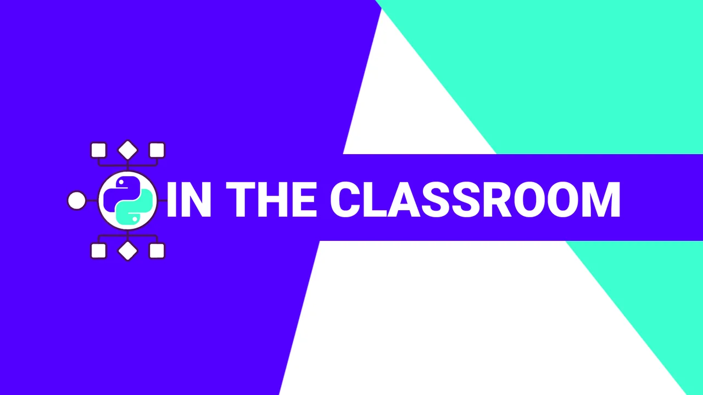
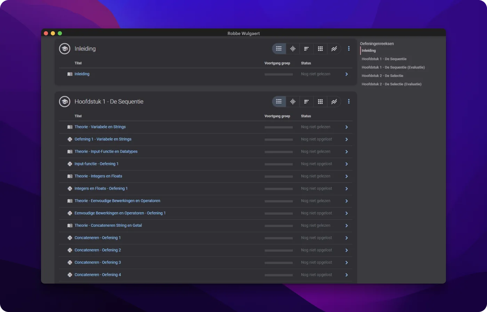
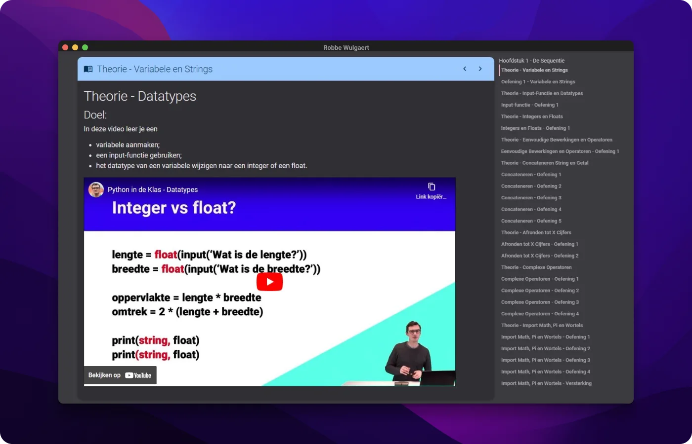
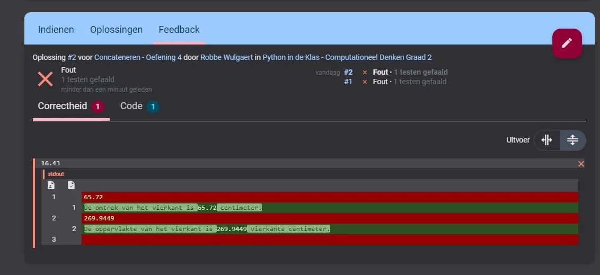
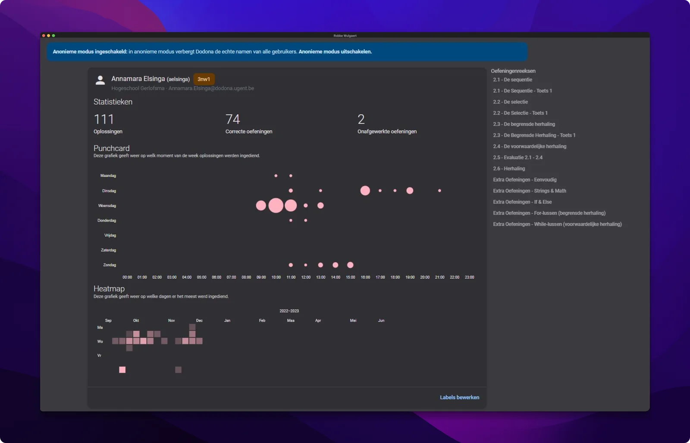
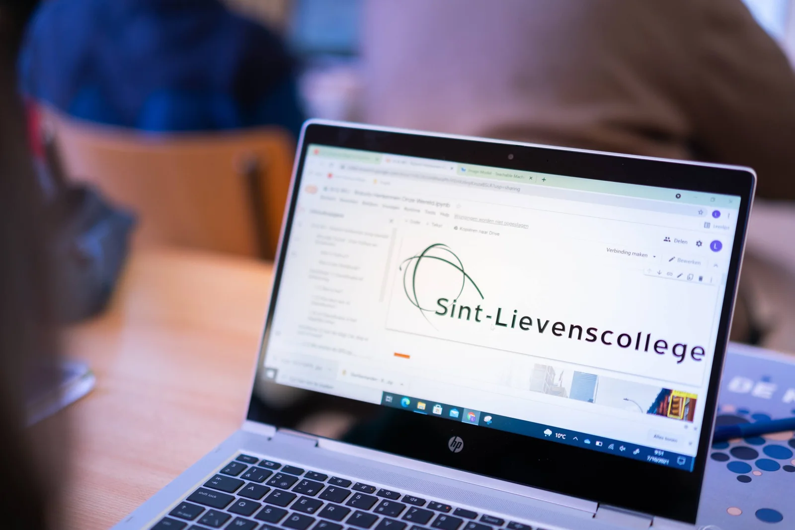

**Our society is increasingly influenced and controlled by computer systems, apps and algorithms. Countless problems, now and in the future, are solved through those powerful computers. We also feel this digitalisation at school and in the classroom. But if you want to help think about and work on this digital future, it is best to learn how to think computationally! Learn to design your own algorithms and translate them into programming languages such as Python! But how do you bring that into the classroom? I can help you with that! More than 80 exercises, auto-corrections, 20 elaborate teaching videos ... all summarised in one clear lesson series I published on the open source platform Dodona (Ghent University). Free to use via** [**www.pythonindeklas.be**](https://dodona.ugent.be/nl/courses/2641/)[**!**](https://dodona.ugent.be/nl/courses/2641/)

### Didn't this already exist?

Correct! Or roughly anyway, because I have been using this teaching material for two school years now. Throughout that period, I noticed which things were not running smoothly and where the product could be better. So it happened! This builds on that teaching material and the material I already made for my first grade classes. An overview of those materials and where you can find them on KlasCement:

-   [Python & Math - video lessons (replaced by these new materials!)](https://www.klascement.net/video/141449/computationeel-denken-met-python-lesvideo/?previous)

-   [Computational Thinking - Introduction](https://www.klascement.net/downloadbaar-lesmateriaal/158385/computationeel-denken-lessenreeks/?previous)

-   [Computational Thinking & JavaScript](https://www.klascement.net/downloadbaar-lesmateriaal/159321/computationeel-denken-javascript-lessenreeks/?previous)

### Why Python?

Python is a relatively user-friendly and well-documented programming language. It is a language that can be used in combination with various other teaching materials and content, such as a Micro:Bit, MakeCode Arcade from Microsoft, within mathematics, statistics ... but also for driving AI models! When you delve into other teaching materials on this education blog such as 'designing with AI models', 'restoration of Ancient Greek inscription', language analysis ... you will notice that these use, yes, Python! So this way, you choose a programming language that you can incorporate into vertical and horizontal learning lines. This means learning material that is constructive over several years (=vertical) and with possibilities within cross-curricular projects (=horizontal).

In addition, we use this teaching material in the Dodona environment of Ghent University. This choice prepares students for the jump to higher education, where this type of teaching material is also offered in this way.

### Any new features?

### Improved order of concepts

After two school years of working with my own teaching materials and materials from publishers, I noticed that the sequence of the teaching material was not always well put together. Certain programming and maths concepts were clearly explained, with exercises afterwards. Other concepts suddenly popped up and required you to solve the exercise. This made teaching with clearly defined instruction phase and exercise phase more rigid.

In the new version of this lesson series, we still divide the exercises across five primary programming concepts, namely:

-   sequence

-   selection

-   delimited repetition

-   conditional repetition

-   graphs

Within those primary programming concepts, the names of the exercises and teaching videos more clearly indicate when new maths and programming concepts are introduced. This increases clarity for both student and teacher.

### Integrated Videos

Within the course, you will find exercises and 'reading assignments'. The latter contain the integrated teaching videos. These are shorter in running time than the previous videos and focus specifically on one particular concept. Each video follows the same structure:

[Video on YouTube](https://www.youtube.com/embed/eF8Bm-KF0GE?feature=oembed)

-   Explanation of the concept

-   Sample exercises we dissect

-   Designing schemata

-   Converting schema into Python code

-   Creating an exercise on Dodona

The videos can also be found separately on YouTube and can be used by both teachers and students. For example to prepare a lesson, with students who need some differentiation in time (=read: get ahead), in a 'Flipped Classroom' approach, as remediation, when rehearsing ...

### Integrated Autocorrect

At the request of colleagues and students, the exercises now work with a form of auto-correction. This will, if the structure of the exercise allows, check the student's algorithm at two levels:

-   **Syntax: is the code correct according to Python's rules of play?**

-   **Content: is the input and output correct?**

The latter feature is completely new and can be found in the majority of the 80+ exercises in the lesson series. It allows us to provide learner feedback and the teacher can see more quickly via the dashboard whether a learner has entered a content-correct solution. Previously, a student could write an algorithm such as:

> print("I enter this nicely with every exercise. Hihi!")

This is syntax-wise completely correct. Here is a print-statement and it will write the string to the screen. But content-wise, of course, this makes no sense at all. So in the previous version of this lesson series, only one check was performed. Now Dodona will note that that one string does not fit our problem. Eureka!

### Evaluate, oversight and feedback

By working within Dodona, as opposed to, say, the Notebooks we use for stand-alone AI projects, you obtain some advantages as a teacher and student. These are:

**Teacher**

-   Dodona is an open-source learning environment designed by researchers at UGent;

-   It is free to use;

-   You can integrally copy an existing lesson series (such as this one) and use it in your own classes;

-   You can create your own lesson series based on the exercises of numerous other teachers;

-   The platform is accessible via the browser (so no installation required);

-   You can run the Python code via the browser, so there is no need to fiddle with 'save as' and 'run scripts'. This works to lower the threshold for students;

-   You get a handy overview of each student's progress, both in terms of exercises and days of the week the student works. This kind of learning material is only mastered (read: working on automation) through regular practice. Extremely useful for concrete feedback to the student and his/her parent(s);

-   There is the possibility of plagiarism control;

-   As a teacher, you can add written feedback per exercise.

**Student**

-   All exercises are in a single place;

-   You get feedback on syntax and content;

-   In between, the teacher can bring theory via reading assignments and videos;

-   You do not need to install anything;

-   You can log in via Smartschool, Microsoft 365 ...

### Lesson and curriculum objectives

**Lesson objectives**

-   Students can go through and apply the steps of computational thinking:

    decomposition, pattern recognition, abstracting, algorithm creation, debugging

-   Learners can apply general programming concepts. Concepts such as:

    -   different data types (string, integers, float)

    -   sequence

    -   selection

    -   bounded repetition

    -   conditional repetition

-   Students can apply specific (in-depth) programming concepts. Concepts such as:

    -   rounding to X decimal places

    -   importing libraries

    -   taking the square root of Y

    -   creating conditions with various operators (<, >, >=, <=, ==, !=, and, or)

    -   constructing graphs

    -   manipulate lists

    -   manipulating strings

-   Students can apply mathematics concepts. Concepts such as:

    -   simple operations

    -   operations with percentages

    -   raising to a power

    -   formulas of perimeter and area

    -   application of the Pythagorean theorem

    -   Collatz conjecture

### Curricula

This lesson series was developed in view of the curriculum objectives and tables of Catholic Education Flanders. Given the modernisations (plural, repeatedly) and the late revision of the curricula, you will find below the objectives as formulated in, among others, Mathematics C 2nd grade D-finality II-WisS-d. and Common Curriculum ICT 2nd grade D-, D/A- and A-finality II-GLI-ddaa, to which the mathematics curriculum explicitly refers (building blocks of digital systems. So this piece of teaching material is subject to change.

**LPD 60 Students design algorithms to solve problems digitally.**

-   Concepts of computational thinking: decomposition, pattern recognition, abstraction, algorithm

-   Control structures: sequence, repetition structure, choice structure

-   Elements of programming languages: variables, data types, simple data structures, operators, parameters, conditions, procedures or functions, built-in functions

-   Debugging

-   According to the syllabus, you should provide 10 teaching periods for this. From experience, I reserve 12 teaching periods for this, especially for in-depth components, time for formative and summative evaluations.

**Learning outcomes**

**Students design algorithms to solve problems digitally.**

**Conceptual knowledge**

-   Concepts of computational thinking: decomposition, pattern recognition, abstraction, algorithm

-   Organisation, modelling, simulation and digital representation of information

-   Debugging: testing and adjustment

-   Principles of programming: sequence, repetition structure, choice structure

-   Embedded functions

-   Elements of programming languages: variables, data types, operators, parameters, conditions, procedures or functions

**Procedural knowledge**

-   Application of principles of computational thinking: decomposition, pattern recognition, abstraction, algorithm

-   Application of principles of organisation, modelling, simulation and digital representation of information

-   Application of principles of debugging

-   Application of principles of programming: sequence, repetition structure, choice structure

-   Application of control structures and simple data structures when formulating algorithms

### **I want this in my classroom! What should I do?**

**Want to get started with this yourself in your classroom? Super! Introducing young people to computational thinking, programming and maths concepts is important in an increasingly digital society. That definitely includes exploring-and delving into-Python. Feel free to help you with that! You can find the exercises via the button below or at www.pythonindeklas.be!**

<a class="content-button content-button--primary content-button--medium" href="https://dodona.ugent.be/nl/courses/2641/">Dodona course!</a>

<a class="content-button content-button--primary content-button--medium" href="https://youtube.com/playlist?list=PL7qul8TV_7p5mZ_LFp_KHUVn1WglOU-is">YouTube Playlist</a>

<a class="content-button content-button--primary content-button--medium" href="/contactinfo">I have a question</a>

