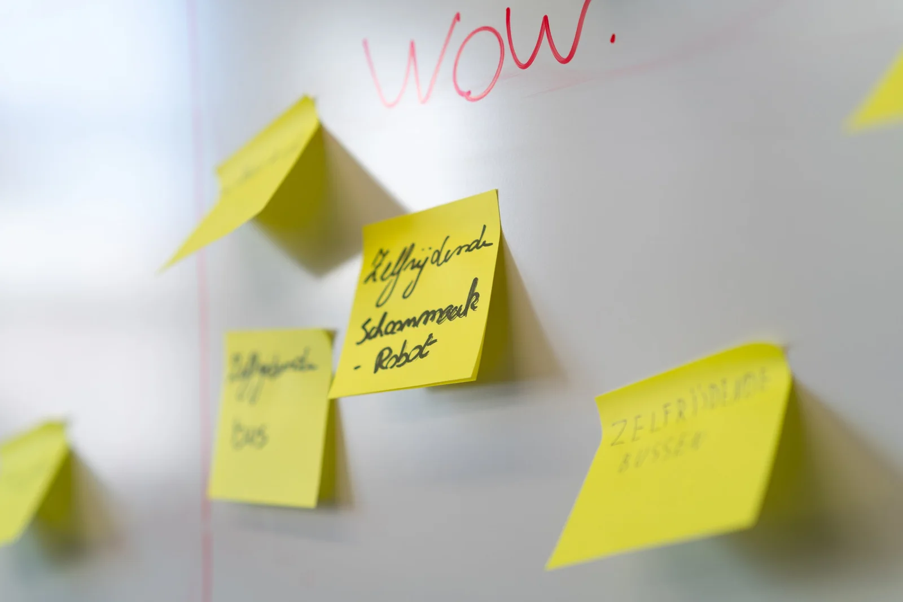
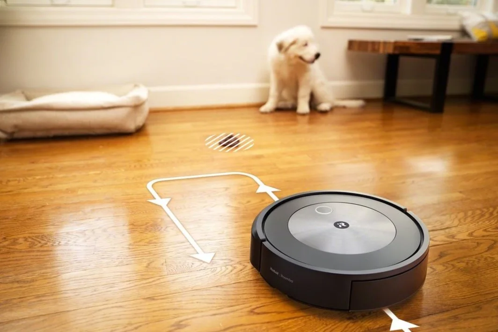
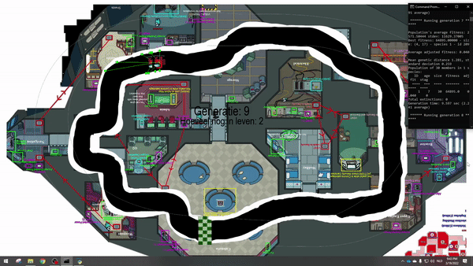
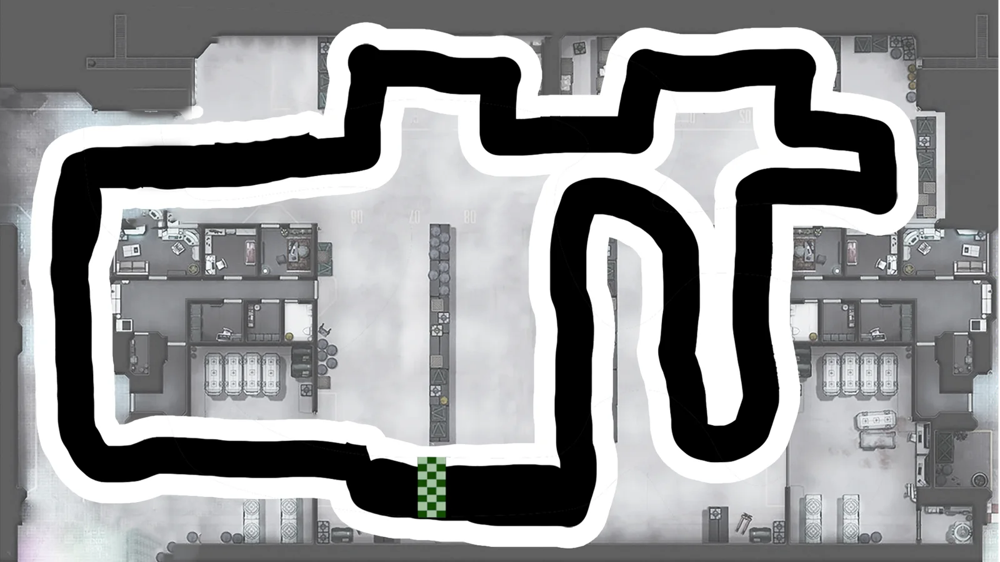
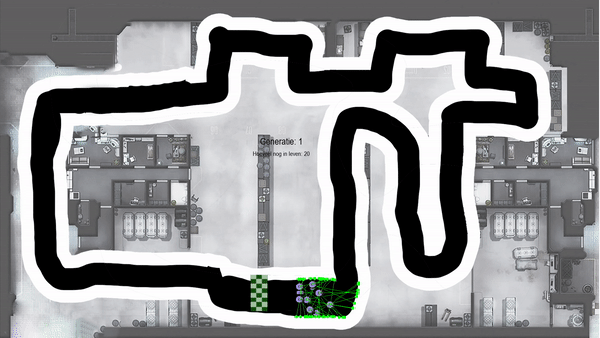
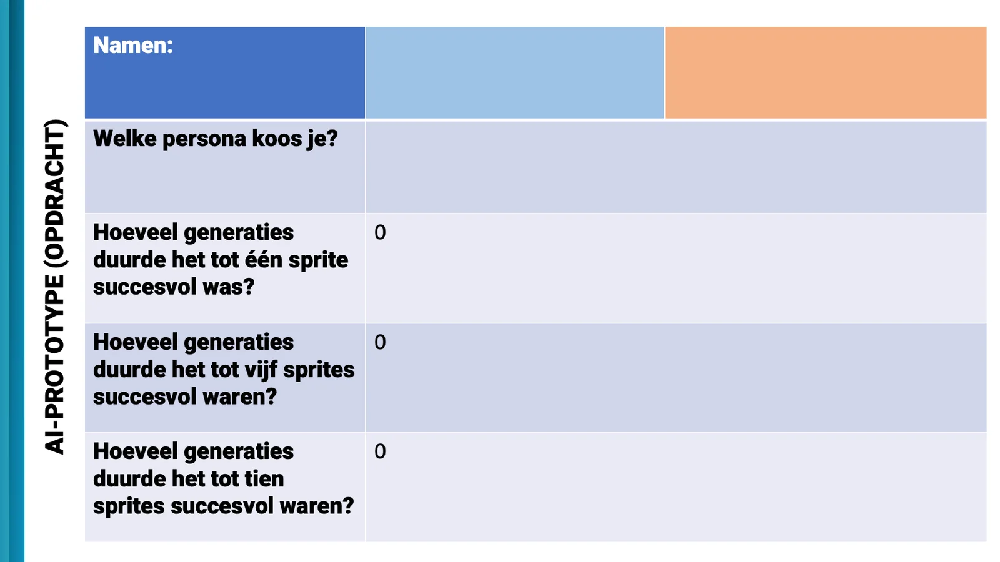

[Video on YouTube](https://www.youtube.com/watch?v=nnxSBOJ-JlQ)

### Self-driving vehicles capture our imagination. We see the technology popping up in different forms like cars and buses, but also in lawnmowers, hoovers and on the work floor. The ease of working behind the wheel, fewer accidents, less pollution... The potential benefits are countless and exactly the reason why manufacturers and governments are so keen on it. When we look under the bonnet of AI technology, these benefits are not so easy to achieve. In this teaching project, I will explain how artificial intelligence technology works, how it can improve our lives and how you can bring it into your classroom!

### From context to practice with Design Thinking

Pupils have probably already heard about self-driving cars. They then spontaneously think of well-known brands such as Tesla, or of a recent visit to the Maria Middelares hospital. The technology can be used in many different ways, also in situations outside the students' comfort zone. During the lesson, the students get to know three users. Bus driver Lara, Walter, owner of trucks and a manager in a department store, Samir. The pupils analyse the users and go through the Design Thinking process. All three have problems and goals. Pupils look for solutions to improve the life of their chosen persona.

They use their knowledge, skills and teaching materials from the subject Design Thinking. They get to work with a 'needs sheet' and a COCD box. The latter we use individually and in class to organise our ideas and solutions. The end result is a board full of post-its with possible solutions. In order to prevent this discovering step from taking up too much teaching time, we carry out this context phase in a design sprint. Teaching effectiveness is important, so each assignment is given a clear time limit!

### Let’s go: from LEGO to machine learning!

Running a small car is done in more classes. For that you have some packages to choose from. You can work with an Arduino Uno, or with LEGO Mindstorms. The latter is best known in education. Pupils can programme the central brick to move forward by a certain number of seconds, to turn when the sensor approaches a wall, to slow down when it detects a colour, etc. This is called programming within an expert system. As a programmer, you know how the trolley should drive and convert this, step by step, into an algorithm that the computer can understand. So you are doing computational thinking! This is also the way cheaper robot hoovers or robot lawn mowers work. These are programmed according to an expert system where they drive forward until they detect a wall or obstacle. Then they turn 90 degrees and repeat their mission. After a while, your living room is net again! Is something going wrong? Then the expert system offers transparency, because you yourself prepared the algorithm for the robot. That is an important advantage.

### Machine learning with Charles Darwin

An expert system also has an important disadvantage. Whereas transparency used to be an advantage, algorithms from such an **expert system** are difficult to generalise and you often have to rewrite your algorithm yourself if the environment changes. Does your robot bus suddenly need to change parking spaces or does your hoover need to change rooms? That will cause problems! This rewriting of the algorithm costs time and effort. If only the computer could do that itself!

Of course it can! With **machine learning** (artificial intelligence), the computer writes its own algorithm. To do this, it will run the course. Again and again and again. As it is not so safe to do this on public roads, we use a computer simulation. In this computer simulation, we use Python and the processing power of our computer to let twenty cars explore the track at the same time. Such a simulation is safe, always accessible and scales better!

In this simulation we apply the learning strategy "reinforcement learning". Here we are going to reward the AI model for desired behaviour and punish undesired behaviour. In this case, good behaviour is successfully following the course, without accidents. Undesirable behaviour? Experiencing a crash or collision. After 40 seconds, we look at which of our 20 cars has covered the most distance in the simulation. We use the best two to launch a new generation of AI cars. The rest? Survival of the fittest, with the best adapted AI model surviving. **Artificial evolution theory!**

Did I use AI and machine learning to make Among Us avatars race through their spaceship? … Maybe.

### From theory to practice!

Now that you know how reinforcement learning works, it is time to prepare our simulation. We use the computing power of your own computer. You only need a handful of things, namely Python, Notepad: and the command vester (Command Prompt or Terminal). We prepare our Python code. In that Python code we find two important things:

-   A map: the map, floor plan or track on which our figures will ride.

-   A sprite: a visual representation of our vehicle.

We can adapt the map and the sprite ourselves by changing the file name in the Python code. For example, I can easily find a sprite of a small Roomba and set it in my simulation.

A route in an fictional warehouse.

For the map or course we need a little more preparation. The AI model will follow these rules:

-   Black: he may drive on this part;

-   White: he will see this part as walls;

-   There will also be a start-finish place on the map.

If you want to draw your own track, you can start by using Paint, for example. You draw your course with a thick black brush and place the start and finish. That's it! If you use a different background, you will have to go through the following steps:

1.  Draw a white frame along the edges of your image;

2.  Draw the course to follow with a thick white brush;

3.  Then retrace the route with a thinner black brush.

If we want to start our simulation, we use Python code and the Terminal or Command Prompt. There we type python start.py and our computer starts the training in the simulation. In the middle of the screen you can follow how many generations have already been deployed.

### Benchmark time!

Once you have mastered the basics, can switch between courses and sprites, it's time for the real thing: the lab! Students develop a sprite and a course that fits our user/customer. They run the simulation and write down the results. How long does it take for one AI model to successfully complete the course? How many generations of AI models do we have to wear out before more than half of them succeed in their task?

### I want this in my class! What do I have to do?

Do you want to work with this in your classroom? Super! The future will be increasingly digital. A future in which artificial intelligence will play a very important role. It goes without saying that we need to prepare and motivate young people. I am happy to help you with that! You can send me a message via the button below. I usually reply within 48 hours!

<a class="content-button content-button--primary content-button--medium" href="/contactinfo">Contact!</a>

