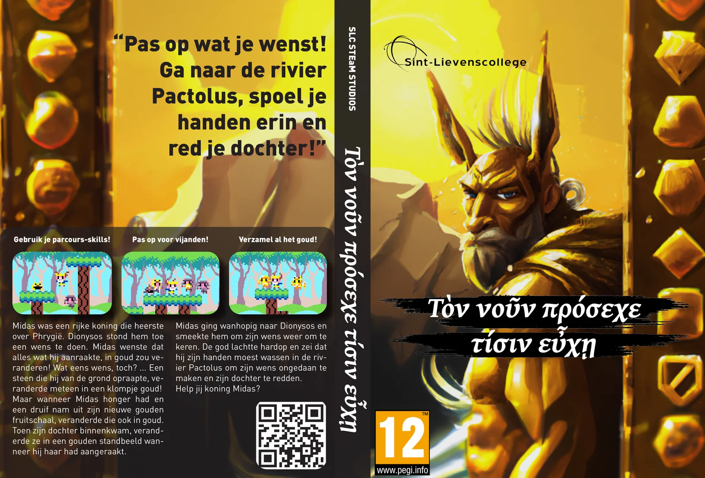
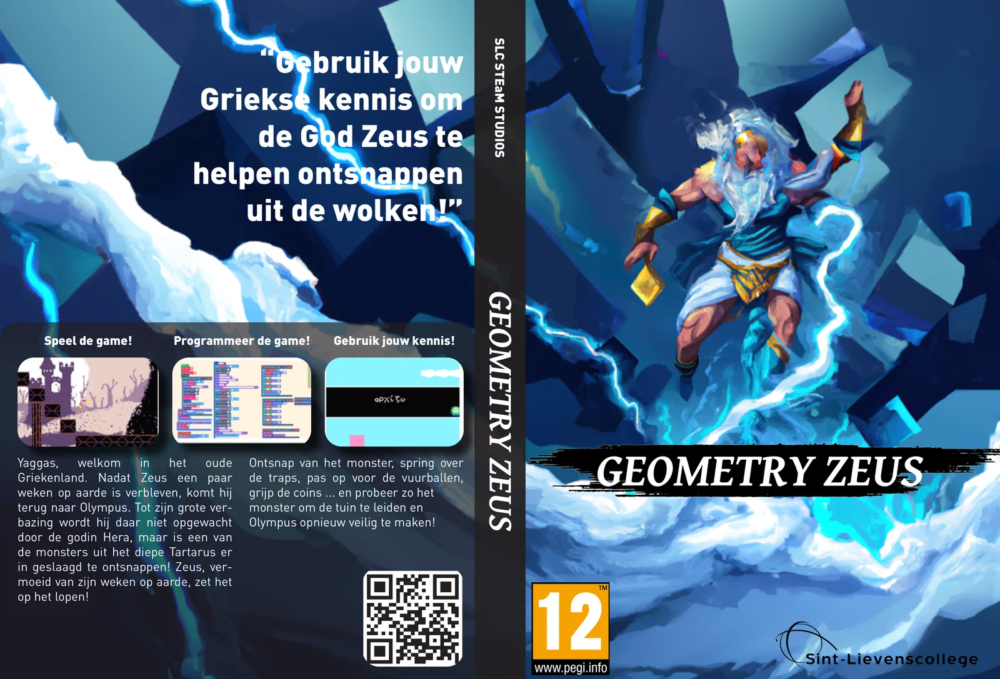
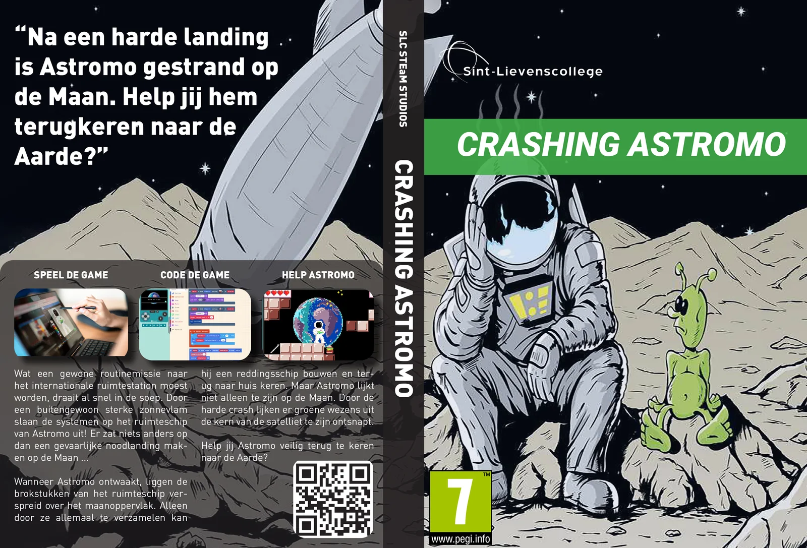
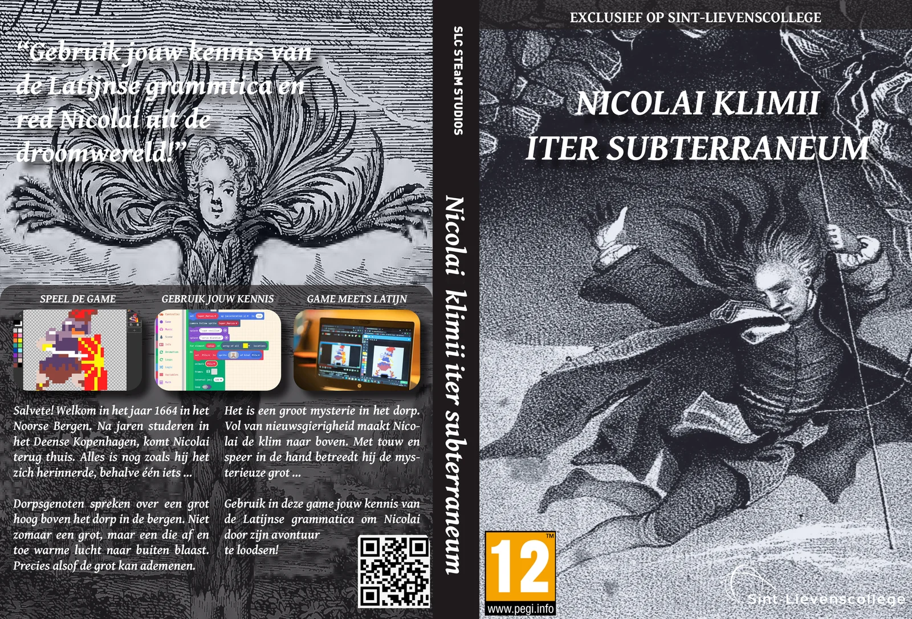
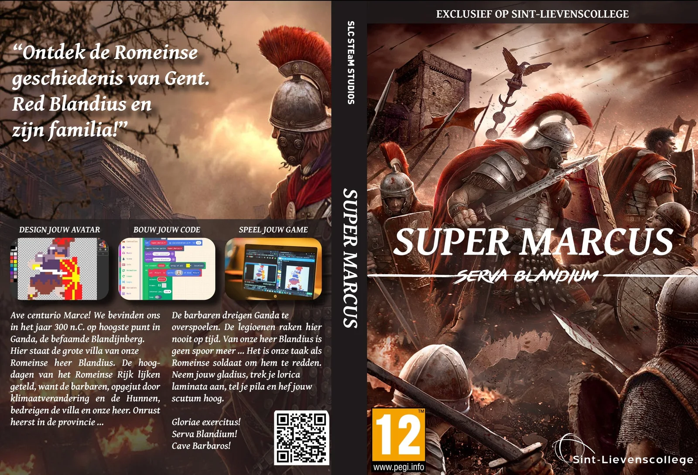
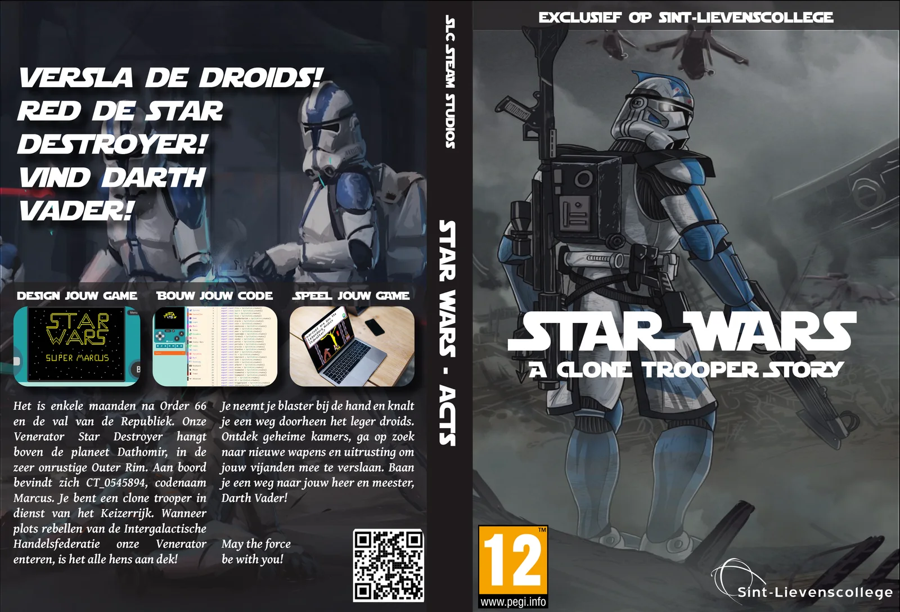
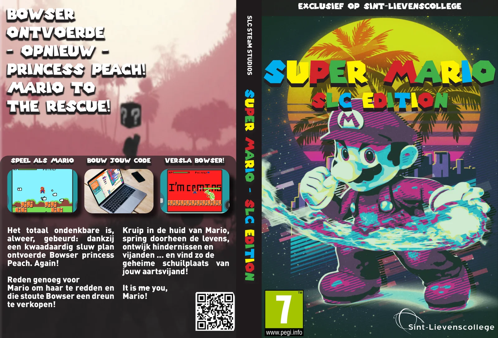
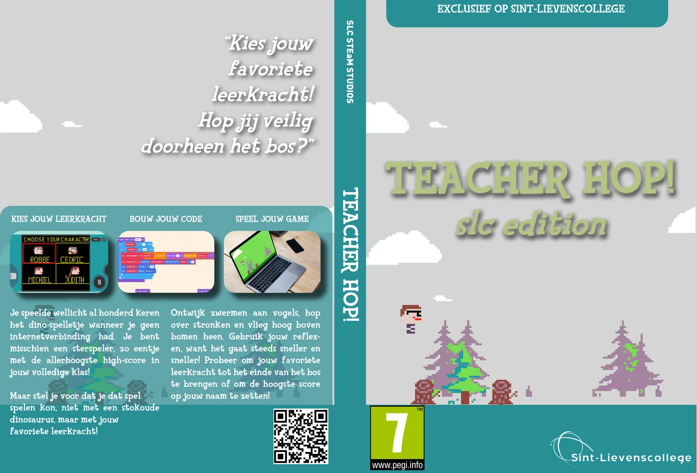
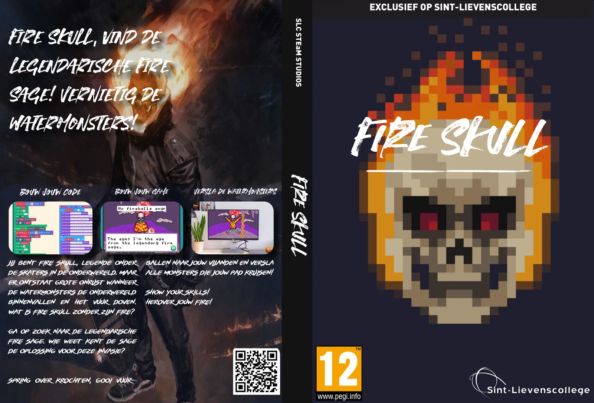

It may surprise you, but film or music are not the biggest sectors in the media landscape. That appears to be games! From computer games to mobile games, consoles and streamers ... It is a huge market. Many young people also play games, on average even 11 hours a week! But what if you could design your own game? From sprites to game rules completely developed by yourself? Combine this with programming concepts or your knowledge of Latin and Greek?

Well, you can! Every year, my students get the chance to challenge themselves and empathise through an introduction to game design. The best designs are rewarded with a place in the 'Wall of Game'. This is not one physical wall, but posters and DVD boxes of their game can be found at various locations on the campus. By using a simple QR code, fellow students can test their game, play it and try to set the high score!

Below is the current selection of games in the 'Wall of Game 2022-2023'. These are the covers designed for the DVD boxes to promote the students' games.

### Watch out what you wish for

Midas was a rich king who ruled over Phrygia. Dionysus allowed him to make a wish. Midas wished that everything he touched would turn into gold! What a wish, right? ... A stone that he picked up from the ground immediately turned into a lump of gold! But when Midas was hungry and took a grape from his new golden fruit bowl, it turned into gold too. When his daughter came in, she turned into a golden statue whenever he touched her. Midas went to Dionysus in despair and begged him to reverse his wish. The god laughed out loud and told him to wash his hands in the river Pactolus to undo his wish and save his daughter. Will you help King Midas?

### Geometry Zeus

Yaggas, welcome to ancient Greece. After Zeus has spent a few weeks on earth, he returns to Olympus. To his great surprise, he is not awaited there by the goddess Hera, but one of the monsters from deep Tartarus has managed to escape! Zeus, tired of his weeks on earth, runs away! Escape from the monster, jump over the traps, watch out for the fireballs, grab the coins ... and try to fool the monster and make Olympus safe again!

### Crashing Astromo

What was supposed to be an ordinary routine mission to the International Space Station soon turns to shit. An unusually strong solar flare causes the systems on the Astromo spacecraft to shut down! There was nothing to do but make a dangerous emergency landing on the Moon ... When Astromo wakes up, the debris from the spaceship is scattered across the surface of the moon. Only by collecting them all can he build a rescue ship and return home. But Astromo does not seem to be alone on the Moon. Due to the hard crash, green creatures seem to have escaped from the satellite's core. Will you help Astromo return safely to Earth?

### Nicolai Klimii Iter Subterraneum

Salvete! Welcome to the year 1664 in Bergen, Norway. After years of studying in Copenhagen, Denmark, Nicolai comes back home. Everything is as he remembered it, except one thing ... Fellow villagers talk about a cave high above the village in the mountains. Not just any cave, but one that occasionally blows out warm air. Just as if the cave could breathe. It is a great mystery in the village. Full of curiosity, Nicolai climbs up. With rope and spear in hand, he enters the mysterious cave...In this game, use your knowledge of Latin grammar to guide Nicolai through his adventure!

[**This game is part of a series of lessons in collaboration with my Educational Master students at UGent. More info? Click here!**](/onderwijs/latijn-en-game-design)

### Super Marcus

We are in the year 300 AD at the highest point in Ghent (Ganda), the Blandijnberg. There stands the grand villa of the Roman lord Blandinius. The heydays of the Roman Empire seem numbered, for the barbarians, stirred up by climate change and theirs, threaten the villa and our lord. It is our task, as a Roman soldier called Super Marcus, to save him!

[**This game is part of a teaching series. More info? Click here!**](/onderwijs/super-marcus)

### Star Wars: A Clone Trooper Story

It is several months after Order 66 and the fall of the Republic. Our Venerator Star Destroyer is hovering over the planet Dathomir, in the highly unsettled Outer Rim. On board is CT\_0545894, codename Marcus. You are a clone trooper in the service of the Empire. When suddenly rebels from the Intergalactic Trade Federation board our Venerator, it's all hands on deck! Pick up your blaster and blast your way through the army of droids. Discover secret rooms, find new weapons and equipment to defeat your enemies. Make your way to your lord and master, Darth Vader! May the force be with you!

### Super Mario - SLC Edition

The totally unthinkable has, once again, happened: thanks to an evil cunning plan, Bowser kidnapped Princess Peach. Again! Reason enough for Mario to rescue her and give that naughty Bowser a smackdown! Assume the role of Mario, jump through lives, dodge obstacles and enemies ... Find the secret hideout of your archenemy! It's me you, Mario!

### Teacher Hop!

You may have played the dino game a hundred times when you had no internet connection. You may be a star player, one with the highest high score in your entire class! But imagine if you could play that game, not with an ancient dinosaur, but with your favourite teacher! Dodge flocks of birds, hop over stumps and fly high above trees. Use your reflexes, because it goes faster and faster! Try to bring your favourite teacher to the end of the forest or get the highest score!

### Fire Skull

You are Fire Skull, legend among skaters in the underworld. But there is great unrest when the water monsters invade the underworld and put out the fire. What is Fire Skull without his fire? Go in search of the legendary Fire Sage. Who knows, the sage knows the solution to this invasion? Jump over caverns, throw fireballs at your enemies and defeat all monsters that cross your path! Show your skills! Reclaim your fire!

### I want this in my class! What do I have to do?

The Game Design series is just one element in our vertical curriculum of computer science, computational thinking and programming. It is a component with which we have already achieved good results. For example, we made a game about the Roman history of the Blandijnberg in Ghent. Sofie Baeckelandt and Laura Naeye from UGent used this method to make a game around a post-classical Latin text.

Latin and Game Design

<a class="content-button content-button--primary content-button--medium" href="/onderwijs/super-marcus">Roman History of Ghent</a>

