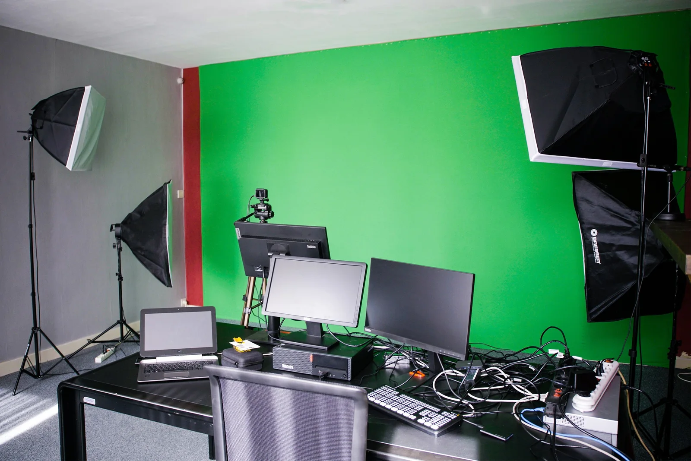

### Apps, programmes and algorithms determine more and more of our lives and more and more schools and organisations are recognising this. That is a positive evolution! Do you want to join this movement? Are you interested in bringing Python or AI into your classroom, but do you need some help with that? Then you have come to the right place!

**Schedule academic year 2022-2023**

-   Monday 10 October 2022: Python in the Classroom!

    -   [More info about this project](https://www.klascement.net/video/141449/computationeel-denken-met-python-lesvideo/)

    -   [Register](https://data-onderwijs.vlaanderen.be/inschrijvingen/onderwijsevent.aspx?id=367#P1218)

-   Thursday 17 November 2022: Roma Aeterna - Explore Latin in Minecraft

    -   [More info about this project](/onderwijs/ontdek-latijn-met-minecraft)

    -   [Subscribe](https://www.uacno.be/nl/opleiding/lesproject-roma-aeterna-verken-latijn-in-minecraft-78318)

-   Wednesday 18 January 2023: Artificial Intelligence and Latin - Bringing Tacitus to life!

    -   [More info about this project](/onderwijs/ai-en-latijn-breng-tacitus-tot-leven)

    -   [Subscribe](https://www.uacno.be/nl/opleiding/artificiele-intelligentie-en-latijn-hoe-agrippina-tot-leven-komt-78396)

-   Thursday 9 February 2023: Artificial Intelligence and Greek Epigraphy

    -   [More info about this project](/onderwijs/ai-en-grieks-epigrafie-met-een-robot)

    -   [Subscribe](https://www.uacno.be/nl/opleiding/artificiele-intelligentie-en-griekse-epigrafie-een-knap-duo-78397)

### Questions or contact?

Do you have a question about a specific topic, a project of mine and my students or anything else? You are certainly not alone! You can ask that question by using the button below. I usually reply within 72 hours. I can help you in the following ways:

-   Guide you through my teaching materials via email;

-   Give an explanation via an online video call (30 - 60 min);

-   Give an online presentation from my studio for you and your colleagues;

-   give a physical, practical, refresher course for you and your colleagues;

-   give one of my projects in your classroom as a guest teacher.

<a class="content-button content-button--primary content-button--medium" href="/contactinfo">Contact</a>

