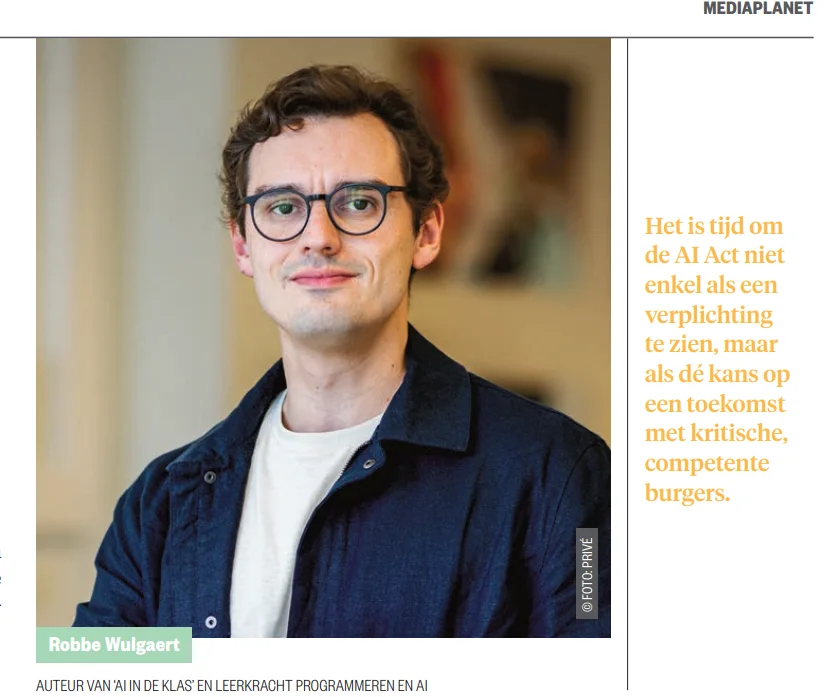

### ‘The devil is in the details’, zeker als schrijver. Zo kreeg ik begin 2025 van Mediaplanet & Planet Future de vraag een opiniestuk te schrijven over AI-geletterdheid. Enthousiast vloog ik erin en diende, zoals mijn leerlingen ook vaak doen, nipt voor de deadline mijn tekst van 2.500 woorden in. Ik zat klaar voor feedback, maar had niet verwacht dat die zou luiden: ‘Oei, dat moesten 2.500 tekens zijn, spaties inclusief.’ Gelukkig was het niet omgekeerd! [De korte versie van mijn betoog vind je in Planet Future (maart 2025)](https://nl.planet-future.be/learning-development/ai-act-van-verplichting-naar-ambitie/?utm_source=Robbe&utm_medium=social), maar hieronder lees je de uitgebreide versie over het belang van AI-geletterdheid en onze collectieve Vlaamse ambitie.

* * *

Het nieuwe jaar was nog piepjong, maar januari 2025 voelde alsof drie maanden zich ineen propten. AI-ontwikkelingen volgden elkaar in razend tempo op: DeepSeek brak plots door vanuit China, OpenAI raakte in de VS in de problemen en een mini-AI-beurscrash schudde de markt op. Nieuwe modellen met nagenoeg ondoorgrondelijke namen zoals GPT o3-mini-high en Qwen-max-2025-01-25 schoten als paddenstoelen uit de grond. Zelfs wie de sector nauwgezet volgt, hapte naar adem. En dan kwam februari met de lancering van de Europese AI Act.

Terwijl de wereld in een heuse AI-wervelwind zit, kijkt Europa resoluut naar regelgeving als antwoord. De boutade ‘De VS innoveert, de EU reguleert en China kopieert’ is allang achterhaald. Of toch maar deels, want net China innoveert agressief op vlak van AI, de VS blijft huidig marktleider en Europa positioneert zichzelf als ethische of juridische koploper. Maar wat betekent dat om koploper te zijn op vlak van regelgeving?

## Artikel 4: het is van moeten

Artikel 4 van de AI Act verplicht bedrijven, scholen en overheden om een ‘voldoende niveau van AI-geletterdheid’ te garanderen bij hun personeel en gebruikers. De vraag is hoe groot die geletterdheid vandaag écht is.

Volgens de IMEC Digimeter 2023 zegt 90% van de Vlamingen AI te kennen, of toch alleszins het begrip. Maar wanneer men doorvraagt, blijkt slechts 57% in staat om uit te leggen wat AI betekent en inhoudt. Met andere woorden: AI is een modewoord, maar geen gedeelde kennis. Nagenoeg iedereen kent ChatGPT, maar is verwonderd wanneer men vaststelt dat AI ook gebruikt wordt in hun favoriete streaming-app, hun online winkels, hun feed op sociale media … Dat betekent dat meer dan vier op tien Vlamingen niet echt begrijpt hoe de technologie werkt of welke impact deze heeft op ons leven. Bovendien beperkt dat probleem zich niet tot individuele burgers: nagenoeg alle scholieren gebruiken AI, maar worden er niet allemaal over onderwezen. Grote ondernemingen investeren in opleidingen, maar KMO’s blijven vaak achter. Op meerdere plekken in onze samenleving stellen we een kenniskloof vast. Die kloof heeft directe gevolgen: bedrijven, scholen en overheden moeten zich aanpassen aan de AI Act, maar lopen achter op de realiteit.

Het is trouwens niet van willen, maar van moeten. Een basisschool die leerkrachten een GPT-tool laat gebruiken, moet hun ook leren hoe ze AI-resultaten kritisch kunnen beoordelen. Een KMO die AI inzet voor klantenservice, moet medewerkers trainen om bias en foute interpretaties te herkennen. Zelfs de Vlaamse overheid, die 10.000 CoPilot-licenties aankocht, moet ervoor zorgen dat ambtenaren AI niet blindelings vertrouwen, maar begrijpen waar de technologie tekortschiet.

Hoewel de Europese Unie AI-geletterdheid voorstelt als een essentieel onderdeel van de digitale toekomst, mist Vlaanderen momenteel duidelijke doelstellingen, richtlijnen en een strategie om de kenniskloof te dichten. Kortom: er ontbreekt een coherent actieplan. Nochtans nemen sommige scholen en ondernemingen initiatief en zitten AI-opleidingen voller dan ooit. Zonder coördinatie blijft AI-geletterdheid echter ongelijk verdeeld: grote bedrijven en topuniversiteiten investeren, terwijl kleinere organisaties en scholen achterblijven. Een cursusje prompting volgen is heus niet voldoende. Wat betreft het onderwijs verwoordden enkele professoren van mijn alma mater de KU Leuven het in hun open brief van januari 2025 treffend: _“Het ontbrekende hoofdstuk in de beleidsnota Onderwijs: AI.”_ 

Laat ons die belangrijke verplichting uit de AI Act omzetten in een duidelijke ambitie. Want als AI-geletterdheid vrijblijvend blijft, zal de kenniskloof enkel groeien, met alle gevolgen van dien. Maar ‘hold on’, waarom is die AI-geletterdheid eigenlijk zo belangrijk en wat hoopt Europa precies te bereiken met deze verplichting?

## Waarom?

In het onderwijs is ‘waarom’ de sleutelvraag. Waarom leren we? Waarom investeren we tijd in een onderwerp? Waarom is iets cruciaal voor de toekomst? AI-geletterdheid is zó belangrijk dat het nu een juridische verplichting is geworden. Hoe vertalen we die verplichting naar de praktijk?

Overweging 20 (recital) van de AI Act stelt dat AI-geletterdheid belangrijk is omwille van drie redenen: opportuniteiten, naleving en tenslotte werkomstandigheden en innovatie.

**1)      Voordelen en nadelen**

AI belooft hogere productiviteit en technologische vooruitgang, maar zonder AI-geletterdheid kunnen deze voordelen omslaan in gevaren: vooringenomen algoritmes in de rechtspraak, gezichtsherkenning in de publieke ruimte en AI-beslissingen over sociale toeslagen. Hoe zorgen we ervoor dat AI onze rechten beschermt, in plaats van ze te ondermijnen?

AI-technologie kan gebruikt worden om rotte appels te herkennen bij de oogst of in een fruitsapfabriek, maar diezelfde technologie kan ook ingezet worden door politiediensten om hun ‘rotte appels’ op te sporen. De EU AI Act verbiedt bijvoorbeeld biometrische surveillance in de publieke ruimte, maar laat een reeks uitzonderingen toe voor nationale veiligheidsdiensten. Dat betekent dat gezichtsherkenning en andere AI-technologieën toch legaal kunnen worden ingezet door politiediensten, zelfs als dit een risico vormt voor privacy en discriminatie.

Zoals Nathalie Smuha, AI-ethicus aan de KU Leuven, opmerkt in een Politico artikel ‘_The EU’s AI bans come with big loopholes for police’_: "You can even question whether you can really speak of a prohibition if there \[are\] so many exceptions."

Zonder AI-geletterdheid missen burgers, beleidsmakers en journalisten de kennis om deze uitzonderingen te begrijpen, correct in te zetten en te controleren. Het risico? Een samenleving waarin AI-technologie sluipend onze privacy en fundamentele rechten ondermijnt.

**2)      Naleving AI Act**

De AI Act stelt duidelijke regels, maar regelgeving alleen is niet genoeg. Wie AI gebruikt, van bedrijven tot overheden, moet begrijpen hoe de technologie werkt om te weten wanneer ze zich binnen of buiten de regels van de wet bevinden.

Een ziekenhuis dat AI gebruikt om diagnoses te stellen, moet bijvoorbeeld controleren of de algoritmes geen discriminerende patronen bevatten. Een HR-afdeling die AI inzet als ondersteuning bij de rekrutering, moet nagaan of het systeem niet onbedoeld bepaalde kandidaten systematisch uitsluit. Zonder AI-geletterdheid kunnen bedrijven zich onbewust schuldig maken aan illegale praktijken.

**3)      Werk en innovatie**

De arbeidsmarkt verandert ingrijpend: sommige taken worden geautomatiseerd, nieuwe jobs ontstaan en andere zullen misschien verdwijnen. Werknemers kunnen zich niet omscholen als ze niet begrijpen wat AI kan en niet kan. AI-geletterdheid gaat niet alleen over de technologie begrijpen, maar over het ontwikkelen van de juiste vaardigheden om in een AI-gestuurde economie mee te kunnen. 

Deze doelstellingen zijn ambitieus, maar noodzakelijk. De AI Act schept het kader, maar wij moeten het concreet maken. Daar knelt nu juist het schoentje. Hoe doen andere landen dat? Tijd om verder te kijken en de blik (opnieuw) te richten op Finland.

## Opnieuw naar Finland

Als onderwijzer begeef ik me even op glad ijs, want ik denk dat we voor dit collectieve educatieve vraagstuk best eens kunnen kijken naar Finland. Het land is namelijk al even geen gidsland meer als het gaat om PISA-rankings of innovatieve schoolmodellen, maar wél als het gaat om AI-geletterdheid en ambitie.

We draaien de klok terug naar de zomer van 2017. Het lijkt eeuwen geleden – een tijd vóór COVID-19, Zoom-meetings en nascholingen over prompting die als paddenstoelen uit de grond schoten. Niet ver van het Finse ministerie van Economie broedden enkele academici en bedrijfsleiders op een stevig plan: ‘Elements of AI’.

Deze gratis online cursus had niet als doel om burgers op te leiden tot AI-experts, maar om een democratische basis te leggen. Zonder AI-geletterdheid zijn burgers minder in staat om beleid te begrijpen, technologie kritisch te beoordelen en hun rechten te beschermen. Finland zag AI niet als een technisch vraagstuk, maar als een maatschappelijke noodzaak. De cursus was niet gericht op ingenieurs of programmeurs, maar op Jan en Mieke. Je herkent hierin duidelijk de kiemen van de AI Act.

Maar hoe krijg je burgers warm voor een cursus ten voordele van de democratie? De Finnen bleven realistisch. Ze mobiliseerden bedrijven van elke omvang – van techreuzen zoals Nokia tot traditionele sectoren zoals de houtindustrie – en overtuigden hen om hun werknemers AI-geletterd te maken. Tegen het einde van 2018 hadden 6.300 Finnen de cursus afgerond.

In datzelfde jaar verschoof Finland zijn focus: hoe kon AI-geletterdheid kleine en middelgrote ondernemingen (KMO’s) helpen innoveren en concurreren? Dat plan was niet louter educatief, maar een economische strategie. Finland besefte dat opboksen tegen China en de VS op technologisch vlak onrealistisch was, maar dat Europa wél een kennisvoordeel kon uitbouwen.

Toen Finland in 2019 voorzitter werd van de Europese Unie, namen ze deze ambitie mee naar Brussel. Het doel? 1% van de EU AI-geletterd maken. De cursus werd vertaald in alle EU-talen en gepromoot als een manier om de Europese digitale kloof te verkleinen. Terwijl de VS en China AI-modellen trainden, trainde Europa haar burgers.

Ik mis die duidelijkheid en ambitie in 2025. Waar is ons collectief plan? Dat contrast werd extra duidelijk toen ik op school de open brief van de KU Leuven-professoren las over de ontbrekende visie op generatieve AI in Vlaanderen. Aan de muur bij mijn bureau prijkt mijn ingelijste ‘Elements of AI’-certificaat. Een certificaat dat ook veel van mijn leerlingen behaalden. Wat begon als een Finse ambitie, werd een Europees project en vond ook zijn weg naar ons klaslokaal. Hoog tijd dus om die ambitie nieuw leven in te blazen: 1% van de Vlamingen een basisniveau van AI-geletterdheid bieden. Als eerste stap, niet als einddoel.

## Van basisniveau naar maatwerk

De brede ambitie om 1% van de Europese bevolking AI-geletterd te maken was een eerste stap, maar het is onvoldoende. Basiskennis volstaat niet als AI in elke sector op een andere manier ingrijpt. De AI Act erkent dit en verplicht bedrijven, overheden en scholen om te streven naar een ‘_voldoende_ _niveau’_ van AI-geletterdheid. Maar hoe vertalen we dat naar de praktijk?

Laat mij starten bij mijn eigen sector, het onderwijs. Zonder verplichte eindtermen en een structurele AI-opleiding voor leerkrachten ontstaat een willekeurige aanpak: sommige scholen integreren AI in hun lessen, andere blijven volledig achter. Dit dreigt een generatie op te leveren waarin sommige scholieren wél leren omgaan met AI en anderen totaal niet. Maar wat betekent ‘voldoende AI-geletterdheid’ voor een scholier Moderne Talen die vertaler wil worden? Voor een student Houtbewerking? Voor een leerling Grieks-Latijn?

Die vraag speelt niet alleen in het onderwijs. Ook in bedrijven en organisaties heeft AI-geletterdheid een andere invulling per sector. Een journalist kan AI gebruiken om teksten te redigeren, maar moet tegelijk kritisch leren omgaan met desinformatie. Een ontwerper kan AI inzetten om nieuwe concepten te genereren, maar moet begrijpen hoe de datasets van die algoritmes opgesteld werden. Een medewerker bij IKEA moet niet alleen AI-tools kunnen gebruiken, maar ook weten hoe geautomatiseerde beslissingen in de logistiek en verkoop tot stand komen.

Die realiteit vertaalt zich al in verschillende initiatieven. Arteveldehogeschool en Odisee Hogeschool ontwikkelden een gratis online cursus over generatieve AI voor hun studenten (aivoorstudenten.be). Ze wonnen hiervoor een prijs op de SETT-beurs in februari 2025. IKEA investeert ondertussen in AI-trainingen voor werknemers, zodat winkelpersoneel niet alleen AI-tools gebruikt, maar ook begrijpt hoe de technologie achter de schermen beslissingen neemt.

Eén algemene AI-cursus is slechts een begin. Het ‘voldoende niveau’ van AI-geletterdheid moet afgestemd zijn op de praktijk en de noden van elke sector. Dat vraagt visie én actie. AI-geletterdheid mag geen loterij zijn waarbij sommige bedrijven en scholen investeren terwijl anderen achterblijven. Het moet een structurele pijler worden in onderwijs en op de werkvloer, ondersteund door gerichte beleidskeuzes en concrete leertrajecten.

## Hoe bouw je AI-geletterdheid op binnen jouw organisatie?

AI-geletterdheid kan niet beperkt blijven tot losse initiatieven of vrijblijvende goede bedoelingen. We hebben een doordachte, gestructureerde aanpak nodig die aansluit bij de realiteit op de werkvloer en in het onderwijs. De vraag blijft: waar begin je? Niet elke organisatie heeft immers de middelen of schaal van IKEA of een hogeschool. Toch kan elke organisatie AI-geletterdheid opbouwen, mits een helder plan.

Daarom stelde de Vlaamse Academie voor AI (VAIA) recent een leidraad op om organisaties te helpen bij het ontwikkelen van AI-geletterdheid binnen hun teams. Hun advies is helder: voordat je AI-opleidingen aanbiedt, moet je eerst begrijpen waar je staat.

1\. Breng het huidige AI-gebruik en kennisniveau in kaart

-   Welke AI-tools worden al gebruikt? Wordt er gewerkt met taalmodellen, beeldherkenning of automatisering?

-   Zijn er shadow AI-systemen die zonder medeweten van de organisatie gebruikt worden?

-   Wat zijn de risico’s voor privacy, bias en datamisinterpretatie?

-   Hoeveel AI-kennis is er al? Waar zitten de grootste hiaten?

-   Welke AI-kennis heeft elke rol nodig? Zo heeft een data-analist andere expertise nodig dan HR of leerkrachten.

2\. Bouw een leercultuur rond AI-geletterdheid

Wanneer duidelijk is wie wat moet weten, komt de volgende stap: het opzetten van een continu leerproces. Continu, want AI verandert razendsnel en een eenmalige cursus zal nooit volstaan. VAIA adviseert om verschillende opleidingsmethodes te combineren:

-   AI-geletterdheid is een continu proces, geen eenmalige training. Zorg voor een combinatie van brede AI-basiskennis (zoals Elements of AI) en sectorgerichte opleidingen.

-   Versterk digitale basisvaardigheden: data kunnen begrijpen en kritisch denken zijn cruciaal.

-   Bouw voort op bestaande initiatieven: GDPR-trainingen en bestaande trajecten rond cybersecurity kunnen AI-geletterdheid integreren.

-   Stimuleer samenwerking: IT, HR en legal moeten samen AI-gebruik in goede banen leiden.

## Van verplichting tot ambitie

AI-geletterdheid is geen vrijblijvende optie meer. De AI Act legt bedrijven, overheden en scholen een duidelijke taak op: investeren in AI-geletterdheid. Als deze verplichting echter beperkt blijft tot een afvinklijstje zonder reële impact, zullen we de boot missen.

We moeten dus verder kijken dan regulering en inzetten op praktische, relevante en doorlopende AI-opleidingen die aangepast zijn aan de noden van verschillende sectoren. Of het nu gaat om een student houtbewerking, een IKEA-medewerker of een universitair onderzoeker: AI-geletterdheid mag geen loze eis uit de wetgeving zijn, maar een strategische troef voor de toekomst.

Tijd om die titel van koploper in wetgeving om te zetten in koploper tout court. Het gaat tenslotte over onze eigen, collectieve toekomst. AI-geletterdheid mag geen buzzword blijven, maar moet een structureel deel worden van levenslang leren. Europa heeft de wetgeving, nu is het tijd om die om te zetten in concrete verandering met doordachte en gerichte investeringen in onderwijs, bedrijven en publieke instellingen. In onze gedeelde en digitale toekomst is AI-geletterdheid geen luxe, maar een noodzaak. Europa heeft geen passieve toeschouwers nodig, maar kritische en competente burgers.

* * *

### Contact 

<a class="content-button content-button--primary content-button--medium" href="/contact">Stel jouw vragen hier!</a>

