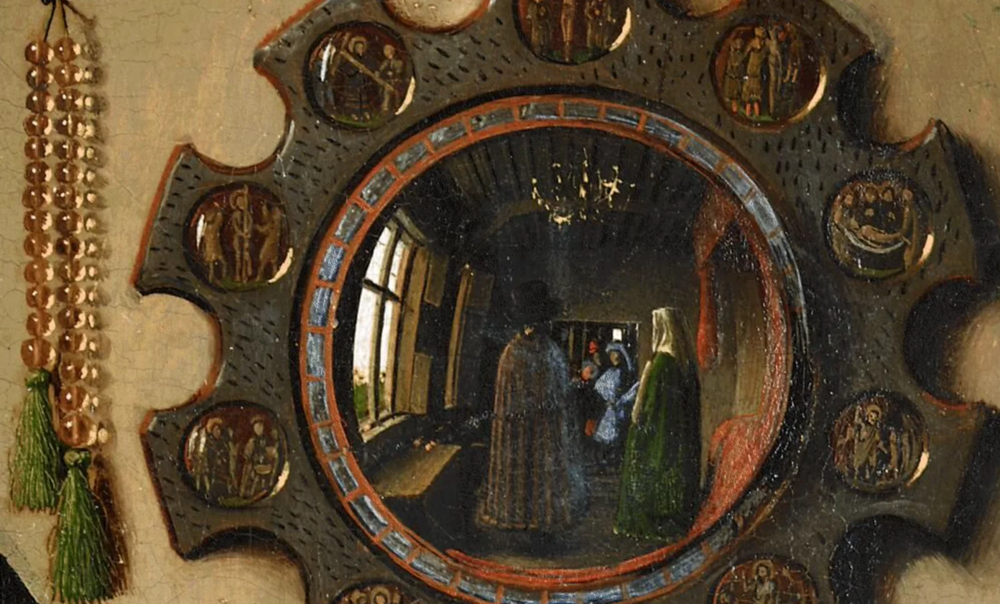
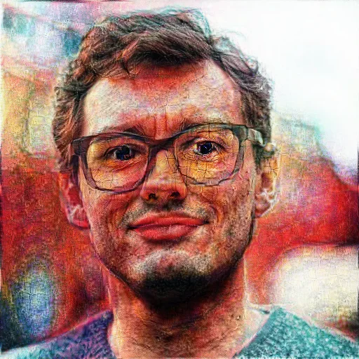
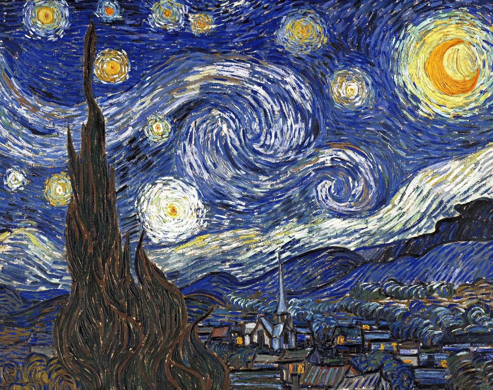
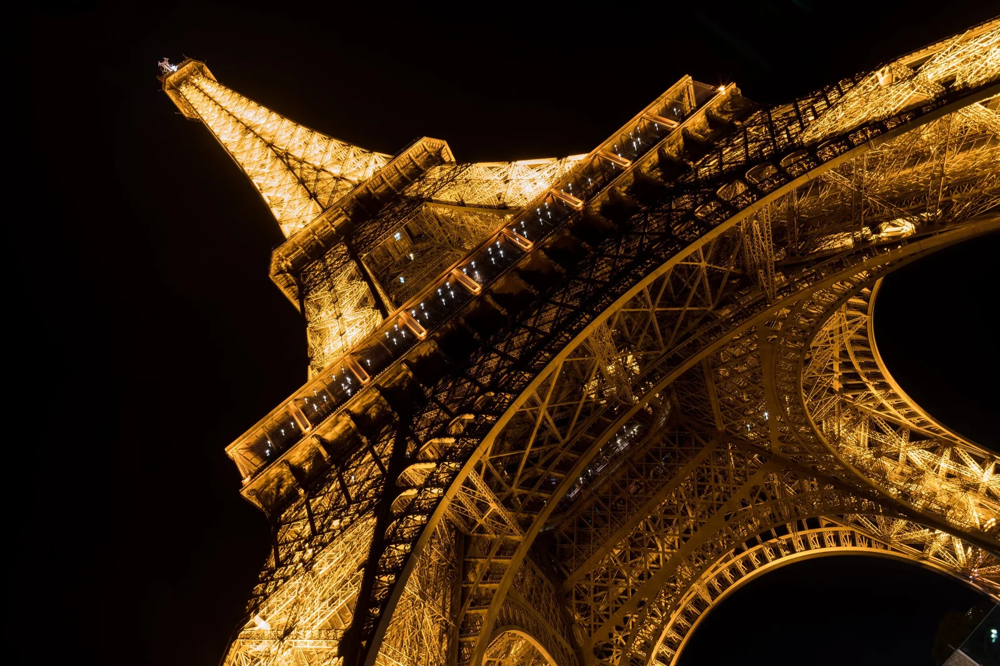
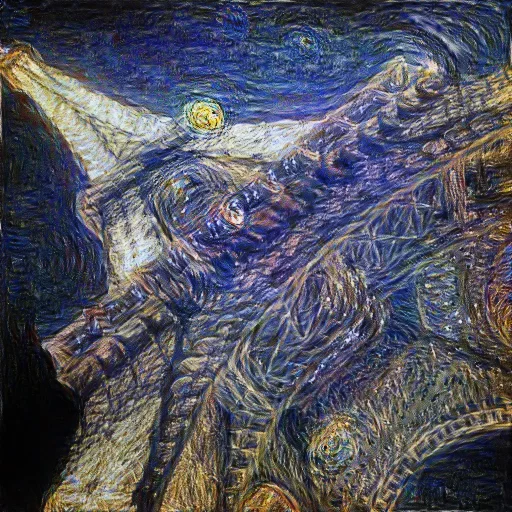

### Heel misschien vroeg je je het al eens af, maar hoe zou jouw selfie eruitzien mocht Van Eyck, de bekendste Vlaamse Primitief, die hebben geschilderd? Het klinkt als een gek idee, maar het is niet zo vergezocht hoor!

[Video on YouTube](https://www.youtube.com/watch?v=Et8QsDSzoEQ)

### Opzet van dit educatief project

Jan Van Eyck was een getalenteerd schilder. Hij wist als geen ander textuur te brengen in zijn werken. Het tapijt en de maliënkolder van Sint-Joris, in het werk '**Madonna en kanunnik van der Paele**', lijken precies echt. Hij had een ongekend oog voor details.

Dit kan je ook bewonderen in een ander werk, het '**Arnolfini Portret**'. Zoveel detail, dat je in de spiegel achter het paar ook een soort zelfportret van Van Eyck kan vinden! Een selfie als het ware, verstopt in het werk voor een ander.

**Hier de oorsprong van dit educatief AI-in-de-klas-project: kunnen we een AI gebruiken om een Van Eyck-versie te maken van onze selfie?**

### Van Vlaams Primitief naar high-tech AI!

Dat Van Eyck er wat kan kon, dat weten we al langer. Zijn werken zijn wereldwijd gekend en geroemd. Maar wat als een A.I. het werk van Van Eyck en diens typische stijl niet alleen zou kunnen herkennen, maar ook overnemen en toepassen op een andere foto?

De smartphone app **Prisma** is al enkele jaren volledig mee met dit idee! Prisma lanceerde in 2016 als iOS app voor de iPhone. De app was ontwikkeld door Russische ontwikkelaars. De app stelt de gebruiker in staat om een foto in te laden en deze te bewerken met **'filters'**. Deze filters waren gebaseerd op bekende kunstenaars.

In feite werd er **géén filter** over de foto of afbeelding geplaatst, maar werd de foto op de servers van Prisma **deeltje per deeltje ontleed, aangepast en opnieuw opgebouwd volgens de geselecteerde stijl!** Toch een pak meer indrukwekkend dan 'filter' deed vermoeden! Maar hoe gaat dit in zijn werk?

De techniek om zo een foto te ontleden, deeltje per deeltje aan te passen, een stijl toepassen ... noemen we **DeepArt**. Deze techniek werkt aan de hand van **Deep Learning** technologie. Meer informatie vind je in de video bovenaan deze pagina!

Maar we (of de AI, eigenlijk … ) gebruiken twee afbeeldingen:

-   **Content image**: onze gemaakte foto (een reisfoto, een selfie, een portretfoto … )

-   **Style image**: de afbeelding waaruit onze AI de kunststijl zal ‘leren’.

## Vragen, opmerkingen …

Vragen of opmerkingen over dit project of een van mijn andere projecten? Dan kan je hieronder terecht!

<a class="content-button content-button--primary content-button--medium" href="/contact">Meer informatie</a>

