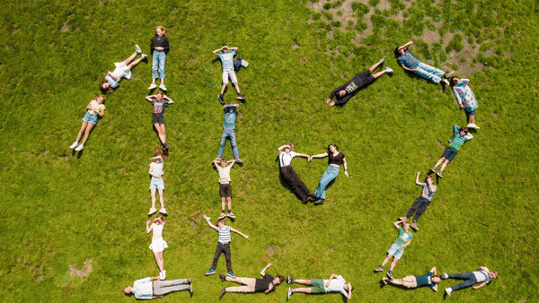
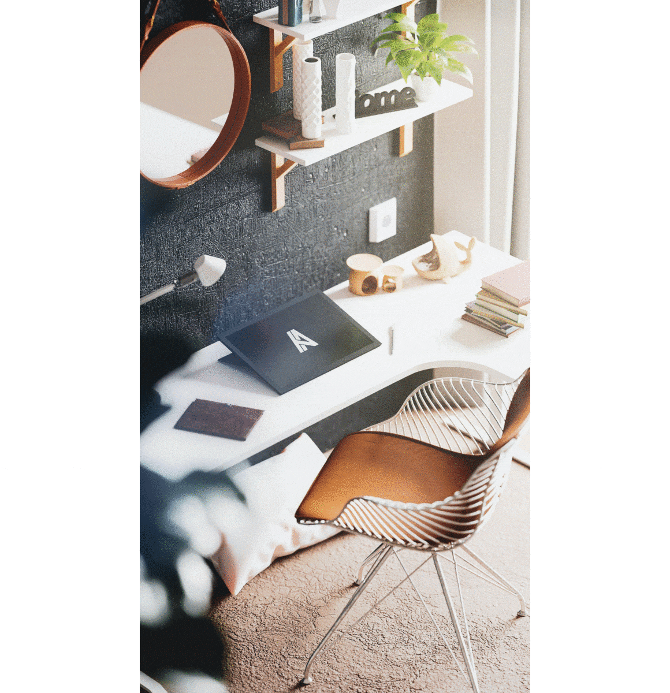

### Dat onze wereld steeds meer visueel ingesteld raakt, waar foto's en camera's aan belang winnen, daarvan moet ik je niet meer overtuigen. Sinds de smartphone menig kleine camera heeft verdrongen en apps zoals Instagram fotografie hebben gedemocratiseerd, is iedereen een amateurfotograaf geworden. Bij zo'n foto's streven gebruikers graag naar perfectie. Maar wat als een toevallige passant, een lastige vriend of een stuk vuilnis jouw shot ontsieren? Wat als je die **stoorzenders**, gewoonweg met een **AI-model, zou kunnen uitgommen**.

### **Ben jij de nieuwe Thanos?**

In de GIF hierboven kan je duidelijk zien wat er aan de hand is. Storende objecten verdwijnen gewoon als sneeuw voor de zon. Ideaal dus wanneer je net dat ene vakantiekiekje hebt genomen, maar er toch één stoorzender te zien is.

Maar welke **AI-technologie** is er hier aan het werk? Is deze vorm van **inpainting** volledig nieuw? Waar kunnen we deze technologie gebruiken?

### **Een (k)oud kunstje voor Photoshop**

Fervente gebruikers van fotobewerkingssoftware zoals Photoshop zullen de **kloonstempel** kennen. Het is een tool om pixels van de ene plaats naar een andere plaats op de foto te klonen. Doe je dit zeer zorgvuldig en gebruik je de omliggende pixels van het storende object, dan kan je dat manueel verwijderen. Het voornaamste nadeel van deze aanpak is natuurlijk dat je dit **manueel** moet doen, dus de werklast bij de gebruiker ligt. **Een goed getraind AI-model kan de gebruiker helpen!**

De **content aware brush** is zo een handige tool waardoor je niet alle pixels zelf, manueel dus, moet klonen van de ene plaats op de foto naar de andere plaats op de foto. Deze borstel binnen programma's zoals Photoshop kijkt zelf naar welke pixels in aanmerking komen om gebruikt te worden bij de inpainting. De resultaten zijn niet altijd even overtuigend dan wanneer je het manueel zou doen, maar het is wel een pak sneller!

### **Een nieuw kunstje voor de gloednieuwe Google Pixels**

In oktober 2021 lanceerde Google haar nieuwe smartphones, de zesde telg in de Pixel-lijn. Deze zijn noemenswaardig omdat deze een **SoC (system-on-a-chip)** bevatten die ontworpen is door Google zelf. Vroeger kocht Google mobiele chips in bij andere fabrikanten. Met een eigen ontwerp brengen ze hun Tensor-rekenkernen naar mobiele telefoons. Deze rekenkernen zijn gespecialiseerd voor het verwerken van AI-toepassingen en algoritmes! Vroeger moest dit allemaal gebeuren op de CPU of centrale rekeneenheid van een smartphone. Dit vergde teveel rekenkracht voor de doorsnee processor.

Een van hun nieuwe AI-toepassingen heet de **magic eraser** en je raadt het al, je kan er ongewenste objecten mee wissen uit een foto. Dus waar je voorheen de foto moest bewerken met een speciaal programma op een computer met een degelijke processor, kan het tegenwoordig met AI op jouw smartphone!

### **Hoe doen wij dit? AI aan de slag!**

Het AI-model dat we gebruiken in dit project gebruikt zogenaamde [**'large mask inpainting met Fourier Convolutions'**](https://github.com/saic-mdal/lama). Een gehele mond vol. Maar hoe werkt dit eigenlijk?

**Standaard inpainting:** Deze vorm probeert ongewenste objecten uit te wissen door te kijken naar de **onmiddellijk omliggende pixels.** Deze aanpak kijkt dus niet naar het grotere prentje.

**Large mask inpainting:** Hier wordt in de beginfase van de aanpak van het model wel gewerkt met een **groter analyseveld**. Deze large mask analyseert dus veel meer in één blik van de foto om daarmee de ongewenste delen aan te passen. Zo slaagt deze aanpak er beter in om (voorspelbare) texturen van bijvoorbeeld muren of hekkens mee te nemen in zijn oplossing.

### In de klas!

[Video on YouTube](https://www.youtube.com/watch?v=aHzn5jEZ1m8)

### Vragen, opmerkingen?

Vragen of opmerkingen over dit project of een van mijn andere projecten? Dan kan je hieronder terecht!

<a class="content-button content-button--primary content-button--medium" href="/contact">Contact</a>

