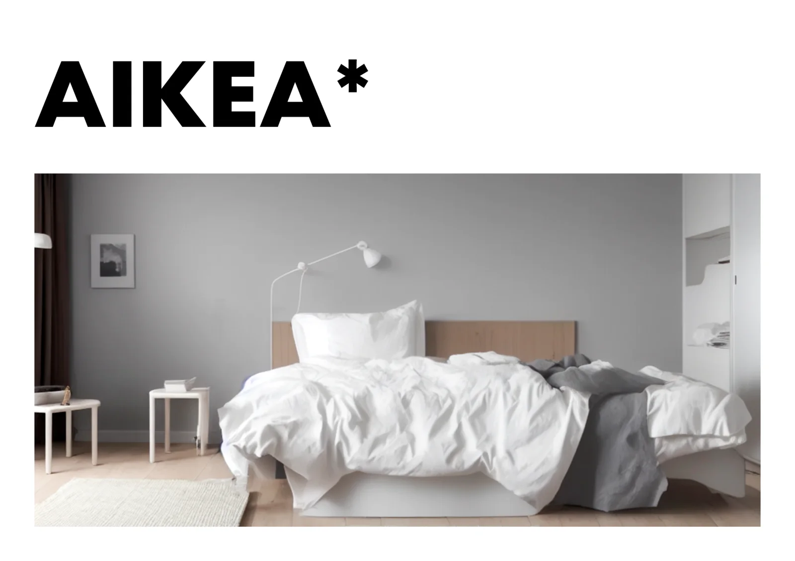

### Artificiële intelligentie bepaalt reeds grote delen van ons leven. Hoe we werken, reizen, taken maken voor school ... Zelfs wanneer je een eenvoudige foto maakt met jouw moderne smartphone, wordt deze realiteit niet enkel bepaalt door glazen lenselementen, maar ook door algoritmes en gewichten van AI-modellen. Zulke AI-systemen kunnen ons niet enkel helpen bij het maken van onze kiekjes, maar ze kunnen ze volledig verzinnen! Wat als dat verzonnen onderwerp nu eens ons interieur was? Bedden, keukens, bureautafels ... De meubels die onze identiteit en het ritme van ons leven kunnen bepalen. Onze ontwerpen en ons leven volledig in handen van algoritmes zoals Stable Diffussion en ChatGPT!

Volledige grootte weergeven

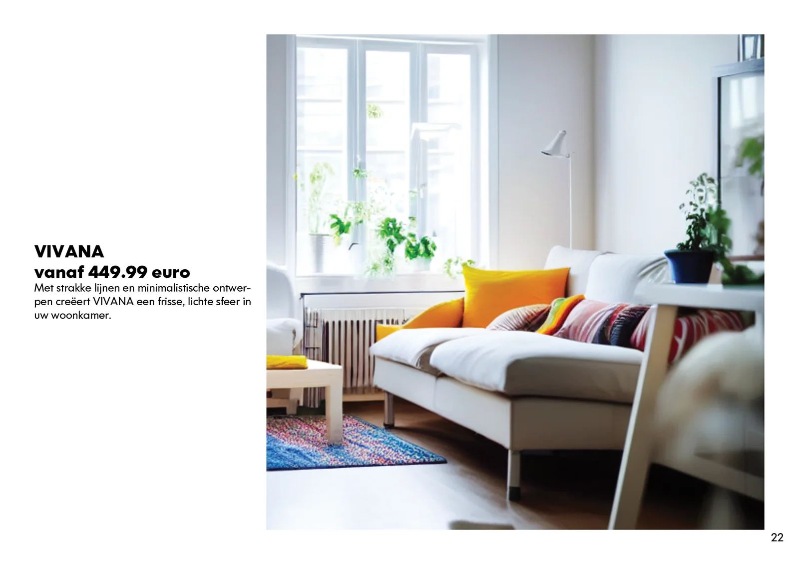

Dat is het gekke idee van enkele leerlingen en hun leerkracht aan het Sint-Lievenscollege in Gent. Tijdens hun derde jaar krijgen ze vakken waar computationeel denken, programmeren en artificiële intelligentie centraal staan. Niet puur theoretisch, maar waar deze toepassingen en de achterliggende systemen deel uitmaken van heuse vakoverschrijdende projecten. Waar de we actief de mogelijkheden verkennen en oog hebben voor de beperkingen van verschillende vormen van machine learning. Zo werkten we vorig schooljaar reeds rond het [maken van een AI-kunstgalerij](/onderwijs/open-een-ai-kunstgalerij), [combineerden deze soort toepassingen met klassieke mythes](/onderwijs/de-chimaera-het-fantastische-monster) en [ontwierpen een constructie voor de Maker Faire Gent om de discussie over de “waarde” van deze AI-resultaten op scherp te zetten.](/onderwijs/define-value)

Volledige grootte weergeven

De interieurs en meubels in deze catalogus zijn dus helaas niet te koop. Wie zou er tevens die winst verdienen? De leerlingen, de leerkracht, het AI-model, de echte designers die de basis vormden van de gebruikte datasets of de vormgevers bij het Zweedse meubelbedrijf IKEA? Een vraagstuk voor een ander moment. Alle items zijn wel gemaakt door op basis van de input van de leerlingen. Hun instructies (=prompts) en eigen persoonlijke leefruimtes (=initialisatieafbeeldingen) vormden de basis van elk ontwerp. Elk ontwerp bevat dus een hoogstpersoonlijke toets van een leerling. Een deeltje persoonlijkheid dus in deze steeds meer digitale, en AI-bepaalde, wereld.

### “Onze” resultaten

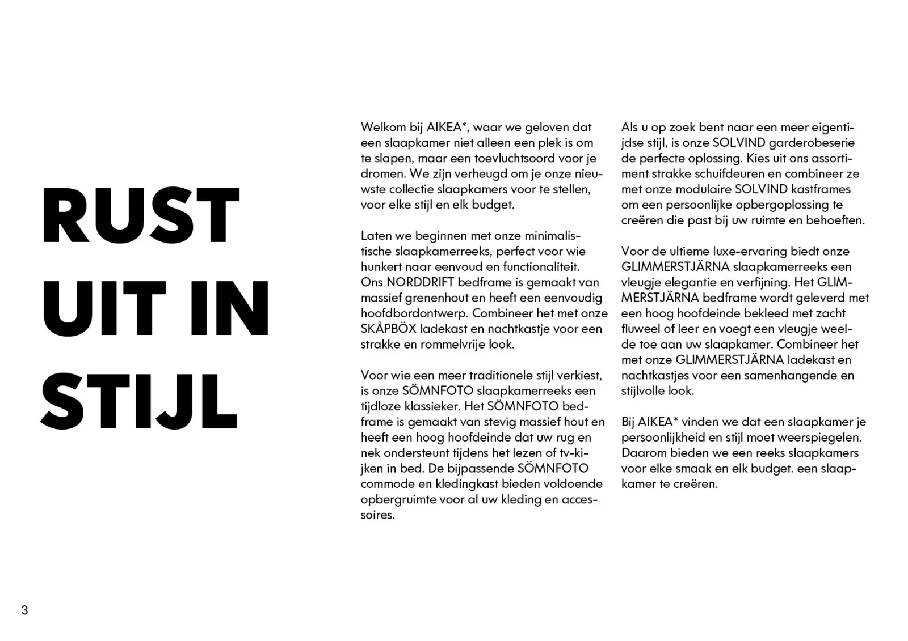 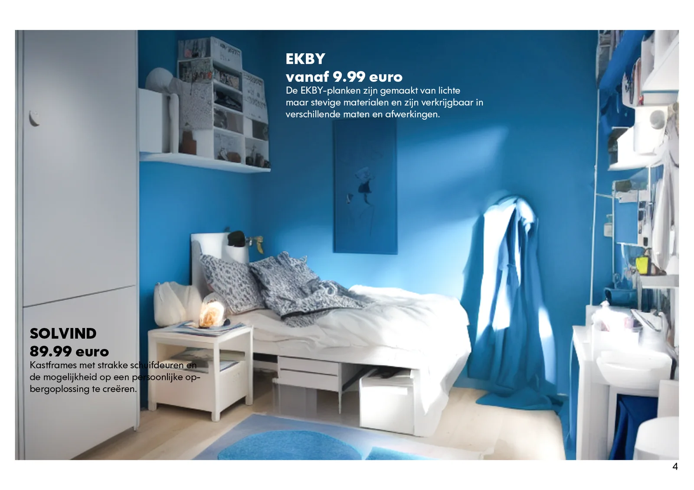 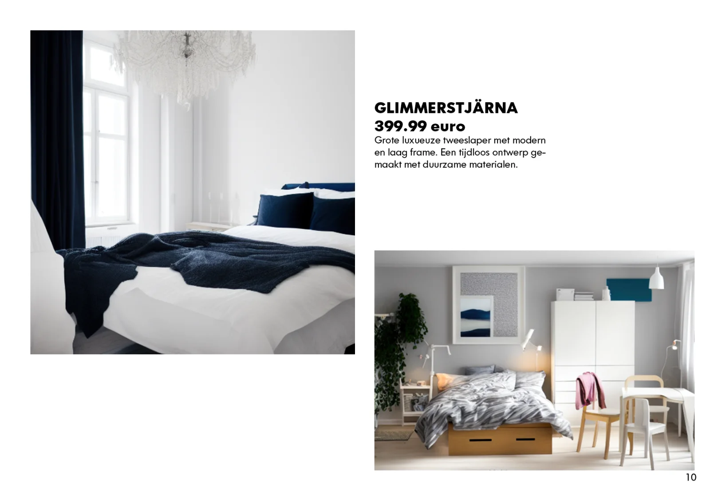 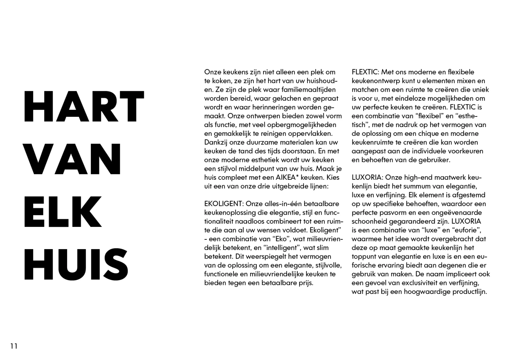 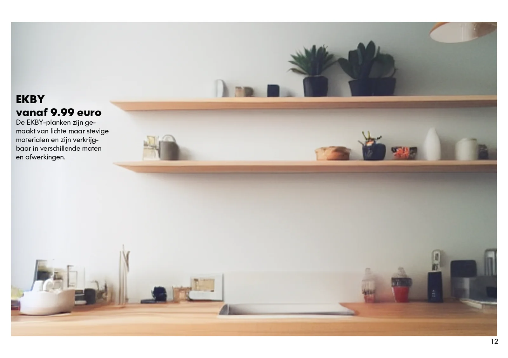 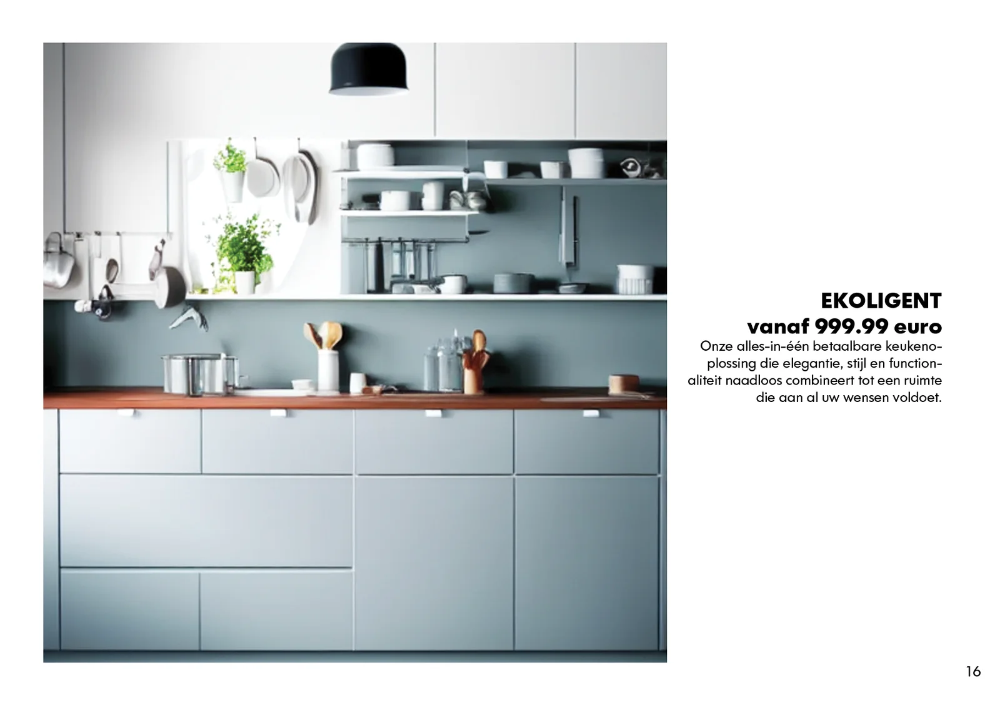 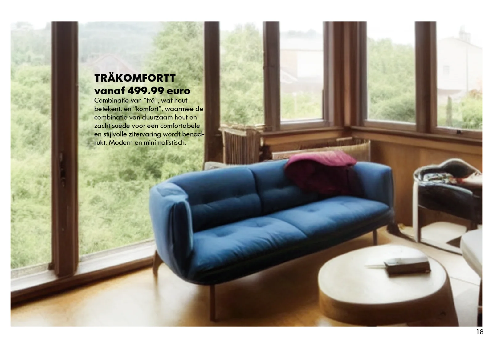 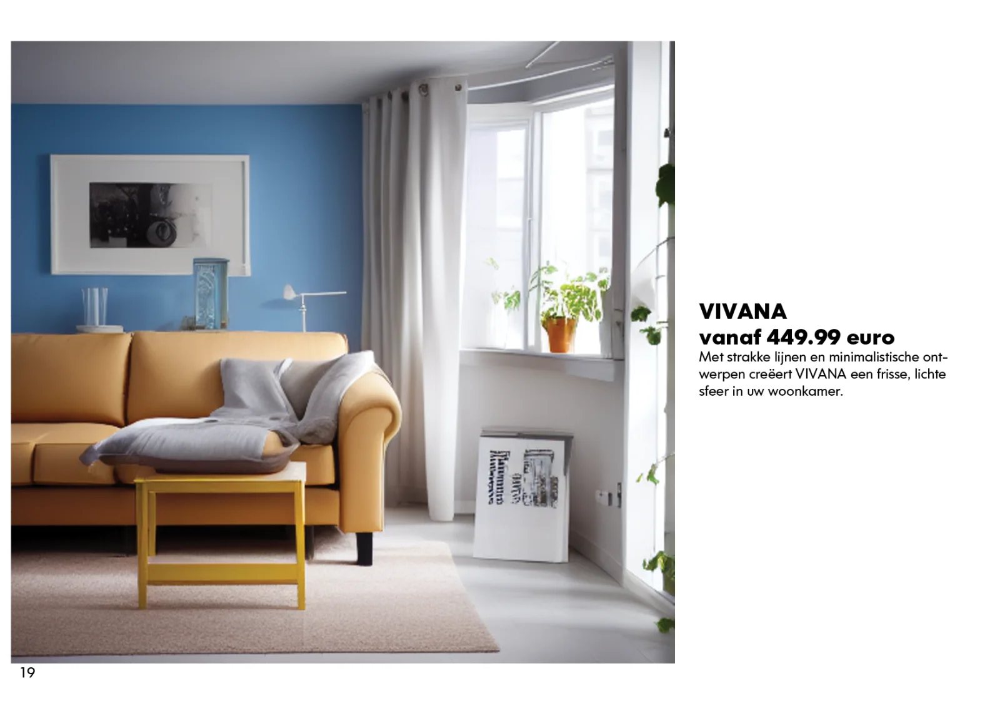 

### Onze werkwijze

**Technische achtergrond**

Tijdens dit project maakten leerlingen kennis met generatieve AI-modellen zoals Stable Diffusion. Bij dit soort modellen wordt er gewerkt volgens een Diffusie-aanpak. Daarbij worden nieuwe afbeeldingen gemaakt uit ruis. De AI-modellen zijn in feite grote taalmodellen. Ze zijn, kort door de bocht, te vergelijken met bekende tools zoals ChatGPT. Maar het systeem is niet enkel getraind op tekst, maar ook op afbeeldingen. Om dit te bereiken maakte men gebruik van de alt-data. Tekstdata die bij een afbeelding vermeld staat en vooral gebruikt wordt voor mensen met een visuele beperking. Die beschrijving wordt dan voorgelezen door het device. Door deze aanpak is het model in staat om een geschreven instructie te begrijpen en nieuwe voorstelling daarvan te maken. Het kan dus tekenen op commando! Meer informatie over de precieze werking van een diffusie-model [kan je hier lezen.](http://jalammar.github.io/illustrated-stable-diffusion/)

**Prompting!**

Dat commando moet natuurlijk neergeschreven worden door de leerlingen! Er zit een gehele wetenschap achter het schrijven van een goede instructies of prompts en die kunnen best verschillen tussen de AI-modellen. Zo is een goede prompt voor een kunstmodel wel anders dan voor bijvoorbeeld ChatGPT.

Volledige grootte weergeven

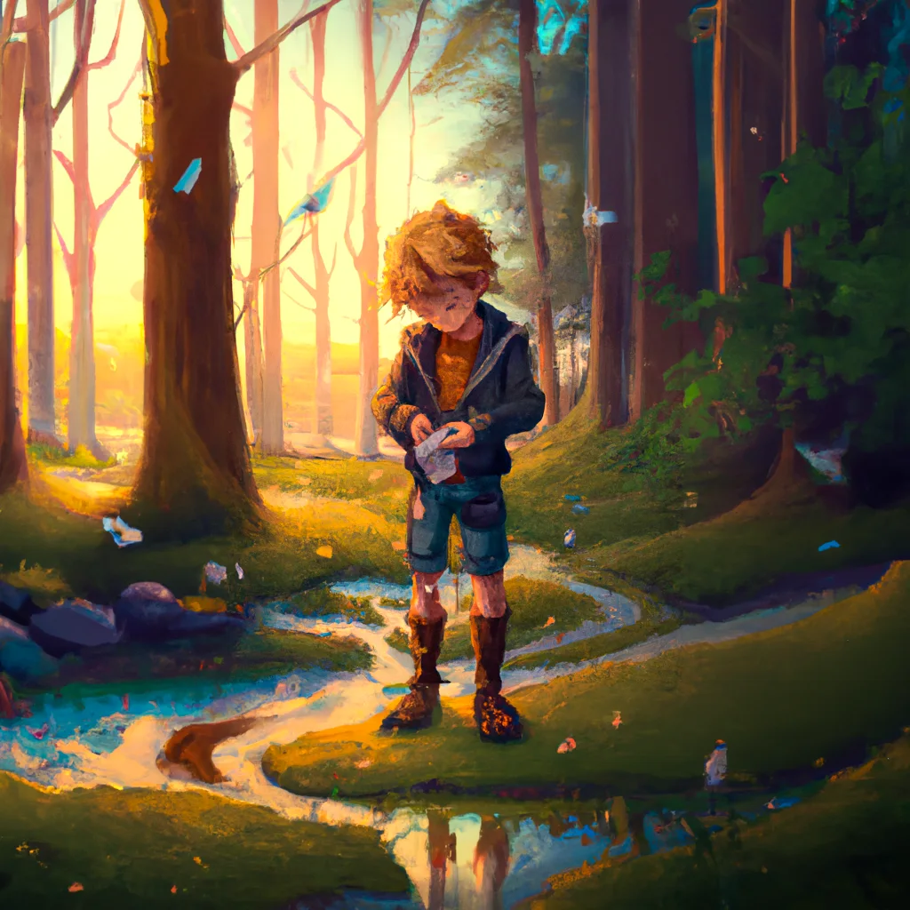

_‘matte expressive for children of a boy emptying his pants pockets in a forest at sunrise, god rays piercing the canopy, by Robbe Wulgaert, 5K resolution’
_Zoals je hierboven ziet, is de vorm van een prompt voor een beeldmodel wel wat anders dan een GPT-model. Deze afbeelding werd gemaakt als illustratie bij een kinderboek door Patricia David en mezelf ‘Over Zonnedraken en Zeerovers’. [Meer info over dit boek vind je hier!](/onderwijs/over-zonnedraken-en-zeerovers)

**Eerste Hulp Bij Prompting!**

Om te helpen bij het schrijven van een goede prompt, kan je volgende stappen proberen:

-   Beschrijf de gewenste foto door te vertrekken van de originele foto. Voeg daarna nieuwe elementen toe zoals de gewenste stijl, look, ontbrekende elementen …

-   Laat een GPT-tool je helpen! Hoewel ze beiden een verschillende manier hebben van reageren op instructies, is een GPT-model wel in staat om een prompt op te stellen voor een CLIP-taalmodel.

-   Maak gebruik van een tool zoals [CLIP Interrogator](https://huggingface.co/spaces/pharma/CLIP-Interrogator). Deze doet eigenlijk het omgekeerde van wat wij van plan zijn. Geef het een afbeelding en de tool zal nagaan welke kernwoorden het taalmodel zou plaatsen bij de gegeven foto.

Volledige grootte weergeven

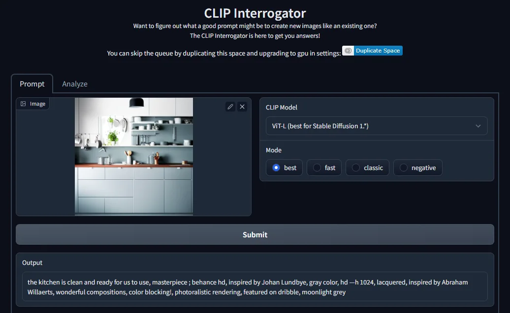

_Hoe een CLIP-model de “wereld ziet'“._

**Gebruik een startafbeelding!**

De leerlingen voorzien niet alleen een instructie voor het AI-model. Ze voorzien ook een startafbeelding. Een foto van een kamer uit een magazine, website, eigen foto, via de webcam van het eigen device … Die foto vormt, samen met de prompt, het beginpunt voor het beeldmodel. Het zal de bestaande afbeelding gebruiken als een gids om de instructie daarop toe te passen.

### **Benodigdheden**

Dit project is maar één voorbeeld van hoe je dit soort generatieve AI-technologie kan aanwenden in de prototype-fase van een opdracht. De tool slaagt er in om, op korte tijd, meerdere voorbeelden te genereren. Je merkt wel dat er hier en daar grote fouten ontstaan of zaken ontbreken. Zo zal een wastafel in een keuken het best werken wanneer je die voorziet van een kraan …

Volledige grootte weergeven

Deze ontwerpen of werkwijze is dus **geen sluitstuk**, maar een startpunt voor verdere stappen, correcties, aanpassingen … uitgevoerd door de mens. Het maakt het mogelijk om in korte tijd een veelheid aan ideeën en inspiratiepunten te genereren. Geen van bovenstaande ontwerpen zou dus een finaal meubelstuk kunnen vormen.

Om dit zelf uit te voeren in de klas heb je volgende zaken nodig:

-   Enkele catalogi, tijdschriften, voorbeelden … om de leerlingen te inspireren en kenmerken te bespreken in de les:

-   Een laptop met webcam;

-   Een fotocamera of smartphone met functionele camera;

-   Een notebook met Python-code om het AI-model aan te sturen;

-   Een stabiele internetverbinding.

## **Ik wil dit in mijn klas! Wat moet ik doen?**

Wil je hier zelf mee aan de slag in jouw klaslokaal? Super! De toekomst zal steeds meer en meer digitaal zijn. Een toekomst waar artificiële intelligentie een heel belangrijke rol in zal spelen, in allerlei facetten van ons leven. Dat we jongeren hierop moeten voorbereiden en motiveren, spreekt voor zich. Mocht je na het lezen van bovenstaand artikel nog enkele vragen hebben, dan wil ik jou daar gerust bij helpen! Via de knoppen hieronder kan je mij een bericht sturen of informatie krijgen over een nascholing of workshop. Ik antwoord veelal binnen de 48 uur!

<a class="content-button content-button--primary content-button--medium" href="/onderwijs/workshops-en-nascholingen" target="_blank" rel="noreferrer">Nascholing of uitleg!</a>

<a class="content-button content-button--primary content-button--medium" href="/contact" target="_blank" rel="noreferrer">Stel een vraag!</a>

