### Artificiële intelligentie duikt steeds meer en meer op. De slimme computermodellen bepalen wat we online te zien krijgen of hoe een foto met onze smartphone er uit ziet. Die toegenomen mogelijkheden en rekenkracht kunnen we ook in het klaslokaal krijgen, zelfs binnen de klassieke talen! [Eerder sloegen de UGent en het Sint-Lievenscollege Gent de handen in elkaar om AI-lesmateriaal te ontwikkelen voor het vak Latijn](/onderwijs/ai-en-latijn-breng-tacitus-tot-leven), maar in dit project verkennen we de wereld van de epigrafie en Griekse oudheid. [Een doorontwikkeling, noem het versie 2.0, van onze eerdere samenwerking eind 2021.](/onderwijs/ai-grieks-epigrafie-poezie-en-ai-met-pythia) Trek je Indiana Jones-outfit aan en start die computer op, want ook in de wereld van de archeologie kan artificiële intelligentie potten breken!

<!-- p08-deferred:media-acb4b9584ab05464 -->

### Brug tussen twee tegenpolen

Dit project is ontwikkelend om een brug te slaan tussen twee ogenschijnlijke **tegenpolen**, namelijk de **Klassieke Talen** en **moderne computertechnieken en programmeertalen**. We willen de leerling een inleiding geven in de wereld van **artificiële intelligentie**, tonen wat de mogelijkheden maar ook de beperking zijn ervan. Het is dus een combinatie van een kennismaking met de epigrafie, artificiële intelligentie en de vaardigheden Oudgrieks.

[Video on YouTube](https://www.youtube.com/embed/OrtNUIDsltI?feature=oembed)

### Hoe kwam dit project tot stand?

Dit lesproject werd ontwikkeld door [Robbe Wulgaert (Sint-Lievenscollege Gent)](/) en Noor Vanhoe (Student Verkorte Educatieve Master Grieks-Latijn UGent). Dit samen met vakdocenten Katrien Vanacker en Katja De Herdt (UGent) in het kader van het vak 'Vakdidactiek B'. Dit project is een doorontwikkeling van het lesproject ['AI & Grieks - Pythia](/onderwijs/ai-grieks-epigrafie-poezie-en-ai-met-pythia)['](/onderwijs/ai-klassieke-talen-breng-de-romeinse-keizers-tot-leven) en is gebouwd op eerder werk van o.a. Bram Fauconnier (UGent), Yannis Assael (Oxford), Thea Sommerschield (Oxford) en Tim Whitmarsh (Cambridge).

[Video on YouTube](https://www.youtube.com/watch?v=MhNinruUhUw)

Klasbeelden van versie 1.0 - november 2021

### Drieluik aan lesinhoud

In dit project komen drie elementen samen in één lesproject: **epigrafie, artificiële intelligentie en literatuur**. Zo tonen we de leerlingen dat deze onderdelen samenhangen met elkaar en elkaar kunnen helpen. Het toont dat AI geen STEM-only verhaal is en dat het AI-model gebruikt kan worden als tool door de epigraficus, niet als gevaar die de job van epigraficus of classicus zal doen verdwijnen.

### Kennismaking met epigrafie

Het onderzoek van de geschiedenis maakt uitvoerig gebruik van diverse bronnen. Bronnen zoals munten, rollen papyrus, manuscripten … maar ook inscripties in stenen zoals grafstenen, tempelmuren of juwelen kunnen van onschatbare waarde zijn. Het onderzoek naar dat soort bronnen heet de epigrafie. Uit de periode van de klassieke oudheid zijn reeds 600.000 inscripties teruggevonden, vooral in de steden van vroeger. Deze inscripties kunnen ons meer leren over de politieke, sociale, culturele en economische geschiedenis van samenlevingen.

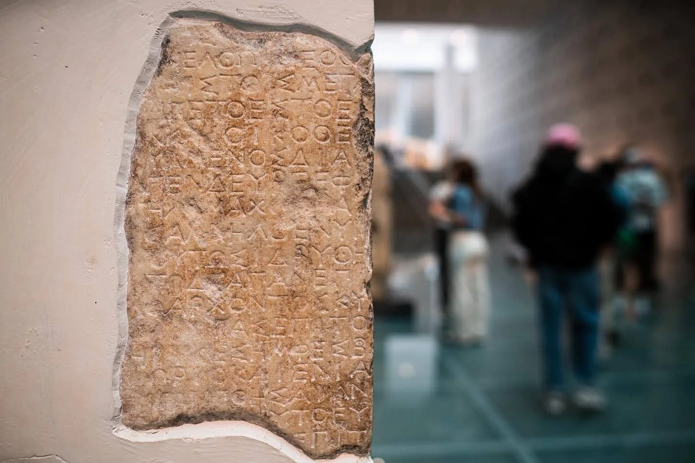

Oudgriekse inscriptie, Akropolismuseum Athene

Maar deze inscripties zijn, zoals vele andere bronnen doorheen de jaren, niet altijd goed bewaard gebleven. Vernietigd of beschadigd door de tand des tijds, door menselijke handelen of blootstelling aan natuurelementen. Hierdoor zijn teksten onleesbaar, ontbreken tekens of volledige zinnen. Voordat men onderzoek kan doen naar de geschiedenis die verscholen zit in de inscriptie, moet een epigraficus het werk proberen herstellen. Hiervoor zijn die 600.000 gevonden inscripties van onschatbare waarde, maar dat is een gigantische hoeveelheid kennis en data waar een epigraficus zijn weg in moet vinden. Geen eenvoudige opgave!

### AI to the rescue

Die 600.000 gekende vondsten zijn een vloek en een zegen. Een zegen omdat ze een schat aan informatie kunnen geven aan de epigraficus, maar ook een vloek omdat het een hele grote set aan data vormt om te beheersen. Om de epigraficus hierbij te helpen, gebruiken we de grote rekenkracht van een AI-model. Voor een eerder lesproject gebruikten we **Pythia** in de klas. Een ontwikkeling van Yannis Assael en Thea Sommerschield bij de universiteit van Oxford. Voor versie 2.0 van dit project kijken we opnieuw naar Yannis, Thea et al. voor hun vernieuwde AI-model genaamd **Ithaca**. Dit vernieuwde model komt met verbeteringen en nieuwe mogelijkheden, zoals situeren in de ruimte en tijd!

### **Input** - rebelse poëzie of liever de sterren en muzen?

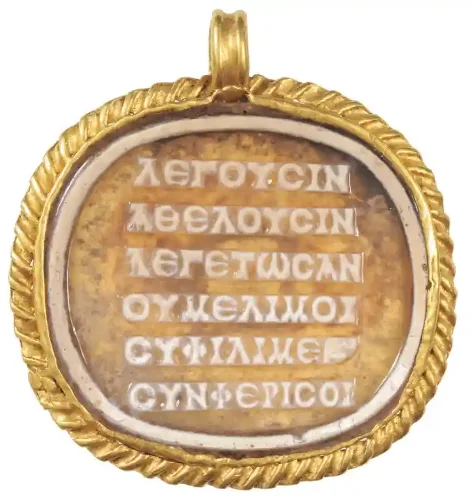

In dit lesproject kan je kiezen tussen twee inscripties om te behandelen. [De eerste komt uit een onderzoek van Tim Whitmarsh van de universiteit van Cambridge](/onderwijs/ai-grieks-epigrafie-poezie-en-ai-met-pythia), de tweede inscriptie werd uitgekozen door Noor Vanhoe (student UGent) en handelt over de muze Ourania. De keuze voor de inscriptie heeft natuurlijk gevolgen voor het laatste deel van dit lesproject, wanneer we de kenmerken en geschiedenis achter de inscriptie bespreken.

Bij beide teksten hebben we karakters verwijderd. Zo krijgen de leerlingen een onvolledige inscriptie voor de kiezen. De volgende stap van een epigraficus is proberen achterhalen hoeveel karakters er verdwenen zijn. Wanneer dit gebeurd is door de tand des tijds of menselijke ingrijpen vele jaren geleden, is het aantal ontbrekende karakters een pak moeilijker te achterhalen. Bij deze stap helpen we de leerling door zelf aan te duiden waar er karakters werden gewist. Deze ontbrekende karakters duiden we aan met een vraagteken.

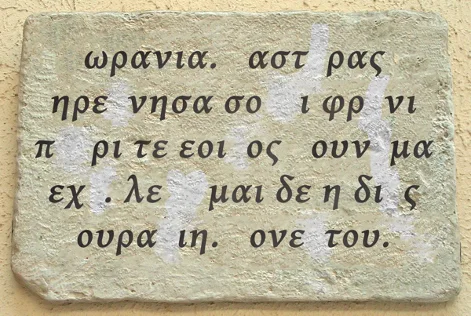

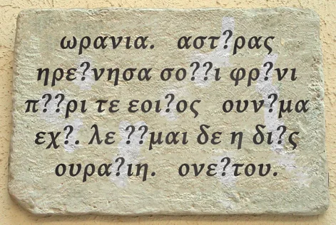

### Verwerking door Ithaca

Wanneer we de tekst hebben aangevuld met vraagtekens, moet deze worden ingevoerd in het AI-model. Hiervoor gebruiken de leerling hun Grieks toetsenbord. Zo oefenen in dit lesproject ook het gebruik hiervan! Bij het invoeren moeten de leerlingen letten op het gebruik van de Leidense Conventies. Zo worden diakritische tekens, hoofdletters en leestekens achterwege gelaten. Dit maakt de tekst beter te begrijpen voor het AI-model. Daarna voegen wie dit elementen terug in de output.

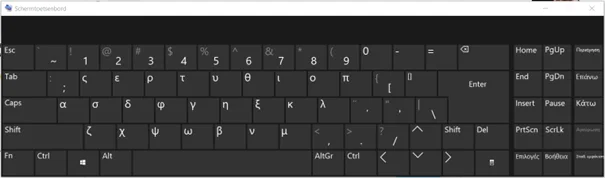

Wanneer alles is ingevoerd, zal de AI een poging tot restauratie ondernemen. Hiervoor maakt het gebruikt van kansberekening. **Ithaca is getraind op een dataset van 178.551 getranscribeerde teksten van het Packard Humanities Institute (PHI)**. Daarna zal het AI-model voor elk ontbrekend karakter nagaan welk karakter daar zou kunnen staan. Daarvoor gebruikt het ‘attention mechanisms’, waarbij het kijkt naar andere karakters en woorden in de zin en de ruimere context.

### Output - hypotheses en situeren

Wanneer het AI-model achter Ithaca klaar is met de kansberekeningen, komt het met hypotheses. Maar liefst twintig verschijnen er op het scherm, met elk hun percentage. Dit percentage drukt uit hoe zeker het model is van die hypothese. Je zal merken dat:

1.  geen hypothese 100% zekerheid kent;

2.  er mogelijks in de beste hypotheses nog fouten zitten.

Dit is een belangrijke les over het gebruik van artificiële intelligentie. **Je werkt niet met absolute zekerheden** en het dient als tool om de mens, in dit geval de epigraficus, te helpen bij diens job. Het is een tool zoals een elektrisch boormachine dat is voor een houtwerker. Die kan hetzelfde doel proberen bereiken met een schroevendraaier en kracht, maar het kost ook meer tijd. De rekenkracht van een AI-model zoals Ithaca inschakelen brengt de benodigde werktijd van de epigraficus terug van (in sommige gevallen) twee uur naar ongeveer vijf minuten. En net zoals bij een boormachine, kan je er ook met deze tool eens naast zitten. **Daarom hebben we nog steeds de vakkennis van de epigraficus nodig om de machine te corrigeren!**

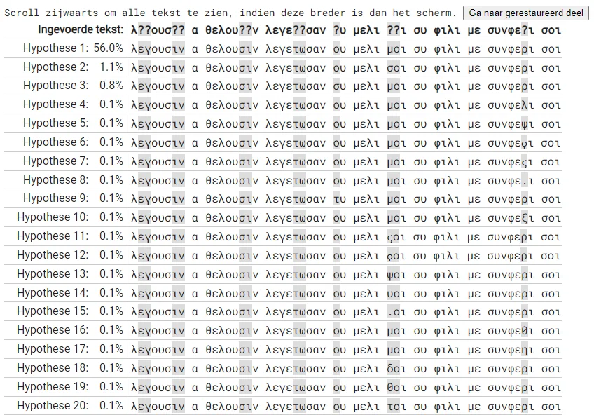

Naast de top 20 aan hypotheses komt het model ook met nieuwe functies. Functies die nog niet in het **Pythia AI-model** staken. Zo kan het, opnieuw op basis van kansberekening, de tekst **situeren in de ruimte en de tijd.** Dit wil zeggen dat het een kaart en tijdslijn kan genereren.

Hoe groter de cirkel om onderstaande kaart, hoe meer onzekerheid dit uitdrukt. Het model kan ook via staafdiagrammen uitdrukken welke regio’s het meeste kans maken als oorsprong van de inscriptie.

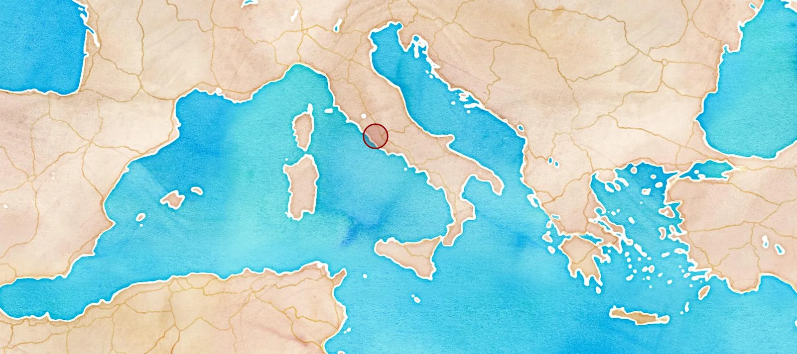 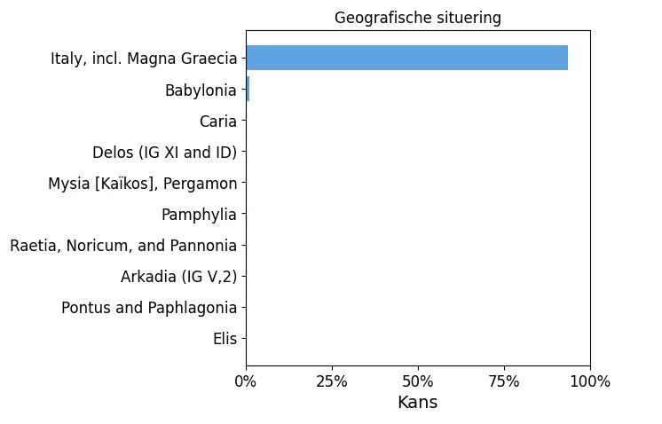 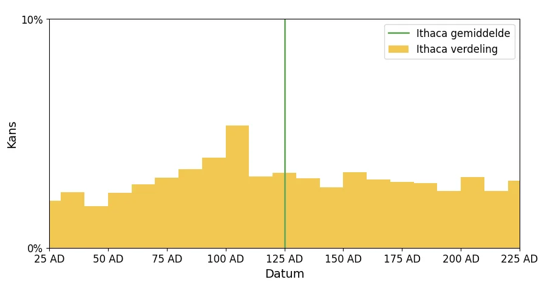

Naast het situeren in de ruimte, kan het model ook **situeren in de tijd.** Ook dit is een belangrijke stuk informatie en vaardigheid. Bij het situeren in de tijd werd de tijdslijn, van 800 v.C. tot 800 n.C. ingedeeld in decennia. Het model probeert dus, opnieuw via kansberekening, te achterhalen uit welk decennium de tekst afkomstig is. Ook hier geeft het daarvan een grafische weergave.

### Over Ourania, muze van de astronomie

Eenmaal de tekst werd hersteld en gesitueerd in de tijd en de ruimte, is het tijd om deze te vertalen van het Oudgrieks naar het Nederlands. Dat is een vaardigheid die Ithaca noch Pythia bezitten, maar de leerlingen wel. Het is dus een goede oefening om individueel, in groepjes of klassikaal de tekst te vertalen en zo de boodschap te achterhalen.

De tekst waar wij voor gekozen hebben in dit project (tekstfragment twee, gekozen door Noor Vanhoe), over de muze Ourania, kan je hieronder vinden. Inclusief de output zoals wij deze kregen uit het AI-model en de bijhorende vertaling.

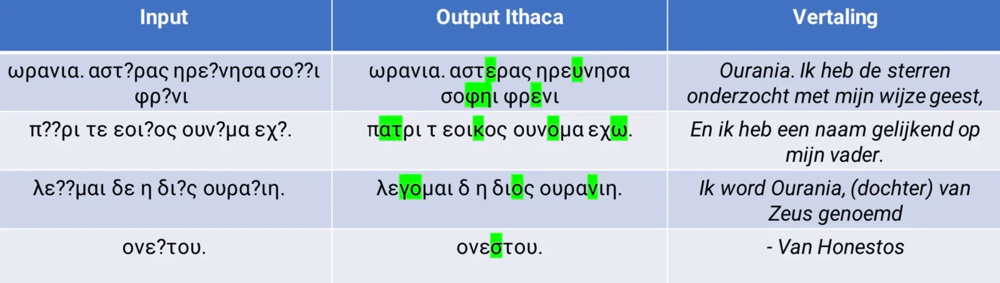

Wanneer we de tekst vertalen, zien we dat het gaat over Urania of eerder Ourania, muze van de astronomie. Het is een ideaal moment om met de leerlingen in de wereld te duiken van de muzen. Ze kunnen we het hebben over hun rol in de Griekse mythologie, hun vakgebieden, over hun voorstellingen in de klassieke oudheid tot nu.

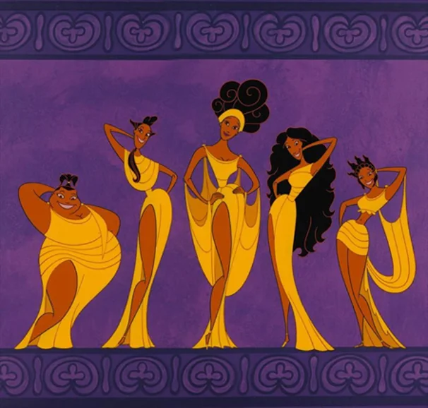

### Benodigdheden

Voor dit lesproject heb je volgende zaken nodig:

-   Een laptop per leerling of per twee leerlingen;

-   Een stabiele internetverbinding;

-   De werkbundel die hoort bij dit lesproject;

-   De PowerPoints-slides en hand-out die horen bij dit lesproject;

-   Ongeveer 1 lesuur per onderdeel (dus reken drie à vier lesuren in totaal).

### Lesdoelen

Bij de ontwikkeling van dit lesproject werden relevante **leerplandoelen** geselecteerd uit het leerplan Grieks, 3de graad, binnen het Katholiek Onderwijs Vlaanderen. De geselecteerde doelen zijn:

**Leerplandoelen na de hervorming (vanaf schooljaar 2023-2024):**

-   **LPD 8:** De leerlingen tonen aan dat ze de tekst begrijpen: de tekst weergeven in eigen woorden, samenvatten, vragen beantwoorden en vertalen.

-   **LPD 14:** De leerlingen beschrijven stijlmiddelen en verwoorden de functie ervan binnen een tekst.

-   **LPD 18:** De leerlingen vergelijken vertalingen met de brontekst en met andere vertalingen.

-   **LPD 19:** De leerlingen situeren auteurs en teksten binnen hun cultuur-historische context.

-   **LPD 22:** De leerlingen illustreren de receptie van de klassieke oudheid of van latere periodes.

**Leerplandoelen voor de hervorming (voor schooljaar 2023-2024):**

-   **LPD 9**: tekstbegrip tonen door de hoofdgedachte uit de tekst te halen, de tekst te parafraseren, de tekst te synthetiseren, de tekst expressief te lezen, een werkvertaling of vlotte vertaling van de tekst te maken (SET 13, 15);

-   **LPD 12**: typische stijlmiddelen aanduiden en de functie ervan binnen de tekst toelichten (SET 2, 4, 9);

-   **LPD 17**: de relatie tussen inhoud en vorm kritisch evalueren en de expressieve waarde beoordelen volgens klassieke en hedendaagse visies (SET 9, 18);

-   **LPD 20**: vertaalproblemen verwoorden (SET 17);

-   **LPD 23**: auteur(s) en werk(en) binnen de cultuurhistorische context situeren en die context bij de interpretatie van teksten betrekken (SET 5, 14).

Bij de lesontwerp werden ook **lesdoelen** geformuleerd. Na dit lesproject kan je:

-   in eigen woorden duiden wat een inscriptie is;

-   een voorbeeld geven van een inscriptie (geschiedkundige bron);

-   uitleggen wat de taak is van een epigraficus;

-   duiden hoe een AI-model een epigraficus kan helpen;

-   duiden waarom een AI-model zoals Ithaca een epigraficus niet zal vervangen;

-   gebruikmaken van het Grieks toetsenbord om een tekst te digitaliseren;

-   de uitvoer van het Ithaca AI-model uitleggen;

-   het herstelde werk vertalen naar het Nederlands;

-   de rol van de muzen in de Griekse mythologie duiden;

-   de inhoud van de herstelde tekst duiden.

Dit project en de bijhorend werkbundel zijn onderverdeeld in **vier lesdelen**, namelijk:

1.  Inleiding epigrafie (theoretisch via klasgesprek, duurtijd 1 lesuur)

2.  Inleiding AI en machine learning (theoretisch en praktijkleerlingen, duurtijd 1 lesuur)

3.  Lectuur van de tekst (klassikale vertaling of in groep, duurtijd ongeveer 1 lesuur)

4.  Bespreking van de Muzen (theoretisch via klasgesprek, duurtijd 1 lesuur)

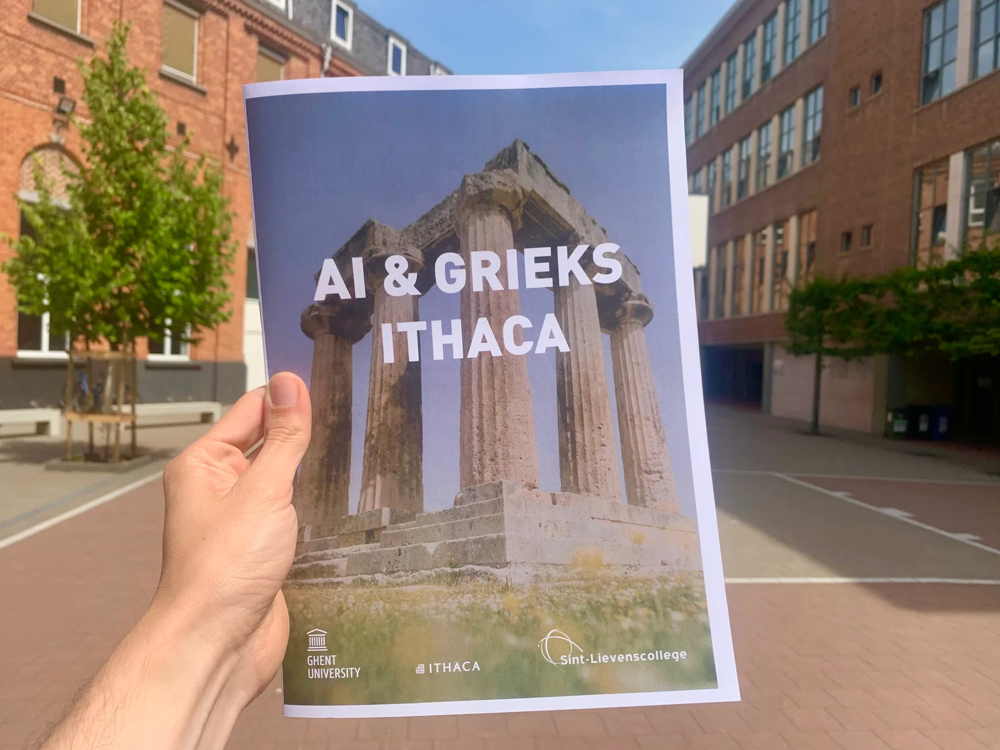

Dit lesproject heeft een gehele hand-out voor leerlingen en leerkrachten.

### Ik wil dit in mijn klas! Wat moet ik doen?

Wil je hier zelf mee aan de slag in jouw klaslokaal? Super! De toekomst zal steeds meer en meer digitaal zijn. Een toekomst waar artificiële intelligentie een heel belangrijke rol in zal spelen. Dat we jongeren hierop moeten voorbereiden en motiveren, spreekt voor zich. Ik wil jou daar gerust bij helpen! Via de knoppen hieronder kan je mij een bericht sturen of informatie krijgen over een nascholing of workshop. Ik antwoord veelal binnen de 48 uur!

<a class="content-button content-button--primary content-button--medium" href="https://www.vaia.be/nl/opleidingen/ai-en-grieks-epigrafie-met-muzen-en-robots">Info workshop</a>

<a class="content-button content-button--primary content-button--medium" href="/contact">Ik heb een vraag</a>

