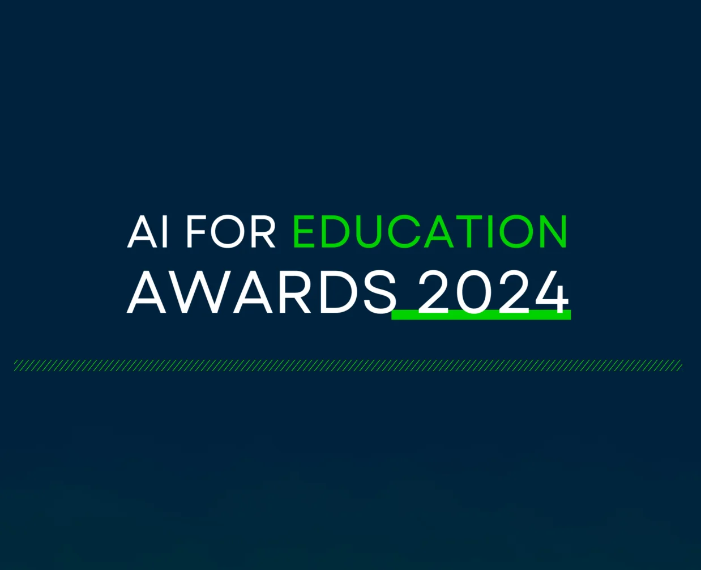
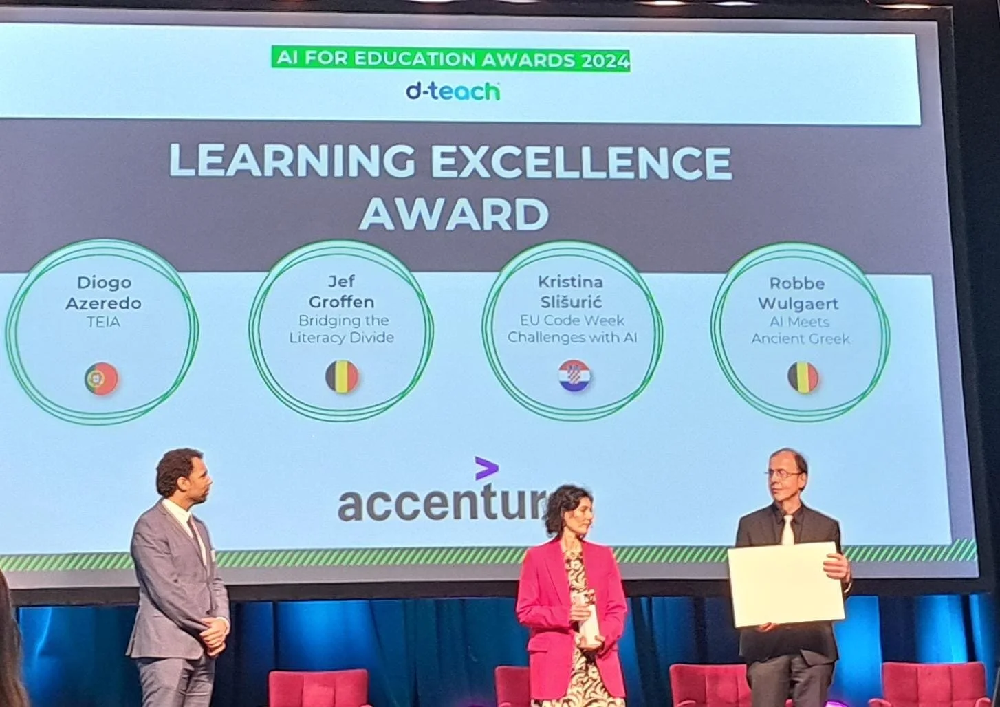
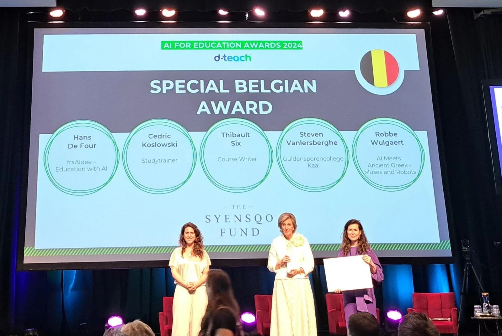

### Op dinsdag 18 juni 2024 vond in Oslo de ‘AI For Education Awards’ - prijsuitreiking plaats. Daarbij worden Europese lesprojecten, praktijkvoorbeelden en aanpakken over- en met artificiële intelligentie in de kijker gezet. In maar liefst drie categorieën konden prijzen gewonnen worden. [Het lesmateriaal van Yannis, Thea, Noor en ikzelf over Griekse epigrafie en artificiële intelligentie](/onderwijs/ithaca-teaching-history-journal) won in maar liefst twee van die categorieën, ‘Learning Excellence’ en ‘Special Belgian Award’, tweede plaats! Onze inzending (in het Engels) kan je integraal hieronder lezen.

The 'AI Meets Ancient Greek - Muses and Robots' project is a novel integration of artificial intelligence with classical education, designed to enrich both teaching and learning experiences. This initiative equips educators and students with comprehensive teaching materials, a trained and accessible AI model, and an AI literacy program, facilitating engagement with classical studies through technology. By enabling the restoration and interpretation of ancient Greek texts, the project not only makes classical studies more interactive but also teaches participants to critically scrutinize AI outputs. This promotes an evidence-based cooperation between human insight and technological capabilities, equipping learners with essential skills for a technological future. Bridging ancient scholarship with modern computational methods, the project sets a new standard for the potential of AI in educational settings across radically diverse disciplines.

<!-- p08-deferred:media-8360687d51721032 -->

### Relevance of innovation:

Utilizing the AI model Ithaca not only as a tool for textual restoration but also as a dynamic component of classroom interaction, this approach prepares students for interdisciplinary learning environments. Additionally, the project includes teacher training programs and class materials that enable educators to implement and leverage AI within their teaching practices. By merging machine learning with historical linguistics, these resources ensure that both teachers and students can explore the complexities of classical texts through modern technological lenses. This integration underscores the continued relevance of classical studies and exemplifies how traditional educational content can be aided by technology.

### Integration with educational goals and impact

We build on research by Thea Sommerschield and Yannis Assael, using their findings on AI’s capabilities to analyze and restore ancient Greek texts to form a robust partnership between K-12 education and Ghent University. This collaboration has transformed these research insights into practical classroom and teacher training materials. These efforts are further extended through Robbe Wulgaert’s leadership in AI teacher training programs at the University of Antwerp.

Efforts to valorize these educational innovations include diverse media exposure, such as a featured video on Google DeepMind’s social media, illustrating the project's methodologies and its practical applications in education. This visibility helps to highlight the synergy between academia and industry, enhancing global access to these educational resources.

However, challenges remain, particularly in AI literacy among educators and the infrastructure needed to support AI technologies in schools. Addressing these, the project has developed professional courses and adaptable class materials in multiple languages, featured in various publications. This approach ensures accessibility and supports the integration of AI into diverse educational environments.

### Equity and inclusion

The project advances equity and inclusion in education by democratizing access to AI tools via a web- based platform and accessible Python code. This approach ensures that all students can engage with the content. By integrating AI into these traditionally non-technical subjects, the project not only broadens the appeal of the humanities but also showcases their relevance in a modern digital context. This inclusive strategy encourages a diverse range of students to explore AI. Furthermore, the simplicity of the programming involved ensures that even educators without prior experience can facilitate learning. These features collectively promote an equitable learning environment where every student can interact with advanced technology in meaningful ways.

### Ethics and privacy

The project places an emphasis on addressing concerns in AI education. Utilizing research by Assael and Sommerschield, the project ensures transparency in the AI’s training processes with data sourced from the Packard Humanities Institute. To safeguard privacy, the project offers dual usage modes: offline access via Python scripts and Notebook for data control and Google Colab for ease of use. This setup accommodates diverse educational needs while meeting privacy standards. By maintaining control over data and providing flexible operational modes, the project ensures that all interactions with the AI are secure, private, and ethically managed.

### Balanced integration of AI and human-centered learning

The project exemplifies a balanced integration of AI with human-centered learning, bridging STEM and humanities. Students interact with ancient texts, blending AI precision with human interpretation to enhance text restoration accuracy and decrease character error rates. This evidence-based approach, highlighted in the research paper by Assael and Sommerschield, demonstrates significant improvements when AI tools are augmented by human oversight.

Additionally, the project emphasizes the development of digital and AI literacy, teaching students to not only use AI tools but to understand and critically assess their outputs. Such skills encourage students to view AI as an aid to human reasoning rather than a replacement, fostering a balanced perspective on AI's role in education. This strategy prepares students for a future requiring interdisciplinary skills, reducing overreliance on AI, and promoting an understanding of its strengths and limitations.

### Supporting technology

The project utilizes the Ithaca AI model to analyze ancient Greek texts. This core technology is implemented through the usage of Notebooks, enabling a user-friendly environment that adjusts in complexity to suit various levels of user expertise, thereby enhancing accessibility for both students and teachers.

Transparency and collaboration are facilitated through GitHub, where the project’s resources are openly available. This open-source approach not only fosters community involvement but alsoensures continual updates and issue resolution. The technologies chosen are highly adaptable, fitting diverse educational settings. Regular updates are communicated via GitHub, where users can access detailed changelogs. Custom Notebooks by Wulgaert ensure smooth integration of these updates, maintaining effective integration into K-12 education.

### AI-literacy of educator

As an educator involved in AI education, I actively enhance my skills through initiatives like contributing to the EU report on digital education and AI. This involvement not only boosted my expertise but also allowed me to shape AI integration strategies across the educational landscape. My role in creating the AI advice notice with Flanders' student body and participating in the VRT TV show on AI's role in education highlight my commitment to advancing AI knowledge and its practical applications in teaching.

I lead workshops, helping peers understand and integrate AI in their curricula, emphasizing the need for critical thinking alongside AI use. This approach promotes a balanced understanding of AI’s capabilities and limitations, ensuring that both educators and students can critically engage with AI tools.

* * *

### Wie ontwierp deze leermaterialen?

Deze materialen werden ontwikkeld door Robbe Wulgaert (Sint-Lievenscollege) en Noor Vanhoe (Student Verkorte Educatieve Master Grieks-Latijn Universiteit Gent), samen met docenten Katrien Vanacker en Katja De Herdt (Universiteit Gent). Dit project is een verdere ontwikkeling van het onderwijsproject 'AI & Greek - Pythia' en bouwt voort op onderzoek van Tim Whitmarsh (Cambridge University) en de AI-modellen (Pythia en Ithaca) ontworpen door Yannis Assael (Oxford University, Google DeepMind), Thea Sommerschield (Oxford University) en anderen.

### Referenties

1\. [Publication Australian Journal for History Education](/education/ithaca-teaching-history-journal)

[2\. Teaching materials (article)](/education/ai-and-greek-epigraphy-with-a-robot)

3\. Teaching materials (PDF): Werkbundel Ithaca - ENG.pdf

4\. [Courses for teachers – exploring class materials and training AI literacy (Dutch)](https://cno.uantwerpen.be/nl/opleiding/artificiele-intelligentie-en-griekse-epigrafie-een-knap-duo-78397?filter=15_41_85)

5\. Courses for teachers - exploring class materials and training AI literacy (English)

6\. Science Projects Online Workshops - Scientix

[7\. Video Google DeepMind on project and educational outreach:](https://twitter.com/GoogleDeepMind/status/1708831176910151958/video/1)

[8\. AI report on Artificial Intelligence in formal education:](https://op.europa.eu/en/publication-detail/-/publication/9bb60fb1-b42a-11ee-%20%20b164-01aa75ed71a1/language-en)

9\. [Website Google DeepMind](https://ithaca.deepmind.com/)

10. [GitHub project webpage](https://github.com/google-deepmind/ithaca)

11. [Research outcomes by Yannis Assael and Thea Sommerschield](https://www.nature.com/articles/s41586-022-04448-z)

12. [Policy recommendation on AI in education by Scholierenkoepel (VL)](https://www.scholierenkoepel.be/kennisbank/scholieren-over-de-toekomst-%20%20van-artificiele-intelligentie-en-vr-in-de-klas)

13\. [‘Het Digitale Dilemma – AI: Sprookje of Nachtmerrie’ (TV show, public](https://www.vrt.be/vrtmax/a-z/het-digitale-dilemma/1/het-digitale-%20%20dilemma-s1a2/)

[broadcast)](https://www.vrt.be/vrtmax/a-z/het-digitale-dilemma/1/het-digitale-%20%20dilemma-s1a2/)

14\. [Google Colab Notebook – Epigraphy and AI with Ithaca (Robbe W)](https://colab.research.google.com/drive/1CybfwDPofZi2puqS1idNYSdkCDkVsX%20%20EW?usp=sharing)

### Meer informatie over dit soort AI-lesmateriaal en veel meer vind je in:

