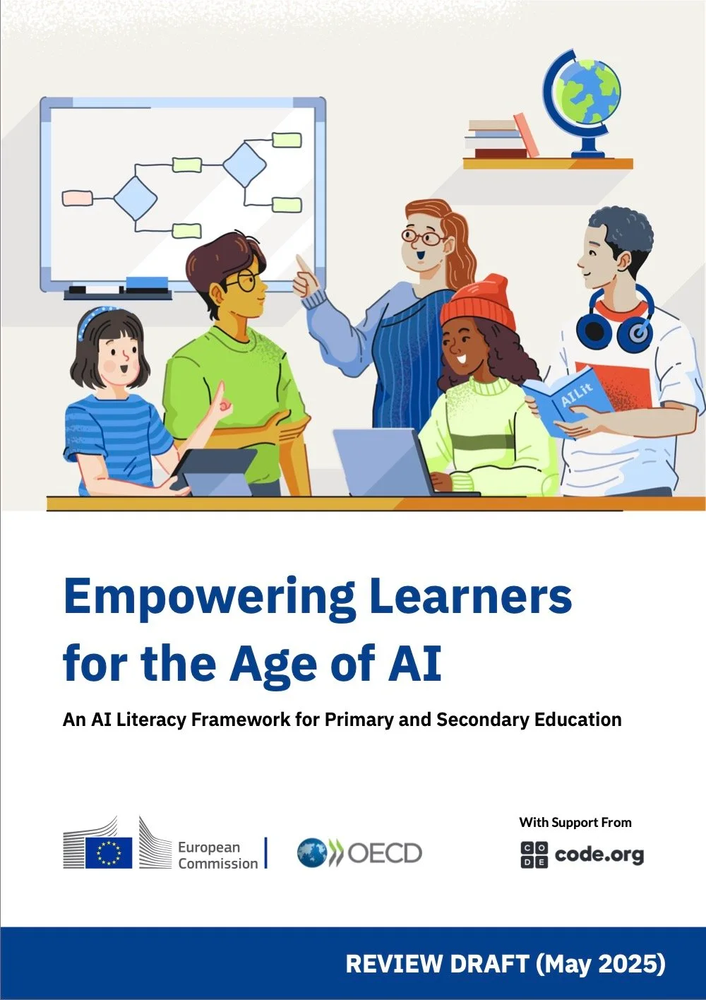
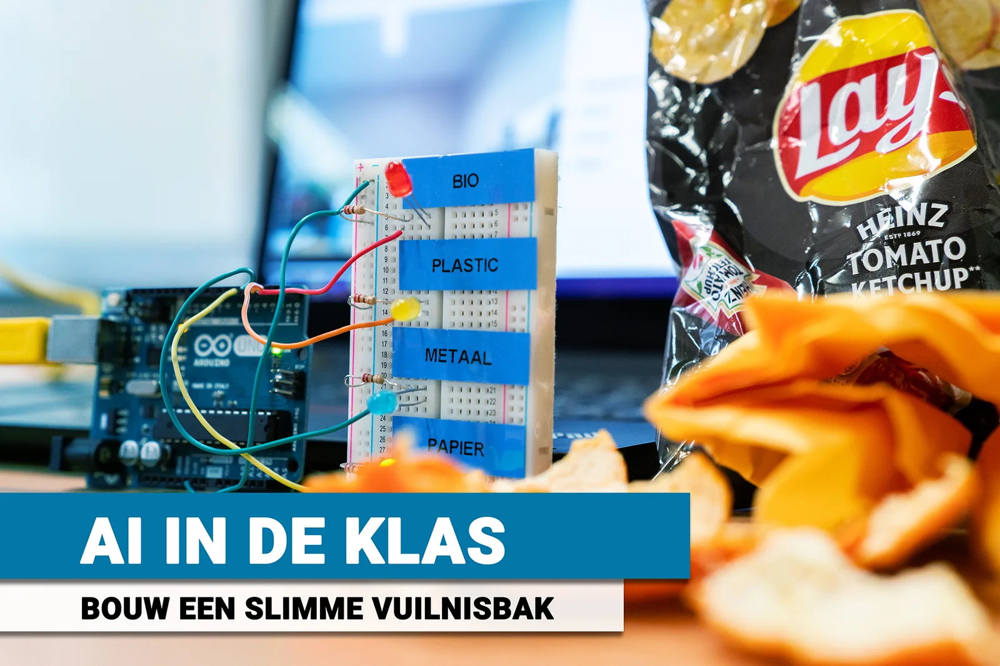
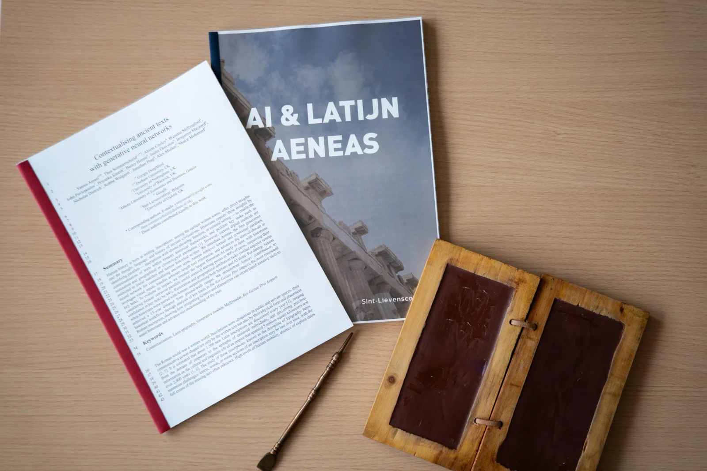
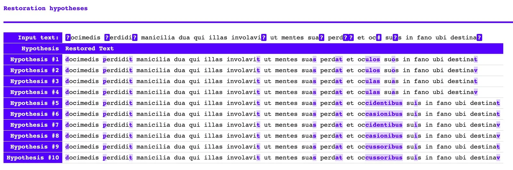

### Op maandag, dinsdag en woensdag 17 tot 19 november vindt in Brugge het [achtste onderwijscongres](https://www.brugge.be/achtste-onderwijscongres-brugge) plaats. Daar staat taal centraal. Via diverse workshops, lezingen en samenwerkingen zet de stad en de collega’s van de Openbare Bibliotheek taal in de kijker. Daar hoort ook een klein magazine bij. De organisatoren vroegen me, om in het verlengde van mijn workshop op het congres, naar mijn visie op AI-geletterdheid en taal. Dit artikel kan je vinden un hun magazine maar ook hieronder! 
_“Waarom moeten wij dit kennen?”_ 

Generatieve AI is wijdverbreid in Vlaanderen en dringt ook de klas binnen. Cijfers van de Vlaamse Scholierenkoepel (2023) en imec Digimeter (2023–2024) tonen die groei. Die snelle groei zet niet zelden druk op leerwinst en zelfstandig denken. Een gegeven wat vele leerkrachten al aan den lijve hebben ondervonden. In een studie van Acco (2024) gebruikt 75% van de studenten AI vooral als zoekmachine-vervanger, en 49% van 17- tot 27-jarigen worstelt met het controleren van AI-antwoorden (Merriman & Sanz Sáiz, 2024). De vraag is dus: hoe leren we leerlingen AI juist gebruiken, en wat verstaan we onder AI-geletterdheid in de klas? In wat volgt definiëren we AI-geletterdheid, toetsen we die aan twee lesprojecten en koppelen we onze aanpak aan bestaande competentiekaders.

### Wat is AI-geletterdheid?

Framework van de OESO en Europese Commissie ([bron](https://ailiteracyframework.org/wp-content/uploads/2025/05/AILitFramework_ReviewDraft.pdf))

AI-geletterdheid is geen nieuw modewoord; het is de doorontwikkeling van klassieke ICT-vaardigheden: begrijpen hoe digitale systemen werken en ze verantwoord toepassen. In kaders van de Europese Commissie en de OESO wordt AI-geletterdheid beschreven als de kennis, vaardigheden en attitudes om met AI te werken, te creëren en kritisch te blijven kijken naar kansen, risico’s en ethiek. In het AI-raamwerk van de Europese Commissie en de OESO definiëren we AI-geletterdheid als volgt: 

_“AI-geletterdheid omvat de technische kennis, vaardigheden en attitudes die noodzakelijk zijn om te leven en groeien in een samenleving waar AI een grote invloed heeft. Het stelt leerlingen in staat om aan de slag te gaan met de technologie, nieuwe inhouden te creëren en AI te ontwikkelen terwijl ze kritisch kunnen en blijven kijken naar de potentiële voordelen, nadelen, risico’s en ethische implicaties.”_  

AI-geletterdheid is het vermogen om AI kritisch en verantwoord te gebruiken én te ontwikkelen in context. Dat vraagt systeemkennis (hoe modellen werken) én vakspecifieke kennis om output te beoordelen. Voor geschiedenis betekent dit bijvoorbeeld dat je de Vruchtbare Sikkel in tijd en ruimte kunt situeren vóór je een AI-samenvatting controleert.

Op basis van die definitie laten we zien hoe dit er in de klas uitziet: eerst de Slimme Vuilnisbak (AI-cyclus), daarna Aeneas bij Latijnse en Griekse opschriften.

### Lesproject 1: Achter de schermen van AI

Vanuit de definitie van AI-geletterdheid verkennen we eerst de technische kennis, vaardigheden We starten met de AI-cyclus. Leerlingen bouwen een slimme vuilnisbak: een systeem dat via een webcam afval herkent en leds of motoren aanstuurt naar de juiste bak. De werking lijkt op herkenningsapps zoals ObsIdentify, maar dan met een zelfgetraind model in de klas. Het lesmateriaal is modulair en schaalt mee met voorkennis en leeftijd (van 10 tot grofweg 18 jaar).  

_Arduino en breadboard met de ledjes die oplichten als bepaald stuk vuilnis herkent wordt._

Eerst verzamelen en labelen leerlingen beelden. Daarna trainen ze een model en laden de dataset in. Al doende ontdekken ze dat meer data vaak helpt, maar ook kost: langere traintijd en soms afnemende meeropbrengst of zelfs overfitting als de data eenzijdig is.

Vervolgens evalueren ze de robuustheid: presteert het model zoals verwacht, ook bij twijfelgevallen? Reageert het hetzelfde op een foto van een banaan als op een echte? Waarom ziet het soms een mens als papierafval, en welke data- of drempelaanpassingen lossen dat op?

Ten slotte koppelen we het getrainde netwerk aan de fysieke wereld. Met micro:bits en Arduino’s laten leerlingen leds oplichten en motoren bewegen en bouwen ze een werkend prototype in een echte vuilnisbak.

<!-- p08-deferred:media-d5d9f1396511c999 -->

 Zo ervaren ze alle ontwikkelfasen van een AI-systeem: van data tot deployment. Ze zien hoeveel menselijk werk in dataverzameling en labeling zit, dat trainen bij AI iets anders betekent dan bij mensen en hoe datasetkeuzes het resultaat in het wild kunnen maken of kraken. Met die basis schakelen we naar de vakcontext: hoe helpt AI bij historische bronnen?

### Lesproject 2: Vakkennis en AI-kennis

Na de ‘Slimme Vuilnisbak’ schakelen we over naar de lessen talen. Geen Engels, Frans of Duits maar wel de klassieke talen! We werken met opschriften: teksten op steen of metaal die door de tand des tijds of menselijk handelen vaak beschadigd, vervaagd of ontheemd zijn (buiten hun oorspronkelijke context). Dat maakt bronanalyse, lezen, vertalen, interpreteren, een uitdaging voor een historicus. Samen met collega’s ontwikkelden we Aeneas, een klasvriendelijke AI-tool die laat zien hoe AI-technologie kan helpen zonder de mens te vervangen. 

_Lesmateriaal en_ [_Nature-artikel_](https://www.nature.com/articles/s41586-025-09292-5) _rond het Aeneas-onderzoek._

Aeneas vult ontbrekende tekst aan, schat een datering per decennium, raamt de vermoedelijke herkomst en stelt vergelijkbare parallelteksten voor ter context. De mens blijft aan het stuur: leerlingen beoordelen suggesties en hypothesen, onderbouwen hun keuze en noteren aanvullingen volgens de Leidse Conventies (dat is een standaardnotatie voor lacunes en aanvullingen). Relevantiekaarten tonen welke woorden of tekens de uitkomst van het AI-model het zwaarst bepaalden, zodat we niet alleen wat, maar ook waarom kunnen bespreken.

_Restauratiehypotheses van het Aeneas-model._

Wat Aeneas níét doet, is opschriften cultureel en historisch kaderen. Het systeem kan een beschadigd votiefaltaar helpen restaureren, maar vakkennis blijft nodig om te begrijpen dat de vermelde veldslag in een woelig jaar voor het keizerrijk past. Kritisch evalueren en contextualiseren blijven dus menselijke taken. Precies daar ontstaat de tandem: leerlingen koppelen vakinhoud aan uitlegbare AI-uitvoer en leren verantwoord onderbouwen. In de volgende sectie tonen we waar dit in het curriculum en in bestaande leerplankaders past.

### In welk leerplan staat dit?

Er zijn (nog) geen Vlaamse minimumdoelen of leerplannen voor AI-geletterdheid. Dat betekent niet dat we zonder houvast werken. We koppelen onze aanpak aan bestaande leerplankaders: het UNESCO AI Literacy Framework, DigComp 2.2 en het AI-geletterdheidskader van Europese Commissie/OESO richting PISA 2029.

Binnen het AI Literacy Framework worden de competenties onderverdeeld in vier competentiegebieden, namelijk betrekken (engaging), creëren (creating), beheren/verbeteren (managing) en ontwerpen (designing). Onze twee lesprojecten raken elk domein. In Lesproject 1 (Slimme Vuilnisbak) herkennen leerlingen AI-toepassingen, bouwen en testen ze een eigen model en sturen ze het bij: van betrekken en creëren naar beheren en ontwerpen. In Lesproject 2 (Aeneas, klassieke talen) analyseren ze historische bronnen samen met een AI-model, beoordelen ze de output, documenteren ze outputs en onderbouwen ze keuzes met bewijs: opnieuw betrekken, creëren, beheren en ontwerpen, maar nu in vakcontext.

Dit is een greep uit de mogelijkheden. Let op: niet elke les hoeft een les AI-geletterdheid te zijn. Soms werkt een bordschema, duidelijke instructie en oefeningen op papier beter dan een volgende digitale taak. Laat deze voorbeelden je vooral inspireren. AI-geletterdheid is namelijk méér dan een zoveelste tekst laten herschrijven met een chatbot.
