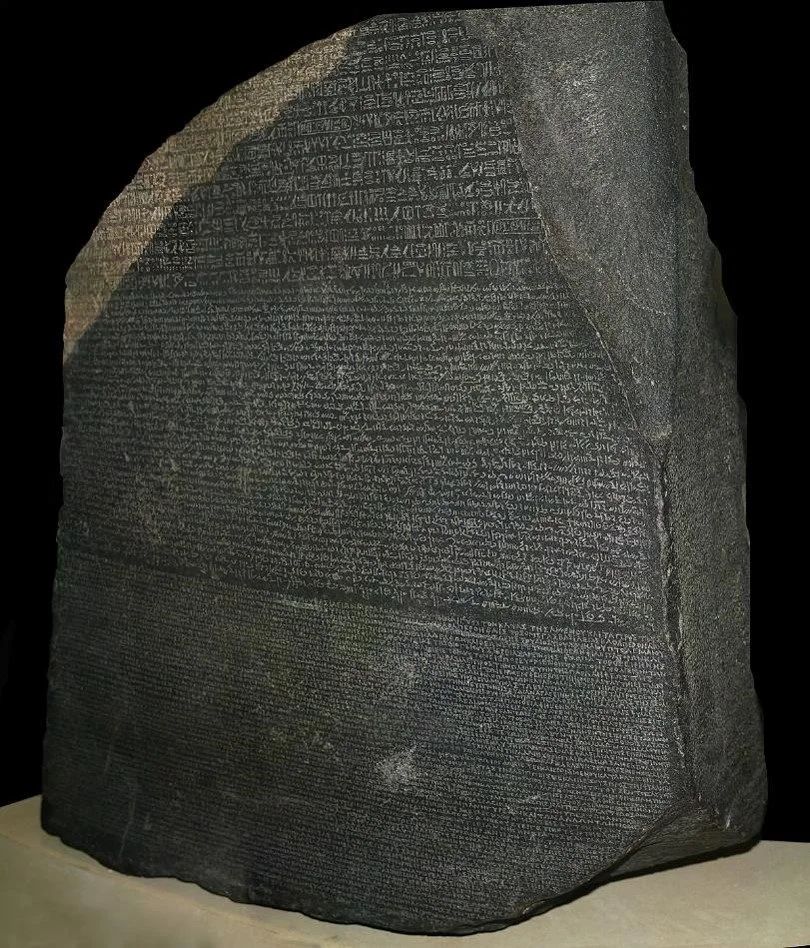
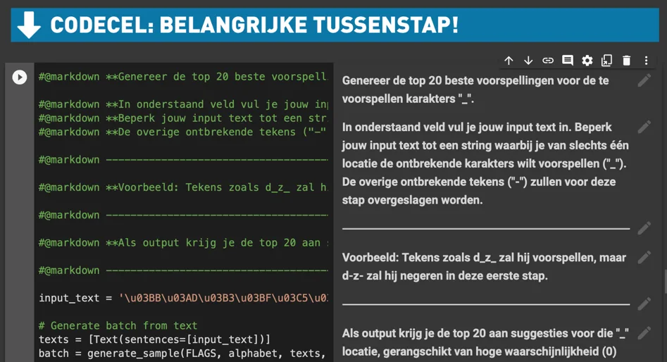
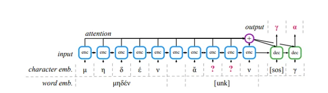
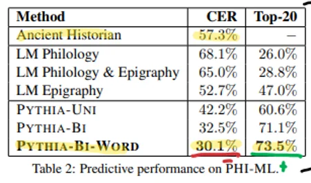
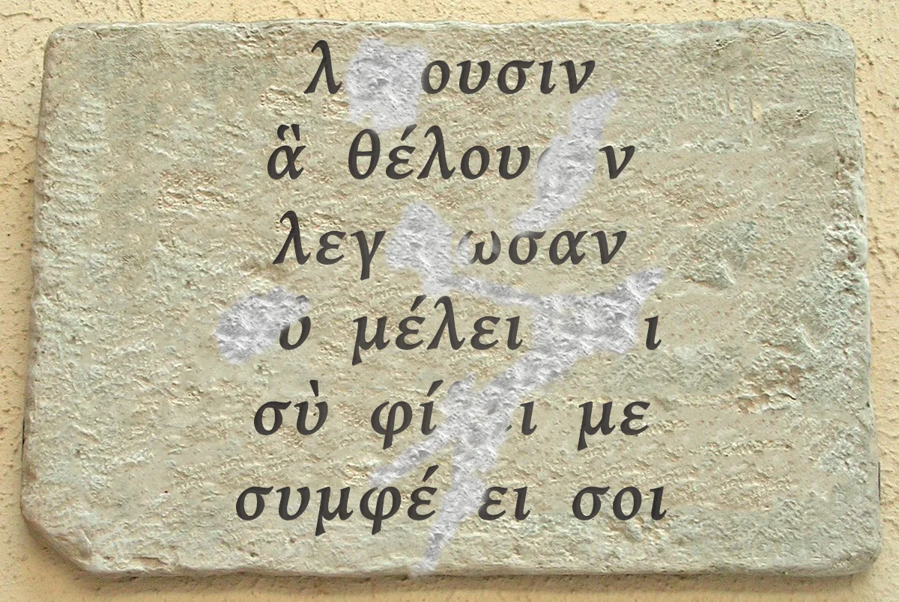
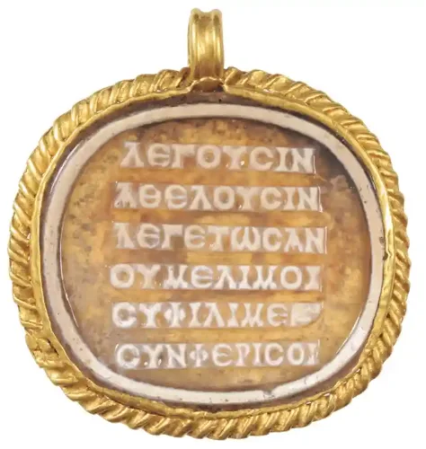
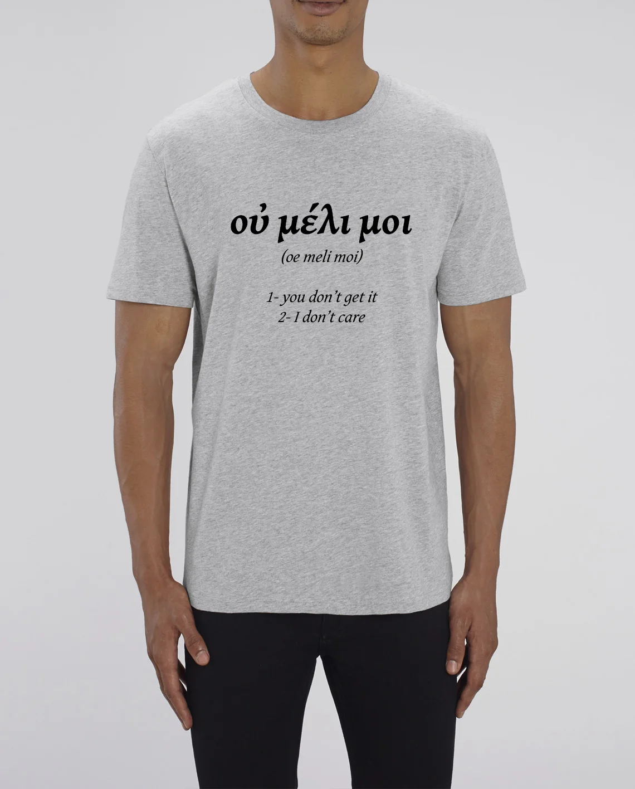

[Video on YouTube](https://www.youtube.com/watch?v=MhNinruUhUw)

**Bij het bestuderen van de Klassieke Oudheid vertrouwen we op allerlei bronnen. Verhalen van grote dichters, prachtige tempels, tekeningen op allerlei objecten … In dit AI-project maak je kennis met de epigrafie, de tak van archeologie die zich verdiept in inscripties op harde objecten. Teksten op stenen, graven of muren. Door de tand des tijd of menselijk handelen zijn die niet altijd meer even leesbaar. Maar wat als je deze met een AI-tool kon herstellen? Wat als je met deze aanpak de betekenis van een eeuwenoud gedicht kon achterhalen? Een gedicht, nota bene, dat de brug slaat tussen de poëzie uit de 2de eeuw n.C. en die van vandaag.**

**In dit AI-project, ontwikkeld in samenwerking met Bram Fauconnier van de UGent, combineren we onderzoek van de universiteit van Oxford en de universiteit van Cambridge tot één lespakket!**

### Kennismaking met Epigrafie

Epigrafie is de tak van de archeologie die zich focust op het onderzoeken van de geschiedenis door middel van inscripties. Deze vind je terug op bijvoorbeeld stenen, muren en graven, maar ook op brons of lood. Zo werden er honderdduizenden Griekse inscripties teruggevonden uit een periode van 800 v.C. tot 700 n.C. over een gigantisch gebied. Van Newcastle tot Kandahar, van Denemarken tot Jemen. Louis Robert zou de Griekse en Romeinse samenleving omschrijven als _“Une civilisation d’épigraphie”._

Epigrafie kan ons meer leren over de politieke, sociale, economische en culturele geschiedenis van die boeiende tijd. Bekende vonden zijn o.a. Res Gestae Divi Augusti en de Rosettasteen.

### Uitdagingen bij epigrafie

Vondsten uit het verleden zijn niet altijd in goede staat. Door de tand des tijds of menselijke interventie zijn stukken van de tekst verloren gegaan. Dit kan gaan over bepaalde karakters die vervagen of ontbreken. Vaak ontbreken volledige woorden, zinnen of gehele stukken van de tekst. Dit maakt het ontcijferen van de betekenis van de tekst niet eenvoudig!

De epigraaf kan dat terugvallen op zijn kennis en het bestaande corpus aan teksten om de vondst te herstellen. Dat is geen eenvoudige klus! Zo moet men bijvoorbeeld **eerst kunnen achterhalen hoeveel karakters en woorden er ontbreken**. Gezien de gigantische hoeveelheid teksten en mogelijke opschriften, kan dit en werk worden van lange adem.

**Een werk waar artificiële intelligentie bij kan helpen!**

### **Meet Pythia**

**Pythia** is een AI-model dat ontworpen is door [Yannis Assael en Thea Sommerschield bij de universiteit van Oxford.](https://arxiv.org/abs/1910.06262) Het is een model dat ze trainden op een gigantische collectie inscripties uit een periode van 700 v.C. tot 500 n.C. Deze werden verzameld door het Packard Humanities Institute. Deze basis aan teksten werden aangepast, diakritische tekens werden verwijderd … zodat het AI-model deze zou kunnen verwerken. Dit model werkte aan de hand van **unsupervised learning**.

De kracht van Pythia en de gebruikte AI-technieken is dat deze met heel grote hoeveelheden data overweg kunnen, deze kunnen analyseren en patronen ontdekken. Het is zo mogelijk om meer informatie in het geheugen te houden dan dat een epigraaf zelf zou kunnen.

Pythia kan daarna gebruikt worden om, gegeven een tekst met ontbrekende karakters, vliegensvlug op zoek te gaan naar de passende tekens. Opgelet, Pythia zal de job van de epigraaf niet overnemen! Pythia is niet feilloos, maar wel in te zetten als tool voor de epigraaf. Dit zien we terug in de slaagpercentages van het model. Bij het onderzoek bevond het juiste karakter, in 73.5% van de gevallen, zich bij de top 20 hypotheses die het AI-model voorstelde. Maar vertrouwde je gewoon op de nulhypothese voor alle ontbrekende karakters, daalde dat percentage significant.

### Aan de slag met Pythia

Wanneer we met Pythia aan de slag willen gaan, hebben we dus een vondst nodig. Daarvoor baseerde ik me op [het werk van Tim Whitmarsh van de universiteit van Cambridge.](https://www.cambridge.org/core/journals/cambridge-classical-journal/article/abs/less-care-more-stress-a-rhythmic-poem-from-the-roman-empire/B5A03C3981F21E885228D3C3184109E9) Hierin beschrijft hij een gedicht dat verspreid was van Spanje tot Hongarije, teruggevonden werd op muren, gegraveerd op edelstenen … Geen vorm van hoge literatuur, geen heldenepos of magnum opus van een bekende schrijver. Wel een klein gedicht met een eigenaardige vorm een interessant metrum!

Door middel van eenvoudige beeldbewerking werd dit gedicht aangepast zodat het beschadigd lijkt. Karakters ontbreken en maken de vertaling heel moeilijk. Wanneer we de tekst invoeren in Pythia, geeft die een bijna foutloos resultaat. Een resultaat dat we kunnen vertalen om de betekenis van het gedicht te achterhalen!

**Input:**

λ--ουσιν ἃ θέλου--ν λεγ--ωσαν -ὐ μέλει --ι σὺ φί--ι με συμφέ-ει σοι

**Output Pythia:**
λέγουσιν ἃ θέλουσιν λεγέτωσαν οὐ μέλει _τ_οι σὺ φίλει με συμφέρει σοι

### **οὐ μέλει μοι - op zoek naar de roots van moderne poëzie**

Dit gedicht bleek, na onderzoek, te werken zoals stressed poetry. Een vorm van poëzie die meer lijkt op hedendaagse poëzie dan andere werken van zijn tijd. Het gedicht is zodanig geschreven dat het visueel netjes in een kolom past, met op elke regel 8 of 9 karakters. Epsilons zijn zodanig geplaatst dat ze een diagonaal vormen en de laatste drie regels kennen een soort rijm.

**_λέγουσιν_** _- They say_

**_ἃ θέλουσιν -_** _What they like_

**_λεγέτωσαν_** _- Let them say it_

**_οὐ μέλει μοι -_** _I don’t care_

**_σὺ φίλει με -_** _Go on, love me_

**_συμφέρει σοι -_** _It does you good._

Meer dan louter de vorm, is ook de inhoud van het gedicht fascinerend. Het verwerpt geldende conventies (zowel op vlak van intimiteit als literatuur), lijkt zich af te zetten, is een toonbeeld van een soort opkomende middenklassen en individualisme … maar het is tevens een massaproduct. Het werd in grote getalen gefabriceerd en gevonden. Je zou het kunnen vergelijken met een t-shirt van Che Guevara in de Primark. Het afgooien van verantwoordelijkheid, οὐ μέλει μοι betekent ‘I don’t care’, en de intieme tekst doen eerder denken aan songteksten van een Taylor Swift dan werk van Sappho of Vergilius. Het zou ook verdomd goed staan op een edgy t-shirt.

### Vragen of opmerkingen?

Heb je vragen over dit onderwijsproject of andere? Dan is er maar één adres:

<a class="content-button content-button--primary content-button--medium" href="/contact">Contact</a>

