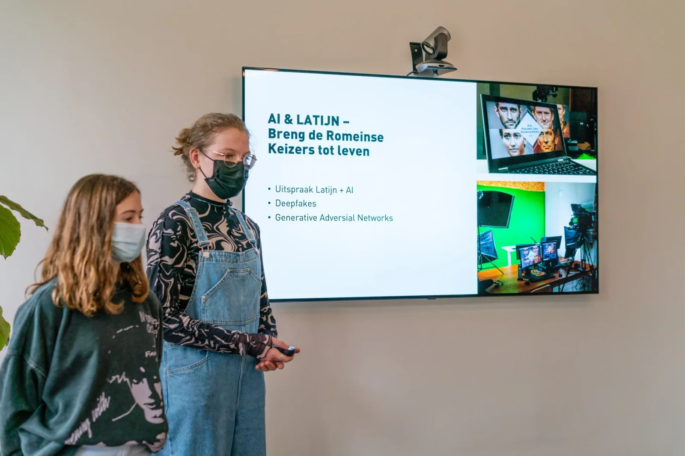
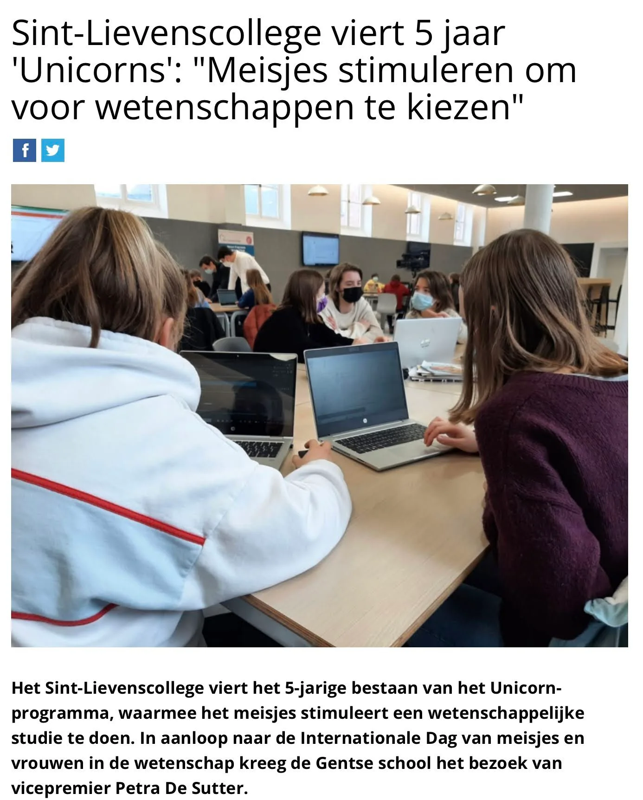
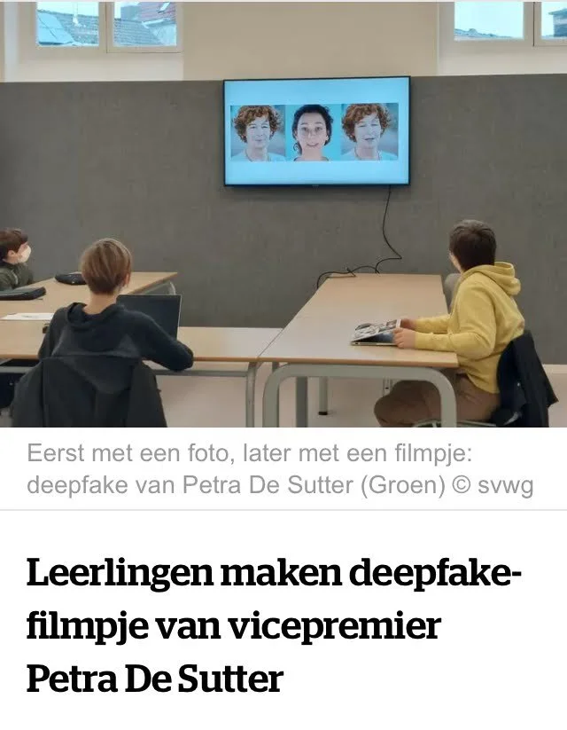
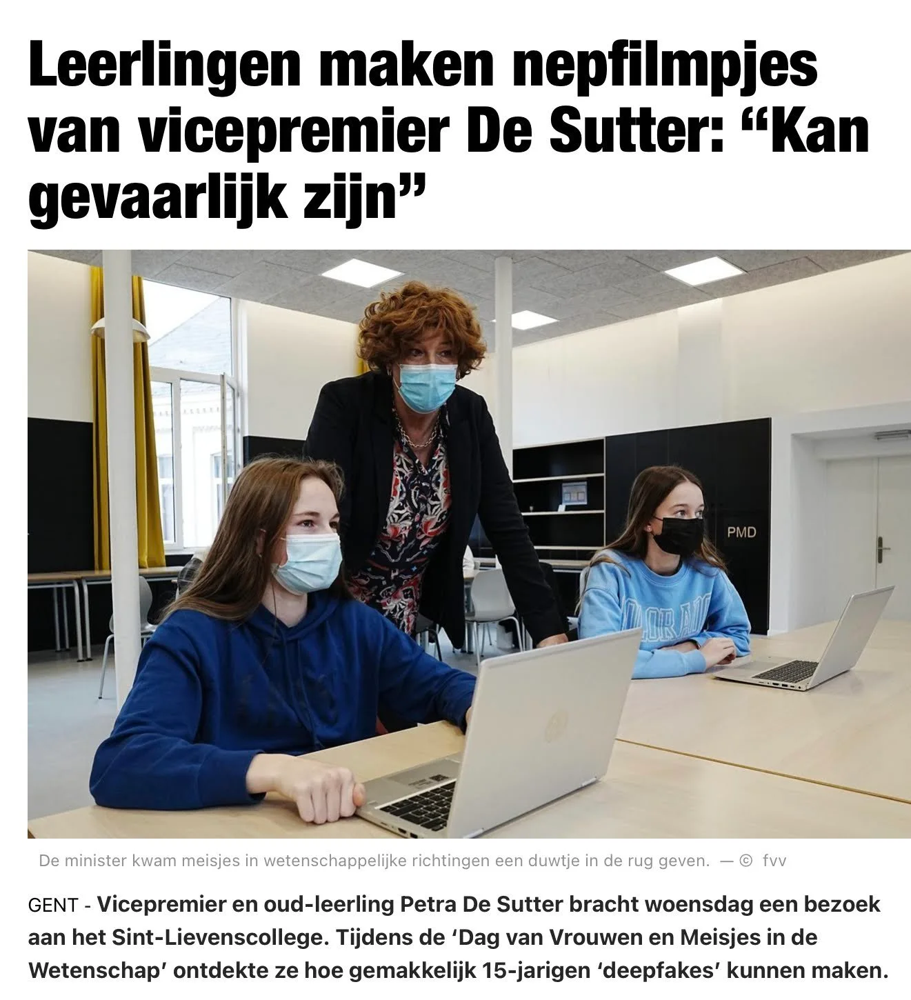
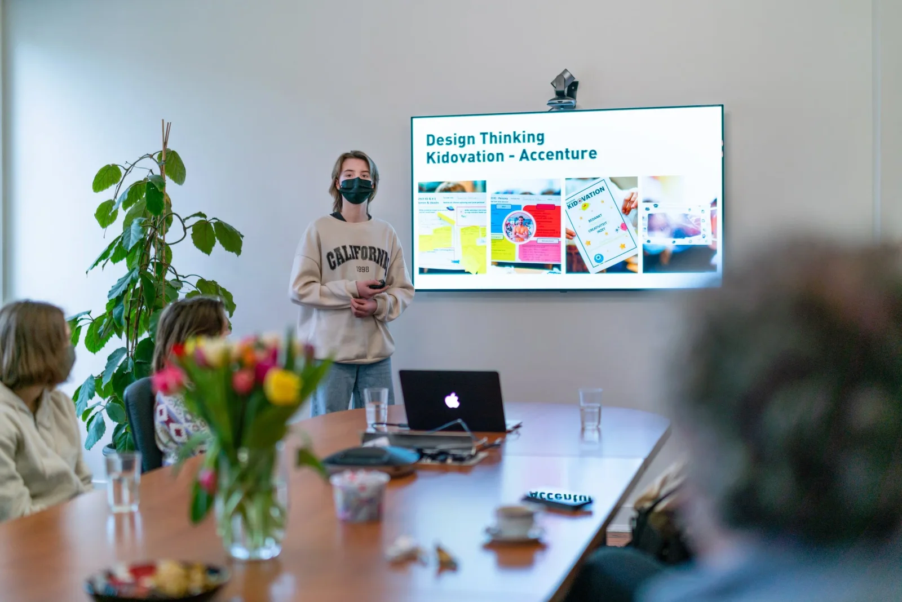

**De STEM-Monitor 2021 toont aan dat steeds meer meisjes kiezen voor een STEM-studierichting. Een positieve en broodnodige verandering. Maar hoe kan je meisjes motiveren om te kiezen voor de wetenschappen? Het Unicorn-programma voor meisjes in STEaM-studierichtingen van het Sint-Lievenscollege te Gent probeert net dat te doen. Door een nadruk op de arts binnen STEaM, vrouwelijke rolmodellen, een uitgewerkte leerlijn rond AI in de klas … Dit doen we reeds vijf jaar. Om dit te vieren kwam vicepremier Petra De Sutter op 11 februari, ‘Internationale Dag van Meisjes in de Wetenschap’, een les AI volgen!**

[Video on YouTube](https://www.youtube.com/watch?v=nYf8whDeOSE)

**Inspire - Connect - Celebrate**
Het Unicorn-programma werd in 2017 opgestart met als doel meisjes in de STEaM-richtingen van het Sint-Lievenscollege te blijven inspireren en motiveren om door te zetten in álle STEaM-studierichtingen. Een speciale leerlingenraad, de Unicorn Council, bestaande uit enkel meisjes organiseert bedrijfsbezoeken (TomTom, Dow Chemical… ) en ontmoetingsmomenten met vrouwelijke wetenschappers en rolmodellen. Zo sprak onlangs Angelique Van Ombergen (ESA) de meisjes toe over haar werk. De ‘Unicorns’ van het Sint-Lievenscollege organiseren daarenboven tijdens de middagpauze workshops programmeren voor leerlingen uit niet-STEaM gerelateerde studierichtingen.

**Design Thinking en Artificiële Intelligentie als vakken in het curriculum**
Ondanks de recente modernisering van het secundair onderwijs in schooljaar 2019-2020 zag het Sint-Lievenscollege zich genoodzaakt om nieuwe vakken zoals Design Thinking en Artificiële Intelligentie in het secundair onderwijs te introduceren om een antwoord te bieden op de vele nieuwe technologische en maatschappelijke uitdagingen. Niet toevallig is de aantoonbare maatschappelijke en sociale meerwaarde van studierichtingen een essentiële hefboom om meisjes te binden aan STEM-studierichtingen. Geïnspireerd door het Finse plan om 1% van de bevolking een basiseducatie in Artificiële Intelligentie te geven, ontwikkelde een leerkrachtenteam van het Sint-Lievenscollege een leerlijn informaticawetenschappen die bouwt vanuit het eerste middelbaar naar het vak Artificiële Intelligentie in het derde middelbaar. Leerlingen ontdekken de werking ervan, klonen hun eigen stem, passen AI toe in vakken zoals Grieks en Latijn …

[Video on YouTube](https://www.youtube.com/watch?v=r2zg9cDfDrc)

**In de pers**

Ons event werd opgepikt in de pers. Van ["Sint-Lievenscollege viert 5 jaar 'Unicorns' " bij AVS](https://www.avs.be/artikels/sint-lievenscollege-viert-5-jaar-unicorns-meisjes-stimuleren-om-voor-wetenschappen-te) tot ["Leerlingen maken nepfilmpjes van vicepremier De Sutter" bij Het Nieuwsblad.](https://www.nieuwsblad.be/cnt/dmf20220209_94783154) Ook HLN titelt “[Leerlingen maken deepfake-filmpje van vicepremier Petra De Sutter](https://www.hln.be/gent/leerlingen-maken-deepfake-filmpje-van-vicepremier-petra-de-sutter~aa630495/)”. 

### Vragen of opmerkingen?

Vragen of opmerkingen over dit project of een van mijn andere projecten? Dan kan je hieronder terecht!

<a class="content-button content-button--primary content-button--medium" href="/contact">Contact</a>

