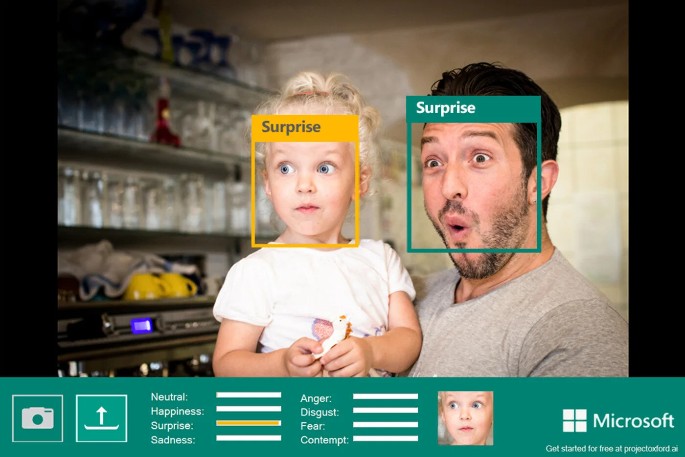
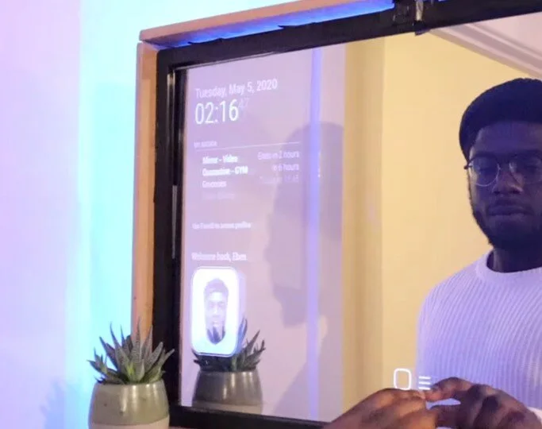
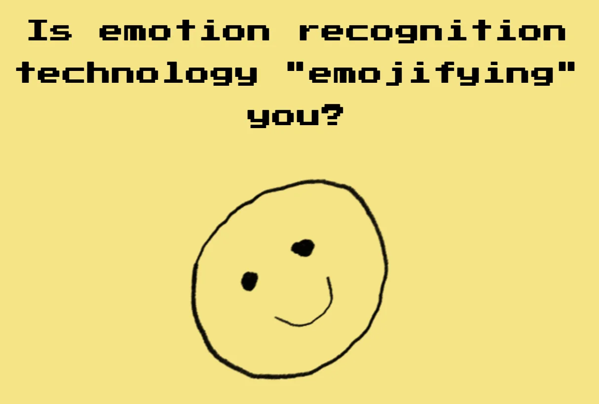
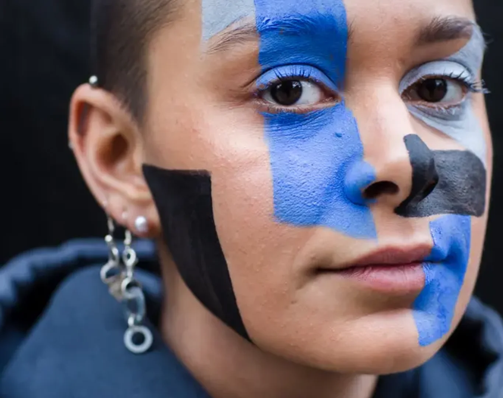

[Video on YouTube](https://www.youtube.com/watch?v=BE4c2EOsWG0)

### Kunnen AI-systemen, naast het herkennen van schattige katjes, hondjes, varkentjes … ook getraind worden om onze emoties te herkennen? Is AI naast artificieel, ook emotioneel intelligent? En willen we dit soort technologie eigenlijk wel, of komen we best in opstand?
Dit is het tweede deel in een reeks over AI & WIJ waarbij we AI-classificatiesystemen leren trainen en gebruiken in jouw klaslokaal!

### Previously on …

[Dit is het tweede deel in een reeks over objectclassificatie door AI-systemen. Deel 1 vind je hier!](/onderwijs/ai-wij-robots-herkennen-onze-wereld) In deze post herhalen we dus niet de volledige theorie achter dit soort AI-classificatiesystemen. Daarvoor verwijs ik graag naar [deel 1](/onderwijs/ai-wij-robots-herkennen-onze-wereld) waar we een AI-model trainen om honden, varken, brood ... van elkaar leren onderscheiden. Daar leer je in detail de verchillende stappen (data, training, voorspelling) en zie je de mogelijkheden en beperkingen van dat systeem.

### **Over emotie en emotiebegrip**

**Emotie** is, net zoals AI, moeilijk te definiëren. Er bestaat, naast natuurlijke- en artificiële intelligentie, ook zoiets als emotionele intelligentie. Maar wat wil dat allemaal zeggen?

**Emotie
**Over emotie bestaat er op heden, net zoals voor AI, geen één definitie. afhankelijk van het onderzoeksveld van een onderzoeker vaak een andere nadruk wordt gelegd in de definitie. Cognitieve psychologen leggen in hun definiëring bijvoorbeeld eerder de nadruk op de cognitieve kenmerken van emoties.
Volgens Scherer (2005) bestaat een emotie uit **vijf subsystemen** die samen leiden tot vijf emotiecomponenten. Inschatting, lichamelijke reacties, actietendensen, gelaatsuitdrukkingen en stem, subjectieve gevoelens

**Emotiebegrip**
Emotiebegrip is kennis hebben van deze vijf elementen van emotie, deze herkennen en kunnen onderscheiden bij anderen.
**Het mag duidelijk zijn dat een AI-systeem dat getraind is bij het herkennen van een gelaatsuitdrukking en daar een emotie uit afleidt, niet het volledige plaatje kent.**

### **Mogelijkheden!**

AI-systemen op basis van herkenning (niet enkel beperkt tot gezichtsuitdrukkingen) kunnen in verschillende toepassingen gebruikt worden. Zoals:

-   [Een AI-spiegel die jouw gezicht en adem kan analyseren. Eventueel te gebruiken om de dosis medicatie van dag tot dag, op basis van die metingen, aan te passen.](https://www.nature.com/articles/s41746-018-0068-7)

-   [A.I. in schoollaptop herkent wanneer leerling het moeilijk heeft met leerstof.](https://www.wsj.com/articles/chinas-efforts-to-lead-the-way-in-ai-start-in-its-classrooms-11571958181)

-   [A.I. aan de grens / asiel die leugens detecteert op basis van camerabeeld.](https://www.theguardian.com/world/2018/nov/02/eu-border-lie-detection-system-criticised-as-pseudoscience)

-   [A.I. in het schoolrestaurant herkent jouw gezicht.](https://www.ft.com/content/af08fe55-39f3-4894-9b2f-4115732395b9)

### **Gevaren!**

Dat klinkt innovatief en soms interessant, maar hier zijn duidelijk gevaren aan gekoppeld. Zo kunnen we een drietal kritieken opsommen bij deze vormen van _innovatie_.

-   **Begrijpt AI wel wat ie ziet?**

Deze eerste vorm van kritiek richt zich op het begripsniveau. De AI, ook in dit project, heeft geleerd welke patronen of afbeeldingen horen bij een bepaalde klasse. Hij kan deze dus _herkennen_. Maar net zoals bij taalalgoritmes of gedachte-experimenten zoals **Chinese Room Argument** kunnen we ons de vraag stellen in hoeverre _herkenning_ gelijkstaat met _begrijpen_.

Als je zelf eens een AI wil testen of om de tuin leiden, [kan je hier terecht!](https://emojify.info/)

-   **White man bias in de data**

Tijdens dit project hebben we geleerd dat een AI-model getraind moet worden voordat het aan herkenning of voorspelling kan doen. Om te trainen is er data nodig. Deze datasets zijn, zeker met de opkomst van social media, eenvoudiger te verkrijgen dan je denkt. Hoe deze datasets zijn samengesteld is vaak een grote vraag. Wat we wel merken, wanneer we zulke datasets van nabij bekijken, is dat deze proportioneel meer data bevatten van witte mensen, vooral mannen. Dus wanneer het AI-model getraind wordt, zal dit vooral relatief goede resultaten behalen in de testfase wanneer het geconfronteerd wordt met witte proefpersonen. Bij mensen van een andere origine krijgen we significant slechtere resultaten, met soms grote gevolgen.

Daarnaast is ook de uitdrukking van emotie een _gekleurd_ begrip. Niet in alle culturen en groepen kent een glimlach dezelfde connotatie. Zo is gebleken dat sommige culturen tot 30% minder fysiek glimlachen dan anderen.

Zowel aan de kant van de data, als aan de kant van emotiebegrip, moeten we dus waakzaam zijn voor elke vorm van **vooroordeel of bias**.

-   **Your face is yours**

Tenslotte hebben we het privacyargument. Jouw gezicht en jouw gelaatsuitdrukkingen, jouw emoties, zijn iets dieppersoonlijk. Waar het vroeger eenvoudig was om jouw gezicht uit een dataset te houden, is dat vandaag, door de prevalentie van sociale media en bewakingscamera's, zeker geen sinecure meer.

### **Oplossingen!**

Oplossingen, zeker voor het privacyluik, kunnen zich op een aantal niveau's bevinden, zoals:

-   **Individu**

Je kan je informeren en in jouw eigen handelen en ontwerpen rekening houden met mogelijkheden en beperkingen. Zo is het belangrijk dat informatie over artificiële intelligentie en privacy opgepikt worden door het onderwijs.

-   **Organisaties**

Je kan petities tekenen zoals van de organisatie [_Reclaim your Face_](https://reclaimyourface.eu/), aansluiten bij privacygroepen zoals [_Ministry of Privacy_](https://ministryofprivacy.eu/). Ook [_Amnesty International_](https://www.amnesty.org/en/latest/press-release/2021/01/ban-dangerous-facial-recognition-technology-that-amplifies-racist-policing/) vraagt actie te ondernemen tegen gevaarlijke AI-toepassingen die vooroordelen op basis van ras versterken.

-   **Overheden**

Ook overheden, zoals de European Council en de Europese GDPR-wetgeving streven voor meer privacy en bescherming voor hun burgers.

Maar ... ook overheden zijn niet zonder zonde. [Zo blijkt de Belgische politie gebruik te maken van de illegale gezichtsherkenningstool van Clearview AI](https://www.demorgen.be/nieuws/belgische-politie-ontkende-altijd-maar-agenten-maakten-dan-toch-gebruik-van-controversiele-software~ba04aaae/). Een praktijk waar de politie, een deel van de Belgische overheid, meermaals over heeft gelogen.

### **Samenvattend**

We kunnen een computer / A.I. data (afbeeldingen) leren classificeren.

-   Belang van goede trainingsdata voor de A.I. en mogelijke gevaren duiden.

-   Emoties zijn gelaagd (gelaat, stem, lichaam).

-   Emoties zijn cultureel bepaald.

-   Privacy is belangrijk, maar ook in gevaar!

-   AI is zelden dé wonderoplossing (solutionisme).

### Vragen, opmerkingen … ?

Heb je vragen over dit onderwijsproject of andere? Dan is er maar één adres:

<a class="content-button content-button--primary content-button--medium" href="/contact">Contact</a>

