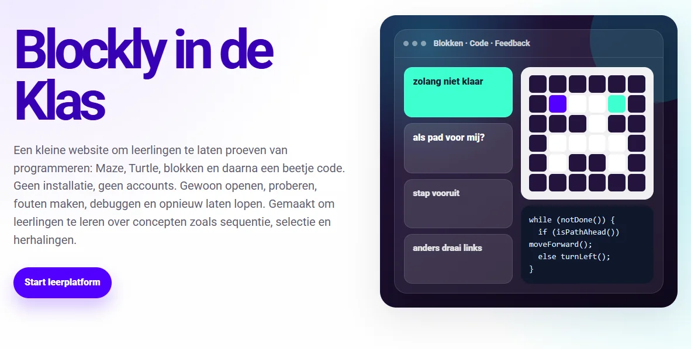
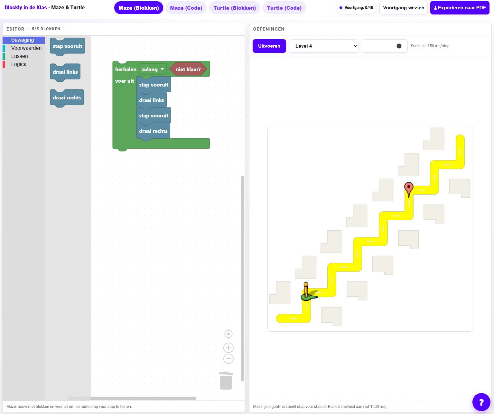
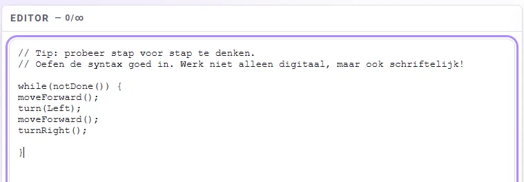
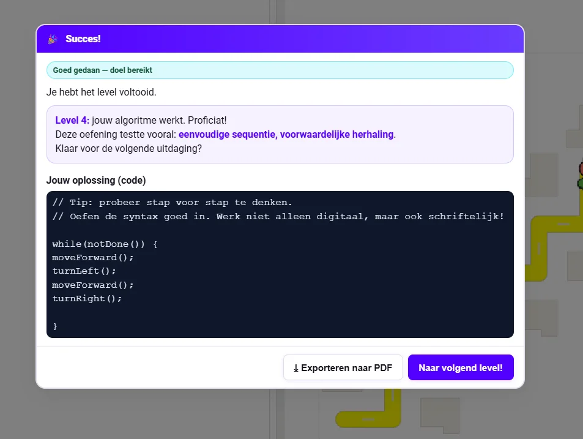
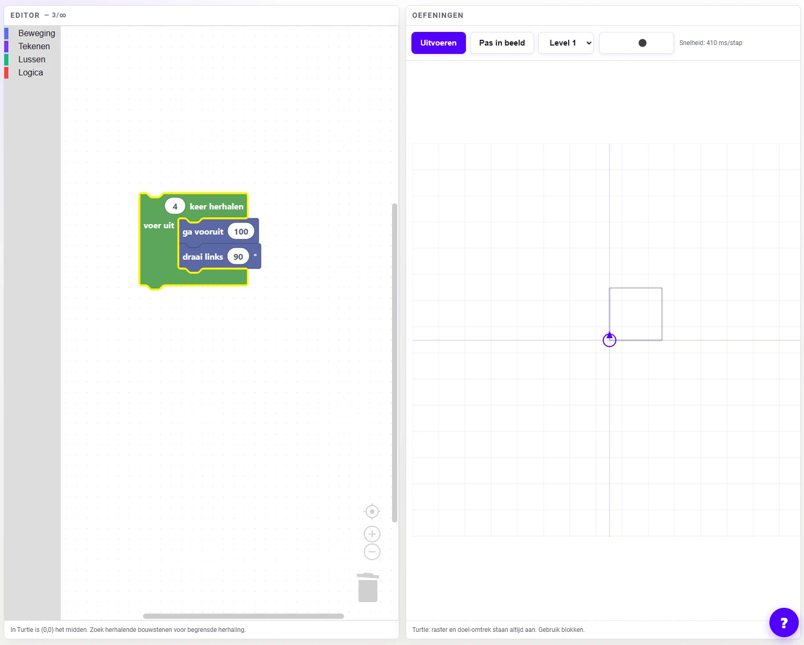
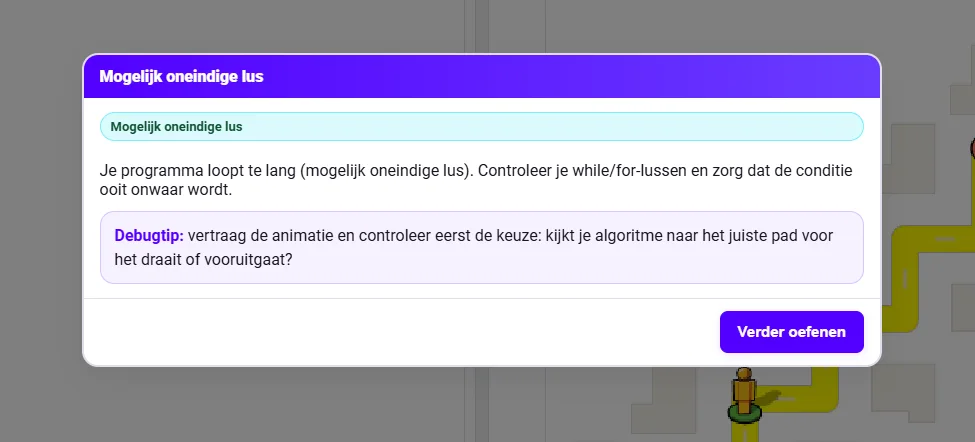
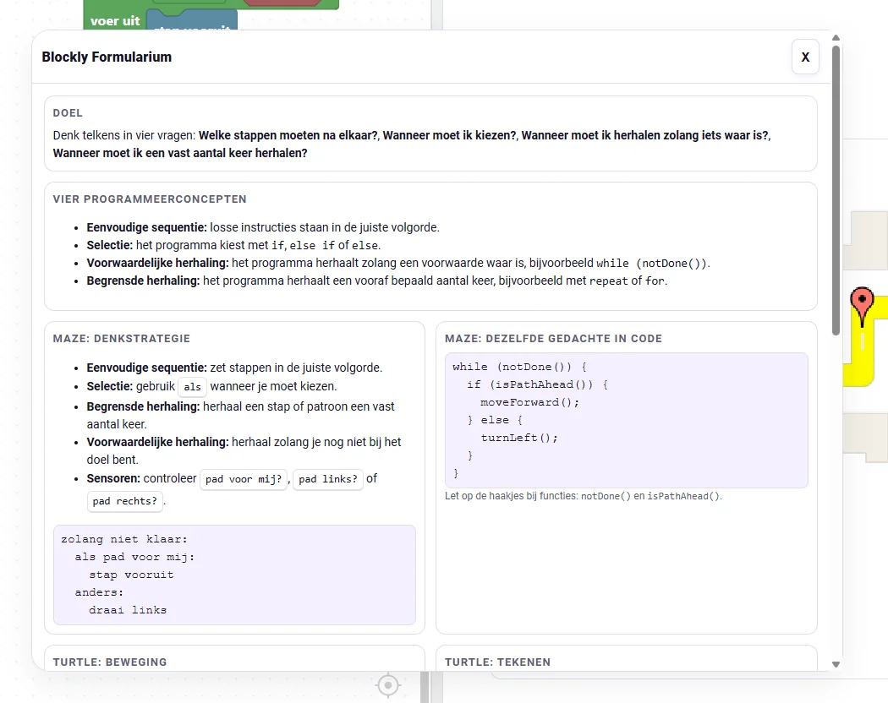
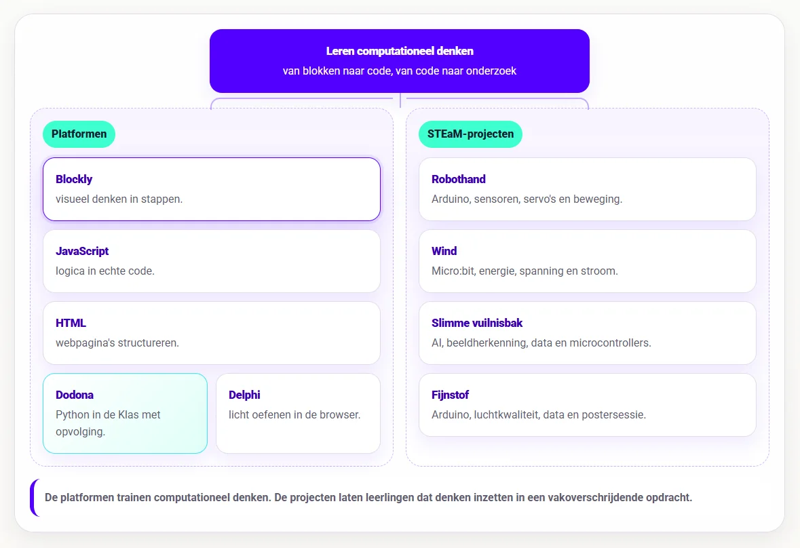

### Soms zegt een leerling dat hij de code niet begrijpt. Vaak zit het probleem een stap eerder. Wat moet er eerst gebeuren? Wanneer moet het programma kiezen? Welke stappen moet het programma herhalen? Wanneer stopt die herhaling? Waarom doet de computer precies wat er staat, terwijl de leerling iets anders bedoelde?

### Als leerlingen leren programmeren, leren ze meer dan een programmeertaal. Ze leren een probleem ontleden, stappen ordenen, voorwaarden herkennen en een oplossing bijsturen. Syntax komt daar nog bovenop. Voor beginners komt die laag codetaal soms net te vroeg.

### Ik wilde daarom een plek waar leerlingen eerst met de redenering kunnen oefenen, zonder dat elk vergeten haakje meteen alles blokkeert. Daarom bouwde ik **Blockly in de Klas**: een kleine leeromgeving waarin leerlingen met Maze en Turtle stap voor stap oefenen met computationeel denken. Eerst met blokken, daarna met JavaScript.

### Wat is het?

**Blockly in de Klas** geeft leerlingen een instap in computationeel denken en programmeren. Ze bouwen algoritmes met blokken en zien meteen wat hun oplossing doet. Daarna kunnen ze dezelfde redenering proberen in JavaScript. De omgeving draait volledig in de browser en werkt zonder login.

Ik leg de focus in de klas op vier basisconcepten die in bijna elke programmeerleerlijn terugkomen: sequentie, selectie, voorwaardelijke herhaling en begrensde herhaling. Bij sequentie zetten leerlingen stappen in de juiste volgorde. Bij selectie kiest het programma tussen mogelijkheden met if, else if of else. Bij voorwaardelijke herhaling blijft het programma herhalen zolang een voorwaarde waar is, bijvoorbeeld met while (notDone()). Bij begrensde herhaling voert het programma iets een vast aantal keer uit, bijvoorbeeld met repeat of for.

Die programmeerconcepten lijken eenvoudig, maar in de les zijn ze dat niet altijd. Een leerling kan begrijpen wat “herhaal” betekent, maar toch moeite hebben om te bepalen welke stappen het programma precies moet herhalen. Een leerling kan weten dat if “als” betekent, maar nog niet zien welke situatie in de opgave om een keuze vraagt.

### Waarom werken met blokjes?

Blokken zijn een didactische tussenstap. Voor sommige leerlingen vraagt tekstuele code in het begin te veel tegelijk. Eén ontbrekend haakje kan ervoor zorgen dat de oefening niet loopt, terwijl het onderliggende algoritme misschien wel klopt. Omgekeerd kan code technisch functioneel zijn, maar inhoudelijk nergens op slaan.

Met blokken kan je die twee lagen even uit elkaar trekken. Eerst kijk je naar de redenering: klopt de volgorde, staat de keuze op de juiste plaats, wordt het juiste stuk herhaald? Daarna komt de vraag hoe je die redenering in code schrijft.

Dat maakt **Blockly in de Klas** vooral nuttig bij een eerste lessenreeks computationeel denken, bij differentiatie of als opstap naar **JavaScript in de Klas**. Leerlingen ervaren eerst wat een algoritme doet, voordat ze de volledige syntaxlast van een programmeertaal dragen.

### **Stap voor stap door het doolhof**

De eerste onderdeel is **Maze**. Daar sturen leerlingen een sprite door een doolhof. Ze bouwen een algoritme dat hem naar het doel brengt. Eerst met blokken, daarna eventueel met JavaScript. In eenvoudige oefeningen gaat het over volgorde: welke stappen moeten na elkaar? Daarna komen vaste herhalingen, keuzes en voorwaardelijke herhaling erbij.

Een typische oplossing kan er in JavaScript zo uitzien:

Dat stukje code lijkt klein, maar er zit relatief veel denkwerk in. De leerling moet begrijpen welke stappen het programma herhaalt, wanneer de herhaling stopt, wanneer het programma kiest en welke actie bij welke situatie hoort. Pas wanneer die redenering duidelijk is, wordt de code minder vreemd of abstract. Daarom helpt het om dit eerst visueel te zien gebeuren.

## **Turtle: patronen, hoeken en ruimtelijk denken**

Het tweede hoofdstuk is **Turtle**. Daar tekenen leerlingen met bewegingen, hoeken, coördinaten, peninstellingen en lussen. Een vierkant, driehoek, trap of patroon wordt zo meer dan een reeks commando’s.

Bij Turtle zie je onmiddellijk wat een verkeerde hoek doet. Je merkt snel wanneer een herhaling te kort of te lang is. Je ziet ook wanneer de pen op het verkeerde moment omhoog of omlaag staat.

Dat maakt Turtle interessant voor leerlingen die code nog erg abstract vinden. Het resultaat staat letterlijk op het scherm. Een fout is dan geen rode foutmelding, maar ook een lijn die verkeerd loopt. Meteen duidelijk en bruikbaar dus.

## **Feedback**

Een belangrijk doel was dat fouten zichtbaar blijven. Wanneer een leerling een verkeerd algoritme uitvoert, wil ik liever tonen wat er gebeurt dan alleen melden dat het fout is. Waar loopt onze sprite vast? Welke stap komt te vroeg? Waarom blijft een lus draaien?

Daarom speelt Maze ook bij mislukte oplossingen de uitvoering af. Loopt onze sprite tegen een muur, dan duidt de omgeving dat punt aan. Eindigt hij niet op het doel, dan ziet de leerling waar hij stopt. Bij een mogelijke oneindige lus beperkt de omgeving de animatie, zodat de oefening niet vastloopt.

Leerlingen kunnen voorspellen wat hun algoritme zal doen, het uitvoeren en daarna vergelijken. Waar klopt hun verwachting niet met wat er werkelijk gebeurt? Welke stap moet anders? Welke keuze ontbreekt? Welke herhaling staat op de verkeerde plaats? Dat noemen we in het computationeel denken: debuggen.

### **Formularium**

In de leeromgeving zit ook een klein formularium. Dat werkt als denkkaart en syntaxhulp. Leerlingen krijgen er vier vragen mee: welke stappen moeten na elkaar, wanneer moet ik kiezen, wanneer moet ik herhalen zolang iets waar is, en wanneer moet ik een vast aantal keer herhalen?

Daarnaast bevat het formularium enkele syntax-elementen. Zo blijven leerlingen niet vastlopen op de schrijfwijze wanneer de focus ligt op het ontleden van een opgave en het ontwerpen van een oplossing.

### Van blokken naar code

Elk hoofdstuk heeft een blokmodus en een codemodus. Dat is belangrijk, want die blokken vormen een ideale stapsteen naar het ontwerpen van een algoritme in code. Zo zien leerlingen dat JavaScript dezelfde redenering preciezer opschrijft. Bij JavaScript controleert de omgeving ook enkele typische fouten, zoals vergeten haakjes bij notDone(), een enkele = in een voorwaarde, onbekende functienamen of ontbrekende puntkomma’s bij acties.

Kleine syntaxfouten slorpen bij beginners snel alle aandacht op. Gerichte feedback voorkomt dat een leerling twintig minuten naar één vergeten teken zit te staren.

## **Praktisch voor leerkrachten**

**Blockly in de Klas** is bewust heel eenvoudig gehouden. Alles werkt in de browser, er zijn geen accounts nodig en de browser bewaart voortgang lokaal. Leerlingen kunnen hun werk exporteren naar PDF. Een PDF-bestand bevat naam, klas, oefening, code, snapshot, pogingen en rubriek voor gerichte evaluatie en feedback.

Leerlingen kunnen de voortgang ook per oefening of volledig wissen. Die lokale opslag is handig voor korte trajecten, losse lessen en oefenmomenten. Voor structurele opvolging blijft een echt dashboard natuurlijk beter. Wil je als leerkracht precies bijhouden wie wat maakte, wanneer leerlingen iets indienden en hoe feedback doorheen een traject evolueert, dan gebruik je beter een platform dat daarvoor gemaakt is.

Dit gratis oefenplatform wil vooral snel inzetbaar zijn: openen, oefenen, kijken, bijsturen.

## **Hoe ziet de leerlijn er uit?**

Eerst verdiepen leerlingen via de **platformen** in de wereld van het computationeel denken. Ze leren de decompositie toepassen, leren programmeerconcepten herkennen, ontwerpen algoritmes en slaan aan het debuggen. Hiervoor hanteren we volgende **platformen**:

-   **Blockly in de Klas** helpt leerlingen eerst visueel redeneren. Ze oefenen daar met sequentie, selectie, begrensde herhaling en voorwaardelijke herhaling zonder dat syntax meteen met alle aandacht gaat lopen. Dit onderdeel zit in het begin van de leerlijn.

-   **JavaScript in de Klas** zit op een interessante plek in de reeks. Het komt na visueel redeneren met blokken, maar blijft dichter bij de browser dan Python. Daardoor kan het tegelijk programmeerconcepten oefenen en webgedrag zichtbaar maken.

-   **HTML in de Klas** zit in de webtak. Daar leren leerlingen hoe webpagina’s opgebouwd zijn met structuur, tags, attributen en inhoud. HTML beslist niets en herhaalt niets. **JavaScript** verbindt die werelden. De taal voegt gedrag toe aan webpagina’s en laat leerlingen dezelfde denkpatronen uit Blockly verder oefenen: variabelen, voorwaarden, lussen, functies, invoer, uitvoer en debugging.

-   **Project Delphi** neemt daarna Python op als tekstuele programmeertaal met een grotere oefencatalogus en testcases.

-   **Dodona blijft de allersterkste keuze voor volledige trajecten, dashboards, deadlines, evaluaties, klasopvolging, toetsen en zelfs examens!**

Daarna komen de **STEaM-projecten**. Die projecten gebruiken de opgebouwde concepten in grotere opdrachten waarin leerlingen bouwen, meten, testen en besluiten. De platformen trainen de bouwstenen van het computationeel denken. De projecten zetten tonen hoe we met die bouwstenen en digitale systemen een impact kunnen hebben op onze eigen leefwereld en samenleving.

-   Bij **Project Robothand** brengen leerlingen Arduino, sensoren, servo’s, seriële data en mechaniek samen in één werkend systeem. Dit past later in de leerlijn, na een eerste traject rond Arduino en fysieke computing. Leerlingen sturen niet alleen code naar een bordje, maar zien hoe sensorwaarden beweging veroorzaken.

-   Bij **Project Wind** verschuift de focus naar meten en onderzoeken. Leerlingen bouwen een windmolenopstelling, gebruiken de micro:bit om spanning en stroom te meten, berekenen vermogen en energie, vergelijken proeven en schrijven een besluit op basis van data. Hier wordt code een onderzoeksinstrument.

-   Bij **Slimme Vuilnisbak** komt daar artificiële intelligentie bij. Leerlingen verzamelen voorbeelden, kennen labels toe, trainen een model, testen voorspellingen, bekijken confidence-scores en koppelen de voorspelling aan een microcontroller. Zo wordt AI geen magische doos, maar een systeem dat werkt met data, labels, fouten en bijsturing.

-   **Fijnstof** hoort in dezelfde projectlaag. Tijdens dit STEaM-project gaan we aan de slag met Arduino, luchtkwaliteit, data en een postersessie. Leerlingen meten een verschijnsel uit de echte wereld, verwerken data en communiceren hun bevindingen.

Zo ontstaat er een overzichtelijk en duidelijk **curriculum**: eerst leren leerlingen redeneren, structureren en programmeren in kleine oefenomgevingen. Daarna gebruiken ze die kennis in projecten waarin code gekoppeld wordt aan fysieke systemen, meetgegevens, onderzoeksvragen en ontwerpkeuzes.

### **Ik wil dit in mijn klas! Wat moet ik doen?**

Wil je hier zelf mee aan de slag in jouw klaslokaal? Super! Samen met jongeren werken rond computationeel denken en programmeren is fantastisch, maar ik ben wellicht een bevooroordeelde bron. Met de knoppen hieronder kan je de tool zelf uittesten. Vind je een bug in mijn code? Laat het gerust weten via het contactformulier of via de Discord-server! 

<a class="content-button content-button--primary content-button--medium" href="https://robbew.github.io/Blockly/" target="_blank" rel="noreferrer">Ga naar Blockly in de Klas!</a>

<a class="content-button content-button--primary content-button--medium" href="/contact">Contacteer Robbe!</a>

