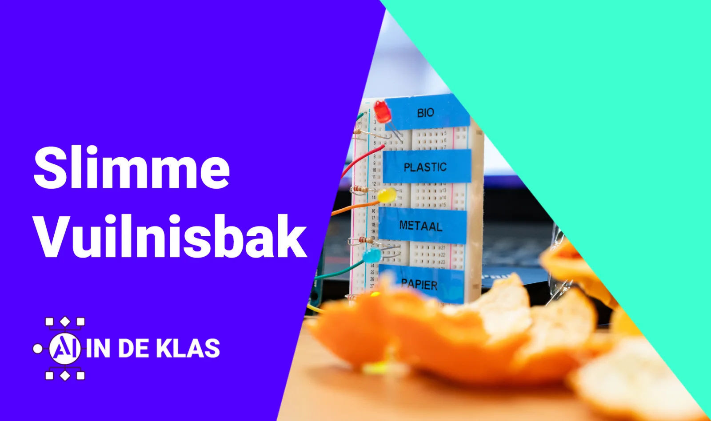
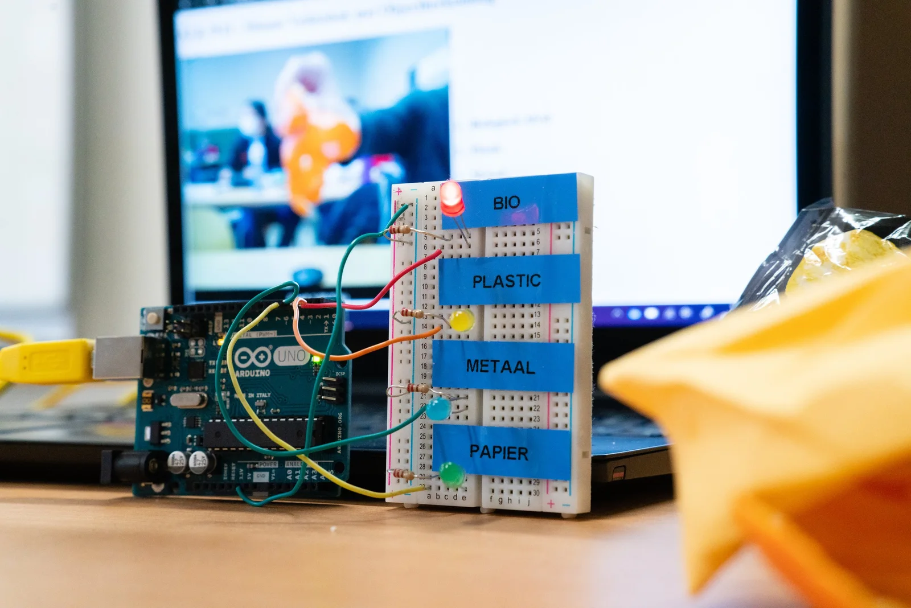
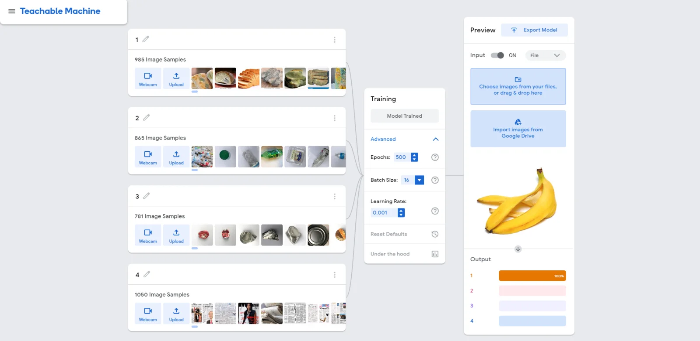
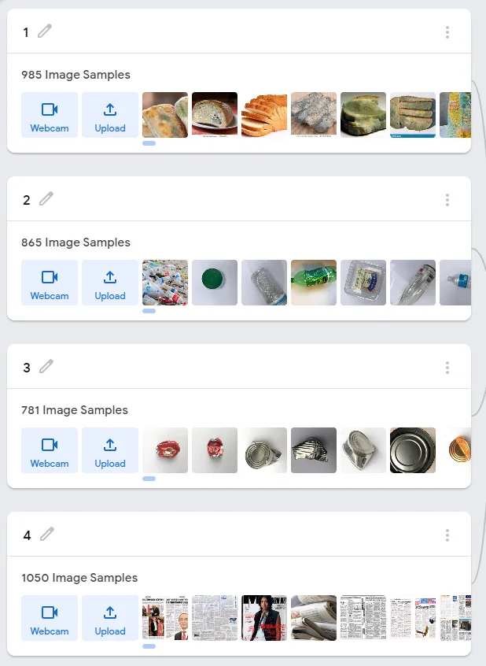
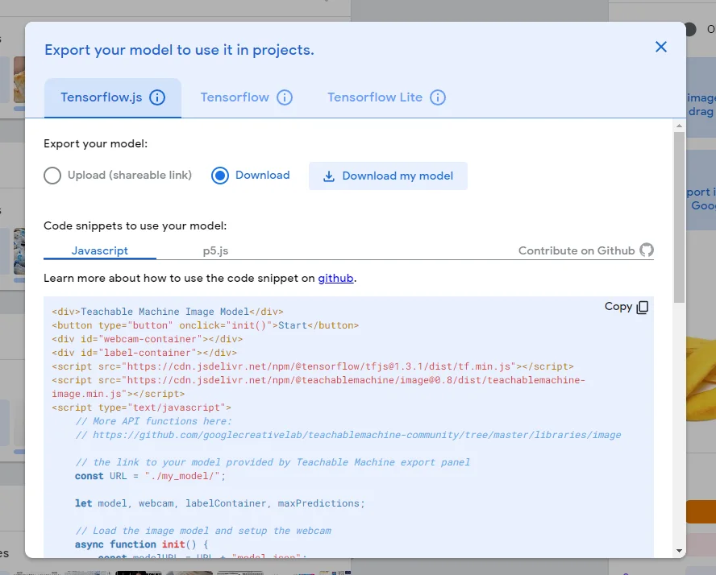
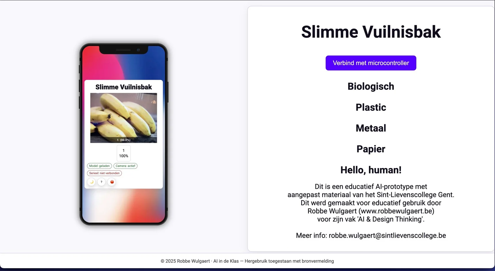
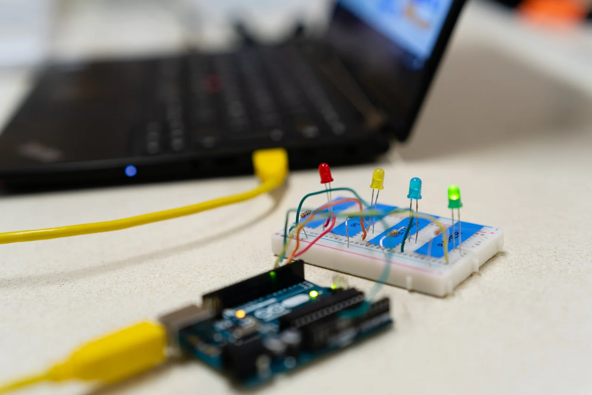
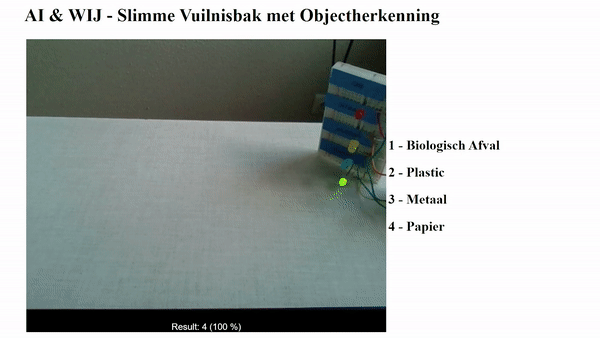

**Heb je ooit voor de vuilnisbak gestaan en je afgevraagd: "Is dit nu PMD, restafval of iets anders?" Je bent niet de enige. Goed sorteren is belangrijk, en je wilt het graag goed doen. Zo dragen we zorg voor het milieu en voor de mensen die ons afval verwerken. Een kleine moeite voor een betere wereld. Maar wat als je die twijfel kunt wegnemen? Wat als we een artificiële intelligentie kunnen aanleren om te sorteren en samen een slimme vuilnisbak te bouwen? Dat kan! Je hebt er bovendien geen doctoraat of een uit de kluiten gewassen computer voor nodig. Dit kan perfect met een laptop in de klas!**

### Benodigdheden 

Om een slimme vuilnisbak te bouwen die ons kan helpen bij het sorteren, hebben we enkele zaken nodig. Dit project kan je uitvoeren op bijna elke schoollaptop met een webcam en een Windows-besturingssysteem.

Wat heb je nodig om deze slimme vuilnisbak te bouwen?

-   Een laptop met webcam

-   Python-software

-   Een Arduino Uno, breadboard en ledjes

-   Of een Micro:bit-bordje

-   Arduino IDE-software om het bord te programmeren

-   Een USB-kabel om de Arduino Uno of Micro:bit met de laptop te verbinden

-   Ongeveer 5.000 foto’s van afval om een AI-model te trainen

5.000 foto’s van afval!? Maak je geen zorgen, ik help je hierbij uit de nood! Maar eerst even een woordje over hoe een AI-model werkt en waarom we die foto’s nodig hebben.

### Hoe kan een AI afval herkennen? 

Wanneer we een slimme vuilnisbak willen bouwen met artificiële intelligentie, moeten we de AI eerst leren afval te herkennen en te sorteren. Dit klinkt misschien ingewikkeld, maar het is vergelijkbaar met hoe we kinderen nieuwe woorden leren. Als we kinderen willen aanleren wat een katje, hondje of koetje is, tonen we prentjes en vertellen we de naam van het diertje. Zo doen we dat ook met afval. We tonen een foto van een plastic flesje en zeggen de naam. Dit herhalen we duizenden keren met onze AI. Dit proces, aangedreven door machine learning-algoritmen, stelt AI in staat om zelfstandig te leren en menselijk gedrag te imiteren. Net als jij, kan een AI bijleren!

Binnenin de computer zal ons AI-model, via algoritmen, op zoek gaan naar patronen in de afbeeldingen. Doorgaans geldt dat hoe meer data en tijd we het AI-model geven, hoe beter het wordt in zijn taak. Dit heet ‘**Machine Learning**’. Net zoals bij menselijk leren, zijn er verschillende strategieën om tot leren te komen. De strategie die wij hier gebruiken, waarbij we het AI-model duizenden prentjes tonen en daarbij de naam van de klasse (restafval, plastic, papier …) vermelden, heet ‘**supervised learning**’. Daarbij leert het model dankzij de door mensen voorgesorteerde afbeeldingen. 

_“Staan er duizenden foto’s van afval op mijn computer thuis? … Maybe.”_

Dit ‘**machine leren**’ kan je zelf doen via jouw computer. Daarvoor kan je gebruikmaken van de [**Teachable Machine van Google**](http://teachablemachine.withgoogle.com/). Die kan je voorzien van verzamelingen aan foto’s die je een label geeft, en trainen maar! Eenmaal getraind kan ons AI-model een handig trucje: je kan een foto nemen van zijn aangeleerde kennis (= **checkpoint**) en dit downloaden naar de computer. Dat bestand kan je inladen in een andere computer, die het voorgetrainde model onmiddellijk kan gebruiken. Beeld je in dat er een examen wiskunde op de planning staat. De sterkste leerling uit de klas studeert dit vak grondig en uploadt zijn/haar/hun kennis, waarna de rest van de klas dit naar hun hersenen downloadt.

Voila, de “hersenen” van onze slimme vuilnisbak zijn klaar! 

_Voor dit project kan je zelf een AI-model trainen, maar kan je ook gebruikmaken van mijn voorgetraind model via mijn_ **_checkpoint_**_._ 

### HTML – sorteren via de webcam 

Nu we onze artificiële intelligentie hebben getraind, onze slimme vuilnisbak dus van “hersenen” hebben voorzien, is het tijd om te werken aan de “ogen”. Om vuilnis correct te kunnen herkennen, moet onze AI het natuurlijk kunnen zien.  Daarvoor gebruiken we de webcam van onze laptop en de browser. 

Voor dit project kan je gebruikmaken van mijn standaard HTML- en Javascriptbestanden. Als deze computertalen geen geheimen meer voor je kennen, kan je ze zelf ook naar hartenlust aanpassen. 

### Arduino – ons sorteer/verkeerslicht

We hebben onze slimme vuilnisbak voorzien van hersenen en ogen, maar nu moet het ook nog iets ‘doen’ wanneer het een bepaald type afval herkent. Daarvoor maken we gebruik van een microcontroller zoals een Arduino Uno of een Micro:Bit. Dit zijn kleine programmeerbare computerbordjes die we heel eenvoudig kunnen verbinden met een computer. De Micro:Bit is een kant-en-klaar bordje, maar een Arduino breid je uit met een breadboard waar je een viertal ledjes op kan plaatsen. Dit kan je later nog uitbreiden met servo-moteren om een fysieke vuilnisbak te openen/sluiten.

Om onze Arduino te programmeren, hebben we de Arduino IDE-software nodig. Daarmee plaatsen we een stukje code op onze Arduino Uno. Via dit stukje code zal de Arduino luisteren naar inkomende signalen van onze computer. Afhankelijk van het signaal, zal het een specifiek kleur ledje doen branden. De codes voor de microcontrollers zitten standaard in het lesmateriaal. 

Wanneer onze computer, via de webcam, een stukje vuilnis herkent, zal het een signaal sturen. Om dit signaal te sturen, maken we gebruik van de USB-poort van de computer en een stukje software die de brug vormt tussen de herkenning van ons AI-model en de Arduino. 

Als alle stukjes op hun plaats zitten, kunnen we onze slimme vuilnisbak lanceren. Daarvoor gebruiken we een eenvoudig Python-scriptje. Dit zal de webpagina lanceren, het AI-model zoeken en de nodige elementen inladen. 

Voila, zo bouw je in jouw klaslokaal een vuilnisbak met artificiële intelligentie en draag je bij aan een betere wereld! Wil je dit project helemaal naar jouw hand zetten en samen met de leerlingen een andere detector bouwen? Bijvoorbeeld om bepaalde ingrediënten te herkennen? Ook daarvoor vind je een handig script in het lesmateriaal. 

### Competenties

**Met dit lesmateriaal werken we aan volgende competenties:**

-   een voorbeeld geven van AI in jouw dagelijks leven (en dat van de leerlingen);

-   een voorbeeld geven van machinaal leren;

-   de machine learning-techniek ‘supervised learning’ uitleggen in eigen woorden;

-   een eigen AI-model trainen aan de hand van supervised learning (=toepassen);

-   afbeeldingsclassificatie onderscheiden van afbeeldingsdetectie;

-   deze ML-techniek toepassen in de eigen lespraktijk of vakdomein (=transfer).

### Ik wil dit in mijn klas!
Wat moet ik doen? 

Wil je hier zelf mee aan de slag in jouw klaslokaal? Super! De toekomst zal steeds meer en meer digitaal zijn. Een toekomst waar artificiële intelligentie een heel belangrijke rol in zal spelen. Dat we jongeren hierop moeten voorbereiden en motiveren, spreekt voor zich. Ik wil jou daar gerust bij helpen! Het lesmateriaal en ondersteuning is te vinden via de Discord-community. 

<a class="content-button content-button--primary content-button--medium" href="/contact">Contact en link naar Discord</a>

