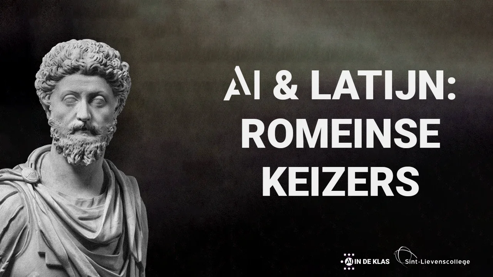
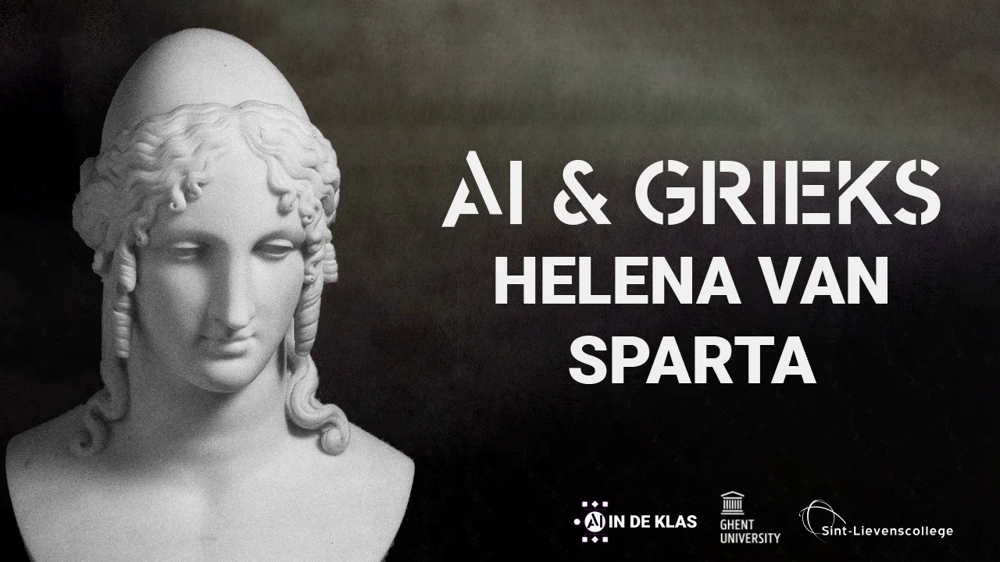
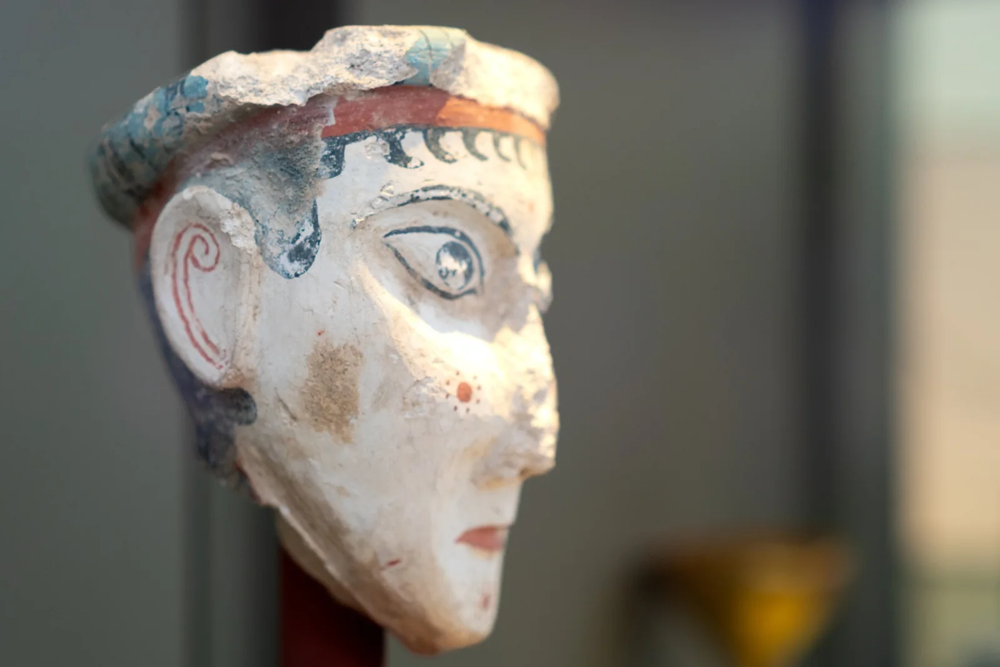
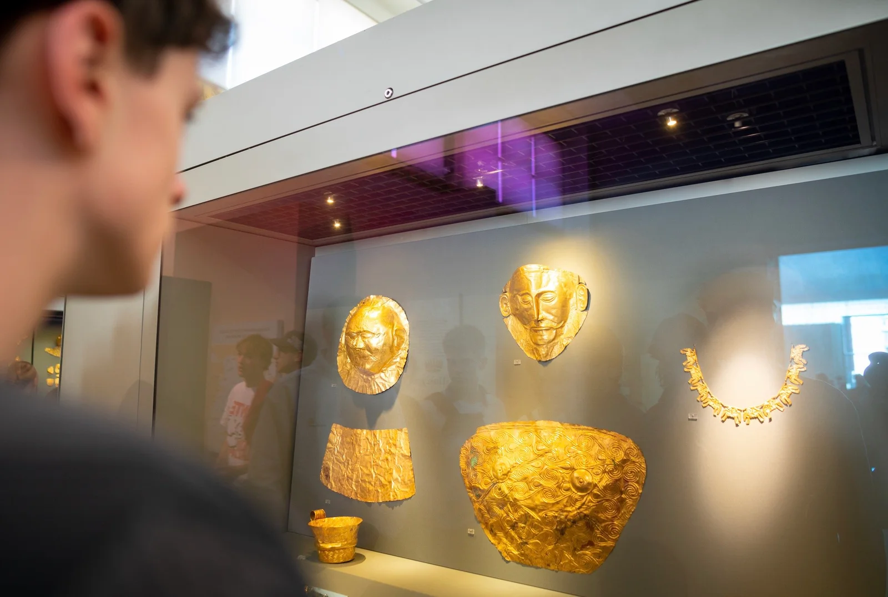
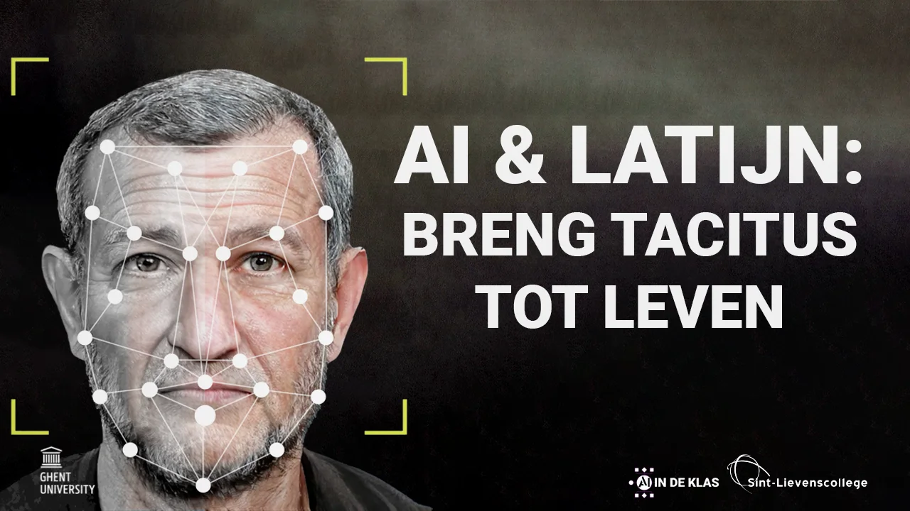
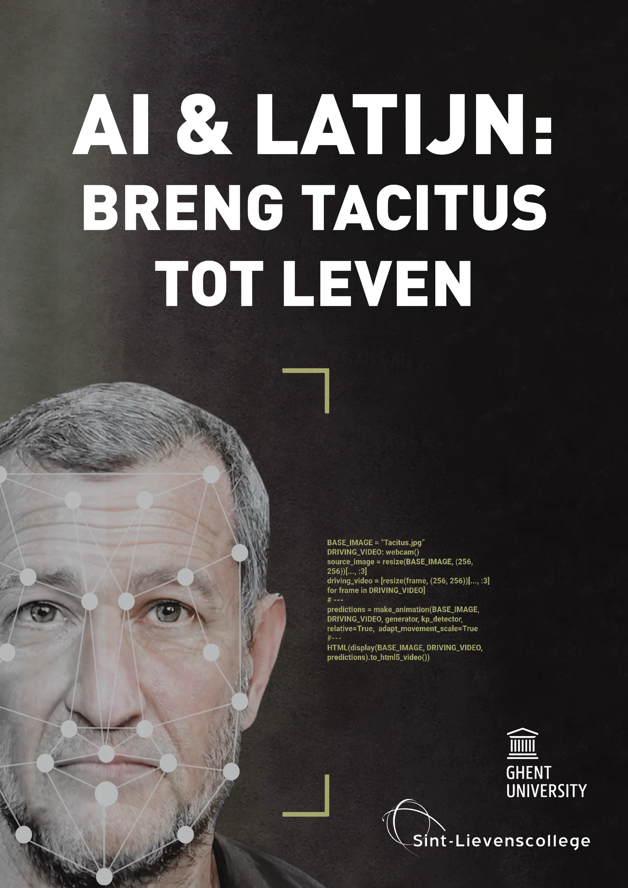
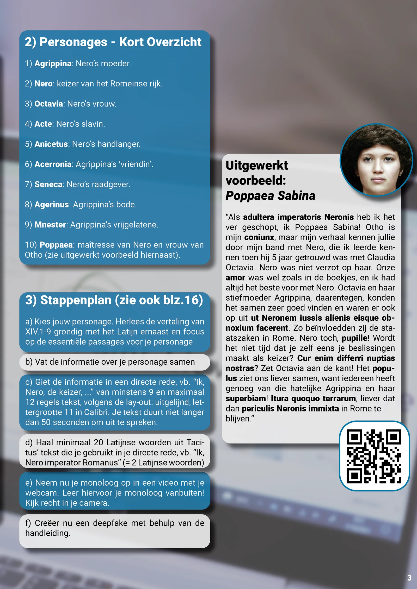
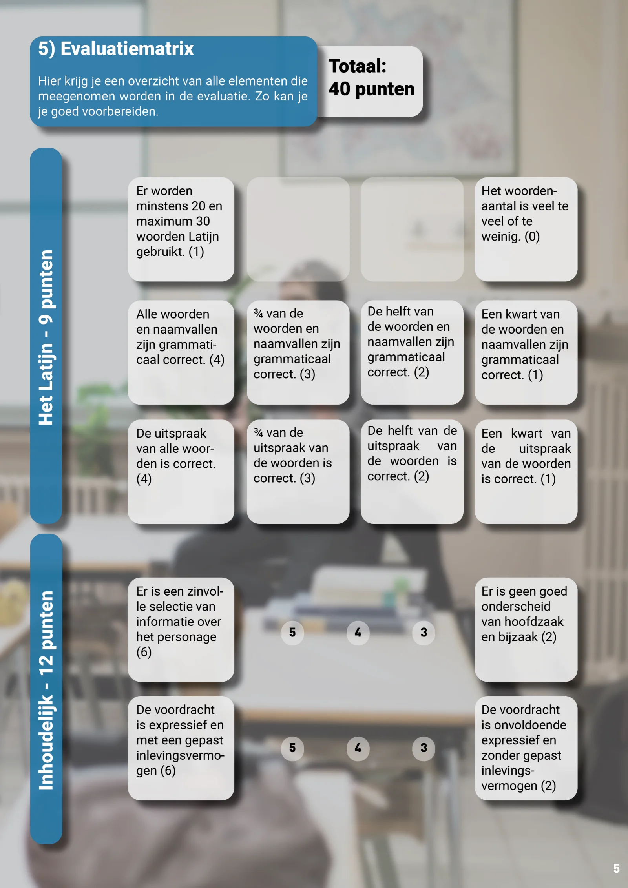
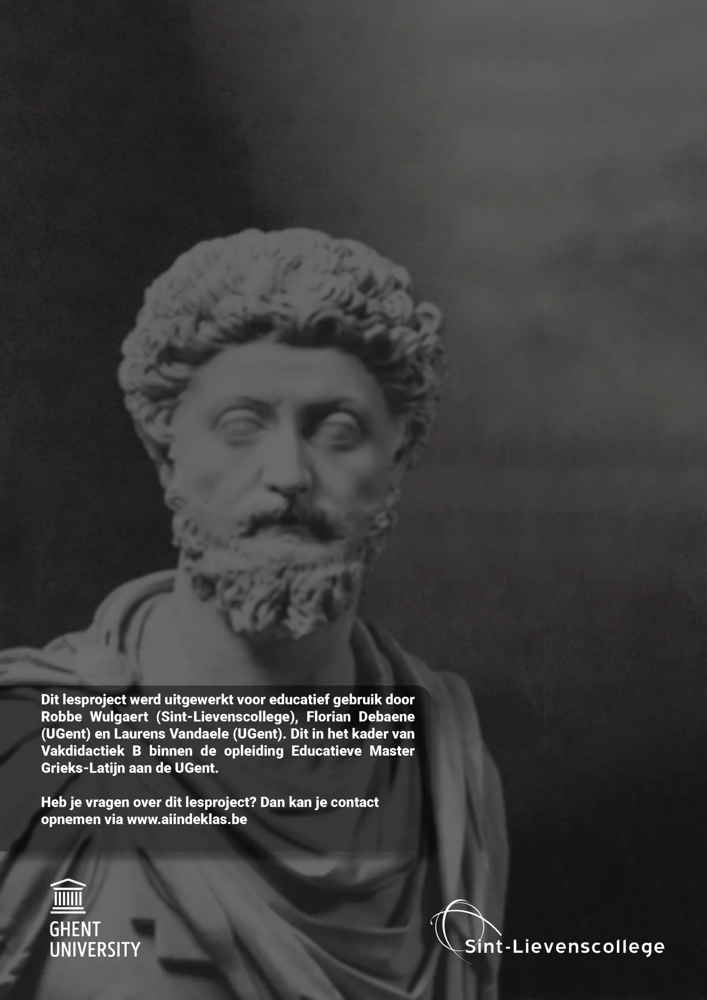
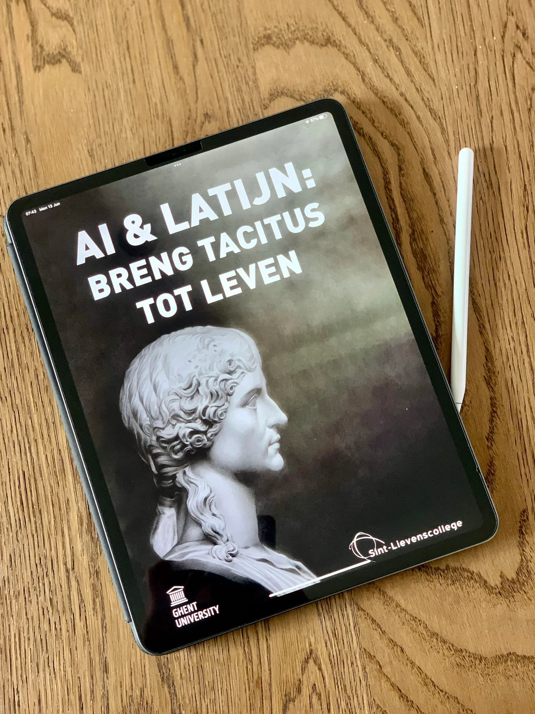

### **Een verrassende verschijning in een recente campagnevideo: de Belgische oud-premier en CD&V-boegbeeld Jean-Luc Dehaene leek de burger toe te spreken. ‘The beast is back!’, of toch niet? Want gezien het overlijden van Dehaene rees de vraag: hoe is dit mogelijk? Het antwoord ligt in de toepassing van artificiële intelligentie en deepfake-technologie. Een toepassing** [**die terecht niet onbesproken bleef.**](https://www.vrt.be/vrtnws/nl/2023/12/07/cd-v-filmpje-met-jean-luc-dehaene-gimmick-die-discussie-over-de/) 

### **Voor docenten klassieke talen en geschiedenis biedt dit een unieke kans om hedendaagse technologie te verbinden met het verleden. Hoe kunnen we jongeren bewust maken van zowel de kansen als de risico's van dergelijke technologieën? In dit lesmateriaal kruip je in de huid van figuren als Vespasianus, Nero of Menelaos om deze brug te slaan. Deze blogpost verkent hoe we dit actuele en uitdagende onderwerp kunnen integreren in de les en zo kunnen leren over de impact van technologie voor het heden en verleden.**

<!-- p08-deferred:media-1ccd4b00f2d824af -->

## Wat is een deepfake?

Voordat we deepfake-technologie in ons lesmateriaal integreren, of wenselijkheid kunnen bespreken, is het belangrijk om de werking ervan te begrijpen. Deepfake combineert 'deep learning' – een geavanceerde vorm van machine learning waarbij computermodellen patronen in data leren herkennen – met het creëren van valse ('fake') beelden.

Het doel van deze technologie is om realistische video's te genereren waarin het lijkt alsof iemand iets zegt of doet wat nooit echt gebeurd is. Denk aan een vorm van geavanceerd poppentheater. Voorheen was dit mogelijk met tools zoals Photoshop of Premiere Pro, maar dit was een tijdrovend proces. Met deepfake-technologie kan dit nu veel sneller, realistischer maar ook gevaarlijker.

Hoe werkt dit? We trainen een computermodel met uren aan videomateriaal, zodat het gezichtsbewegingen en uitdrukkingen kan herkennen en nabootsen. Om de nauwkeurigheid te verhogen, gebruiken we een tegenwerkend AI-model – een 'detective' die nepbeelden identificeert. Deze twee modellen concurreren in een ‘_generative adversarial network_’, wat resulteert in steeds realistischere deepfakes. Een schier eindeloze boksmatch tussen twee spelers waardoor beiden steeds beter en beter worden. 

Het resultaat is een technologie die snel en effectief stilstaande beelden kan omzetten in bewegende, sprekende figuren. Zo kan oud-premier Dehaene digitaal tot leven worden gewekt voor promotiedoeleinden, maar dit kan ook ingezet worden voor educatieve doeleinden. In het volgende hoofdstuk verkennen we hoe we deze technologie kunnen gebruiken om historische figuren zoals Romeinse keizers tot leven te brengen, en hun beroemde citaten te laten 'uitspreken'.

## Kapstok voor diverse onderwerpen

Wanneer we deepfake-technologie met leerlingen bespreken, is het essentieel om de focus te leggen op zowel de mogelijkheden als de **duidelijke gevaren**. Om dit effectief te integreren in het onderwijs, is het raadzaam om deze technologie te koppelen aan bestaande vakken en lesmateriaal. Dit voorkomt dat het onderwerp wordt gereduceerd tot een eenmalige les over mediawijsheid die iemand er bovenop moet nemen. Door te vertrekken vanuit bekende thema's binnen de vakken Klassieke Talen, kunnen docenten deze geavanceerde technologie op een zinvolle manier inbedden in het bestaande curriculum.

In de onderstaande secties demonstreren we hoe we deepfake-technologie kunnen integreren met Latijn en Grieks. Dit is niet alleen om de veelzijdigheid van de technologie te tonen, maar ook om aan te geven hoe deze kan worden aangepast aan verschillende onderwerpen en het niveau van de leerlingen. We beginnen met een focus op de Romeinse keizers en Julius Caesar, geschikt voor leerlingen in het tweede, derde of vierde jaar van het middelbaar onderwijs. 

### Romeinse Keizers

<!-- p08-deferred:media-59f8a27dbe6a61df -->

In dit voorbeeld kruipen we in de huid van de Romeinse keizers. Hiervoor gebruiken we AI-reconstructies gemaakt door [Panagiotis Constantinou](https://www.youtube.com/@panagiotisconstantinou). Op basis van overgeleverde munten en beelden werden levensechte reconstructies gemaakt van de overleden keizers. Aan deze selectie werd nadien ook Julius Caesar toegevoegd (due to popular demand). Deze afbeeldingen vormen de ‘_base image’_ in onze aanpak, het stilstaand beeld dat we willen manipuleren en aansturen. 

Die aansturing doen we in de vorm van een korte uitspraakoefening. De leerlingen krijgen volgende instructie:

-   kies jouw favoriete keizer of een keizer die we hebben behandeld in de les;

-   zoek online naar een bekend citaat van jouw gekozen keizer;

-   bewaar de bron;

-   zoek naar de vertaling van dat citaat;

-   bewaar de bron;

-   Schrijf een **kort** tekstje. In dit **kort** tekstje komt aan bod:

    -   het citaat, uitgesproken in het Latijn of Grieks (Marcus Aurelius bijvoorbeeld);

    -   de vertaling van het citaat;

    -   de korte uitleg over de context van het citaat. Waar en/of waarom is dit uitgesproken? Zei de keizer dit op het sterfbed, in een gesprek met diens zoon?

-   Gebruik de camera van jouw laptop en neem een kort filmpje op waarin je dit tekstje opdraagt. Studeer dit uit het hoofd om het eindresultaat tot z’n recht te laten komen.

-   Dit filmpje zal fungeren als de _‘driver video’_ of de aansturing van de stilstaande afbeelding.

Hieronder vind je een voorbeeld van een driver video en het eindresultaat. In dit voorbeeld laten we keizer Vespasiunus uitleggen wat '_‘pecunia non olet’_ betekent.

<!-- p08-deferred:media-f015ca41cd50a729 -->

<!-- p08-deferred:media-06d1c4f726849f8a -->

### Commentarii de Bello Gallico

Als alternatief op bovenstaande kan je de keuzemogelijkheden voor de leerlingen beperken en/of de uitspraakcomponent vergroten. Hiervoor kan je kiezen voor de inleidende woorden uit ‘Commentarii de Bello Gallico’ door Julius Caesar. Dit maakt het mogelijk om een brug te slaan tussen de propaganda van de bekende veldheer en de misinformatie die vandaag mogelijk is door het gebruik van de deepfake-technologie.

Dit voorbeeld, in vergelijking met voorgaande aanpak, …  

-   verkleint de keuzeopties voor de leerlingen; 

-   vergroot de uitspraakoefening voor de leerlingen;

-   maakt het mogelijk om een brug te slaan tussen de propaganda in het verleden en heden.

<!-- p08-deferred:media-ab8cd31ef8162035 -->

### Helena van Sparta

Dit lesmateriaal biedt een veelzijdige basis waarop we diverse thema's uit de Klassieke Oudheid kunnen verkennen, waaronder Oudgriekse literatuur. Op aanvraag van een Atheense school, om dit te gebruiken in hun lessen rond het werk 'Helena’ door Euripides, werd dit lesmateriaal vertaald naar het Engels. Zo wil maar ginds Euripides' toneelstuk 'Helena' gebruiken om de controverse rond de Trojaanse Oorlog te onderzoeken.

Voor de reconstructie van belangrijke personages zoals Helena en Menelaos, nemen we enkele creatieve, maar niet per se historisch correcte, stappen. Geïnspireerd door een sculptuur van een Myceense vrouw in het archeologisch museum van Athene, kunnen we ons een beeld vormen van hoe Helena eruit zou kunnen zien. Deze sculptuur toont de traditionele make-up van priesteressen in Mycene en Argolis, gekenmerkt door rode stippen. Door deze artistieke interpretatie krijgen leerlingen de kans om zich een beeld te vormen van Helena van Sparta. 

<!-- p08-deferred:media-de802c1310b44b55 -->

In ons lesmateriaal hebben we een soortgelijke oefening uitgevoerd met het beeld van Menelaos, waardoor we de kans krijgen om het '[masker van Agamemnon](https://nl.wikipedia.org/wiki/Masker_van_Agamemnon)' te bespreken. Voor de oefening gaan we tijdelijk uit van de ongefundeerde hypothese dat dit masker daadwerkelijk van Agamemnon is, hoewel historisch bewijs dit tegenspreekt. We verkennen de idee dat Menelaos mogelijk gelijkenissen vertoont met zijn broer Agamemnon, en dus met het masker. Dit masker dient als een startpunt voor onze fictieve reconstructie van Menelaos. Deze aanpak biedt dus ook een gelegenheid om met leerlingen de foutieve aannames te bespreken, hen te stimuleren tot kritisch denken en mogelijk een onderzoeksopdracht te verbinden aan de historische bron van het masker.

<!-- p08-deferred:media-a16887d3f052e971 -->

### Agrippina en Tacitus

Het meest uitgebreide en gedetailleerde voorbeeld van ons lesmateriaal, dat AI-technologie combineert met de werken van Tacitus, is te vinden in een artikel in de [Prora-editie van juni 2022](/onderwijs/prora-ai-in-het-vakblad-voor-leraren-oude-talen) alsook in een [andere blogpost op deze website (én KlasCement)](/onderwijs/ai-en-latijn-breng-tacitus-tot-leven). In dit lesmateriaal, dat ontwikkeld werd door studenten aan de educatieve master aan de UGent, verkennen leerlingen de tekst van Tacitus. Ze kiezen een personage uit de annalen, zoals Anicetus, Seneca, Acceronia of Nero. Vervolgens transformeren zij de tekst naar directe rede en schrijven vanuit het perspectief van hun gekozen personage. Ze duiken vervolgens in het verhaal met behulp van AI-technologie, bijvoorbeeld door middel van een gereconstrueerde Agrippina, om Nero’s motief om haar te vermoorden te verkennen.

Aan dit lesmateriaal is een papieren syllabus verbonden van ruim 20 bladzijden. Hierin steekt ook een voorbeeld van een evaluatiematrix om te gebruiken in de les. 

   

## Benodigdheden

Om hiermee aan de slag te gaan in de klas, heb je natuurlijk enkele zaken nodig. Dit zijn:

-   de werkbundel voor leerlingen (voor het lesmateriaal rond Tacitus);

-   de handleiding voor leerkrachten (voor het lesmateriaal rond Tacitus);

-   een laptop met een webcam;

-   een stabiele internetverbinding;

-   een Google- of Gmail-account.

In de werkbundel voor leerlingen en de handleiding voor leerkrachten zijn alle stappen, uitgeschreven teksten en voorbeelden te vinden. De laptop, de internetverbinding en de Google- of Gmail-account is vereist om de Notebook, het programma met Python-code, te doen draaien. Deze Notebook en code vergen veel rekenkracht, meer rekenkracht dan een reguliere laptop kan genereren. Om dit project toegankelijk te maken voor alle leerlingen, maken we gebruik van de Google Colab omgeving. Deze omgeving maakt het mogelijk om de code uit te voeren op stevige serverhardware bij Google.

## Leerplandoelen

De leerplandoelen verschillen natuurlijk naar gelang de precieze aanpak, de graad waarin dit gegeven wordt en de moeilijkheidsgraad van de bijhorende opdracht. Zo zal een opdracht rond Julius Caesar in een tweede middelbaar andere doelen en verwachtingen hebben dan deze rond Tacitus. Hieronder vind je de leerplandoelstellingen en lesdoelen die horen bij dat laatste voorbeeld (dus derde graad secundair onderwijs): 

**Leerplannen na de hervorming (vanaf schooljaar 2023-2024)**

-   LPD 4: De leerlingen lezen Latijnse tekstfragmenten voor volgens de algemene regels van de Latijnse uitspraak en prosodie.

-   LPD 5: De leerlingen bouwen inzicht op in het taalsysteem van het Latijn en passen dat toe bij het lezen van teksten of tekstfragmenten.

-   LPD 7: De leerlingen maken doeltreffend en kritisch gebruik van hulpmiddelen (bv. woordenboek bij de synthese van de eigen tekst)

-   LPD 8: De leerlingen tonen aan dat ze de tekst begrepen hebben: de tekst weergeven in eigen woorden, samenvatten, vragen beantwoorden en vertalen.

-   LPD 11: De leerlingen ontleden de opbouw van een tekst.

-   LPD 16: De leerlingen motiveren de eigen beleving en interpretatie van Latijnse teksten (vb. Waarom koos je voor een bepaald personage?)

-   LPD 18: De leerlingen vergelijken vertalingen met de brontekst en met andere vertalingen (zoals de vertaling in de syllabus)

-   LPD 20: De leerlingen beschrijven aspecten van de maatschappij en cultuur waarin het Latijn werd gebruikt.

**Leerplannen voor de hervorming (voor schooljaar 2023-2024)**

-   LPD 4: Een aangeleerde leesmethode toepassen.

-   LPD 5: Bij het leesproces het tekstbegrip systematisch aan grammaticale en inhoudelijke criteria toetsen en de aard van eventuele problemen aangeven.

-   LPD 7: Tekstbegrip tonen door de hoofdgedachte uit de tekst te halen, de tekst te parafraseren, de tekst te synthetiseren, de Latijnse tekst expressief te lezen ...

-   LPD 9: De opbouw van een tekst(fragment) ontleden.

-   LPD 13: De communicatieve functie van teksten verduidelijken aan de hand van vorm en inhoud.

-   LPD 14: De relatie tussen inhoud en vorm kritisch evalueren en de expressieve waarde beoordelen volgens klassieke en hedendaagse visies.

-   LPD 15: Een tekstfragment in een ruimer geheel situeren.

-   LPD 19: Gegeven vertalingen met de gelezen brontekst en met elkaar vergelijken en daarbij verschillen tussen het Latijnse en Nederlandse taalsysteem toelichten.

-   LPD 28: Aan de hand van taal en cultuur de identiteit en diversiteit van de Romeinse samenleving toelichten.

-   LPD 29: Een persoonlijke reactie op Romeinse denkbeelden en cultuuruitingen geven en die creatief verwerken.

## Nascholing

Het lesmateriaal '**_Artificiële Intelligentie en Latijn: Hoe Agrippina tot leven komt_**‘ maakt deel uit van een nascholingsprogramma dat regelmatig wordt aangeboden door het Centrum Nascholing Onderwijs (CNO) van de Universiteit Antwerpen. Deze nascholing, die doorgaans plaatsvindt op de campus Boogkeers, heeft al meer dan 30 docenten Klassiek Talen aangetrokken en is beoordeeld met een gemiddelde score van 4.35 op 5.

Heeft u interesse om deze CNO-nascholing op uw school te organiseren? Dat is zeker mogelijk. Voor meer informatie over het aanbod en de organisatie van deze nascholing kunt u de onderstaande link raadplegen.

<a class="content-button content-button--primary content-button--medium" href="https://cno.uantwerpen.be/nl/opleiding/artificiele-intelligentie-en-latijn-hoe-agrippina-tot-leven-komt-78396" target="_blank" rel="noreferrer">Nascholing CNO</a>

<a class="content-button content-button--primary content-button--medium" href="/onderwijs/workshops-en-nascholingen" target="_blank" rel="noreferrer">Info over nascholingen</a>

## Ik wil dit in mijn klas!

Wil je hier zelf mee aan de slag in jouw klaslokaal? Super! Jongeren laten kennismaken met artificiële intelligentie is een belangrijke opgave, ook binnen een richting met Klassieke Talen. Meer informatie en downloads kan je vinden via onze Discord Community!

<a class="content-button content-button--primary content-button--medium" href="/contact">Naar contact en de Discord!</a>

### Meer informatie over dit soort AI-lesmateriaal en veel meer vind je in:

