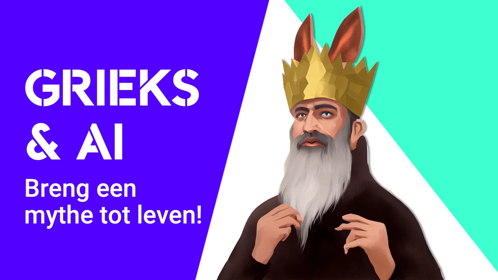
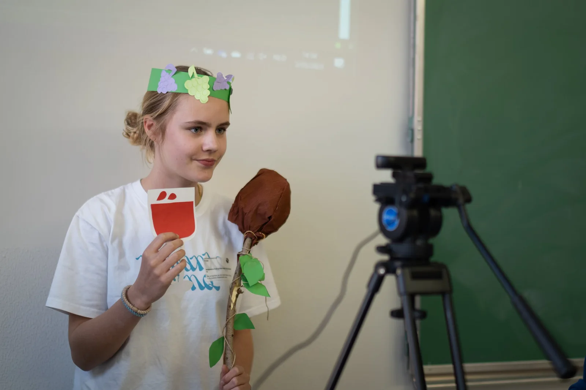
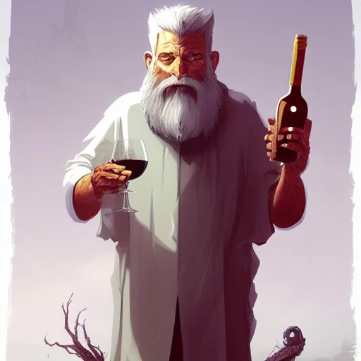
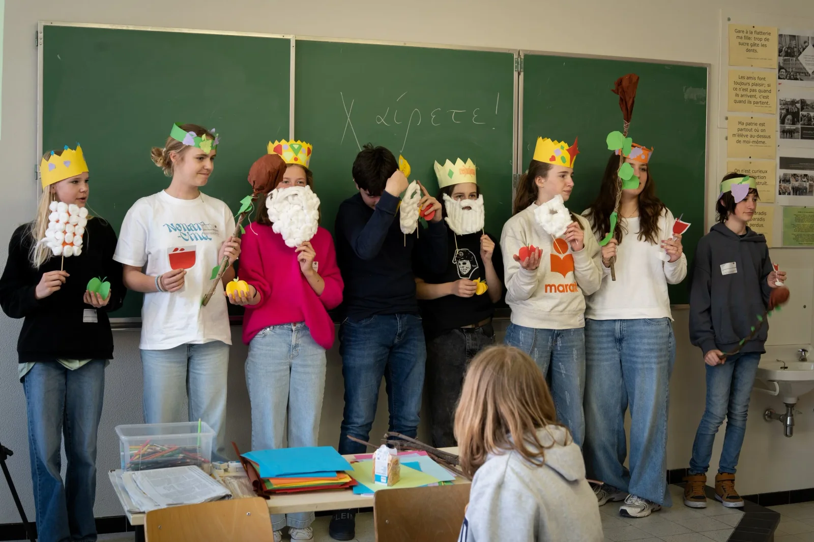
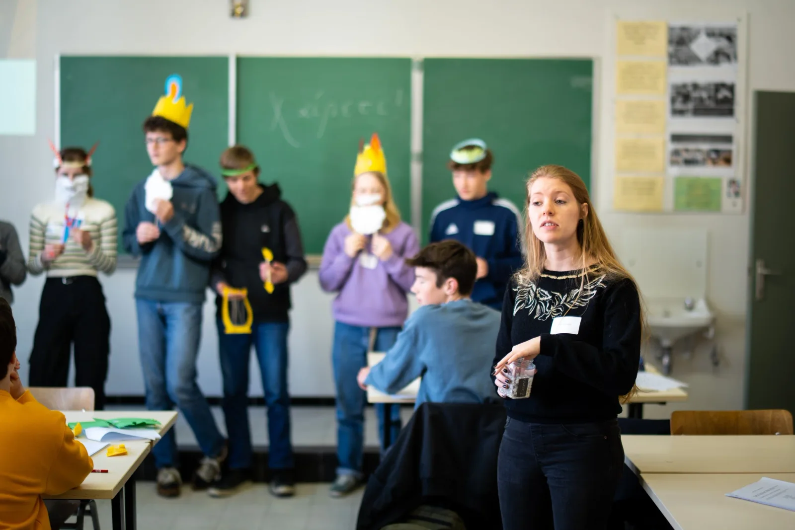
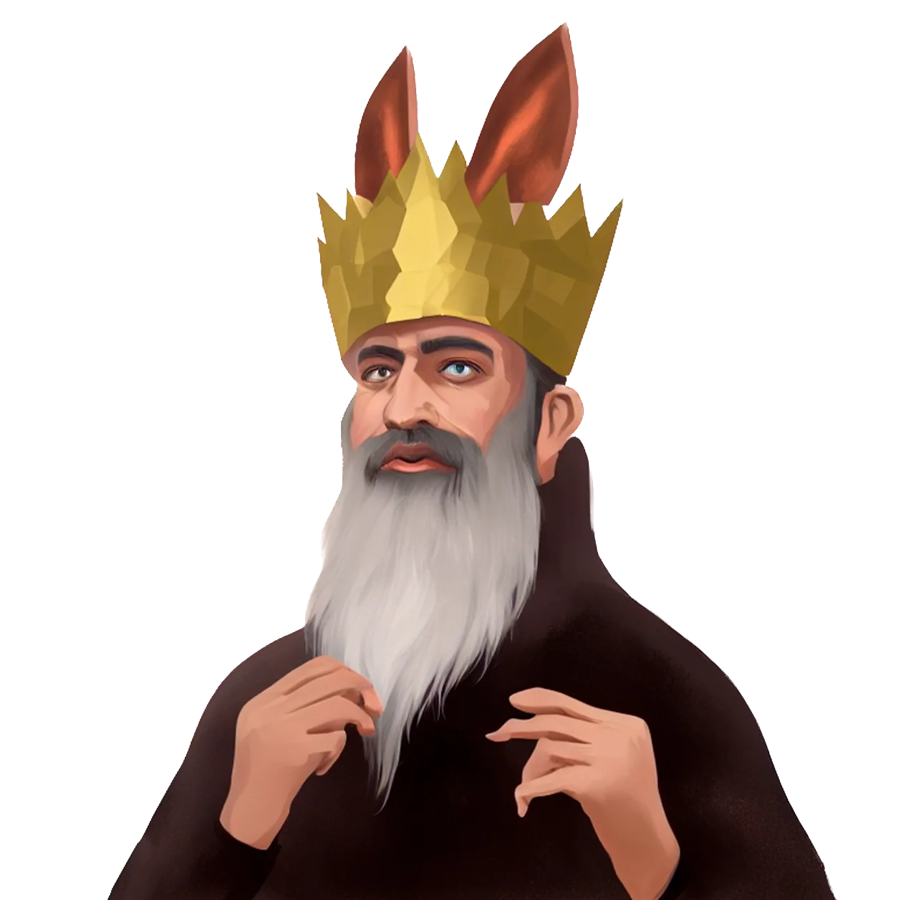
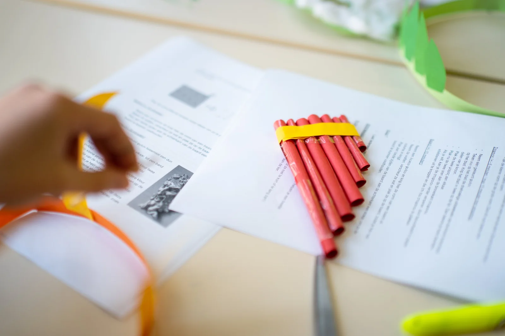
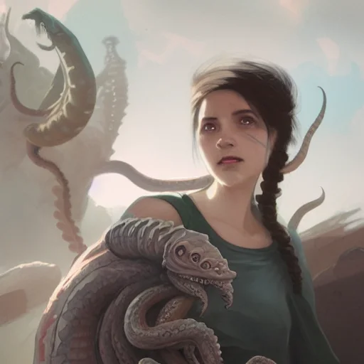

### **Χαῖρε! Hoe sla je de brug tussen artificiële intelligentie en de klassieke talen? Vorig academiejaar ontwierpen mijn studenten en ik lesmateriaal dat net dit deed!** We ontwikkelden lesmateriaal waarbij leerlingen in de huid kropen van personages uit de [Annales van Tacitus voor het vak Latijn](/onderwijs/ai-en-latijn-breng-tacitus-tot-leven), maar ook lesmateriaal dat naadloos [AI, Geschiedenis en Grieks wist te verbinden](/onderwijs/ai-en-grieks-epigrafie-met-een-robot)**. Dit jaar duiken we in de Oudgriekse mythes via drie verschillende verhalen aan de hand van didactische aanpakken uit het vak artistieke vorming. Dit lesmateriaal combineert zo het praktische met het digitale en richt zich op het tweede en derde middelbaar Grieks. Lang verhaal kort: we maakten, speciaal voor de Griekse Dag van het Katholiek Onderwijs Vlaanderen, een Griekse mythen + AI-photobooth!** Πες τυρί!

### **De uitdaging: Oudgrieks en edtech!**

Op beurzen waar educatieve technologie centraal staat, zoals SETT in België of BETT in het Verenigd Koninkrijk, vind je talloze applicaties om digitale tools te combineren met wetenschappen en computationeel denken. Maar de klassieke talen vind je daar minder eenvoudig terug. Daarom proberen mijn studenten, collega’s en ik tegengewicht te bieden. Binnen ons opleidingsonderdeel focussen we bewust op de combinatie tussen klassieke talen en moderne technologie zoals games en artificiële intelligentie!

Binnen dit project ontwikkelden we een lesaanpak waarbij leerlingen kennismaken met drie mythes. De mythe over Scylla en twee over koning Midas, met ezelsoren of zijn kenmerkende ‘golden touch’. Ze ontdekken de personages en worden uitgedaagd om de bijhorende attributen in elkaar te knutselen. Attributen die het AI-model kunnen helpen bij het visualiseren van hun gekozen mythisch figuur in de **photobooth**!

De AI-photobooth in actie!

### **Voor wie?**

Dit project richt zich op leerlingen uit het **tweede en derde leerjaar** **van het secundair onderwijs.** De leerlingen ontdekken drie mythen door middel van aangepaste verhalen die we vertellen in de klas. Daarna gaan de leerlingen aan de slag! In een race tegen de tijd en met beperkte knutselspullen ontwerpen zij de bijhorende attributen. Als kers op de taart nemen ze plaats in onze **AI-photobooth**!

### **Aan de slag!**

Tijdens dit lesproject doorlopen de leerlingen **vier** **lesfases**.

**1) Materiaal kiezen!**

Nog voordat de leerlingen te weten komen welke mythes en personages de revue zullen passeren, laten we hen materiaal kiezen. De verantwoording achter deze beperking komt in lesfase 3 aan bod!

Dionysos, twee cijfers op de klok.

**2) Kennismaking met de mythe**
De groep leerlingen wordt in drie verdeeld. Elk deel krijgt een eigen mythe voorgeschoteld. Deze mythe kan worden gelezen of met veel bravoure worden verteld (Griekse mythes hebben namelijk een zeer kleurrijke orale traditie).

**3) maken van de attributen**
Leerlingen krijgen beperkte tijd en middelen om hun attributen te ontwikkelen. Een kroon, ezelsoren, een lier, een gouden appel … Door de beperking in tijd en materialen dagen we hen creatief uit. Voor de photobooth maakt het niet zoveel uit mocht de gouden appel gemaakt zijn uit oranje of geel papier of mochten de ezelsoren paars blijken te zijn.

**4)** **Say cheese! Πες τυρί!
**Leerlingen nemen plaats voor de camera. Via de browser, JavaScript en Python-code combineren we de foto van de leerling met onze instructie. Hiermee kan het AI-model aan de slag! De gewichten in het neurale netwerk lichten op en in een mum van tijd zie je drie verschillende verwerkingen van jouw personage!

### **Hoe kwam dit project tot stand?**

Dit project is het resultaat van een samenwerking tussen de **UGent** en het **Sint-Lievenscollege** **Gent**. Dit in het kader van het opleidingsonderdeel ‘**Vakdidactiek B’ binnen de Educatieve Master**. In dit opleidingsonderdeel dienden studenten, Andrée Walravens, Gaëtan Rubbrecht en Sien Denduyver, digitaal lesmateriaal te ontwikkelen voor **Grieks** in combinatie met **artificiële** **intelligentie**. Hiervoor werden ze begeleid door vakdocenten Katrien Vanacker, Wim Cool en Katja De Herdt (UGent - vakinhoudelijk) en Robbe Wulgaert (begeleider - ontwikkeling digitaal materiaal).

Andrée, Gaëtan en Sien verkenden de mogelijkheden van een AI-tool, kozen relevante leerplan- en lesdoelen, ontwikkelden lesmateriaal, kozen gepaste didactische aanpakken, knutselden eigen attributen in elkaar en selecteerden evaluatiemethoden …

Vorig academiejaar ontwierpen we, in hetzelfde opleidingsonderdeel, reeds lesmateriaal om Klassieke Talen en AI te combineren**.** Zo kan je reeds [**in de huid kruipen van de personages uit de Annales van Tacitu**](/onderwijs/ai-en-latijn-breng-tacitus-tot-leven)[**s**](/onderwijs/ai-en-latijn-breng-tacitus-tot-leven) of een [**inscriptie herstellen met een taalalgoritme**](/onderwijs/ai-en-grieks-epigrafie-met-een-robot). Met de mythes en onze AI-photobooth zijn we dus zeker niet aan ons proefstuk toe!

Koning Midas met ezelsoren

### Lesdoelen

-   De leerlingen kunnen aan de hand van een vertaling de fysieke en materiële aspecten van een personage samenvatten. 

-   De leerlingen kunnen de fysieke en materiële aspecten van een personage op een creatieve wijze weergeven aan de hand van een tekening. 

-   De leerlingen kunnen aan de hand van Griekse woorden weergeven hoe een personage eruit zag via een creatief product.

-   De leerlingen tonen dat ze woorden uit het basisvocabularium hebben begrepen via hun creatief product.

-   De leerlingen vormen via constructieve feedback een mening over de het product van zichzelf en van andere groepen.

-   De leerlingen leggen in eigen woorden uit hoe AI bijdraagt tot de visuele herwerking van hun creatieve product. 

-   De leerlingen argumenteren via hun artistiek proces dat ze de opdracht begrepen hebben.

-   De leerlingen tonen via hun artistiek proces en product dat ze de auditieve en geschreven input begrepen hebben. 

-   De leerlingen tonen via het artistieke proces dat ze kunnen samenwerken.

### Leerplandoelen

Deze leerplandoelen werden geselecteerd uit de leerplannen Grieks uit de eerste graad, de tweede graad, het leerplan Artistieke Vorming / Beeld en Geschiedenis, het gemeenschappelijk leerplan ICT en sleutelcompetenties uit de eerste graad en tweede graad.

**Leerplan klassieke talen (eerste graad):**

-   LPD 47: de leerlingen leiden een in de context passende vertaling af van woorden uit de gememoriseerde betekenissen;

-   LPD 27: de leerlingen verwerken aspecten van de klassieke oudheid op een creatieve manier;

-   LPD 52: De leerlingen beschrijven aspecten van de Griekse cultuur en vergelijken ze met de eigen cultuur. 

**Leerplan klassieke talen (tweede graad, vernieuwde leerplannen 2023-2024):**

-   LPD 4: de leerlingen geven de betekenis, woordsoort en aanvullende betekenis van ca. 800 frequente woorden;

-   LPD 34: de leerlingen illustreren de receptie van de klassieke oudheid;

-   LDP 35: de leerlingen verwerken aspecten van de klassieke oudheid op een creatieve manier.

**Eindtermen (sleutelcompetenties) uit de eerste graad:**

-   Competenties in het Nederlands

-   Competenties in andere talen

-   Cultureel bewustzijn en culturele expressie.

**Eindtermen (sleutelcompetenties) uit de tweede graad:**

-   sleutelcompetentie Nederlands

-   Sleutelcompetentie: cultureel bewustzijn

-   Culturele expressie:

    -   De waardering voor kunst- en cultuuruitingen kan op verschillende manieren geuit worden, zowel talig als expressief. Door zelf een artistiek creatieproces te doorlopen kan de waardering voor de expressies van anderen genuanceerder beargumenteerd worden. Deze doelstellingen staan voorop bij de eindtermen onder de derde bouwsteen.

    -   Culturele expressie komt aan bod in een inhoudelijke bouwsteen ‘verbeelding gericht inzetten bij het creëren van artistiek werk’. De wederkerige verbinding en beïnvloeding tussen kennis, gevoel en lichaamservaring zijn kenmerkend voor creatieve processen. Het bewust beleven van die interactie tussen lichaam, gevoel en kennis tijdens het creëren draagt bij aan de persoonlijke ontplooiing.

**Leerplan Artistieke Vorming / Beeld:**

-   **Beschouwen**

    -   LPD 1: De leerlingen beleven een divers aanbod van cultuuruitingen via kunst.

    -   LPD 2: De leerlingen nemen kunst- en cultuuruitingen waar met oog op het onderwerp en de bedoeling.

-   **Creëren**

    -   LPD 10: De leerlingen experimenteren in functie van een afgebakende opdracht met diverse bouwstenen, materialen en (basis)technieken van de verschillende artistieke vormen.

    -   LPD 12: De leerlingen creëren in functie van een afgebakende opdracht artistiek werk vanuit de eigen verbeelding.

    -   LPD 13: De leerlingen creëren samen artistiek werk.

-   **Reflecteren**

-   LPD 17: De leerlingen reflecteren en communiceren aan de hand van aangereikte criteria over het eigen artistiek proces en product en over dat van medeleerlingen.

-   LPD 18: De leerlingen uiten hun waardering over kunst- en cultuuruitingen vanuit hun eigen unieke expressieve ervaringen.

**Gemeenschappelijk Leerplan ICT:**

-   LPD 7: De leerlingen onderscheiden bouwstenen van een digitaal systeem

Scylla

### Benodigdheden

Voor dit lesproject heb je een aantal zaken nodig, namelijk:

-   Kleurpotloden;

-   Bladen papier (liefst in kleur)

-   De verhalen van de mythes voor de leerkracht;

-   De PowerPoint met de timers;

-   Een laptop voor de leerkracht;

-   Het AI-model;

-   Een webcam (intern of extern).

Dit project kan nagenoeg kosteloos worden uitgevoerd in de klas. Het AI-model kan via de browser draaien op nagenoeg elke schoollaptop.

### Ik wil dit in mijn klas! Wat moet ik doen?

Wil je hier zelf mee aan de slag in jouw klaslokaal? Super! Jongeren laten kennismaken met artificiële intelligentie, taal en cultuur is belangrijk. Daar hoort het verkennen van het vak Grieks zeker bij. Ik wil jou daar gerust bij helpen!

<a class="content-button content-button--primary content-button--medium" href="https://sintlievenscollege-my.sharepoint.com/:u:/g/personal/robbe_wulgaert_sintlievenscollege_be/EYF_OYYZbj9Lj5JSucPHBekBrgzjCwgQg22O9nZSQ85haQ?download=1">Download het Lesmateriaal</a>

