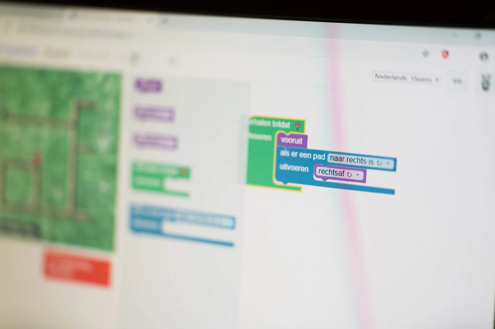
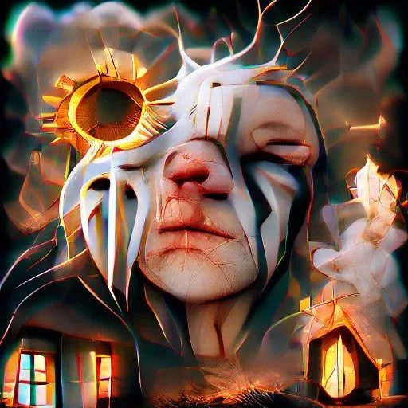
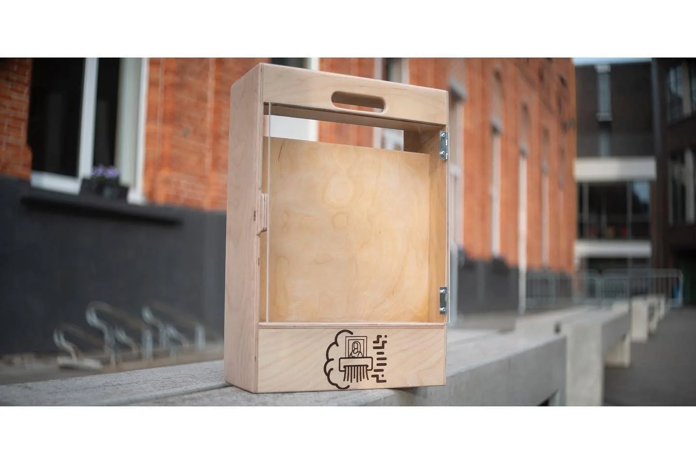

**Welke waarde heeft kunst? Een ongelofelijk moeilijk vraagstuk, want hoe meet je zoiets? Druk je dat uit in geld? De waarde van de individuele grondstoffen waaruit het werk bestaat? De tijd en kunde die het vergt van de kunstenaar? De bekende naam van de kunstenaar? Het is een vraagstuk dat enkel ingewikkelder is geworden in deze digitale tijd. Een tijd waarin alles oneindig te kopiëren is, of eeuwig bestaat als NFT op de blockchain. Dit project hoopt geen antwoord te bieden op deze vraag, maar ze op scherp te stellen. Want wat is de waarde van een werk wanneer dit gemaakt is door een artificiële intelligentie? Niet om oneindig te delen en eeuwig te bestaan, maar uniek en slechts eindig in onze wereld. Want de artificiële intelligentie die dit werk maakte, zal het na een volledig onbekend aantal toeschouwers vernietigen.**

**How do we define value, human?**

[Video on YouTube](https://www.youtube.com/watch?v=UHSUIHJcylw)

### De\_Titel.txt

Wanneer leerlingen leren computationeel denken, leren we hun een probleem analyseren, ontleden en opdelen in kleine stappen. Kleine stappen die de computer kan oplossen. Die stappen vormen de onderdelen van ons stappenplan, ook wel algoritmes genaamd. Algoritmes bepalen ons leven. In de digitale én de fysieke wereld.

Zo een computeralgoritme start met het bepalen van variabelen en toekennen van een waarde. Net daar loopt het al fout wanneer we het hebben over kunst. Want hoe variabel de vorm ervan ook is, het toekennen van een ‘waarde’ is een pak ingewikkelder dan bij informaticawetenschappen. Aan wie is het ook om waarde toe te kennen? **En aan welke factoren, variabelen, is de ‘waarde’ onderhevig?** De eerste stap uit ons algoritme, een standaardprocedure, die er plots geen meer is ...

### **De\_Artiest.txt**

Een van die variabelen bij het bepalen van de waarde van een werk, is natuurlijk de naam en faam van de artiest. Een Van Gogh, Warhol of Van Eyck trekt ogen. Velen willen die wonderen van menselijk talent zien, sommigen willen er veel geld voor neerleggen. Maar wat als de artiest een onbekende is? Meer nog, wanneer de artiest een artificiële intelligentie is genaamd DALL-E? **Kan zo een systeem van ingewikkelde computeralgoritmes überhaupt tot creativiteit komen, en zo ja, wat is dat waard?**

### **Het\_Werk.txt**

**Het werk van DALL-E is het product van een minimale menselijke input en maximale vrijheid voor de AI.** De mens geeft een beschrijving van het eindresultaat, van een gevoel, van een scene ... daarna geeft de mens de controle uit handen. De DALL-E neemt het over en creëert een eigen interpretatie.

Bovendien is deze interpretatie uniek, want als men DALL-E zou klonen en hetzelfde commando geeft, zal het eindresultaat niet exact hetzelfde zijn. Natuurlijk kan men het digitale werk eindeloos kopiëren en verspreiden. Daarom zetten we het werk van de AI om in een geprinte versie, plaatsen het in een speciale lijst en vernietigen we de digitale kopij. **Niet te repliceren, niet te dupliceren, eindeloos te bewonderen, toch?**

### **De\_Tentoonstelling.txt**

Dat eindeloos bewonderen, die tijdscomponent ... ook dat is een variabele in onze waardebepaling. Het is een variabele die ons boeit, maar waar we hier de controle uit handen geven. Want wanneer wij naar het werk van DALL-E kijken, kijkt DALL- E ook naar ons. De speciale lijst waar het werk in steekt, beschikt over een camera. Deze camera is verbonden met het AI-brein van de lijst. Dit brein is getraind om menselijke aangezichten te herkennen. Niet om Bert van Inez te onderscheiden, maar om te detecteren wanneer iemand kijkt naar de lijst. Dat kan DALL-E omdat het getraind is op verschillende menselijke gezichten. Niet via een of andere zoekmachine of creepy sociale mediasite, maar via het AI-systeem achter ‘this person does not exist’. Een website die eindeloos unieke foto’s maakt van mensen die helemaal niet bestaan. Telkens wanneer iemand kijkt, zal DALL-E turven ...

Waarom zal DALL-E dit turven? Wanneer het werk in de lijst wordt geplaatst en de camera wordt opgestart, plaatst DALL-E een willekeurig getal in het geheugen. Een getal dat fungeert als een limiet en niet wordt gecommuniceerd met de buitenwereld. **Wanneer de teller van herkende toeschouwers wordt bereikt, zal de in de lijst ingebouwde versnipperaar het werk onherroepelijk vernietigen. Het werk blijft bestaan zolang de AI bepaald heeft.**

### **De\_Slotvraag.txt**

Wanneer heeft het werk ‘waarde’? Wanneer het intact bestaat in de lijst, wanneer het zijn arbitrair bepaald totaal aantal toegelaten bezoekers heeft bereikt, wanneer het werk dit volledige proces heeft doorlopen en versnipperd eindigt ... Of had het nooit waarde omdat het slechts het product is van een onbewuste artificiële intelligentie in een nodeloos ingewikkelde denkoefening?

### Making-of.mp4

[Video on YouTube](https://www.youtube.com/watch?v=06QAeILUQIw)

### Ik wil dit in mijn klas! Wat moet ik doen?

Wil je hier zelf mee aan de slag in jouw klaslokaal? Super! De toekomst zal steeds meer en meer digitaal zijn. Een toekomst waar artificiële intelligentie een heel belangrijke rol in zal spelen. Dat we jongeren hierop moeten voorbereiden en motiveren, spreekt voor zich. Ik wil jou daar gerust bij helpen! Via de knop hieronder kan je mij een bericht sturen. Ik antwoord veelal binnen de 48 uur!

<a class="content-button content-button--primary content-button--medium" href="/contact">Contact!</a>

