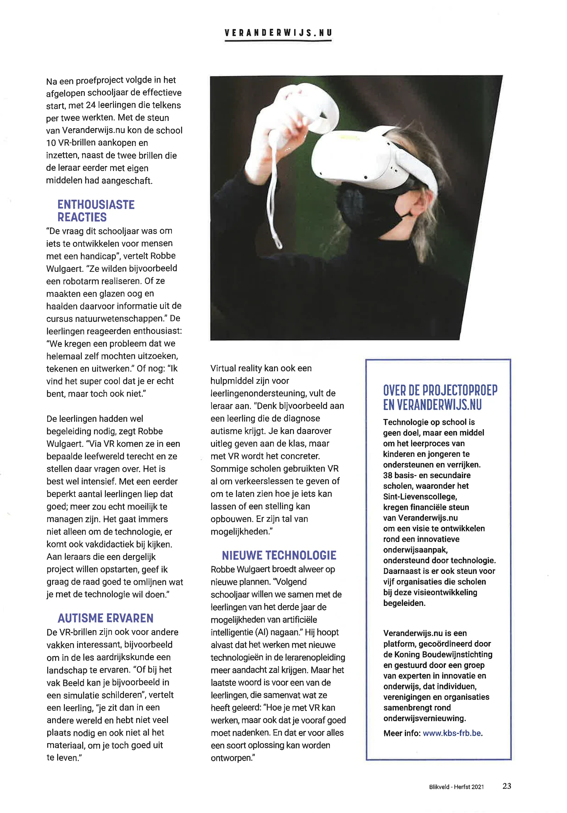

[Video on YouTube](https://www.youtube.com/watch?v=KUIE_fjzhvI)

### Het initiatief

Virtual reality evolueert razendsnel. Waar VR-brillen enkele jaren geleden nog een flinke duit kostten of moeilijk op te stellen waren, is dat aan het keren. Net zoals bij de computer, de camera en de smartphone, wordt de gebruiksdrempel van VR-brillen steeds lager. Daardoor zijn meer en meer mensen in staat om zichzelf én anderen onder te dompelen in hun eigen virtuele realiteit. In die nieuwe immersieve wereld kunnen mensen content maken, zich creatief uitlaten en zo hun ervaring op een originele manier kleur geven.

Met dit project slaan we een brug tussen de verschillende vakken, talenten en technologieën, tussen informaticawetenschappen, plastische opvoeding en Nederlands. Waar leerlingen kennis leren maken met de nieuwe technologie, zich erin verdiepen en zich even verliezen. Waar leerlingen creatief aan de slag gaan om hun fantasie om te zetten naar visuele en auditieve kunst.

Een beeld zegt misschien meer dan duizend woorden, maar de meerwaarde van een goede vertelstem valt niet te onderschatten. Dat alles combineren we tot een geheel, om zo door fantasie en technologie onze boodschap te brengen.

### De vernieuwing

Dit vakoverschrijdend project in het secundair onderwijs tracht nieuwe technologie in te zetten om leerlingen te laten creëren. We slaan zo de brug tussen disciplines, collega's en leerplannen. Zo zetten we ook de Arts in STEaM in de kijker.

### Waarom en hoe?

Dit project vertrekt van een kleine schaal (+-12 leerlingen) en dient als een proof-of-concept. Het is een pilootproject om de techniek uit te testen in een onderwijssetting. Echter, zelfs als dit project slaagt in zijn doelstellingen, zal het wellicht kleinschalig blijven. De kosten die verbonden zijn aan het materiaal zijn immers hoog. Bovendien vergt het veel tijd om een werk in 2D en daarna in 3D te maken en het vervolgens om te zetten naar een app. Een schaalvergroting van dit project zal dus gepaard moeten gaan met investeringen.

### Resultaten

Leerlingen leren in dit project een verhaal brengen. Ze tekenen hun verhaal in 2D (op papier), schrijven het uit (taalvak), maken het ontwerp in virtual reality en leren hoe je een verhaal wervend vertelt (taalvak). We combineren deze verschillende onderdelen en bouwen zo onze eigen VR-app. In deze app komt het volledige verhaal tot leven! Je luistert naar het verhaal, loopt vrij rond, kijkt van ver en dicht naar de creaties ... onze fantasie komt tot leven!

### Tips & tricks

Lang verhaal kort: neem gerust contact op! Ik geef digitale workshops om scholen te begeleiden in dit soort projecten.

<a class="content-button content-button--primary content-button--medium" href="https://www.veranderwijs.nu/verhaal/steam-project-digital-storytelling-virtual-reality">Meer informatie</a>

