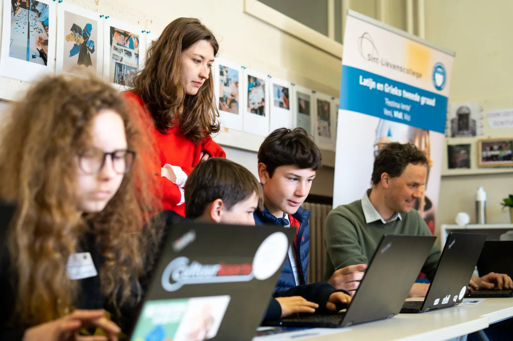
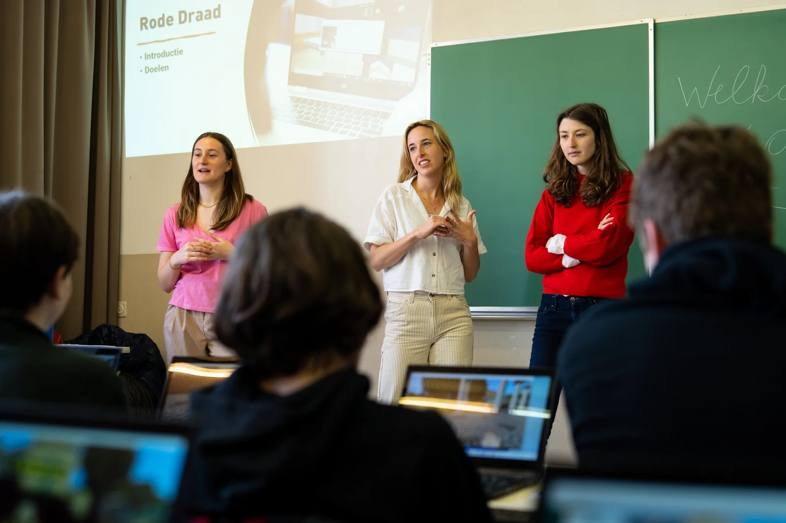
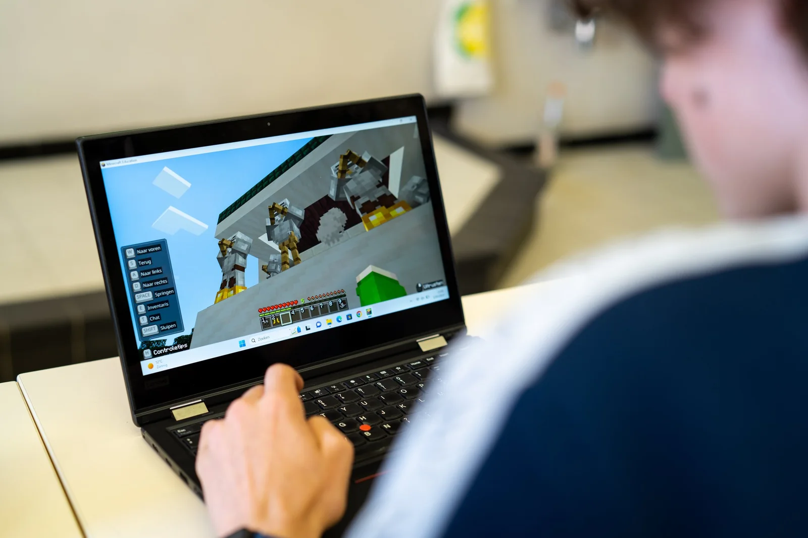
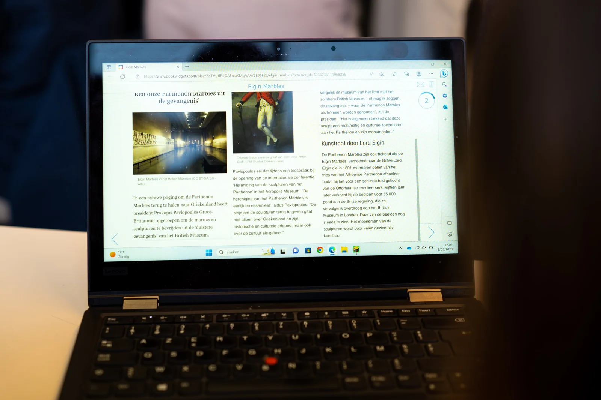

### Χαῖρε! Hoe breng je educatieve technologie in de klassieke talen? Vorig academiejaar ontwierpen mijn studenten en ik lesmateriaal dat net dit deed! [We ontwikkelden twee levels waarin leerlingen het oude Rome konden verkennen en via opdrachten meer leerden over de Familia Latina en het leven van de Romeinen](/onderwijs/ontdek-latijn-met-minecraft). Dit jaar trekken we naar de Atheense Akropolis! Via een Minecraft-wereld ontdekken leerlingen het Parthenon, ontmoeten ze Athena en leren ze bij over de Elgin Marbles. Dit digitale lesmateriaal richt zich op het tweede en derde middelbaar Grieks en durft zo de inhoudelijke lat hoger leggen. Dit lesmateriaal ontwikkelden we speciaal voor de Griekse Dag van het Katholiek Onderwijs Vlaanderen. **Π**άμε!

### **De uitdaging: Oudgrieks en edtech!**

Op beurzen waar educatieve technologie centraal staat, zoals SETT in België of BETT in het Verenigd Koninkrijk, vind je talloze applicaties om digitale tools te combineren met wetenschappen en computationeel denken. Maar de klassieke talen vind je daar minder eenvoudig terug. Daar proberen mijn studenten, collega’s en ik tegengewicht te bieden. Binnen ons opleidingsonderdeel focussen we bewust op de combinatie tussen klassieke talen en moderne technologie zoals games en artificiële intelligentie!

Binnen dit project ontwikkelden we een Minecraft-wereld waar leerlingen de Atheense Akropolis kunnen verkennen. Op de heuvel vinden ze niet alleen **Perikles, Athena en Xanthippe** terug, maar ook de gekende gebouwen zoals het **Parthenon**, de **Kariatiden** en zelfs het vergane standbeeld van **Athena Promachos**.

Via diverse stops en tussentijdse bevragingen komen de leerlingen in aanraking met de **verschillende gebouwen op de Akropolis** en hun functies, ze leren bij over diverse goden en de **oorsprong van de polis Athene**, ze leren over de discussie rond de **Elgin Marbles** en maken zo kennis met argumenten pro en contra hun teruggave aan Athene.

Bovendien zorgen we ervoor dat de verschillende stops **geen cultuurlesjes blijven**. De teksten bevatten Oudgriekse termen en begrippen die de leerlingen uitdagen. Eenvoudige invuloefeningen wisselen we af met leesteksten en krantenartikels. Bij de slotoefening wisselen we het lineaire voor een verkenningsopdracht langs het odeon van Herodes Attikos, het theater van Dionysos en het chryselefantiene beeld van Zeus.

### **Voor wie?**

Dit project richt zich op leerlingen uit het **tweede en derde leerjaar** **van het secundair onderwijs.** De leerlingen ontdekken de Akropolis door middel van een aangepaste Minecraft-wereld. Deze wereld is een **bijna volledige herschepping van de oude Atheense Akropolis**, inclusief het Parthenon, het Erechtheion, de Propyleeën …

### **Aan de slag!**

In dit lesmateriaal wordt de leerling ondergedompeld in de voor velen bekende **Minecraft**\-**wereld**. Niet om te bouwen of overleven, maar om de Akropolis van het oude Athene volledig te ontdekken! Binnen een level maakt de leerling kennis met enkele spelpersonages zoals Perikles, Hermes, Sokrates …

Als extra uitdaging, of evaluatie en feedbacktool voor de leerkracht, bevat het level meerdere quizzen! Zo kunnen we nagaan of de lesdoelen bereikt werden door de leerling.

### **Hoe kwam dit project tot stand?**

Dit project is het resultaat van een samenwerking tussen de **UGent** en het **Sint-Lievenscollege** **Gent**. Dit in het kader van het opleidingsonderdeel ‘**Vakdidactiek B’ binnen de Educatieve Master**. In dit opleidingsonderdeel dienden studenten, Rachel Pittie, Delphine Larmuseau en Aurélie De Baerdemaeker, digitaal lesmateriaal te ontwikkelen voor Grieks binnen het spel Minecraft. Hiervoor werden ze begeleid door vakdocenten Katrien Vanacker, Wim Cool en Katja De Herdt (UGent - vakinhoudelijk) en Robbe Wulgaert (begeleider - ontwikkeling digitaal materiaal).

Rachel, Delphine en Aurélie verkenden de mogelijkheden van een digitale tool, kozen relevante leerplan- en lesdoelen, ontwikkelden lesmateriaal en evaluatiemethoden … Zo leren studenten zelf (digitaal) lesmateriaal ontwikkelen, van begin tot eind.

Vorig academiejaar ontwierpen we, in hetzelfde opleidingsonderdeel, reeds [**lesmateriaal om Minecraft en Latijn te combineren**](/onderwijs/ontdek-latijn-met-minecraft)**.** We maakten ook de brug tussen[**game design en de losse ablatief**](/onderwijs/latijn-en-game-design). Met de Akropolis zijn we dus zeker niet aan ons proefstuk toe!

### Lesdoelen

-   Herkennen van verschillende  gebouwen op de Akropolis;

-   Benoemen van gebouwen op de Akropolis met hun naam en functie;

-   Griekse woorden herkennen in Nederlandse woorden;

-   Kennismaken met de prominente figuren uit de 5de eeuw v.Chr.: Perikles, Sokrates, Xanthippe;

-   Basis Griekse woordenschat begrijpen;

-   Begrijpend lezen;

-   Kennis uitdiepen over bepaalde Griekse goden vb. Athena, Nike en Hermes;

-   Het debat rond de Elgin Marbles verwoorden en argumenten geven pro of contra.

### Leerplandoelen

Deze leerplandoelen werden geselecteerd uit de [leerplannen Grieks](https://pro.katholiekonderwijs.vlaanderen/leerplan-ii-gri-d/leerplan) en Geschiedenis (tweede graad).

**Grieks:**

-   LPD 1: De leerlingen leiden de betekenis van woorden af uit woordopbouw en - verwantschap:

    -   in het Grieks: via verwantschap met andere Griekse woorden;

    -   in het Grieks: via verwantschap met de moderne talen;

    -   in moderne talen: via verwantschap met het Grieks.

-   LPD 30: De leerlingen onderscheiden overeenkomsten en verschillen tussen kenmerkende aspecten van de eigen maatschappij en cultuur en aspecten van maatschappijen en culturen uit de Griekse oudheid.

    -   ✓ Voorbeelden: politieke structuren, filosofische en religieuze opvattingen, mens- en wereldbeeld, wetenschappen, sociale verhoudingen, religieuze praktijken en rituelen. —> tempels, Perikles, imperialisme

    -   ✓ Via Herodotus kan je zowel verbanden leggen met de natuurwetenschappen (via de Ionische natuurfilosofie) als met de sociale wetenschappen, zoals antropologie  -> in ons project Solon, Sokrates

-   LPD 32: De leerlingen lichten diversiteit binnen de bestudeerde maatschappij toe.

-   LPD 33: De leerlingen reflecteren over normen, waarden en opvattingen uit de klassieke oudheid.

-   LPD 35: De leerlingen verwerken aspecten van de klassieke oudheid op een creatieve manier.

**Geschiedenis:**

-   De leerlingen lichten kenmerken van de verschillende maatschappelijke domeinen toe voor samenlevingen uit de bestudeerde historische periodes.

De Griekse Ambassadeur op bezoek tijdens onze sessie op de Griekse Dag.

### Benodigdheden

Toegankelijkheid is een belangrijk element binnen dit project. De benodigdheden om aan de slag te gaan met dit lesmateriaal, voor leerkracht en leerling, zijn:

-   het programma Minecraft Education Edition;

-   een Microsoft- of Office365-account;

-   een computer;

-   eventueel een computermuis (voor extra comfort);

-   stabiele internetverbinding;

-   de kaart met alle belangrijke personages en gebouwen;

-   natuurlijk: het Minecraft-level!

### Hoe een eigen BookWidget importeren?

[Video on YouTube](https://www.youtube.com/embed/dj-LwgdVYFY?feature=oembed)

### Ik wil dit in mijn klas! Wat moet ik doen?

Wil je hier zelf mee aan de slag in jouw klaslokaal? Super! Jongeren laten kennismaken met geschiedenis, taal en cultuur is belangrijk. Daar hoort het verkennen van het vak Grieks zeker bij. Ik wil jou daar gerust bij helpen!

<a class="content-button content-button--primary content-button--medium" href="https://education.minecraft.net/en-us/get-started/download" target="_blank" rel="noreferrer">Download Minecraft Education Edition</a>

<a class="content-button content-button--primary content-button--medium" href="https://sintlievenscollege-my.sharepoint.com/:u:/g/personal/robbe_wulgaert_sintlievenscollege_be/EWJO7HvbqyZHqx7MIC1z9pUBqzKOW_PlHaW7JNxp4GPXUw?download=1" target="_blank" rel="noreferrer">Download het lesmateriaal</a>

