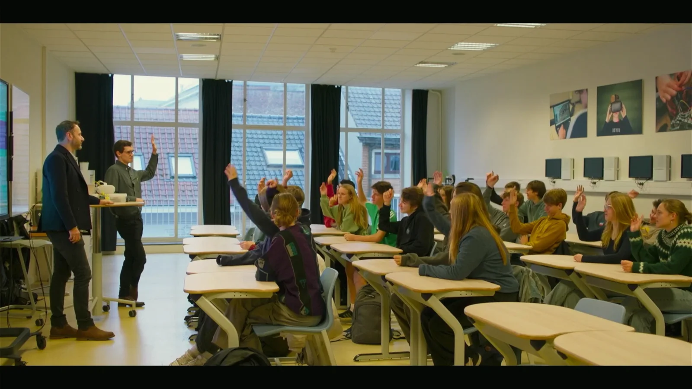
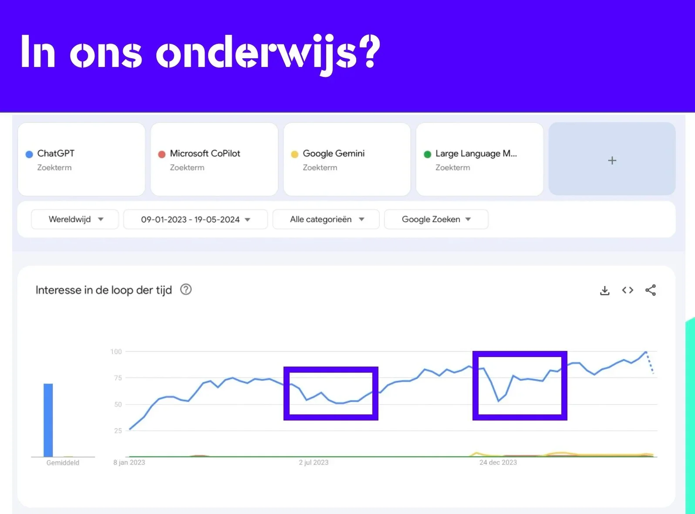
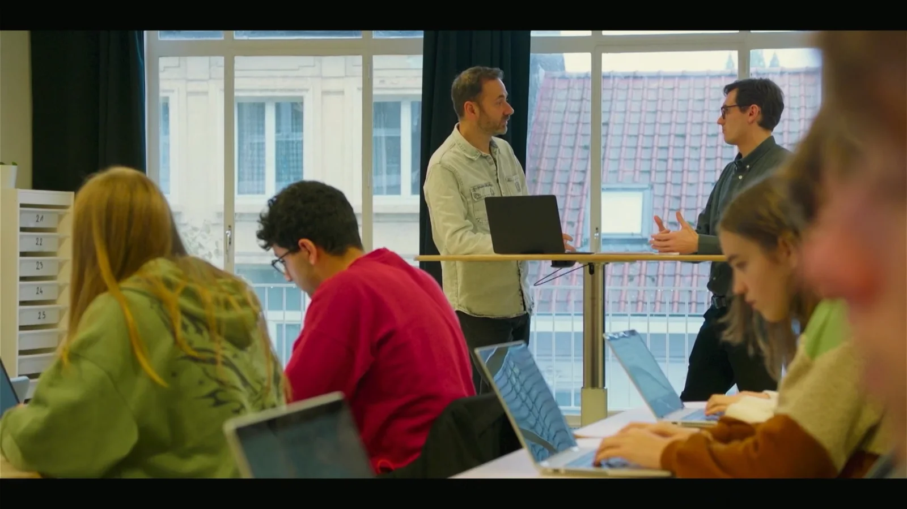
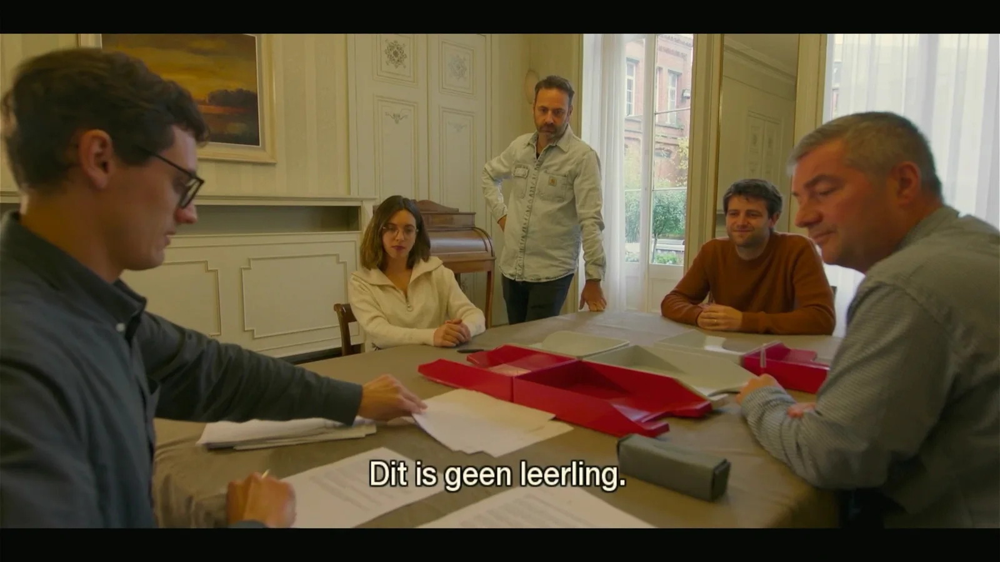
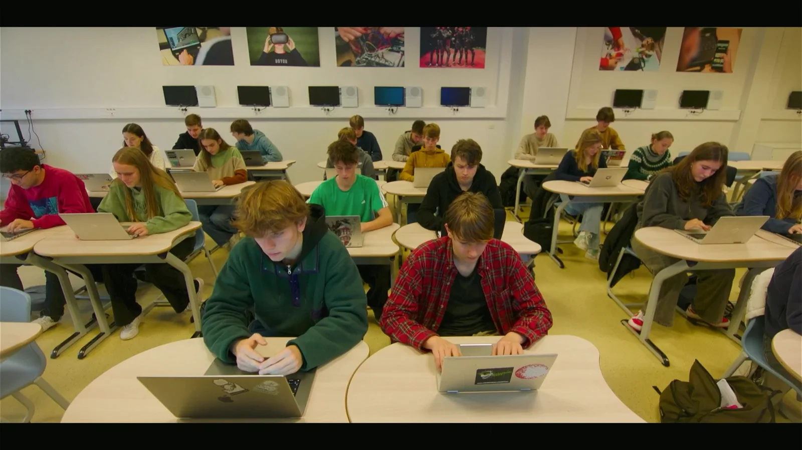
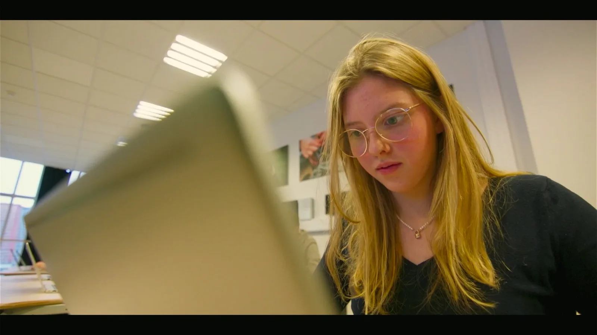
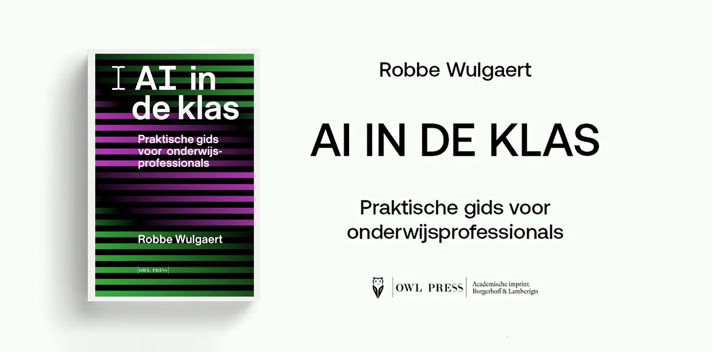

### Welke impact heeft AI op onze samenleving? En is deze invloed het meest voelbaar in ons onderwijs? Met die vragen kwam VRT-journalist Tim Verheyden naar onze school. Hij daagde mijn leerlingen en collega’s uit voor een heus experiment. Kunnen docenten, gewapend met vakkennis, ervaring en GPT-detectie, de echte leerling van AI onderscheiden? We gingen dus even Alan Turing achterna in de tweede aflevering van het TV-programma ‘Het Digitale Dilemma’!

<!-- p08-deferred:media-644bf912113e4828 -->

### AI in het onderwijs

Artificiële intelligentie (AI) is tegenwoordig overal, niet langer slechts een futuristisch idee of enkel toegankelijk voor pioniers in digitale innovaties. Met de introductie van technologieën zoals DALL-E, ChatGPT en Microsoft Copilot, heeft AI snel een brede toepassing gevonden. Volgens de laatste Digimeter van imec uit 2023, gebruikt één op de drie volwassen Vlamingen jaarlijks een AI-tool voor het genereren van beeld, spraak of tekst; 18% doet dat zelfs maandelijks. Onder jongvolwassenen tussen 18 en 24 jaar stijgt dat percentage naar 42%, en onder universiteitsstudenten naar 49%.

_Tim: “Wie van jullie gebruikte reeds ChatGPT?”
De klas: …
(beeld uit de VRT-aflevering)_

Een recente enquête van de Vlaamse Scholierenkoepel toonde aan dat 52% van de leerlingen in de derde graad van het secundair onderwijs in april 2023 regelmatig AI gebruikte. Deze cijfers tonen aan dat AI onmiskenbaar deel uitmaakt van ons onderwijssysteem. Als je je afvraagt of dit invloed heeft op de dagelijkse lespraktijk, bekijk dan de gebruiksgegevens van internetverkeer van AI-tools zoals ChatGPT en leg deze naast de schoolkalender. Zoek naar de zomer- en kerstvakantie; de samenhang tussen AI-gebruik en het onderwijs is haast onmiskenbaar.

Dus wanneer VRT-journalist Tim Verheyden in de TV-reeks ‘Het Digitale Dilemma’ op zoek ging naar hoe nieuwe technologie zoals artificiële intelligentie ons leven en onze samenleving beïnvloeden, kon het onderwijs natuurlijk niet ontbreken. Gezien onze leerlingen in Gent daar al enkele jaren les over-, met- en voor AI krijgen, vormden we een logische partner voor dit experiment.

_(beeld uit de VRT-aflevering)_

### Het experiment

Voor ons experiment schreven de leerlingen een tekst op basis van een van vier mogelijke stellingen. Ze kregen één lesuur om hun standpunt uit te werken in het Nederlands, waarbij ze moesten letten op de tekststructuur: inleiding, midden en slot. In het middendeel moesten ze drie verschillende argumenten gebruiken.

Twaalf leerlingen maakten deze opdracht volledig zelf, terwijl de andere twaalf leerlingen voor 100% gebruikmaakten van tekstgeneratie via een large language model, in dit geval ChatGPT-3.5. We kozen bewust voor een binaire verdeling, zodat precies de helft van de verzamelde teksten door mensen was geschreven en de andere helft door AI-modellen.

Alle teksten werden geanalyseerd door GPT-detectietools, namelijk GPTzero en DetectGPT. De scores van beide tools werden op de hoofding van de teksten vermeld, samen met een vijfcijferig controlenummer. We kozen voor deze tools na overleg met de deelnemende docenten moderne talen, die aangaven dat dit hun vaakst gebruikte detectietools zijn.

In het tweede deel van het experiment kregen de docenten een stapel van 24 schrijftaken: 12 door leerlingen geschreven en 12 door AI-tools. Hun taak was eenvoudig: bepaal of een tekst door een mens of machine is geschreven en leg deze in het juiste verbeterbakje. De ‘Turing Test’ achterna dus! 

_(beeld uit de VRT-aflevering)_

Dit experiment hebben we natuurlijk niet verzonnen, maar is gebaseerd op enkele wetenschappelijke bronnen, namelijk:

-   Liang, W., Yuksekgonul, M., Mao, Y., Wu, E., & Zou, J. (2023). GPT detectors are biased against non-native English writers. _arXiv_. [https://doi.org/10.48550/arXiv.2304.02819](https://doi.org/10.48550/arXiv.2304.02819)

-   Perkins, M., Roe, J., Vu, B. H., Postma, D., Hickerson, D., McGaughran, J., & Khuat, H. Q. (2023). GenAI detection tools, adversarial techniques and implications for inclusivity in higher education. _arXiv_. [https://doi.org/10.48550/arXiv.2403.19148](https://doi.org/10.48550/arXiv.2403.19148)

-   Sadasivan, V. S., Kumar, A., Balasubramanian, S., Wang, W., & Feizi, S. (2023). Can AI-generated text be reliably detected? _arXiv_. [https://doi.org/10.48550/arXiv.2303.11156](https://doi.org/10.48550/arXiv.2303.11156)

Bovenstaande bronnen onderzochten de **effectiviteit van GPT-detectoren**. Telkens kwamen ze tot een vergelijkbare conclusie, namelijk:

1.  de slaagcijfers zijn zeer laag en de resultaten van de tools zijn onbetrouwbaar;

2.  de detectoren zijn heel eenvoudig te misleiden door kleine aanpassingen uit te voeren op de gegenereerde teksten;

3.  de detectoren hebben zelf een inherente bias dat in het nadeel speelt van leerlingen die Engels niet als moedertaal hebben en/of opdrachten in een niet-Engelse taal.

Bovenaan elke schrijfopdracht hadden we dus de percentages genoteerd van de twee favoriete detectoren van de docenten. Het zijn tevens twee detectoren die je terugvindt in de eerder vermelde onderzoeken. Verder gebruikten we nog een onderzoek om ons experiment op te baseren, namelijk:

-   Casal, J. E., & Kessler, M. (2023). Can linguists distinguish between ChatGPT/AI and human writing?: A study of research ethics and academic publishing. _Research Methods in Applied Linguistics, 2_(3), 100068. [https://doi.org/10.1016/j.rmal.2023.100068](https://doi.org/10.1016/j.rmal.2023.100068)

In dit laatste onderzoek dienden 72 taalkundigen 4 abstracts te analyseren. Deze taalkundigen hadden als job om onderzoekspapers na te kijken alvorens deze gepubliceerd werden. Ze hadden dus ervaring binnen dit veld en fungeerden dus als experts. Elke taalkundige diende bij aanvang aan te geven hoe zeker ze waren van hun eigen kunnen. Hoeveel zelfvertrouwen ze dus hadden om de abstracts die geschreven werden door robots te kunnen onderscheiden van de menselijke auteurs. Ze geven zichzelf (voorzichtig) het voordeel van de twijfel.

Tijdens het onderzoek kreeg elke expert vier abstracts om te analyseren. Deze dienden ze te classificeren als ‘mens’ of ‘robot’. Strikt binair dus. Herkenbaar, niet?

De conclusie van het onderzoek was eigenlijk vrij ontnuchterend:

-   het slaagcijfer van de experten was **38.9%;**

-   **geen enkele expert** wist zijn reeks van vier teksten correct te classificeren;

-   algemene conclusie: zelfs experts slagen hier niet in.

_(beeld uit de VRT-aflevering)_

### Onze resultaten

Zoals verwacht was deze taak geen gemakkelijke opgave voor onze deelnemende taaldocenten, en dat gaven ze zelf ook aan. Omdat de schrijftaken geanonimiseerd waren, konden de docenten niet vertrouwen op enige voorkennis van hun leerlingen. Dit deden we bewust om twee redenen. Ten eerste om te voorkomen dat de ene docent bevoordeeld zou zijn ten opzichte van de andere. Ten tweede omdat we in het onderwijs, waar mogelijk, streven naar anonieme evaluatie. Waar voorkennis een voordeel kan opleveren in een experiment, kan het in een reguliere evaluatie de beoordeling beïnvloeden. Daarom werkten we met cijfercodes bovenaan de schrijftaken.

Nu de resultaten: geen van onze docenten slaagde erin alle 24 taken in het correcte bakje te leggen. De scores van de GPT-detectoren bovenaan elke taak hielpen de docenten niet. Onze resultaten komen overeen met de verwachtingen uit eerdere onderzoeken.

_(beeld uit de VRT-aflevering)_

### Conclusie

Hoewel AI-technologie, net zoals andere vormen van technologie, een meerwaarde kan bieden in de klas, blijkt uit dit experiment en de rest van de aflevering dat deze technologie bewust moet worden ingezet. Leerlingen leren niet wanneer tekstgeneratie hun schrijftaak volledig overneemt. Hoewel docenten en onderwijzers hun wenkbrauwen fronsen over dit gebruik, toont het experiment en de onderzoeken waarop we ons baseerden enerzijds aan dat de effectiviteit van detectie, door software of mensen met vakkennis, gering is. Anderzijds is de verleiding voor scholieren en studenten om snelheidswinst te boeken door technologie hun werk volledig te laten overnemen is significant. Een snelheidswinst die soms ten koste gaat van hun leerwinst.

Voor onderwijzers: vertrouw niet blind op detectiesoftware met hun grote beloften. Neem het jezelf niet kwalijk wanneer een AI-taak toch door de mazen van jouw net glipt. Geen van ons is in het onderwijs gestapt om feedback te geven op door robots geschreven taken, maar om met onze passie en kennis jongeren tot leren te brengen. Soms kan technologie daarbij helpen, soms ook echt niet. Een deel van onze taak zal erin bestaan om jongeren hierbij te begeleiden en niet om elke schrijftaak te wantrouwen.

### Vakantietaken en remediëring

Na een druk jaar van leren, studeren en evalueren stellen docenten soms vast dat de leerstof niet voldoende is vastgezet. Soms zijn de hiaten in de kennis zo groot dat een leerling, met het oog op slaagkansen in het volgende schooljaar, baat heeft bij extra leerkansen. Het fenomeen van ‘summer learning loss’, waarbij leerlingen tijdens de acht à negen weken vakantie geleerde stof vergeten, is hierbij bijkomend nadelig. Een extra leerkans door middel van een vakantietaak of remediëring kan een gedeeltelijke oplossing bieden.

Tijdens het schooljaar is de verleiding om een opdracht zonder toezicht door een LLM te laten passeren al groot, en tijdens de zomermaanden is dit zeker niet minder. Dat de geboden leerkans door het blijvend in contact komen met de leerstof verloren gaat, is evident. Daarom deze vuistregels:

-   Controleer of jouw opdracht eenvoudig gemaakt kan worden door een GPT-tool.

-   Spreid de opdracht door de zomer, zodat het niet als één grote productevaluatie met één vaste deadline aanvoelt.

-   Werk eventueel met procesevaluatie of in een gedeeld document, zodat je de vooruitgang door de zomer kunt opvolgen.

-   Laat de leerling elementen uit het afgelopen jaar integreren in de opdracht, bijvoorbeeld door te verwijzen naar een eerdere opdracht die onvoldoende was of een framework dat deel uitmaakte van de leerstof.

-   Geef de leerling de kans om de gemaakte opdrachten mondeling toe te lichten.

-   Laat de leerling op basis van de leerstof of gemaakte opdrachten nieuwe examenvragen opstellen, die je kunt gebruiken bij de eerder genoemde mondelinge bespreking.

* * *

### Waar kan ik deze aflevering bekijken?

Dit experiment komt voor in aflevering 2 van het eerste seizoen van ‘Het Digitale Dilemma’ (S01E02). Je kan deze aflevering bekijk via VRT MAX  en de knop hieronder: 

<a class="content-button content-button--primary content-button--medium" href="https://www.vrt.be/vrtmax/a-z/het-digitale-dilemma/1/het-digitale-dilemma-s1a2/" target="_blank" rel="noreferrer">Bekijk de aflevering!</a>

### Meer informatie over AI in ons onderwijs en veel meer vind je in:

